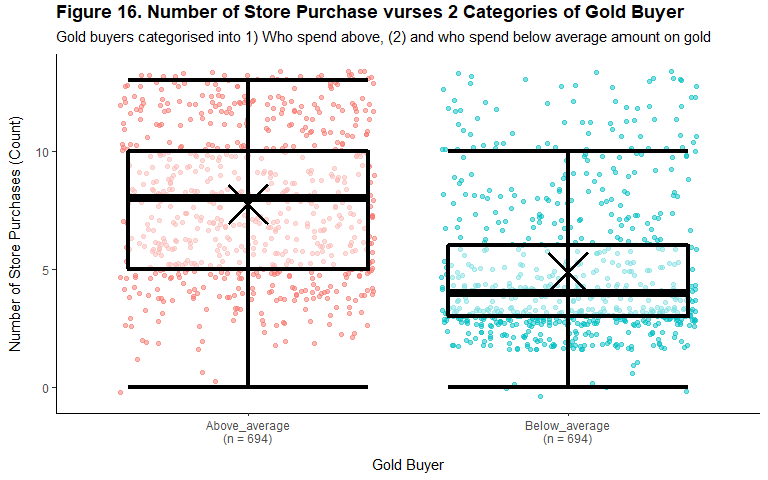

Marketing Analytics
================
Kar Ng
2021

-   [1 SUMMARY](#1-summary)
-   [2 R PACKAGES](#2-r-packages)
-   [3 INTRODUCTION](#3-introduction)
-   [4 DATA PREPARATION](#4-data-preparation)
    -   [4.1 Data import](#41-data-import)
    -   [4.2 Data description](#42-data-description)
    -   [4.3 Data exploration](#43-data-exploration)
-   [5 DATA CLEANING AND
    MANIPULATION](#5-data-cleaning-and-manipulation)
    -   [5.1 Data type conversion](#51-data-type-conversion)
    -   [5.2 Examing tricky missing
        value](#52-examing-tricky-missing-value)
    -   [5.3 Fill up the blank salary
        cells](#53-fill-up-the-blank-salary-cells)
    -   [5.4 Create Age Column](#54-create-age-column)
    -   [5.5 Data processing summary](#55-data-processing-summary)
-   [6 EXPLORATORY DATA ANALYSIS
    (EDA)](#6-exploratory-data-analysis-eda)
    -   [6.1 What does the average customer look like for this
        company?](#61-what-does-the-average-customer-look-like-for-this-company)
        -   [6.1.1 Age](#611-age)
        -   [6.1.2 Country](#612-country)
        -   [6.1.3 Education](#613-education)
        -   [6.1.4 Marital Status](#614-marital-status)
        -   [6.1.5 Customer’s Family size](#615-customers-family-size)
        -   [6.1.6 Income](#616-income)
    -   [6.2 Which products are performing the
        best?](#62-which-products-are-performing-the-best)
    -   [6.3 Which marketing campaign is most
        successful?](#63-which-marketing-campaign-is-most-successful)
    -   [6.4 Which channels are
        underperforming?](#64-which-channels-are-underperforming)
-   [7 STATISTICAL ANALYSIS](#7-statistical-analysis)
    -   [7.1 Testing for
        multicollinearity](#71-testing-for-multicollinearity)
        -   [7.1.1 Correlation assessment](#711-correlation-assessment)
        -   [7.1.2 Variance Inflation factor (VIF)
            assessment](#712-variance-inflation-factor-vif-assessment)
    -   [7.2 Factors that significantly related to in-store
        purchases](#72-factors-that-significantly-related-to-in-store-purchases)
        -   [7.2.1 Data Partitioning](#721-data-partitioning)
        -   [7.2.2 Building the model and model
            performance](#722-building-the-model-and-model-performance)
        -   [7.2.3 Summarise the model](#723-summarise-the-model)
    -   [7.3 Does US’s purchasing power significantly better than the
        rest of the world in terms of total purchases
        ?](#73-does-uss-purchasing-power-significantly-better-than-the-rest-of-the-world-in-terms-of-total-purchases-)
        -   [7.3.1 Comparing total purchases PER CUSTOMER in different
            country\*\*](#731-comparing-total-purchases-per-customer-in-different-country)
        -   [7.3.2 Assumption tests](#732-assumption-tests)
        -   [7.3.4 Kruskal Wallis statistical
            test](#734-kruskal-wallis-statistical-test)
        -   [7.3.5 Visualisation](#735-visualisation)
    -   [7.4 Are gold lovers prefer to shop in
        store?](#74-are-gold-lovers-prefer-to-shop-in-store)
        -   [7.4.1 Visualisation](#741-visualisation)
        -   [7.4.2 Building a model](#742-building-a-model)
        -   [7.4.3 Assumption tests](#743-assumption-tests)
        -   [7.4.4 Mann-Whitney test](#744-mann-whitney-test)
    -   [7.5 Consumption of married PhD candidates on
        Fish](#75-consumption-of-married-phd-candidates-on-fish)
        -   [7.5.1 Married PhD candidates vs others in amount spent on
            fish](#751-married-phd-candidates-vs-others-in-amount-spent-on-fish)
        -   [7.5.2 What other factors are significantly related to
            amount spent on
            fish?](#752-what-other-factors-are-significantly-related-to-amount-spent-on-fish)
    -   [7.6 Is there a significant relationship between geographical
        regional and success of a
        campaign?](#76-is-there-a-significant-relationship-between-geographical-regional-and-success-of-a-campaign)
-   [8 CONCLUSION](#8-conclusion)
-   [9 LEGALITY](#9-legality)
-   [10 REFERENCE](#10-reference)
-   [11 ACKNOWLEDGEMENT](#11-acknowledgement)

------------------------------------------------------------------------


------------------------------------------------------------------------

Reading time: 35 minutes

## 1 SUMMARY

This is a personal project uses a public dataset from *Kaggle* that
designed for students in MSc. in Business Analytics as their final
project. The dataset comprised of customer information, sales channels,
products sold by the company, and the acceptance data of marketing
campaigns. There are 4 tasks for visual exploration and 5 tasks for
statistical analysis.

All 9 business tasks have been solved by 18 graphs and 10 statistical
methods. Statistical methods used in this project include:

-   Exploratory data analysis (EDA)  
-   Multicollinearity test using correlation & VIF  
-   Data partitioning to create train & test for RMSE & R2  
-   Stepwise model selection  
-   Multiple linear regression (MLR)  
-   Generalised Linear Models (GLM)’s binomial for logistic regression  
-   Normality test using Q-Q plot and Shapiro-Wilk test  
-   Variance test with Levene’s test  
-   Omnibus test with Kruskal-Wallis Test  
-   Two-sample non-parametric test with Mann-Whitney test

Results from EDA reveal that most customer are in mature age between 30
to 55, 51% of customers are from Spain, half of the customers have
education level of “graduate” level, 71.5% of customers have a least 1
children home, half of the customers have income between $35k to $70k
and wine is the best selling product that contributing 50.15% to the
total revenue. All marketing campaigns weren’t doing very well with
acceptance rates of lower than 15%. In store sales is the most
performing channels.

Results from statistical analysis reveal in-store purchases is
significantly affected by products, deals, purchases made through web,
income, number of kids at home, sales through catalog and customer’s
visit frequency to company’s website. Purchasing power of customers from
the US do not significantly different from other countries (P-value
0.4004). Gold buyers have more store purchases (P-value &lt; 0.05).
Married PhD candidates spent significantly less than other customer
groups on fish, with a p-value of less than 0.05. Statistical analysis
also concluded that there is no significant relationship between
geographical regions and success of a campaign.

<br/>

*Highlights*

<br/>


<br/>

## 2 R PACKAGES

R packages loaded in this project include tidyverse packages (ggplot2,
dplyr, tidyr, readr, purrr, tibble, stringr, and forcats), skimr,
kableExtra, DT, lubridate, zoo, gridExtra, ggplotr, ggrepel, car, caret,
DescTools, multcomp, and olsrr.

``` r
library(tidyverse)
library(skimr)
library(kableExtra)
library(DT)
library(lubridate)
library(zoo) 
library(gridExtra)
library(qqplotr)
library(ggrepel)
library(car)     # For VIF
library(caret)
library(DescTools)
library(multcomp)
library(olsrr)
```

## 3 INTRODUCTION

The purpose of this project is to answer a series of general business
questions using R programming language. This project has a dataset that
provides many marketing data include general customer information,
products sold by the company, the company’s sale channels, and the
performance of a series of marketing campaigns that the company has
launched.

The business questions that I am tasked to answer are separated into 2
main bodies, one is for data exploration analysis, and the other one is
for statistical analysis.

Business questions for data exploration analysis (EDA) are:

-   What does the average customer look like for this company?  
-   Which products are performing best?  
-   Which marketing campaign is most successful?  
-   Which channels are underperforming?

Business questions for statistical analysis are:

-   What are the factors that significantly related to in-store
    purchases?  
-   Does US’s purchasing power significantly better than the rest of hte
    world in terms of total purchase?  
-   Are gold lovers prefer to shop in store?  
-   Do “Married PhD candidates” have a significant relation with amount
    spent on fish? What other factors are significantly related to
    amount spent on fish?  
-   Is there a significant relationship between geographical regional
    and success of a campaign?

This project uses a public dataset from *Kaggle*. *Kaggle* is a
professional website for data science community. The dataset was
supplied by Dr. Omar Romero-Hernandez for his students for their final
project in order to test their statistical analysis skills as part of a
MSc. in Business Analytics. Please click this
[Link](https://www.kaggle.com/jackdaoud/marketing-data) to the website.
All of the above business questions are actually questions for the
marketing students to answer, visit this
[Link](https://www.kaggle.com/jackdaoud/marketing-data/tasks?taskId=2986)
to the relevant website.

## 4 DATA PREPARATION

### 4.1 Data import

Following codes import the dataset. Table below is an indication of
successful data import.

------------------------------------------------------------------------

``` r
marketing_data <- read_csv("marketing_data.csv")
head(marketing_data)
```

    ## # A tibble: 6 x 28
    ##      ID Year_Birth Education  Marital_Status Income     Kidhome Teenhome Dt_Customer
    ##   <dbl>      <dbl> <chr>      <chr>          <chr>        <dbl>    <dbl> <chr>      
    ## 1  1826       1970 Graduation Divorced       $84,835.00       0        0 6/16/14    
    ## 2     1       1961 Graduation Single         $57,091.00       0        0 6/15/14    
    ## 3 10476       1958 Graduation Married        $67,267.00       0        1 5/13/14    
    ## 4  1386       1967 Graduation Together       $32,474.00       1        1 5/11/14    
    ## 5  5371       1989 Graduation Single         $21,474.00       1        0 4/8/14     
    ## 6  7348       1958 PhD        Single         $71,691.00       0        0 3/17/14    
    ## # ... with 20 more variables: Recency <dbl>, MntWines <dbl>, MntFruits <dbl>,
    ## #   MntMeatProducts <dbl>, MntFishProducts <dbl>, MntSweetProducts <dbl>,
    ## #   MntGoldProds <dbl>, NumDealsPurchases <dbl>, NumWebPurchases <dbl>,
    ## #   NumCatalogPurchases <dbl>, NumStorePurchases <dbl>,
    ## #   NumWebVisitsMonth <dbl>, AcceptedCmp3 <dbl>, AcceptedCmp4 <dbl>,
    ## #   AcceptedCmp5 <dbl>, AcceptedCmp1 <dbl>, AcceptedCmp2 <dbl>, Response <dbl>,
    ## #   Complain <dbl>, Country <chr>

------------------------------------------------------------------------

### 4.2 Data description

Following table describes all variables in the dataset, extracted from
the [Kaggle website](https://www.kaggle.com/jackdaoud/marketing-data).

``` r
Variable <- c("ID", 
              "Year_Birth", 
              "Education",
              "Marital_Status",
              "Income",
              "Kidhome",
              "Teenhome",
              "Dt_Customer",  
              "Recency",
              "MntWines",
              "MntFruits",
              "MntMeatProducts",
              "MntFishProducts",
              "MntSweetProducts",
              "MntGoldProds",
              "NumDealsPurchases",
              "NumWebPurchases",
              "NumCatalogPurchases",
              "NumStorePurchases",
              "NumWebVisitsMonth",
              "AcceptedCmp3",
              "AcceptedCmp4",
              "AcceptedCmp5",
              "AcceptedCmp1",
              "AcceptedCmp2",
              "Response",
              "Complain",
              "Country")

Description <- c("Customer's unique identifier",
                 "Customer's birth year",
                 "Customer's education level",
                 "Customer's marital status",
                 "Customer's yearly household income",
                 "Number of children in customer's household",
                 "Number of teenagers in customer's household",
                 "Date of customer's enrollment with the company",
                 "Number of days since customer's last purchase",
                 "Amount spent on wine in the last 2 years",
                 "Amount spent on fruits in the last 2 years",
                 "Amount spent on meat in the last 2 years",
                 "Amount spent on fish in the last 2 years",
                 "Amount spent on sweets in the last 2 years",
                 "Amount spent on gold in the last 2 years",
                 "Number of purchases made with a discount",
                 "Number of purchases made through the company's web site",
                 "Number of purchases made using a catalogue",
                 "Number of purchases made directly in stores",
                 "Number of visits to company's web site in the last month",
                 "1 if customer accepted the offer in the 3rd campaign, 0 otherwise",
                 "1 if customer accepted the offer in the 4th campaign, 0 otherwise",
                 "1 if customer accepted the offer in the 5th campaign, 0 otherwise",
                 "1 if customer accepted the offer in the 1st campaign, 0 otherwise",
                 "1 if customer accepted the offer in the 2nd campaign, 0 otherwise",
                 "1 if customer accepted the offer in the last campaign, 0 otherwise",
                 "1 if customer complained in the last 2 years, 0 otherwise",
                 "Customer's location")

data.frame(No = c(1:28), Variable, Description) %>% 
  kbl() %>% 
  kable_styling(bootstrap_options = c("bordered", "striped", "hover"))
```

<table class="table table-bordered table-striped table-hover" style="margin-left: auto; margin-right: auto;">
<thead>
<tr>
<th style="text-align:right;">
No
</th>
<th style="text-align:left;">
Variable
</th>
<th style="text-align:left;">
Description
</th>
</tr>
</thead>
<tbody>
<tr>
<td style="text-align:right;">
1
</td>
<td style="text-align:left;">
ID
</td>
<td style="text-align:left;">
Customer’s unique identifier
</td>
</tr>
<tr>
<td style="text-align:right;">
2
</td>
<td style="text-align:left;">
Year\_Birth
</td>
<td style="text-align:left;">
Customer’s birth year
</td>
</tr>
<tr>
<td style="text-align:right;">
3
</td>
<td style="text-align:left;">
Education
</td>
<td style="text-align:left;">
Customer’s education level
</td>
</tr>
<tr>
<td style="text-align:right;">
4
</td>
<td style="text-align:left;">
Marital\_Status
</td>
<td style="text-align:left;">
Customer’s marital status
</td>
</tr>
<tr>
<td style="text-align:right;">
5
</td>
<td style="text-align:left;">
Income
</td>
<td style="text-align:left;">
Customer’s yearly household income
</td>
</tr>
<tr>
<td style="text-align:right;">
6
</td>
<td style="text-align:left;">
Kidhome
</td>
<td style="text-align:left;">
Number of children in customer’s household
</td>
</tr>
<tr>
<td style="text-align:right;">
7
</td>
<td style="text-align:left;">
Teenhome
</td>
<td style="text-align:left;">
Number of teenagers in customer’s household
</td>
</tr>
<tr>
<td style="text-align:right;">
8
</td>
<td style="text-align:left;">
Dt\_Customer
</td>
<td style="text-align:left;">
Date of customer’s enrollment with the company
</td>
</tr>
<tr>
<td style="text-align:right;">
9
</td>
<td style="text-align:left;">
Recency
</td>
<td style="text-align:left;">
Number of days since customer’s last purchase
</td>
</tr>
<tr>
<td style="text-align:right;">
10
</td>
<td style="text-align:left;">
MntWines
</td>
<td style="text-align:left;">
Amount spent on wine in the last 2 years
</td>
</tr>
<tr>
<td style="text-align:right;">
11
</td>
<td style="text-align:left;">
MntFruits
</td>
<td style="text-align:left;">
Amount spent on fruits in the last 2 years
</td>
</tr>
<tr>
<td style="text-align:right;">
12
</td>
<td style="text-align:left;">
MntMeatProducts
</td>
<td style="text-align:left;">
Amount spent on meat in the last 2 years
</td>
</tr>
<tr>
<td style="text-align:right;">
13
</td>
<td style="text-align:left;">
MntFishProducts
</td>
<td style="text-align:left;">
Amount spent on fish in the last 2 years
</td>
</tr>
<tr>
<td style="text-align:right;">
14
</td>
<td style="text-align:left;">
MntSweetProducts
</td>
<td style="text-align:left;">
Amount spent on sweets in the last 2 years
</td>
</tr>
<tr>
<td style="text-align:right;">
15
</td>
<td style="text-align:left;">
MntGoldProds
</td>
<td style="text-align:left;">
Amount spent on gold in the last 2 years
</td>
</tr>
<tr>
<td style="text-align:right;">
16
</td>
<td style="text-align:left;">
NumDealsPurchases
</td>
<td style="text-align:left;">
Number of purchases made with a discount
</td>
</tr>
<tr>
<td style="text-align:right;">
17
</td>
<td style="text-align:left;">
NumWebPurchases
</td>
<td style="text-align:left;">
Number of purchases made through the company’s web site
</td>
</tr>
<tr>
<td style="text-align:right;">
18
</td>
<td style="text-align:left;">
NumCatalogPurchases
</td>
<td style="text-align:left;">
Number of purchases made using a catalogue
</td>
</tr>
<tr>
<td style="text-align:right;">
19
</td>
<td style="text-align:left;">
NumStorePurchases
</td>
<td style="text-align:left;">
Number of purchases made directly in stores
</td>
</tr>
<tr>
<td style="text-align:right;">
20
</td>
<td style="text-align:left;">
NumWebVisitsMonth
</td>
<td style="text-align:left;">
Number of visits to company’s web site in the last month
</td>
</tr>
<tr>
<td style="text-align:right;">
21
</td>
<td style="text-align:left;">
AcceptedCmp3
</td>
<td style="text-align:left;">
1 if customer accepted the offer in the 3rd campaign, 0 otherwise
</td>
</tr>
<tr>
<td style="text-align:right;">
22
</td>
<td style="text-align:left;">
AcceptedCmp4
</td>
<td style="text-align:left;">
1 if customer accepted the offer in the 4th campaign, 0 otherwise
</td>
</tr>
<tr>
<td style="text-align:right;">
23
</td>
<td style="text-align:left;">
AcceptedCmp5
</td>
<td style="text-align:left;">
1 if customer accepted the offer in the 5th campaign, 0 otherwise
</td>
</tr>
<tr>
<td style="text-align:right;">
24
</td>
<td style="text-align:left;">
AcceptedCmp1
</td>
<td style="text-align:left;">
1 if customer accepted the offer in the 1st campaign, 0 otherwise
</td>
</tr>
<tr>
<td style="text-align:right;">
25
</td>
<td style="text-align:left;">
AcceptedCmp2
</td>
<td style="text-align:left;">
1 if customer accepted the offer in the 2nd campaign, 0 otherwise
</td>
</tr>
<tr>
<td style="text-align:right;">
26
</td>
<td style="text-align:left;">
Response
</td>
<td style="text-align:left;">
1 if customer accepted the offer in the last campaign, 0 otherwise
</td>
</tr>
<tr>
<td style="text-align:right;">
27
</td>
<td style="text-align:left;">
Complain
</td>
<td style="text-align:left;">
1 if customer complained in the last 2 years, 0 otherwise
</td>
</tr>
<tr>
<td style="text-align:right;">
28
</td>
<td style="text-align:left;">
Country
</td>
<td style="text-align:left;">
Customer’s location
</td>
</tr>
</tbody>
</table>

It is a comprehensive dataset and it contains classifiable information.

-   1.  **Customer information**: ID, age, education, marital status,
        income, number of kids and teens at home, date of customer’s
        enrollment with the company, recency, complain(s) made in the
        last 2 years, country of the customer currently at (I assume),
        the number of purchases made during a discount, and customers’
        frequency of visiting company’s website.

-   2.  **Products of the company**: Wines, fruits, meat, fish, sweet,
        and gold.

-   3.  **Sale Channels**: Number of purchases made via company website,
        catalog, and in the store.

-   4.  Customers responses on **company’s marketing campaigns**. There
        are a total of 6 campaigns launched.

### 4.3 Data exploration

This dataset has 2,240 rows of observations and 28 columns of variables.
Among the variables, there are 5 character variables and 23 numerical
variables.

------------------------------------------------------------------------

``` r
skim_without_charts(marketing_data)
```

<table style="width: auto;" class="table table-condensed">
<caption>
Data summary
</caption>
<thead>
<tr>
<th style="text-align:left;">
</th>
<th style="text-align:left;">
</th>
</tr>
</thead>
<tbody>
<tr>
<td style="text-align:left;">
Name
</td>
<td style="text-align:left;">
marketing\_data
</td>
</tr>
<tr>
<td style="text-align:left;">
Number of rows
</td>
<td style="text-align:left;">
2240
</td>
</tr>
<tr>
<td style="text-align:left;">
Number of columns
</td>
<td style="text-align:left;">
28
</td>
</tr>
<tr>
<td style="text-align:left;">
\_\_\_\_\_\_\_\_\_\_\_\_\_\_\_\_\_\_\_\_\_\_\_
</td>
<td style="text-align:left;">
</td>
</tr>
<tr>
<td style="text-align:left;">
Column type frequency:
</td>
<td style="text-align:left;">
</td>
</tr>
<tr>
<td style="text-align:left;">
character
</td>
<td style="text-align:left;">
5
</td>
</tr>
<tr>
<td style="text-align:left;">
numeric
</td>
<td style="text-align:left;">
23
</td>
</tr>
<tr>
<td style="text-align:left;">
\_\_\_\_\_\_\_\_\_\_\_\_\_\_\_\_\_\_\_\_\_\_\_\_
</td>
<td style="text-align:left;">
</td>
</tr>
<tr>
<td style="text-align:left;">
Group variables
</td>
<td style="text-align:left;">
None
</td>
</tr>
</tbody>
</table>

**Variable type: character**

<table>
<thead>
<tr>
<th style="text-align:left;">
skim\_variable
</th>
<th style="text-align:right;">
n\_missing
</th>
<th style="text-align:right;">
complete\_rate
</th>
<th style="text-align:right;">
min
</th>
<th style="text-align:right;">
max
</th>
<th style="text-align:right;">
empty
</th>
<th style="text-align:right;">
n\_unique
</th>
<th style="text-align:right;">
whitespace
</th>
</tr>
</thead>
<tbody>
<tr>
<td style="text-align:left;">
Education
</td>
<td style="text-align:right;">
0
</td>
<td style="text-align:right;">
1.00
</td>
<td style="text-align:right;">
3
</td>
<td style="text-align:right;">
10
</td>
<td style="text-align:right;">
0
</td>
<td style="text-align:right;">
5
</td>
<td style="text-align:right;">
0
</td>
</tr>
<tr>
<td style="text-align:left;">
Marital\_Status
</td>
<td style="text-align:right;">
0
</td>
<td style="text-align:right;">
1.00
</td>
<td style="text-align:right;">
4
</td>
<td style="text-align:right;">
8
</td>
<td style="text-align:right;">
0
</td>
<td style="text-align:right;">
8
</td>
<td style="text-align:right;">
0
</td>
</tr>
<tr>
<td style="text-align:left;">
Income
</td>
<td style="text-align:right;">
24
</td>
<td style="text-align:right;">
0.99
</td>
<td style="text-align:right;">
9
</td>
<td style="text-align:right;">
11
</td>
<td style="text-align:right;">
0
</td>
<td style="text-align:right;">
1974
</td>
<td style="text-align:right;">
0
</td>
</tr>
<tr>
<td style="text-align:left;">
Dt\_Customer
</td>
<td style="text-align:right;">
0
</td>
<td style="text-align:right;">
1.00
</td>
<td style="text-align:right;">
6
</td>
<td style="text-align:right;">
8
</td>
<td style="text-align:right;">
0
</td>
<td style="text-align:right;">
663
</td>
<td style="text-align:right;">
0
</td>
</tr>
<tr>
<td style="text-align:left;">
Country
</td>
<td style="text-align:right;">
0
</td>
<td style="text-align:right;">
1.00
</td>
<td style="text-align:right;">
2
</td>
<td style="text-align:right;">
3
</td>
<td style="text-align:right;">
0
</td>
<td style="text-align:right;">
8
</td>
<td style="text-align:right;">
0
</td>
</tr>
</tbody>
</table>

**Variable type: numeric**

<table>
<thead>
<tr>
<th style="text-align:left;">
skim\_variable
</th>
<th style="text-align:right;">
n\_missing
</th>
<th style="text-align:right;">
complete\_rate
</th>
<th style="text-align:right;">
mean
</th>
<th style="text-align:right;">
sd
</th>
<th style="text-align:right;">
p0
</th>
<th style="text-align:right;">
p25
</th>
<th style="text-align:right;">
p50
</th>
<th style="text-align:right;">
p75
</th>
<th style="text-align:right;">
p100
</th>
</tr>
</thead>
<tbody>
<tr>
<td style="text-align:left;">
ID
</td>
<td style="text-align:right;">
0
</td>
<td style="text-align:right;">
1
</td>
<td style="text-align:right;">
5592.16
</td>
<td style="text-align:right;">
3246.66
</td>
<td style="text-align:right;">
0
</td>
<td style="text-align:right;">
2828.25
</td>
<td style="text-align:right;">
5458.5
</td>
<td style="text-align:right;">
8427.75
</td>
<td style="text-align:right;">
11191
</td>
</tr>
<tr>
<td style="text-align:left;">
Year\_Birth
</td>
<td style="text-align:right;">
0
</td>
<td style="text-align:right;">
1
</td>
<td style="text-align:right;">
1968.81
</td>
<td style="text-align:right;">
11.98
</td>
<td style="text-align:right;">
1893
</td>
<td style="text-align:right;">
1959.00
</td>
<td style="text-align:right;">
1970.0
</td>
<td style="text-align:right;">
1977.00
</td>
<td style="text-align:right;">
1996
</td>
</tr>
<tr>
<td style="text-align:left;">
Kidhome
</td>
<td style="text-align:right;">
0
</td>
<td style="text-align:right;">
1
</td>
<td style="text-align:right;">
0.44
</td>
<td style="text-align:right;">
0.54
</td>
<td style="text-align:right;">
0
</td>
<td style="text-align:right;">
0.00
</td>
<td style="text-align:right;">
0.0
</td>
<td style="text-align:right;">
1.00
</td>
<td style="text-align:right;">
2
</td>
</tr>
<tr>
<td style="text-align:left;">
Teenhome
</td>
<td style="text-align:right;">
0
</td>
<td style="text-align:right;">
1
</td>
<td style="text-align:right;">
0.51
</td>
<td style="text-align:right;">
0.54
</td>
<td style="text-align:right;">
0
</td>
<td style="text-align:right;">
0.00
</td>
<td style="text-align:right;">
0.0
</td>
<td style="text-align:right;">
1.00
</td>
<td style="text-align:right;">
2
</td>
</tr>
<tr>
<td style="text-align:left;">
Recency
</td>
<td style="text-align:right;">
0
</td>
<td style="text-align:right;">
1
</td>
<td style="text-align:right;">
49.11
</td>
<td style="text-align:right;">
28.96
</td>
<td style="text-align:right;">
0
</td>
<td style="text-align:right;">
24.00
</td>
<td style="text-align:right;">
49.0
</td>
<td style="text-align:right;">
74.00
</td>
<td style="text-align:right;">
99
</td>
</tr>
<tr>
<td style="text-align:left;">
MntWines
</td>
<td style="text-align:right;">
0
</td>
<td style="text-align:right;">
1
</td>
<td style="text-align:right;">
303.94
</td>
<td style="text-align:right;">
336.60
</td>
<td style="text-align:right;">
0
</td>
<td style="text-align:right;">
23.75
</td>
<td style="text-align:right;">
173.5
</td>
<td style="text-align:right;">
504.25
</td>
<td style="text-align:right;">
1493
</td>
</tr>
<tr>
<td style="text-align:left;">
MntFruits
</td>
<td style="text-align:right;">
0
</td>
<td style="text-align:right;">
1
</td>
<td style="text-align:right;">
26.30
</td>
<td style="text-align:right;">
39.77
</td>
<td style="text-align:right;">
0
</td>
<td style="text-align:right;">
1.00
</td>
<td style="text-align:right;">
8.0
</td>
<td style="text-align:right;">
33.00
</td>
<td style="text-align:right;">
199
</td>
</tr>
<tr>
<td style="text-align:left;">
MntMeatProducts
</td>
<td style="text-align:right;">
0
</td>
<td style="text-align:right;">
1
</td>
<td style="text-align:right;">
166.95
</td>
<td style="text-align:right;">
225.72
</td>
<td style="text-align:right;">
0
</td>
<td style="text-align:right;">
16.00
</td>
<td style="text-align:right;">
67.0
</td>
<td style="text-align:right;">
232.00
</td>
<td style="text-align:right;">
1725
</td>
</tr>
<tr>
<td style="text-align:left;">
MntFishProducts
</td>
<td style="text-align:right;">
0
</td>
<td style="text-align:right;">
1
</td>
<td style="text-align:right;">
37.53
</td>
<td style="text-align:right;">
54.63
</td>
<td style="text-align:right;">
0
</td>
<td style="text-align:right;">
3.00
</td>
<td style="text-align:right;">
12.0
</td>
<td style="text-align:right;">
50.00
</td>
<td style="text-align:right;">
259
</td>
</tr>
<tr>
<td style="text-align:left;">
MntSweetProducts
</td>
<td style="text-align:right;">
0
</td>
<td style="text-align:right;">
1
</td>
<td style="text-align:right;">
27.06
</td>
<td style="text-align:right;">
41.28
</td>
<td style="text-align:right;">
0
</td>
<td style="text-align:right;">
1.00
</td>
<td style="text-align:right;">
8.0
</td>
<td style="text-align:right;">
33.00
</td>
<td style="text-align:right;">
263
</td>
</tr>
<tr>
<td style="text-align:left;">
MntGoldProds
</td>
<td style="text-align:right;">
0
</td>
<td style="text-align:right;">
1
</td>
<td style="text-align:right;">
44.02
</td>
<td style="text-align:right;">
52.17
</td>
<td style="text-align:right;">
0
</td>
<td style="text-align:right;">
9.00
</td>
<td style="text-align:right;">
24.0
</td>
<td style="text-align:right;">
56.00
</td>
<td style="text-align:right;">
362
</td>
</tr>
<tr>
<td style="text-align:left;">
NumDealsPurchases
</td>
<td style="text-align:right;">
0
</td>
<td style="text-align:right;">
1
</td>
<td style="text-align:right;">
2.33
</td>
<td style="text-align:right;">
1.93
</td>
<td style="text-align:right;">
0
</td>
<td style="text-align:right;">
1.00
</td>
<td style="text-align:right;">
2.0
</td>
<td style="text-align:right;">
3.00
</td>
<td style="text-align:right;">
15
</td>
</tr>
<tr>
<td style="text-align:left;">
NumWebPurchases
</td>
<td style="text-align:right;">
0
</td>
<td style="text-align:right;">
1
</td>
<td style="text-align:right;">
4.08
</td>
<td style="text-align:right;">
2.78
</td>
<td style="text-align:right;">
0
</td>
<td style="text-align:right;">
2.00
</td>
<td style="text-align:right;">
4.0
</td>
<td style="text-align:right;">
6.00
</td>
<td style="text-align:right;">
27
</td>
</tr>
<tr>
<td style="text-align:left;">
NumCatalogPurchases
</td>
<td style="text-align:right;">
0
</td>
<td style="text-align:right;">
1
</td>
<td style="text-align:right;">
2.66
</td>
<td style="text-align:right;">
2.92
</td>
<td style="text-align:right;">
0
</td>
<td style="text-align:right;">
0.00
</td>
<td style="text-align:right;">
2.0
</td>
<td style="text-align:right;">
4.00
</td>
<td style="text-align:right;">
28
</td>
</tr>
<tr>
<td style="text-align:left;">
NumStorePurchases
</td>
<td style="text-align:right;">
0
</td>
<td style="text-align:right;">
1
</td>
<td style="text-align:right;">
5.79
</td>
<td style="text-align:right;">
3.25
</td>
<td style="text-align:right;">
0
</td>
<td style="text-align:right;">
3.00
</td>
<td style="text-align:right;">
5.0
</td>
<td style="text-align:right;">
8.00
</td>
<td style="text-align:right;">
13
</td>
</tr>
<tr>
<td style="text-align:left;">
NumWebVisitsMonth
</td>
<td style="text-align:right;">
0
</td>
<td style="text-align:right;">
1
</td>
<td style="text-align:right;">
5.32
</td>
<td style="text-align:right;">
2.43
</td>
<td style="text-align:right;">
0
</td>
<td style="text-align:right;">
3.00
</td>
<td style="text-align:right;">
6.0
</td>
<td style="text-align:right;">
7.00
</td>
<td style="text-align:right;">
20
</td>
</tr>
<tr>
<td style="text-align:left;">
AcceptedCmp3
</td>
<td style="text-align:right;">
0
</td>
<td style="text-align:right;">
1
</td>
<td style="text-align:right;">
0.07
</td>
<td style="text-align:right;">
0.26
</td>
<td style="text-align:right;">
0
</td>
<td style="text-align:right;">
0.00
</td>
<td style="text-align:right;">
0.0
</td>
<td style="text-align:right;">
0.00
</td>
<td style="text-align:right;">
1
</td>
</tr>
<tr>
<td style="text-align:left;">
AcceptedCmp4
</td>
<td style="text-align:right;">
0
</td>
<td style="text-align:right;">
1
</td>
<td style="text-align:right;">
0.07
</td>
<td style="text-align:right;">
0.26
</td>
<td style="text-align:right;">
0
</td>
<td style="text-align:right;">
0.00
</td>
<td style="text-align:right;">
0.0
</td>
<td style="text-align:right;">
0.00
</td>
<td style="text-align:right;">
1
</td>
</tr>
<tr>
<td style="text-align:left;">
AcceptedCmp5
</td>
<td style="text-align:right;">
0
</td>
<td style="text-align:right;">
1
</td>
<td style="text-align:right;">
0.07
</td>
<td style="text-align:right;">
0.26
</td>
<td style="text-align:right;">
0
</td>
<td style="text-align:right;">
0.00
</td>
<td style="text-align:right;">
0.0
</td>
<td style="text-align:right;">
0.00
</td>
<td style="text-align:right;">
1
</td>
</tr>
<tr>
<td style="text-align:left;">
AcceptedCmp1
</td>
<td style="text-align:right;">
0
</td>
<td style="text-align:right;">
1
</td>
<td style="text-align:right;">
0.06
</td>
<td style="text-align:right;">
0.25
</td>
<td style="text-align:right;">
0
</td>
<td style="text-align:right;">
0.00
</td>
<td style="text-align:right;">
0.0
</td>
<td style="text-align:right;">
0.00
</td>
<td style="text-align:right;">
1
</td>
</tr>
<tr>
<td style="text-align:left;">
AcceptedCmp2
</td>
<td style="text-align:right;">
0
</td>
<td style="text-align:right;">
1
</td>
<td style="text-align:right;">
0.01
</td>
<td style="text-align:right;">
0.11
</td>
<td style="text-align:right;">
0
</td>
<td style="text-align:right;">
0.00
</td>
<td style="text-align:right;">
0.0
</td>
<td style="text-align:right;">
0.00
</td>
<td style="text-align:right;">
1
</td>
</tr>
<tr>
<td style="text-align:left;">
Response
</td>
<td style="text-align:right;">
0
</td>
<td style="text-align:right;">
1
</td>
<td style="text-align:right;">
0.15
</td>
<td style="text-align:right;">
0.36
</td>
<td style="text-align:right;">
0
</td>
<td style="text-align:right;">
0.00
</td>
<td style="text-align:right;">
0.0
</td>
<td style="text-align:right;">
0.00
</td>
<td style="text-align:right;">
1
</td>
</tr>
<tr>
<td style="text-align:left;">
Complain
</td>
<td style="text-align:right;">
0
</td>
<td style="text-align:right;">
1
</td>
<td style="text-align:right;">
0.01
</td>
<td style="text-align:right;">
0.10
</td>
<td style="text-align:right;">
0
</td>
<td style="text-align:right;">
0.00
</td>
<td style="text-align:right;">
0.0
</td>
<td style="text-align:right;">
0.00
</td>
<td style="text-align:right;">
1
</td>
</tr>
</tbody>
</table>

------------------------------------------------------------------------

Insights:

-   This dataset is very complete. All variables have a
    **complete\_rate** of 1, which stands for 100%, indicating there is
    no any missing value their columns. It associated with the adjacent
    column **n\_missing**, which is almost 0 for all variables.

-   Except for the variable “Income”, it has a **complete\_rate** of
    0.989 (98.9%). Generally, an analyst will remove these NA rows
    because 98.9% is a level that is already high enough to accept.
    However, I will fill up these blank cells by looking for mean (if
    normality is observed) or median (if outlier is observed) from
    relevant information. This will be carried out in data manipulation
    section.

-   There are no white spaces among the 5 character variables that
    needed to clean as well, by examining the column **whitespace**.

Following summary provides a quick way to examine are the data types
assigned to each column rightfully.

``` r
glimpse(marketing_data)
```

    ## Rows: 2,240
    ## Columns: 28
    ## $ ID                  <dbl> 1826, 1, 10476, 1386, 5371, 7348, 4073, 1991, 4047~
    ## $ Year_Birth          <dbl> 1970, 1961, 1958, 1967, 1989, 1958, 1954, 1967, 19~
    ## $ Education           <chr> "Graduation", "Graduation", "Graduation", "Graduat~
    ## $ Marital_Status      <chr> "Divorced", "Single", "Married", "Together", "Sing~
    ## $ Income              <chr> "$84,835.00", "$57,091.00", "$67,267.00", "$32,474~
    ## $ Kidhome             <dbl> 0, 0, 0, 1, 1, 0, 0, 0, 0, 0, 0, 1, 0, 0, 0, 1, 1,~
    ## $ Teenhome            <dbl> 0, 0, 1, 1, 0, 0, 0, 1, 1, 1, 0, 0, 0, 0, 1, 1, 1,~
    ## $ Dt_Customer         <chr> "6/16/14", "6/15/14", "5/13/14", "5/11/14", "4/8/1~
    ## $ Recency             <dbl> 0, 0, 0, 0, 0, 0, 0, 0, 0, 0, 0, 0, 0, 0, 0, 0, 0,~
    ## $ MntWines            <dbl> 189, 464, 134, 10, 6, 336, 769, 78, 384, 384, 450,~
    ## $ MntFruits           <dbl> 104, 5, 11, 0, 16, 130, 80, 0, 0, 0, 26, 4, 82, 10~
    ## $ MntMeatProducts     <dbl> 379, 64, 59, 1, 24, 411, 252, 11, 102, 102, 535, 6~
    ## $ MntFishProducts     <dbl> 111, 7, 15, 0, 11, 240, 15, 0, 21, 21, 73, 0, 80, ~
    ## $ MntSweetProducts    <dbl> 189, 0, 2, 0, 0, 32, 34, 0, 32, 32, 98, 13, 20, 16~
    ## $ MntGoldProds        <dbl> 218, 37, 30, 0, 34, 43, 65, 7, 5, 5, 26, 4, 102, 3~
    ## $ NumDealsPurchases   <dbl> 1, 1, 1, 1, 2, 1, 1, 1, 3, 3, 1, 2, 1, 1, 0, 4, 4,~
    ## $ NumWebPurchases     <dbl> 4, 7, 3, 1, 3, 4, 10, 2, 6, 6, 5, 3, 3, 1, 25, 2, ~
    ## $ NumCatalogPurchases <dbl> 4, 3, 2, 0, 1, 7, 10, 1, 2, 2, 6, 1, 6, 1, 0, 1, 1~
    ## $ NumStorePurchases   <dbl> 6, 7, 5, 2, 2, 5, 7, 3, 9, 9, 10, 6, 6, 2, 0, 5, 5~
    ## $ NumWebVisitsMonth   <dbl> 1, 5, 2, 7, 7, 2, 6, 5, 4, 4, 1, 4, 1, 6, 1, 4, 4,~
    ## $ AcceptedCmp3        <dbl> 0, 0, 0, 0, 1, 0, 1, 0, 0, 0, 0, 0, 0, 0, 0, 0, 0,~
    ## $ AcceptedCmp4        <dbl> 0, 0, 0, 0, 0, 0, 0, 0, 0, 0, 0, 0, 0, 0, 0, 0, 0,~
    ## $ AcceptedCmp5        <dbl> 0, 0, 0, 0, 0, 0, 0, 0, 0, 0, 0, 0, 0, 0, 0, 0, 0,~
    ## $ AcceptedCmp1        <dbl> 0, 0, 0, 0, 0, 0, 0, 0, 0, 0, 0, 0, 0, 0, 0, 0, 0,~
    ## $ AcceptedCmp2        <dbl> 0, 1, 0, 0, 0, 0, 0, 0, 0, 0, 0, 0, 0, 0, 0, 0, 0,~
    ## $ Response            <dbl> 1, 1, 0, 0, 1, 1, 1, 0, 0, 0, 0, 0, 1, 0, 0, 0, 1,~
    ## $ Complain            <dbl> 0, 0, 0, 0, 0, 0, 0, 0, 0, 0, 0, 0, 0, 0, 0, 0, 0,~
    ## $ Country             <chr> "SP", "CA", "US", "AUS", "SP", "SP", "GER", "SP", ~

I will convert some of the variables into factor type. “Factor” is a
variable type that can be assigned to either character or numerical
variable when these variables are found useful for grouping the data.
For example, variables “Country”, “Marital\_Status”, and “Year\_Birth”
can be useful to group data. This feature is important during data
analysis processing for cleaning, computational and machine learning
techniques.

Following are a few conversions that I will perform in the next data
cleaning and manipulation section.

Variables that need to be converted into factor type (fct) are

-   Education  
-   Marital\_Status  
-   Country

Variables that need to be converted into numerical (dbl) type:

-   Income

Variable that need to be in date (date) data type:

-   Dt\_Customer

## 5 DATA CLEANING AND MANIPULATION

### 5.1 Data type conversion

This section continues with the work mentioned in the last section to
convert some variables into their rightfully type so that the data
analysis can be more efficient and accurate. Following codes complete
the task.

``` r
# I will retain the original dataset as marketing_data and give a new object named "md".

md <- marketing_data

# Start mutating the dataset to obtain the correct data type.

md <- md %>% 
  mutate(Education = as.factor(Education),
         Marital_Status = as.factor(Marital_Status),
         Country = as.factor(Country),
         Dt_Customer = mdy(Dt_Customer))

md <- md %>% 
  mutate(Income = gsub(",", "", Income),
         Income = gsub("\\$", "", Income),
         Income = str_sub(Income, end = -4),
         Income = as.numeric(Income))
```

Checking the type of these variables using following code. Following
results show that the conversions have been successful

``` r
check <- md %>% dplyr::select(Education, Marital_Status, Country, Dt_Customer, Income)
glimpse(check)
```

    ## Rows: 2,240
    ## Columns: 5
    ## $ Education      <fct> Graduation, Graduation, Graduation, Graduation, Graduat~
    ## $ Marital_Status <fct> Divorced, Single, Married, Together, Single, Single, Ma~
    ## $ Country        <fct> SP, CA, US, AUS, SP, SP, GER, SP, US, IND, US, SP, IND,~
    ## $ Dt_Customer    <date> 2014-06-16, 2014-06-15, 2014-05-13, 2014-05-11, 2014-0~
    ## $ Income         <dbl> 84835, 57091, 67267, 32474, 21474, 71691, 63564, 44931,~

### 5.2 Examing tricky missing value

Though the dataset was found very complete without any missing value,
however, if a missing value is filled up manually with character string
data such as “null”, or “missing value” into the cells by the dataset
provider, then it will not be detected by the exploration method I used
because R will recognise them as a part of the data in character type.

This section will examine the presence of these words (or relevant) in
the character and factor variables of the dataset.

``` r
check2 <- md %>% 
  dplyr::select(is.factor, -ID)

sapply(check2, levels)
```

    ## $Education
    ## [1] "2n Cycle"   "Basic"      "Graduation" "Master"     "PhD"       
    ## 
    ## $Marital_Status
    ## [1] "Absurd"   "Alone"    "Divorced" "Married"  "Single"   "Together" "Widow"   
    ## [8] "YOLO"    
    ## 
    ## $Country
    ## [1] "AUS" "CA"  "GER" "IND" "ME"  "SA"  "SP"  "US"

There are no any written form of missing value in all variables (such as
“Null”, “Missing\_value”, “Blank”, or whatever relevant). The column
“ID” has its original data type as numeric at the absence of any
alphabetical string data, hence it does not contain any written form of
missing value.

Still, I am able to check is there any character data (such as “Null”,
“Missing\_value”, “Blank”, or whatever relevant) falling into the **ID**
column as well, by running following code. The result is 0, which
indicates that there is no character data in the column of **ID**.

``` r
which(str_detect(md$ID, "[[:alpha:]]"))
```

    ## integer(0)

### 5.3 Fill up the blank salary cells

In the section of data preparation, I found that the column **income**
has 24 missing value.

------------------------------------------------------------------------

``` r
skim_without_charts(md$Income)
```

<table style="width: auto;" class="table table-condensed">
<caption>
Data summary
</caption>
<thead>
<tr>
<th style="text-align:left;">
</th>
<th style="text-align:left;">
</th>
</tr>
</thead>
<tbody>
<tr>
<td style="text-align:left;">
Name
</td>
<td style="text-align:left;">
md$Income
</td>
</tr>
<tr>
<td style="text-align:left;">
Number of rows
</td>
<td style="text-align:left;">
2240
</td>
</tr>
<tr>
<td style="text-align:left;">
Number of columns
</td>
<td style="text-align:left;">
1
</td>
</tr>
<tr>
<td style="text-align:left;">
\_\_\_\_\_\_\_\_\_\_\_\_\_\_\_\_\_\_\_\_\_\_\_
</td>
<td style="text-align:left;">
</td>
</tr>
<tr>
<td style="text-align:left;">
Column type frequency:
</td>
<td style="text-align:left;">
</td>
</tr>
<tr>
<td style="text-align:left;">
numeric
</td>
<td style="text-align:left;">
1
</td>
</tr>
<tr>
<td style="text-align:left;">
\_\_\_\_\_\_\_\_\_\_\_\_\_\_\_\_\_\_\_\_\_\_\_\_
</td>
<td style="text-align:left;">
</td>
</tr>
<tr>
<td style="text-align:left;">
Group variables
</td>
<td style="text-align:left;">
None
</td>
</tr>
</tbody>
</table>

**Variable type: numeric**

<table>
<thead>
<tr>
<th style="text-align:left;">
skim\_variable
</th>
<th style="text-align:right;">
n\_missing
</th>
<th style="text-align:right;">
complete\_rate
</th>
<th style="text-align:right;">
mean
</th>
<th style="text-align:right;">
sd
</th>
<th style="text-align:right;">
p0
</th>
<th style="text-align:right;">
p25
</th>
<th style="text-align:right;">
p50
</th>
<th style="text-align:right;">
p75
</th>
<th style="text-align:right;">
p100
</th>
</tr>
</thead>
<tbody>
<tr>
<td style="text-align:left;">
data
</td>
<td style="text-align:right;">
24
</td>
<td style="text-align:right;">
0.99
</td>
<td style="text-align:right;">
52247.25
</td>
<td style="text-align:right;">
25173.08
</td>
<td style="text-align:right;">
1730
</td>
<td style="text-align:right;">
35303
</td>
<td style="text-align:right;">
51381.5
</td>
<td style="text-align:right;">
68522
</td>
<td style="text-align:right;">
666666
</td>
</tr>
</tbody>
</table>

------------------------------------------------------------------------

Though the proportion of missing data in the Income column is only 1.1%,
I will fill up these missing values with either mean or median to make
the dataset complete. It will rely on the normality of the data or the
presence of outliers. The computation will be affected by variables
**education level**, **age**, and **country of the customer**. These are
the only information I can rely on from the dataset.

Following table shows how many many missing values by country and
education.

``` r
# Examine the characteristics of individual missing salary. 

md_na <- md[is.na(md$Income),] %>% 
  dplyr::select(ID, Education, Country) %>% 
  group_by(Country, Education) %>% 
  count()

md_na
```

    ## # A tibble: 14 x 3
    ## # Groups:   Country, Education [14]
    ##    Country Education      n
    ##    <fct>   <fct>      <int>
    ##  1 AUS     2n Cycle       1
    ##  2 AUS     Graduation     6
    ##  3 AUS     Master         3
    ##  4 AUS     PhD            3
    ##  5 CA      Graduation     1
    ##  6 CA      PhD            1
    ##  7 GER     2n Cycle       1
    ##  8 GER     Graduation     1
    ##  9 GER     Master         1
    ## 10 GER     PhD            1
    ## 11 IND     2n Cycle       1
    ## 12 SP      Graduation     2
    ## 13 US      Graduation     1
    ## 14 US      Master         1

I have 2 options when filling up these missing values, either to use the
median or mean. I will use boxplot to help making the decision.

``` r
md_complete <- md[complete.cases(md),]

ggplot(md_complete, aes(x = Education, y = Income)) +
  geom_boxplot(outlier.shape = NA) +
  geom_jitter(colour = "blue", alpha = 0.5, width = 0.2) +
  facet_wrap(~Country, scale = "free") +
  stat_boxplot(geom = "errorbar")
```

<!-- -->

Insights:

-   For **AUS** group, I will use *mean* for the missing value in the 2n
    Cycle, Graduation, Master, and PhD education levels.

-   For **CA**, it is better to use *median* to fill up the missing
    value in the PhD dataset because of the presence of extreme outlier.

-   For **GER**, I will use *mean* to fill up missing values in teh 2n
    Cycle, Graduation, Master, and PhD education levels.

-   For **IND**, I will use *mean* to fill up the missing value in the
    2n Cycle education level.

-   For **SP**, I will use *median* to fill up the missing value in the
    Graduation education level.

-   For **US**, I will use *mean* to fill up the missing value in the
    Graduation and Master education levels.

Following codes complete the compuations.

``` r
md2 <- md %>% 
  group_by(Country, Education) %>% 
  mutate(Income = ifelse(Country == "AUS" & is.na(Income), mean(Income, na.rm = T), Income),
         Income = ifelse(Country == "CA" & is.na(Income), median(Income, na.rm = T), Income),
         Income = ifelse(Country == "GER" & is.na(Income), mean(Income, na.rm = T), Income),
         Income = ifelse(Country == "IND" & is.na(Income), mean(Income, na.rm = T), Income),
         Income = ifelse(Country == "SP" & is.na(Income), median(Income, na.rm = T), Income),
         Income = ifelse(Country == "US" & is.na(Income), mean(Income, na.rm =T), Income)) %>% 
  ungroup()
```

Checking is there any more NA in the md2 dataset. The result shown 0
rows, meanning the conversion is successful.

``` r
# Checking is there any more NA in the md2 dataset
md2[!complete.cases(md2), ]  
```

    ## # A tibble: 0 x 28
    ## # ... with 28 variables: ID <dbl>, Year_Birth <dbl>, Education <fct>,
    ## #   Marital_Status <fct>, Income <dbl>, Kidhome <dbl>, Teenhome <dbl>,
    ## #   Dt_Customer <date>, Recency <dbl>, MntWines <dbl>, MntFruits <dbl>,
    ## #   MntMeatProducts <dbl>, MntFishProducts <dbl>, MntSweetProducts <dbl>,
    ## #   MntGoldProds <dbl>, NumDealsPurchases <dbl>, NumWebPurchases <dbl>,
    ## #   NumCatalogPurchases <dbl>, NumStorePurchases <dbl>,
    ## #   NumWebVisitsMonth <dbl>, AcceptedCmp3 <dbl>, AcceptedCmp4 <dbl>, ...

Checking the 24 rows that had no income data in the beginning. They have
now been filed up with newly computed income data based on mean or
median, based on country and education level. Following result shows
that the computation has been successful.

``` r
# Getting the 24 rows that had missing values

NA_locate <- which(!complete.cases(md))

# Checking newly computed Income. 

md2_check <- md2 %>% dplyr::select(Country, Education, Income)
md2_check[NA_locate,]
```

    ## # A tibble: 24 x 3
    ##    Country Education  Income
    ##    <fct>   <fct>       <dbl>
    ##  1 GER     PhD        57845.
    ##  2 US      Graduation 52576.
    ##  3 AUS     PhD        52770.
    ##  4 AUS     Graduation 53555.
    ##  5 CA      PhD        59187 
    ##  6 GER     2n Cycle   43183 
    ##  7 US      Master     54154.
    ##  8 GER     Graduation 55840.
    ##  9 AUS     2n Cycle   45892.
    ## 10 AUS     Master     51995.
    ## # ... with 14 more rows

### 5.4 Create Age Column

Since there is year of birth recorded in the dataset, an **“age”**
column can be pre-prepared just in case if this information is required
in the later stages. I compute the age by using the enrollment rate
minus the year of birth and synthese a column named
**“Age\_atRegister”**. A column **“age\_group”** has also been
synthesised base on the **“Age\_atRegister”** column.

Following code complete the creation.

``` r
# set up the data frame

md2 <- md2 %>% 
  mutate(age = year(Dt_Customer) - Year_Birth + 1,
         age_group = case_when(
           age < 1 ~ "baby",
           age > 1 & age < 14 ~ "youth",
           age > 15 & age < 24 ~ "young.adult",
           age > 25 & age < 44 ~ "middle.adult",
           age > 45 & age < 65 ~ "older.adult",
           TRUE ~ "senior"
         )) %>% 
  relocate(age, .after = Year_Birth) %>% 
  relocate(age_group, .after = age) %>% 
  rename("Age_atRegister" = "age")

# factorise the "age group" column and rearrange the sequence of levels

md2 <- md2 %>% mutate(age_group = factor(age_group, 
                                         levels = c("young.adult", "middle.adult", 
                                                    "older.adult", "senior")))
```

### 5.5 Data processing summary

-   I have converted the variables **Education**, **Marital\_Status**,
    and **Country** into *factor*.

-   I have converted the **Dt\_Customer** from character into *date*
    type.

-   I have removed the dollar and comma signs in the **Income** column
    and converted it into *numerical* type.

-   There are 24 out of 2240 rows of missing values in the **Income**
    column, I have filled them up with mean and median, with
    consideration of respective country and education level.

-   I created two new columns **Age\_atRegister** and **age\_group**.

The dataset is now analysis-ready.

## 6 EXPLORATORY DATA ANALYSIS (EDA)

### 6.1 What does the average customer look like for this company?

In section 6.1, I will explore customer information of the company by
age, country, education, marital status, family size, and income.

#### 6.1.1 Age

The company has customers from 8 different countries, and most of their
customers are aged between 30 to 55. The body of boxplots represent 50%
of the data. Boxplots of each country overlap each other indicating that
there is no difference in age among countries.

-   The country “SP” has the most customers followed by “SA” and “CA”.
    The country “ME” has the least customers with only data from 3
    customers.

-   All countries have similar spread in customer age.

``` r
# set up df

df611 <- md2 %>% 
  group_by(Country) %>% 
  mutate(x_lab = paste0(Country, "\n", "(n= ", n(), ")"))
  
# plot

ggplot(df611, aes(x = x_lab, y = Age_atRegister, fill = Country)) +
  geom_hline(yintercept = 30, linetype = 2, color = "blue") +
  geom_hline(yintercept = 55, linetype = 2, color = "blue") +
  geom_boxplot(outlier.shape = NA, alpha = 0.3) + 
  stat_boxplot(geom = "errorbar") +
  geom_jitter(aes(fill = Country) , shape = 21, alpha = 0.4, width = 0.2) +
  scale_y_continuous(lim = c(0, 80), breaks = seq( 0, 80, 10)) +
  theme(legend.position = "NA",
        axis.title.y = element_text(margin = margin(0, 10, 0, 0)),
        plot.title = element_text(face = "bold")) +
  labs(title = "Figure 1. Distribution of Customer's Age from Different Country",
       y = "Age at Registration") 
```


#### 6.1.2 Country

Following pi-chart shows that nearly half of the customers are from
“SP”, which is Spain. The next largest pool of customer is from SA
(South Africa) at 15%, then followed by the third CA (Canada) at 12%.

``` r
# produce dataframe

df_coun <- md2 %>% 
  group_by(Country) %>% 
  summarise(count = n()) %>% 
  mutate(per = round(count / sum(count)*100, 1),
         per = paste0(per, "%"))

# plot

ggplot(df_coun, aes(x = "", y = count, fill = Country)) +
  geom_bar(stat = "identity") +
  coord_polar(theta = "y",
              start = 50) +  
  geom_text(aes(label = paste0(Country, " (", per, ")")), 
            position = position_stack(vjust = 0.5),
            size = 4) +
  theme_minimal() +
  theme(legend.position = "none",
        axis.title = element_blank(),
        plot.title = element_text(face = "bold")) +
  labs(title = "Figure 2. Distribution of Customers from Different Countries")
```


#### 6.1.3 Education

-   Overall, most customers have a “Graduation” education level (50.3%).

-   “Graduation”, “PHD” and “Master” customers generally ranked the
    first 3 most important customer group in all country.

``` r
# Set up data frame

df613.1 <- md2 %>%
  group_by(Education) %>% 
  summarise(Count = n()) %>% 
  mutate(per = round(Count/sum(Count)*100, 1),
         per = paste(per,"%") )

# plot

plot_df613.1 <- ggplot(df613.1, aes(x = reorder(Education, -Count), y = Count, fill = Education)) +
  geom_bar(stat = "identity") +
  geom_text(aes(label = per, vjust = -1.2)) +
  scale_y_continuous(lim = c(0, 1200), breaks = seq(0, 1200, 200)) +
  theme(legend.position = "none",
        axis.title.x = element_text(margin = margin(10, 0, 0, 0)),
        plot.title = element_text(face = "bold"),
        axis.text.x = element_text(angle = 50, vjust = 0.75)) +
  labs(x = "Education",
       title = "Figure 3. Education") 


# set up faceted data frame

df613.2 <- md2 %>%
  group_by(Country, Education) %>% 
  summarise(Count = n()) %>% 
  mutate(per = round(Count/sum(Count)*100, 1),
         per = paste0(per, "%"))

# plot

plot_df613.2 <- ggplot(df613.2, aes(x = reorder(Education, -Count), y = Count, fill = Education)) +
  geom_bar(stat = "identity") +
  geom_text(aes(label = per, vjust = -1.2), size = 3) +
  scale_y_continuous(lim = c(0, 1200), breaks = seq(0, 1200, 200)) +
  theme(legend.position = "none",
        axis.title.x = element_text(margin = margin(10, 0, 0, 0)),
        axis.text.x = element_text(angle = 50, vjust = 0.75),
        plot.title = element_text(face = "bold")) +
  labs(x = "Education",
       title = "Figure 4. Education By Countries") +
  facet_wrap(~ Country)
      

# Combine

grid.arrange(plot_df613.1, plot_df613.2,
                         layout_matrix = rbind(c(1,1,1,2,2,2,2,2),
                                   c(1,1,1,2,2,2,2,2),
                                   c(1,1,1,2,2,2,2,2),
                                   c(1,1,1,2,2,2,2,2),
                                   c(1,1,1,2,2,2,2,2),
                                   c(1,1,1,2,2,2,2,2),
                                   c(1,1,1,2,2,2,2,2)))
```


#### 6.1.4 Marital Status

Nearly 40% of the customers are married, 25.6% staying together, and
21.3% are single.

``` r
# set up dataframe

df614 <- md2 %>% 
  group_by(Marital_Status) %>% 
  summarise(count = n()) %>% 
  mutate(per = round(count/sum(count)*100, 1),
         per = paste0(per, "%"))


# plot

plot_df614.1 <- ggplot(df614, aes(x = reorder(Marital_Status, -count), y = count, fill = Marital_Status)) +
  geom_bar(stat = "identity") +
  geom_text(aes(label = per, vjust = -1.2)) +
  scale_y_continuous(lim = c(0, 1200), breaks = seq(0, 1200, 200)) +
  theme(legend.position = "none",
        axis.title.x = element_text(margin = margin(10, 0, 0, 0)),
        plot.title = element_text(face = "bold"),
        axis.text.x = element_text(angle = 50, vjust = 0.75)) +
  labs(x = "Marital_Status",
       title = "Figure 5. Marital_Status")


# set up dataframe2

df614.2 <- md2 %>% 
  group_by(Country, Marital_Status) %>% 
  summarise(count = n()) %>% 
  mutate(per = round(count/sum(count)*100, 1),
         per = paste0(per, "%"))


# plot 

plot_df614.2 <- ggplot(df614.2, aes(x = reorder(Marital_Status, -count), y = count, fill = Marital_Status)) +
  geom_bar(stat = "identity") +
  geom_text(aes(label = per, vjust = -1.2), size = 3) +
  scale_y_continuous(lim = c(0, 1200), breaks = seq(0, 1200, 200)) +
  theme(legend.position = "none",
        axis.title.x = element_text(margin = margin(10, 0, 0, 0)),
        plot.title = element_text(face = "bold"),
        axis.text.x = element_text(angle = 50, vjust = 0.75)) +
  labs(x = "Marital_Status",
       title = "Figure 6. Marital_Status by countries") +
  facet_wrap(~ Country)


# Combine

grid.arrange(plot_df614.1, plot_df614.2,
                         layout_matrix = rbind(c(1,1,1,2,2,2,2,2),
                                   c(1,1,1,2,2,2,2,2),
                                   c(1,1,1,2,2,2,2,2),
                                   c(1,1,1,2,2,2,2,2),
                                   c(1,1,1,2,2,2,2,2),
                                   c(1,1,1,2,2,2,2,2),
                                   c(1,1,1,2,2,2,2,2)))
```


#### 6.1.5 Customer’s Family size

-   Only 28.5% of customers have no children (either at least a kid or
    teen in the family).

-   71.5% of customers have at least 1 kid or 1 teen in the family.

``` r
# set up df

df615_0 <- md2 %>% 
  mutate(Familysize = paste0(Kidhome, " Kid ", Teenhome, " Teen")) %>% 
  dplyr::select(Familysize)

df615_1 <- df615_0 %>% 
  group_by(Familysize) %>% 
  summarise(Count = n()) %>% 
  mutate(per = round(Count/sum(Count)*100, 1),
         per = paste(per, "%"),
         Familysize = factor(Familysize))

# plot

ggplot(df615_1, aes(x = reorder(Familysize, -Count), y = Count, fill = Familysize)) +
  geom_bar(stat = "identity") +
  geom_text(aes(label = per), size = 4, vjust = -0.8) +
  theme_bw() +
  theme(legend.position = "none",
        axis.text.x = element_text(angle = 25, vjust = 0.5),
        axis.title.x = element_text(margin = margin(10, 0, 0, 0)),
        axis.title.y = element_text(margin = margin(0, 10, 0, 0))) +
  scale_y_continuous(lim = c(0, 800)) +
  labs(title = "Figure 7. Bar Chart of Family Size among Customers",
       x = "Family Size")
```


#### 6.1.6 Income

The average and median income of customer is $52,250 and $51,550. The
mean and median income is not very far away from each other, I would
assume a normal distribution around the mean and median. The maximum and
minimum incomes might be outliers.

``` r
summary(md2$Income)
```

    ##    Min. 1st Qu.  Median    Mean 3rd Qu.    Max. 
    ##    1730   35539   51550   52250   68290  666666

-   I am 95% confidence that the true mean is falling between $51,212.46
    and $53,287.48.

``` r
t.test(md2$Income)
```

    ## 
    ##  One Sample t-test
    ## 
    ## data:  md2$Income
    ## t = 98.759, df = 2239, p-value < 2.2e-16
    ## alternative hypothesis: true mean is not equal to 0
    ## 95 percent confidence interval:
    ##  51212.46 53287.48
    ## sample estimates:
    ## mean of x 
    ##  52249.97

-   50% of customers have income falls approximately between $35k to
    $70k.

``` r
ggplot(md2, aes(x = Income)) +
  geom_boxplot(fill = "purple", alpha = 0.5, size = 1, width = 0.1)  +
  scale_x_continuous(lim = c(0, 200000),
                     breaks = seq(0, 200000, 20000),
                     labels = function(x)paste0("$", {x/1000}, "k")) +
  theme_classic() +
  theme(plot.title = element_text(face = "bold"),
        axis.text.y = element_blank(),
        axis.ticks.y = element_blank()) +
  labs(title = "Figure 8. Boxplot to show income distribution",
       subtitle = "A outlier point at $666,666 has been removed")
```


\* Income among education levels are not obviously different from each
other except the customers from basic education level, they have the
lowest income.

``` r
ggplot(md2, aes(y = Income, x = age_group, fill = Education)) +
  geom_boxplot(alpha = 0.5, size = 1)  +
  scale_y_continuous(lim = c(0, 200000),
                     breaks = seq(0, 200000, 20000),
                     labels = function(x)paste0("$", {x/1000}, "k")) +
  theme_bw() +
  theme(plot.title = element_text(face = "bold"),
        axis.text.x = element_text(angle = 90, vjust = -0.15),
        axis.title.x = element_text(vjust = -2),
        legend.position = "none") +
  labs(title = "Figure 8. Boxplot to show income distribution",
       subtitle = "A outlier point at $666,666 has been removed",
       x = "Age Group") +
  facet_wrap(~ Education, nrow = 1) 
```


### 6.2 Which products are performing the best?

Products of the company include wines, fruits, meat, fish, sweet, and
gold. Wine is the best selling products of the company which
contributing 50.15% to the total revenue, followed by 27.56% of meat and
then the 7.27% of gold.

``` r
# set up df

df6.2 <- md2 %>% 
  dplyr::select(MntWines, MntFruits, MntMeatProducts, 
         MntFishProducts, MntSweetProducts, MntGoldProds) %>% 
  rename("Wine" = "MntWines",
         "Fruit" = "MntFruits",
         "Meat" = "MntMeatProducts",
         "Fish" = "MntFishProducts",
         "Sweet" = "MntSweetProducts",
         "Gold" = "MntGoldProds") %>% 
  pivot_longer(c(Wine, Fruit, Meat, Fish, Sweet, Gold),
               names_to = "products",
               values_to = "amount_spent") %>% 
  group_by(products) %>% 
  summarise(total_revenue = sum(amount_spent)) %>% 
  mutate(per = round(total_revenue/sum(total_revenue)*100, 2),
         per = paste0(per, "%"),
         lbl = paste0("$", prettyNum(total_revenue,big.mark = ","), "\n", "(", per, ")"))

  
# plot

ggplot(df6.2, aes(x = reorder(products, -total_revenue), 
                  y = total_revenue, fill = products, colour = products)) +
  geom_bar(stat = "identity", alpha = 0.5) +
  geom_text(aes(label = lbl), colour = "black", vjust = -0.3) +
  theme_classic() +
  theme(legend.position = "none") +
  scale_y_continuous(lim = c(0, 800000),  
                     labels = function(x)paste0("$", {x/1000}, "k")) +
  labs(title = "Figure 9. Performance of Each Product Category",
       x = "Product Category",
       y = "Total Revenue")
```


### 6.3 Which marketing campaign is most successful?

There are actually 6 marketing campaigns in the dataset, including the 5
campaigns that have already been launched and the last marketing
campaign is actually the column “Response”. Refer to section 4.2.

The last marketing campaign was the most successful campaign with
acceptance rate at 14.91%. It is a value that is nearly doubling the
acceptance rate of most of the other marketing campaigns launched.

``` r
# Set up data frame 

df6.3 <- md2 %>%
  dplyr::select(ID, AcceptedCmp1, AcceptedCmp2, AcceptedCmp3, AcceptedCmp4, AcceptedCmp5, Response) %>% 
  pivot_longer(c(AcceptedCmp1, AcceptedCmp2, AcceptedCmp3, AcceptedCmp4, AcceptedCmp5, Response),
               names_to = "Campaign",
               values_to = "Reaction")  # Reaction 1 = accepted the offer, 0 means otherwise

df6.3.2 <- df6.3 %>% 
  group_by(Campaign) %>% 
  summarise(Count = n(),
            Acceptance_rate = sum(Reaction)/Count*100,
            Acceptance_rate2 = paste0(round(sum(Reaction)/Count*100, 2), "%")) %>% 
  mutate(Campaign = fct_recode(Campaign,
         "First" = "AcceptedCmp1",
         "Second" = "AcceptedCmp2",
         "Third" = "AcceptedCmp3",
         "Fourth" = "AcceptedCmp4",
         "Fifth" = "AcceptedCmp5",
         "Last" = "Response"))
  

# plot

ggplot(df6.3.2, aes(x = Campaign, y = Acceptance_rate, group = 1)) +
  geom_point(stat = "identity", size = 3.5, colour = "purple") +
  geom_path(linetype = 2, size = 1, colour = "purple") +
  geom_label_repel(aes(label = Acceptance_rate2), nudge_y = 2) +
  theme_classic() +  
  scale_y_continuous(lim = c(0, 20), breaks = seq(0, 20, 4)) +
  labs(title = "Figure 10. Accentance Rates of Each Marketing Campaign",
       y = "Acceptance Rate (%)") +
  theme(axis.title.x = element_text(margin = margin(10, 0, 0, 0)),
        axis.title.y = element_text(margin = margin(0, 10, 0, 0)),
        plot.title = element_text(face = "bold"))
```


### 6.4 Which channels are underperforming?

There are 3 sales channels recorded in the given dataset, the company
website, catalog, and in-store purchase. Catalog was the most
underperforming sale channel, followed by purchases made through company
web. Most purchases were made in store.

``` r
# set up dataframe for this section

df6.4 <- md2 %>% 
  dplyr::select(NumWebPurchases, NumCatalogPurchases, NumStorePurchases) %>% 
  rename("Web" = "NumWebPurchases",
         "Catalog" = "NumCatalogPurchases",
         "In_store" = "NumStorePurchases") %>% 
  pivot_longer(c(Web, Catalog, In_store),
               names_to = "channels",
               values_to = "No_of_purchases") 

df6.4 <- df6.4 %>% 
  group_by(channels) %>% 
  summarise(total_no_of_purchases = sum(No_of_purchases))

# plot the graph

ggplot(df6.4, aes(x = reorder(channels, -total_no_of_purchases), y = total_no_of_purchases)) +
  geom_bar(stat = "identity", fill = "white", aes(colour = channels), size = 1) +
  geom_text(aes(label = channels), 
            vjust = -2.5, fontface = "bold") +
   geom_text(aes(label = paste0("Count: ", prettyNum(total_no_of_purchases, big.mark = ","))), 
            vjust = -1) +
  theme_minimal() +
  labs(title = "Figure 11. Comparison of Sale Channels",
       x = "Sale Channels",
       y = "Total No. of Purchases") +
  theme(plot.margin = unit(c(1,1,1,1), "cm"),
        plot.title = element_text(vjust = 2, hjust = 0.5, face = "bold"),
        legend.position = "none") +
  scale_y_continuous(lim = c(0, 15000),
                     breaks = seq(0, 15000, 2000))
```

<!-- -->

## 7 STATISTICAL ANALYSIS

### 7.1 Testing for multicollinearity

It is a preliminary step before statistical analysis starts at section
7.2. This section is to check correlations between numerical independent
variables within the dataset to avoid significant pairs being used in
the same model, as it would make coefficient estimates unstable and
creating invalid statistical results. It is known as multicollinearity,
[detail](https://blog.minitab.com/en/understanding-statistics/handling-multicollinearity-in-regression-analysis).

#### 7.1.1 Correlation assessment

The rule of thumb is that if **correlation is greater than 0.8** between
two independent variables, then multicollinearity would exist. Following
table successfully present the correlation between each numerical
variables in the dataset.

One can just look for correlation value that is 0.8 but not equal to 1,
then refer to the variable pair that associated with this value.

``` r
# Filter non-numerical and binary variable, to select only numerical variables (predictors) to test relationships among themselve. 

df7.1 <- md2 %>%  dplyr::select(Year_Birth, Age_atRegister, Income, Kidhome, Teenhome, MntWines, MntFruits, MntMeatProducts, MntFishProducts, MntSweetProducts, MntGoldProds, NumDealsPurchases, NumWebPurchases, NumCatalogPurchases, NumStorePurchases, NumWebVisitsMonth, Response) %>% 
  ungroup()

# Correlation test of each pair

datatable(round(cor(df7.1),2))
```

    ## PhantomJS not found. You can install it with webshot::install_phantomjs(). If it is installed, please make sure the phantomjs executable can be found via the PATH variable.

<div id="htmlwidget-a9e24b12c0faa9a14487" style="width:100%;height:auto;" class="datatables html-widget"></div>
<script type="application/json" data-for="htmlwidget-a9e24b12c0faa9a14487">{"x":{"filter":"none","vertical":false,"data":[["Year_Birth","Age_atRegister","Income","Kidhome","Teenhome","MntWines","MntFruits","MntMeatProducts","MntFishProducts","MntSweetProducts","MntGoldProds","NumDealsPurchases","NumWebPurchases","NumCatalogPurchases","NumStorePurchases","NumWebVisitsMonth","Response"],[1,-1,-0.16,0.23,-0.35,-0.16,-0.02,-0.03,-0.04,-0.02,-0.06,-0.06,-0.15,-0.12,-0.13,0.12,0.02],[-1,1,0.16,-0.23,0.35,0.15,0.01,0.03,0.04,0.01,0.05,0.05,0.14,0.12,0.12,-0.13,-0.03],[-0.16,0.16,1,-0.43,0.02,0.58,0.43,0.58,0.44,0.44,0.32,-0.08,0.38,0.59,0.53,-0.55,0.13],[0.23,-0.23,-0.43,1,-0.04,-0.5,-0.37,-0.44,-0.39,-0.37,-0.35,0.22,-0.36,-0.5,-0.5,0.45,-0.08],[-0.35,0.35,0.02,-0.04,1,0,-0.18,-0.26,-0.2,-0.16,-0.02,0.39,0.16,-0.11,0.05,0.13,-0.15],[-0.16,0.15,0.58,-0.5,0,1,0.39,0.56,0.4,0.39,0.39,0.01,0.54,0.64,0.64,-0.32,0.25],[-0.02,0.01,0.43,-0.37,-0.18,0.39,1,0.54,0.59,0.57,0.39,-0.13,0.3,0.49,0.46,-0.42,0.13],[-0.03,0.03,0.58,-0.44,-0.26,0.56,0.54,1,0.57,0.52,0.35,-0.12,0.29,0.72,0.48,-0.54,0.24],[-0.04,0.04,0.44,-0.39,-0.2,0.4,0.59,0.57,1,0.58,0.42,-0.14,0.29,0.53,0.46,-0.45,0.11],[-0.02,0.01,0.44,-0.37,-0.16,0.39,0.57,0.52,0.58,1,0.37,-0.12,0.35,0.49,0.45,-0.42,0.12],[-0.06,0.05,0.32,-0.35,-0.02,0.39,0.39,0.35,0.42,0.37,1,0.05,0.42,0.44,0.38,-0.25,0.14],[-0.06,0.05,-0.08,0.22,0.39,0.01,-0.13,-0.12,-0.14,-0.12,0.05,1,0.23,-0.01,0.07,0.35,0],[-0.15,0.14,0.38,-0.36,0.16,0.54,0.3,0.29,0.29,0.35,0.42,0.23,1,0.38,0.5,-0.06,0.15],[-0.12,0.12,0.59,-0.5,-0.11,0.64,0.49,0.72,0.53,0.49,0.44,-0.01,0.38,1,0.52,-0.52,0.22],[-0.13,0.12,0.53,-0.5,0.05,0.64,0.46,0.48,0.46,0.45,0.38,0.07,0.5,0.52,1,-0.43,0.04],[0.12,-0.13,-0.55,0.45,0.13,-0.32,-0.42,-0.54,-0.45,-0.42,-0.25,0.35,-0.06,-0.52,-0.43,1,-0],[0.02,-0.03,0.13,-0.08,-0.15,0.25,0.13,0.24,0.11,0.12,0.14,0,0.15,0.22,0.04,-0,1]],"container":"<table class=\"display\">\n  <thead>\n    <tr>\n      <th> <\/th>\n      <th>Year_Birth<\/th>\n      <th>Age_atRegister<\/th>\n      <th>Income<\/th>\n      <th>Kidhome<\/th>\n      <th>Teenhome<\/th>\n      <th>MntWines<\/th>\n      <th>MntFruits<\/th>\n      <th>MntMeatProducts<\/th>\n      <th>MntFishProducts<\/th>\n      <th>MntSweetProducts<\/th>\n      <th>MntGoldProds<\/th>\n      <th>NumDealsPurchases<\/th>\n      <th>NumWebPurchases<\/th>\n      <th>NumCatalogPurchases<\/th>\n      <th>NumStorePurchases<\/th>\n      <th>NumWebVisitsMonth<\/th>\n      <th>Response<\/th>\n    <\/tr>\n  <\/thead>\n<\/table>","options":{"columnDefs":[{"className":"dt-right","targets":[1,2,3,4,5,6,7,8,9,10,11,12,13,14,15,16,17]},{"orderable":false,"targets":0}],"order":[],"autoWidth":false,"orderClasses":false}},"evals":[],"jsHooks":[]}</script>

Though inspecting the table visually is an option, but I would use code
to done the job for me. Following codes help me to check the presence of
correlation values that are higher than 0.8, and not 1.

-   There is no multicollinearity in the dataset.

``` r
# Checking.

cor.table <- data.frame(round(cor(df7.1),2))

cor.table <- cor.table %>% 
  rownames_to_column(var = "x1") %>% 
  pivot_longer(c(2:18),
               names_to = "x2",
               values_to = "correlation")

# filter to get correlation that is higher than 0.8 but is not 1

cor.table %>% filter(correlation > 0.8 & correlation < 1)
```

    ## # A tibble: 0 x 3
    ## # ... with 3 variables: x1 <chr>, x2 <chr>, correlation <dbl>

#### 7.1.2 Variance Inflation factor (VIF) assessment

As a rule of thumb, VIF should be less than 4 to have no
multicollinearity issue (the Pennsylvania State University 2018). The
result should be the same as previous correlation analysis. Apart from
the first two variables “Year\_Birth” and “Age\_atRegister”, there is no
multicollinearity exists in all variables.

``` r
model_vif <- lm(NumStorePurchases ~. , data = df7.1)
vif(model_vif)
```

    ##          Year_Birth      Age_atRegister              Income             Kidhome 
    ##          378.833154          379.086706            2.159072            1.818572 
    ##            Teenhome            MntWines           MntFruits     MntMeatProducts 
    ##            1.604499            2.385003            1.908478            2.909310 
    ##     MntFishProducts    MntSweetProducts        MntGoldProds   NumDealsPurchases 
    ##            2.068151            1.893030            1.491667            1.591688 
    ##     NumWebPurchases NumCatalogPurchases   NumWebVisitsMonth            Response 
    ##            1.871632            2.960579            2.403747            1.147800

The first two variables are essentially the same thing, I created
“age\_atRegister” from the “Year\_Birth”. I will only use one of them in
any model because they represent the same information.

### 7.2 Factors that significantly related to in-store purchases

I will explore both the positive and negative relationships, and testing
are they statistical significance.

#### 7.2.1 Data Partitioning

Following codes split the data into 80% training set and 20% testing
set. The training set will be used to build the model to answer this
question. The quality of the model will be tested by the result of
prediction made on the testing set in terms of RSME (Root Mean Squared
Error) and R2. The model will then be used to look for factors that are
significantly related to in-store purchases.

``` r
set.seed(123) 

# Create Data partition

training.data <- md2$NumStorePurchases %>% createDataPartition(p = 0.8, list = F)

# Produce train and test set

train.data <- md2[training.data,] 
test.data <- md2[-training.data,]
```

#### 7.2.2 Building the model and model performance

Building the model with exclusion of variables: ID, Year\_Birth,
Age\_atRegister, Dt\_Customer, AcceptedCmp1, AcceptedCmp2, AcceptedCmp3,
AcceptedCmp4, AcceptedCmp5, Response. They are either redundant or
irrelevant of the context.

``` r
# Build the model

model721 <- lm(NumStorePurchases ~ . - ID - Year_Birth - Age_atRegister - Dt_Customer - AcceptedCmp1 - AcceptedCmp2 - AcceptedCmp3 - AcceptedCmp4 - AcceptedCmp5 - Response , data = train.data)

# Make the prediction based on the 20% test.data

predictions <- model721 %>% predict(test.data)
```

**Model Performance**

-   RMSE - the lower the RMSE, the lower the error, the better the
    model. The RMSE is 2.12, which is lower than the median of the
    responding variable, which indicating that it is a good model for
    prediction.

``` r
RMSE(predictions, test.data$NumStorePurchases)
```

    ## [1] 2.214403

``` r
median(test.data$NumStorePurchases)
```

    ## [1] 5

-   R2 - the higher the R2, the better the squared correlation, the
    better the model. The correlation is moderate. The best range is
    generally 0.75 and above. Since RMSE is indicating it is a good
    model, I will proceed to the next step.

``` r
R2(predictions, test.data$NumStorePurchases)
```

    ## [1] 0.527389

#### 7.2.3 Summarise the model

Factors that significantly related (P-value &lt; 0.05) to in-store
purchases in a positive way are:

``` r
model721_sum <- summary(model721)

# Extract significant variables (<0.05)

model721_sum_df <- model721_sum$coefficients %>% 
  data.frame() %>% 
  dplyr::select(Estimate, Pr...t..) %>% 
  rename("P_value" = Pr...t..) %>% 
  filter(P_value < 0.05) %>% 
  arrange(P_value)

# Positive related predictors

model721_sum_df %>% 
  filter(Estimate > 0) %>% 
  arrange(P_value) %>% 
  kbl %>% 
  kable_styling(bootstrap_options = c("hover", "bordered")) 
```

<table class="table table-hover table-bordered" style="margin-left: auto; margin-right: auto;">
<thead>
<tr>
<th style="text-align:left;">
</th>
<th style="text-align:right;">
Estimate
</th>
<th style="text-align:right;">
P\_value
</th>
</tr>
</thead>
<tbody>
<tr>
<td style="text-align:left;">
MntWines
</td>
<td style="text-align:right;">
0.0033677
</td>
<td style="text-align:right;">
0.0000000
</td>
</tr>
<tr>
<td style="text-align:left;">
NumDealsPurchases
</td>
<td style="text-align:right;">
0.2809073
</td>
<td style="text-align:right;">
0.0000000
</td>
</tr>
<tr>
<td style="text-align:left;">
NumWebPurchases
</td>
<td style="text-align:right;">
0.1513479
</td>
<td style="text-align:right;">
0.0000000
</td>
</tr>
<tr>
<td style="text-align:left;">
MntFruits
</td>
<td style="text-align:right;">
0.0071848
</td>
<td style="text-align:right;">
0.0000379
</td>
</tr>
<tr>
<td style="text-align:left;">
Income
</td>
<td style="text-align:right;">
0.0000194
</td>
<td style="text-align:right;">
0.0000607
</td>
</tr>
<tr>
<td style="text-align:left;">
MntFishProducts
</td>
<td style="text-align:right;">
0.0050058
</td>
<td style="text-align:right;">
0.0001911
</td>
</tr>
<tr>
<td style="text-align:left;">
MntSweetProducts
</td>
<td style="text-align:right;">
0.0050623
</td>
<td style="text-align:right;">
0.0026724
</td>
</tr>
</tbody>
</table>

-   For every 1 unit increase in the predictors, the number of store
    purchases will increase by respective estimate.

Factors that significantly related to In-store purchases in a negative
way are:

``` r
model721_sum_df %>% 
  filter(Estimate < 0) %>% 
  arrange(P_value) %>% 
  kbl %>% 
  kable_styling(bootstrap_options = c("hover", "bordered"))
```

<table class="table table-hover table-bordered" style="margin-left: auto; margin-right: auto;">
<thead>
<tr>
<th style="text-align:left;">
</th>
<th style="text-align:right;">
Estimate
</th>
<th style="text-align:right;">
P\_value
</th>
</tr>
</thead>
<tbody>
<tr>
<td style="text-align:left;">
NumWebVisitsMonth
</td>
<td style="text-align:right;">
-0.2559337
</td>
<td style="text-align:right;">
0.0000000
</td>
</tr>
<tr>
<td style="text-align:left;">
Kidhome
</td>
<td style="text-align:right;">
-0.8559300
</td>
<td style="text-align:right;">
0.0000000
</td>
</tr>
<tr>
<td style="text-align:left;">
NumCatalogPurchases
</td>
<td style="text-align:right;">
-0.1005562
</td>
<td style="text-align:right;">
0.0007278
</td>
</tr>
<tr>
<td style="text-align:left;">
MntMeatProducts
</td>
<td style="text-align:right;">
-0.0009306
</td>
<td style="text-align:right;">
0.0160148
</td>
</tr>
</tbody>
</table>

-   For every 1 unit increment in the predictors, the number of store
    purchases will decrease by respective estimate.

------------------------------------------------------------------------

### 7.3 Does US’s purchasing power significantly better than the rest of the world in terms of total purchases ?

#### 7.3.1 Comparing total purchases PER CUSTOMER in different country\*\*

A column of new variable “total\_purchases” will be synthesied using
“NumWebPurchases”, “NumCatalogPurchases”, and “NumStorePurchases”.
Following codes create the new variable.

``` r
# set up data frame

df7.3 <- md2 %>% 
  dplyr::select(Country, NumWebPurchases, NumCatalogPurchases, NumStorePurchases) %>% 
  mutate(total_purchases = NumWebPurchases + NumCatalogPurchases + NumStorePurchases) %>% 
  dplyr::select(-NumWebPurchases, -NumCatalogPurchases, -NumStorePurchases)
```

**Building the model**

Following codes build the model.

``` r
model7.3 <- aov(total_purchases ~ Country, data = df7.3)
```

#### 7.3.2 Assumption tests

**Normality test with Q-Q plot**

The assumption of residuals normality is violated based on following Q-Q
plot.

``` r
df7.3$residuals <-  model7.3$residuals

ggplot(df7.3, aes(sample = residuals)) +
  stat_qq_band() +
  stat_qq_line() +
  stat_qq_point() +
  labs(title = "Figure 12. QQ-plot",
       subtitle = "Shaded region = 95% confidence interval for Normality") +
  theme(plot.title = element_text(face = "bold"))
```

<!-- -->

**Variance test with Levene’s test**

Levene’s test shows that the variance of total purchase in each country
are the similar, without significant differences with a p-value of
larger than 0.05.

``` r
leveneTest(df7.3$total_purchases, df7.3$Country)
```

    ## Levene's Test for Homogeneity of Variance (center = median)
    ##         Df F value Pr(>F)
    ## group    7  1.1192 0.3479
    ##       2232

#### 7.3.4 Kruskal Wallis statistical test

A kruskal wallies test is selected as the omnibus test. The result shows
that there is no significant difference (P-value = 0.4004) among
countries in term of total purchases per customer.

Therefore, we have not enough significant evidence to say that customer
in a country can purchase more items than another country in this
dataset. Customers located in a country that has less customers from the
company is able to purchase similar or more items than a country that
has many customers from the company.

``` r
kruskal.test(df7.3$total_purchases, df7.3$Country)
```

    ## 
    ##  Kruskal-Wallis rank sum test
    ## 
    ## data:  df7.3$total_purchases and df7.3$Country
    ## Kruskal-Wallis chi-squared = 7.2796, df = 7, p-value = 0.4004

#### 7.3.5 Visualisation

In term of total purchase by count, US ranked the second last country.

``` r
df7.3.2 <- df7.3 %>% 
  group_by(Country) %>% 
  summarise(total_purchases_country = sum(total_purchases))


ggplot(df7.3.2, aes(x = reorder(Country, -total_purchases_country), y = total_purchases_country, fill = Country)) +
  geom_bar(stat = "identity") +  
  scale_fill_manual(values = c("darkgreen", "darkgreen", "darkgreen", "darkgreen",
                               "darkgreen", "darkgreen", "darkgreen", "orange")) +      # the location of US level is 7th
  geom_text(aes(label = total_purchases_country), vjust = -1) +
  scale_y_continuous(lim = c(0, 15000)) +
  labs(x = "Country",
       y = "Total Purchases (Count)",
       title = "Figure 13. Comparison of Total purchases in each Country") +
  theme(legend.position = "none",
        plot.title = element_text(face = "bold"))
```


However, US ranked the second in term of average purchase per customer
(figure 14). It suggests that US customers have slightly better
purchasing power than the rest of the World in terms of total purchases,
but not statistical significance.

``` r
df7.3.3 <- df7.3 %>% 
  group_by(Country) %>% 
  summarise(count = n(),
            total_purchase_country = sum(total_purchases),
            average_purchase_customer = round(total_purchase_country/count, 2)) %>% 
  mutate(x_label = paste0(Country, "\n", "(n = ", count, ")"))

ggplot(df7.3.3, aes(x = x_label, y = average_purchase_customer, colour = Country)) +
  geom_point(shape = 21, size = 5) +
  geom_text_repel(aes(label = average_purchase_customer), fontface = "bold") +
  theme_classic() +
  theme(legend.position = "none",
        plot.title = element_text(face = "bold", vjust = 2),
        axis.title.x = element_text(margin = margin(10, 0, 0, 0)),
        axis.title.y = element_text(margin = margin(0, 10, 0, 0))) +
  scale_colour_manual(values = c("darkgreen", "darkgreen", "darkgreen", "darkgreen",
                               "darkgreen", "darkgreen", "darkgreen", "orange")) +
  labs(title = "Figure 14. US Customer Buy More in Average than Most of Country",
       x = "Country",
       y = "Average purchase per Customer")
```


### 7.4 Are gold lovers prefer to shop in store?

One of the supervisors associated with the dataset insists that people
who buy gold are more conservative. Therefore, people who spent an above
average amount on gold in the last 2 years would have more in store
purchases. I will justify or refute this statement using an appropriate
statistical test in this section.

The average (mean) amount spent on gold is 44.02. Therefore, the
supervisor is claiming that any customer who spent above this amount of
money on gold will have more in store purchases.

``` r
# set up data frame

df7.4 <- md2 %>% 
  dplyr::select(MntGoldProds, NumStorePurchases)

# average 

summary(df7.4$MntGoldProds)
```

    ##    Min. 1st Qu.  Median    Mean 3rd Qu.    Max. 
    ##    0.00    9.00   24.00   44.02   56.00  362.00

#### 7.4.1 Visualisation

Following graph shows that many customers who have spent above average
amount on gold "“Above\_average”" purchased more items in the store than
who spent less than the average on gold. The mean and median of the
group “Above\_average” are higher than the group “Below\_average”.
However, is it statistically significant?

``` r
# set up dataframe

df7.4 <- df7.4 %>% 
  mutate(
    Group = case_when(
    MntGoldProds > 44.02 ~ "Above_average", 
    TRUE ~ "Below_average"),
    Group = factor(Group)
    ) %>% 
  group_by(Group) %>% 
  mutate(count = n(),
         xlab = paste0(Group, "\n", "(n = ", count, ")"))


# plot

ggplot(df7.4, aes(x = xlab, y = NumStorePurchases, colour = xlab)) +
  geom_jitter(alpha = 0.5) +
  geom_boxplot(alpha = 0.5, colour = "black", size = 1.5, outlier.shape = NA) +
  theme_classic() +
  theme(legend.position = "none",
        plot.title = element_text(face = "bold", vjust = 2),
        plot.subtitle = element_text(vjust = 2),
        axis.title.x = element_text(margin = margin(10, 0, 0, 0)),
        axis.title.y = element_text(margin = margin(0, 10, 0, 0))) +
  labs(title = "Figure 15. Number of Store Purchase vurses 2 Categories of Gold Buyer",
       subtitle = "Gold buyers categorised into 1) Who spend above, (2) and who spend below average amount on gold",
       y = "Number of Store Purchases (Count)",
       x = "Gold Buyer") +
  stat_boxplot(geom = "errorbar", size = 1.5, colour = "black") +
  stat_summary(fun = "mean", shape = 4, colour = "black", size = 3, stroke = 2)
```


It can be argued that “Below\_average” has a lot more data points than
“Above\_average”, the comparison might be unfair. To make it become a
fairer comparison, I randomly select 694 samples from the 1546 samples
in the group of “Below\_average”, and creating following figure.

``` r
# set up data frame 

df7.4.2 <- df7.4 %>%
  dplyr::select(Group, NumStorePurchases) %>% 
  group_by(Group) %>% 
  sample_n(694) %>% 
  mutate(count = n(),
         xlab = paste0(Group, "\n", "(n = ", count, ")"))

# plot

ggplot(df7.4.2, aes(x = xlab, y = NumStorePurchases, colour = xlab)) +
  geom_jitter(alpha = 0.5) +
  geom_boxplot(alpha = 0.5, colour = "black", size = 1.5, outlier.shape = NA) +
  theme_classic() +
  theme(legend.position = "none",
        plot.title = element_text(face = "bold", vjust = 2),
        plot.subtitle = element_text(vjust = 2),
        axis.title.x = element_text(margin = margin(10, 0, 0, 0)),
        axis.title.y = element_text(margin = margin(0, 10, 0, 0))) +
  labs(title = "Figure 16. Number of Store Purchase vurses 2 Categories of Gold Buyer",
       subtitle = "Gold buyers categorised into 1) Who spend above, (2) and who spend below average amount on gold",
       y = "Number of Store Purchases (Count)",
       x = "Gold Buyer") +
  stat_boxplot(geom = "errorbar", size = 1.5, colour = "black") +
  stat_summary(fun = "mean", shape = 4, colour = "black", size = 3, stroke = 2)
```


Now, two groups have equal sample size. Reduction of sample size from
1546 to 694 in the group of “Below\_average” leads to a slight reduction
of mean by 0.105. Still, the interpretation of the graph remains the
same as figure 15.

``` r
df7.4 %>% group_by(Group) %>% summarise(ave = mean(NumStorePurchases))
```

    ## # A tibble: 2 x 2
    ##   Group           ave
    ##   <fct>         <dbl>
    ## 1 Above_average  7.77
    ## 2 Below_average  4.90

``` r
df7.4.2 %>% group_by(Group) %>% summarise(ave = mean(NumStorePurchases))
```

    ## # A tibble: 2 x 2
    ##   Group           ave
    ##   <fct>         <dbl>
    ## 1 Above_average  7.77
    ## 2 Below_average  4.89

``` r
4.903622 - 4.798271
```

    ## [1] 0.105351

#### 7.4.2 Building a model

``` r
model742 <- aov(NumStorePurchases ~ Group, data = df7.4.2)
summary(model742)
```

    ##               Df Sum Sq Mean Sq F value Pr(>F)    
    ## Group          1   2873  2873.2   324.1 <2e-16 ***
    ## Residuals   1386  12286     8.9                   
    ## ---
    ## Signif. codes:  0 '***' 0.001 '**' 0.01 '*' 0.05 '.' 0.1 ' ' 1

#### 7.4.3 Assumption tests

**Normality test with Q-Q plot and Shapiro-Wilk test**

Large amount of data points are out of the shaded region of following
Q-Q plot, and do not form and match the straight line. It suggests that
the data residuals are not normality distributed.

``` r
df7.4.2$residuals <-  model742$residuals

ggplot(df7.4.2, aes(sample = residuals)) +
  stat_qq_band() +
  stat_qq_line() +
  stat_qq_point() +
  labs(title = "Figure 16. QQ-plot",
       subtitle = "Shaded region = 95% confidence interval for Normality") +
  theme(plot.title = element_text(face = "bold"))
```


A shapiro-wilk test is also carried out and show the same result that
the residuals in the dataset are not normally distributed.

``` r
by(df7.4.2$NumStorePurchases, df7.4.2$Group, shapiro.test)
```

    ## df7.4.2$Group: Above_average
    ## 
    ##  Shapiro-Wilk normality test
    ## 
    ## data:  dd[x, ]
    ## W = 0.96161, p-value = 1.674e-12
    ## 
    ## ------------------------------------------------------------ 
    ## df7.4.2$Group: Below_average
    ## 
    ##  Shapiro-Wilk normality test
    ## 
    ## data:  dd[x, ]
    ## W = 0.84646, p-value < 2.2e-16

**Variance test with Levene’s test**

The variance between two gold buyer groups is also significant different
based on following Levene’s test (P-value &lt; 0.05). The variance
between both groups are not equal.

``` r
leveneTest(df7.4.2$NumStorePurchases, df7.4.2$Group)
```

    ## Levene's Test for Homogeneity of Variance (center = median)
    ##         Df F value    Pr(>F)    
    ## group    1  15.576 8.323e-05 ***
    ##       1386                      
    ## ---
    ## Signif. codes:  0 '***' 0.001 '**' 0.01 '*' 0.05 '.' 0.1 ' ' 1

#### 7.4.4 Mann-Whitney test

For testing groups that do not have their data points normality
distributed and do not have their variances equal to each other,
Mann-Whitney test is selected.

``` r
wilcox.test(df7.4.2$NumStorePurchases ~ df7.4.2$Group)          
```

    ## 
    ##  Wilcoxon rank sum test with continuity correction
    ## 
    ## data:  df7.4.2$NumStorePurchases by df7.4.2$Group
    ## W = 370668, p-value < 2.2e-16
    ## alternative hypothesis: true location shift is not equal to 0

``` r
# default of wilcox.test is for unpaired test, non-normally distributed, unequal variances pair.
```

Statistical result from the test supports the supervisor’s claim that
people who spent an above average amount on gold in the last 2 years
would have more in store purchases, with a p-value of less than 0.05.

### 7.5 Consumption of married PhD candidates on Fish

Fish has Omega 3 fatty acids which are good for the brain. Accordingly,
do “Married PhD candidates” have a significant relation with amount
spent on fish? What other factors are significantly related to amount
spent on fish?

#### 7.5.1 Married PhD candidates vs others in amount spent on fish

Following summary shows that the sample size between the married PhD
group and the other customer groups have a substantial different in
total sample count. To make the comparison fairer, I will randomly
select 192 samples from the 2048 samples of the “Others” group.

``` r
# set up data frame

df751 <- md2 %>% 
  dplyr::select(Education, Marital_Status, MntFishProducts) %>%
  mutate(group = paste0(Education, Marital_Status)) %>% 
  mutate(group2 = case_when(
    group == "PhDMarried" ~ "Married_PhD_candidates",
    TRUE ~ "Others"
  ),
  group2 = as.factor(group2))

# summarise sample count

df751 %>% 
  group_by(group2) %>% 
  summarise(count = n()) 
```

    ## # A tibble: 2 x 2
    ##   group2                 count
    ##   <fct>                  <int>
    ## 1 Married_PhD_candidates   192
    ## 2 Others                  2048

**Random Sampling**

Following codes complete the random sampling of 192 samples from the
“Others” group.

``` r
df751_192 <- df751 %>% 
  dplyr::select(group2, MntFishProducts) %>% 
  group_by(group2) %>% 
  sample_n(192) 
```

**Visualisation**

Figure belows show that the mean and median of the group “Others” are
slightly higher than the group of married PhD.

``` r
# set up x label

df751_192 <- df751_192 %>% 
  group_by(group2) %>% 
  mutate(count = n(),
         label_x = paste0(group2, "\n", "(n =", count, ")"))

# plot

ggplot(df751_192, aes(x = label_x, y = MntFishProducts, fill = group2)) +
  geom_jitter() +
  geom_boxplot(outlier.shape = NA, alpha = 0.9, size = 1) +
  stat_summary(fun = "mean", shape = 4, size = 2, colour = "blue", stroke = 2) +
  labs("Figure 17. Married PhD Candidates have lesser mean and median") +
  theme(legend.position = "none",
        plot.title = element_text(face = "bold"),
        axis.title.x = element_blank(),
        axis.title.y = element_text(margin = margin(0, 10, 0, 0))) +
  labs(y = "Amount spent on fish",
       title = "Figure 17. Married PhD Candidates spent less on Fish",
       subtitle = "In term of mean (x sign) and median (the thicker line in boxplots)")
```


**Model building**

Codes below build the model for this section.

``` r
model_192 <- aov(MntFishProducts ~ group2, data = df751_192)
```

**Normality testing with Shapiro-Wilk test**

Shapiro-Wilk test suggests that data between the two groups are not
normally distributed.

``` r
by(df751_192$MntFishProducts, df751_192$group2, shapiro.test)
```

    ## df751_192$group2: Married_PhD_candidates
    ## 
    ##  Shapiro-Wilk normality test
    ## 
    ## data:  dd[x, ]
    ## W = 0.69269, p-value < 2.2e-16
    ## 
    ## ------------------------------------------------------------ 
    ## df751_192$group2: Others
    ## 
    ##  Shapiro-Wilk normality test
    ## 
    ## data:  dd[x, ]
    ## W = 0.72415, p-value < 2.2e-16

**Variance test with Levene’s test**

Levene’s test concludes that the spread of variance between the two
groups of data are not equal, with a P-value of lower than 0.05, and
rejects the null hypothesis that the variances between the groups are
equal.

``` r
leveneTest(df751_192$MntFishProducts, df751_192$group2)
```

    ## Levene's Test for Homogeneity of Variance (center = median)
    ##        Df F value  Pr(>F)  
    ## group   1  5.2225 0.02284 *
    ##       382                  
    ## ---
    ## Signif. codes:  0 '***' 0.001 '**' 0.01 '*' 0.05 '.' 0.1 ' ' 1

**Mann-Whitney test**

Base on above assumption tests, Mann-Whitney test is selected as the
two-sample test, it is written as wilcox.test in R as below.

-   The P-value of 0.0003503 concludes that married PhD candidates spent
    significantly less than other customers on fish.

``` r
wilcox.test(df751_192$MntFishProducts ~ df751_192$group2)
```

    ## 
    ##  Wilcoxon rank sum test with continuity correction
    ## 
    ## data:  df751_192$MntFishProducts by df751_192$group2
    ## W = 14478, p-value = 0.0002541
    ## alternative hypothesis: true location shift is not equal to 0

#### 7.5.2 What other factors are significantly related to amount spent on fish?

There are many variables in the dataset can be related to the amount
spent on fish. However, some variables can be either redundant or
irrelevant to this context. I am removing them using following code.

``` r
# set up df

df752 <- md2 %>% dplyr::select(-c(ID, Year_Birth, Age_atRegister, Dt_Customer, AcceptedCmp1, AcceptedCmp2, AcceptedCmp3, AcceptedCmp4, AcceptedCmp5, Response))
```

**Create Dummy variables**

Linear regressions need variables to be continuous, and assigning dummy
variables (0 or 1) to the levels of categorical variable is a common
practice. Fortunately, R will automatically assign dummy data to
categorical variables that are in factor type. Alternatively, one create
dummy data manually in R. In this section, I will assign dummy data to
categorical variables manually to demonstrate my codes.

Following table indicates successful conversion. The number of variables
has been increased from 20 to 41 because each level of categorical data
had been extracted and formed their own column with value of 1 (yes for
the observation) and 0 (no for the observation).

``` r
# Create the dummy data frame

dummy_object <- dummyVars("~.", data = df752)
dummy752 <- as_tibble(predict(dummy_object, newdata = df752))
dummy752 <- dummy752 %>% rename("Education.2n_Cycle" = "Education.2n Cycle")

# Display the data frame

datatable(dummy752)
```

<div id="htmlwidget-8e04c868e6ee042c1cfe" style="width:100%;height:auto;" class="datatables html-widget"></div>
<script type="application/json" data-for="htmlwidget-8e04c868e6ee042c1cfe">{"x":{"filter":"none","vertical":false,"data":[["1","2","3","4","5","6","7","8","9","10","11","12","13","14","15","16","17","18","19","20","21","22","23","24","25","26","27","28","29","30","31","32","33","34","35","36","37","38","39","40","41","42","43","44","45","46","47","48","49","50","51","52","53","54","55","56","57","58","59","60","61","62","63","64","65","66","67","68","69","70","71","72","73","74","75","76","77","78","79","80","81","82","83","84","85","86","87","88","89","90","91","92","93","94","95","96","97","98","99","100","101","102","103","104","105","106","107","108","109","110","111","112","113","114","115","116","117","118","119","120","121","122","123","124","125","126","127","128","129","130","131","132","133","134","135","136","137","138","139","140","141","142","143","144","145","146","147","148","149","150","151","152","153","154","155","156","157","158","159","160","161","162","163","164","165","166","167","168","169","170","171","172","173","174","175","176","177","178","179","180","181","182","183","184","185","186","187","188","189","190","191","192","193","194","195","196","197","198","199","200","201","202","203","204","205","206","207","208","209","210","211","212","213","214","215","216","217","218","219","220","221","222","223","224","225","226","227","228","229","230","231","232","233","234","235","236","237","238","239","240","241","242","243","244","245","246","247","248","249","250","251","252","253","254","255","256","257","258","259","260","261","262","263","264","265","266","267","268","269","270","271","272","273","274","275","276","277","278","279","280","281","282","283","284","285","286","287","288","289","290","291","292","293","294","295","296","297","298","299","300","301","302","303","304","305","306","307","308","309","310","311","312","313","314","315","316","317","318","319","320","321","322","323","324","325","326","327","328","329","330","331","332","333","334","335","336","337","338","339","340","341","342","343","344","345","346","347","348","349","350","351","352","353","354","355","356","357","358","359","360","361","362","363","364","365","366","367","368","369","370","371","372","373","374","375","376","377","378","379","380","381","382","383","384","385","386","387","388","389","390","391","392","393","394","395","396","397","398","399","400","401","402","403","404","405","406","407","408","409","410","411","412","413","414","415","416","417","418","419","420","421","422","423","424","425","426","427","428","429","430","431","432","433","434","435","436","437","438","439","440","441","442","443","444","445","446","447","448","449","450","451","452","453","454","455","456","457","458","459","460","461","462","463","464","465","466","467","468","469","470","471","472","473","474","475","476","477","478","479","480","481","482","483","484","485","486","487","488","489","490","491","492","493","494","495","496","497","498","499","500","501","502","503","504","505","506","507","508","509","510","511","512","513","514","515","516","517","518","519","520","521","522","523","524","525","526","527","528","529","530","531","532","533","534","535","536","537","538","539","540","541","542","543","544","545","546","547","548","549","550","551","552","553","554","555","556","557","558","559","560","561","562","563","564","565","566","567","568","569","570","571","572","573","574","575","576","577","578","579","580","581","582","583","584","585","586","587","588","589","590","591","592","593","594","595","596","597","598","599","600","601","602","603","604","605","606","607","608","609","610","611","612","613","614","615","616","617","618","619","620","621","622","623","624","625","626","627","628","629","630","631","632","633","634","635","636","637","638","639","640","641","642","643","644","645","646","647","648","649","650","651","652","653","654","655","656","657","658","659","660","661","662","663","664","665","666","667","668","669","670","671","672","673","674","675","676","677","678","679","680","681","682","683","684","685","686","687","688","689","690","691","692","693","694","695","696","697","698","699","700","701","702","703","704","705","706","707","708","709","710","711","712","713","714","715","716","717","718","719","720","721","722","723","724","725","726","727","728","729","730","731","732","733","734","735","736","737","738","739","740","741","742","743","744","745","746","747","748","749","750","751","752","753","754","755","756","757","758","759","760","761","762","763","764","765","766","767","768","769","770","771","772","773","774","775","776","777","778","779","780","781","782","783","784","785","786","787","788","789","790","791","792","793","794","795","796","797","798","799","800","801","802","803","804","805","806","807","808","809","810","811","812","813","814","815","816","817","818","819","820","821","822","823","824","825","826","827","828","829","830","831","832","833","834","835","836","837","838","839","840","841","842","843","844","845","846","847","848","849","850","851","852","853","854","855","856","857","858","859","860","861","862","863","864","865","866","867","868","869","870","871","872","873","874","875","876","877","878","879","880","881","882","883","884","885","886","887","888","889","890","891","892","893","894","895","896","897","898","899","900","901","902","903","904","905","906","907","908","909","910","911","912","913","914","915","916","917","918","919","920","921","922","923","924","925","926","927","928","929","930","931","932","933","934","935","936","937","938","939","940","941","942","943","944","945","946","947","948","949","950","951","952","953","954","955","956","957","958","959","960","961","962","963","964","965","966","967","968","969","970","971","972","973","974","975","976","977","978","979","980","981","982","983","984","985","986","987","988","989","990","991","992","993","994","995","996","997","998","999","1000","1001","1002","1003","1004","1005","1006","1007","1008","1009","1010","1011","1012","1013","1014","1015","1016","1017","1018","1019","1020","1021","1022","1023","1024","1025","1026","1027","1028","1029","1030","1031","1032","1033","1034","1035","1036","1037","1038","1039","1040","1041","1042","1043","1044","1045","1046","1047","1048","1049","1050","1051","1052","1053","1054","1055","1056","1057","1058","1059","1060","1061","1062","1063","1064","1065","1066","1067","1068","1069","1070","1071","1072","1073","1074","1075","1076","1077","1078","1079","1080","1081","1082","1083","1084","1085","1086","1087","1088","1089","1090","1091","1092","1093","1094","1095","1096","1097","1098","1099","1100","1101","1102","1103","1104","1105","1106","1107","1108","1109","1110","1111","1112","1113","1114","1115","1116","1117","1118","1119","1120","1121","1122","1123","1124","1125","1126","1127","1128","1129","1130","1131","1132","1133","1134","1135","1136","1137","1138","1139","1140","1141","1142","1143","1144","1145","1146","1147","1148","1149","1150","1151","1152","1153","1154","1155","1156","1157","1158","1159","1160","1161","1162","1163","1164","1165","1166","1167","1168","1169","1170","1171","1172","1173","1174","1175","1176","1177","1178","1179","1180","1181","1182","1183","1184","1185","1186","1187","1188","1189","1190","1191","1192","1193","1194","1195","1196","1197","1198","1199","1200","1201","1202","1203","1204","1205","1206","1207","1208","1209","1210","1211","1212","1213","1214","1215","1216","1217","1218","1219","1220","1221","1222","1223","1224","1225","1226","1227","1228","1229","1230","1231","1232","1233","1234","1235","1236","1237","1238","1239","1240","1241","1242","1243","1244","1245","1246","1247","1248","1249","1250","1251","1252","1253","1254","1255","1256","1257","1258","1259","1260","1261","1262","1263","1264","1265","1266","1267","1268","1269","1270","1271","1272","1273","1274","1275","1276","1277","1278","1279","1280","1281","1282","1283","1284","1285","1286","1287","1288","1289","1290","1291","1292","1293","1294","1295","1296","1297","1298","1299","1300","1301","1302","1303","1304","1305","1306","1307","1308","1309","1310","1311","1312","1313","1314","1315","1316","1317","1318","1319","1320","1321","1322","1323","1324","1325","1326","1327","1328","1329","1330","1331","1332","1333","1334","1335","1336","1337","1338","1339","1340","1341","1342","1343","1344","1345","1346","1347","1348","1349","1350","1351","1352","1353","1354","1355","1356","1357","1358","1359","1360","1361","1362","1363","1364","1365","1366","1367","1368","1369","1370","1371","1372","1373","1374","1375","1376","1377","1378","1379","1380","1381","1382","1383","1384","1385","1386","1387","1388","1389","1390","1391","1392","1393","1394","1395","1396","1397","1398","1399","1400","1401","1402","1403","1404","1405","1406","1407","1408","1409","1410","1411","1412","1413","1414","1415","1416","1417","1418","1419","1420","1421","1422","1423","1424","1425","1426","1427","1428","1429","1430","1431","1432","1433","1434","1435","1436","1437","1438","1439","1440","1441","1442","1443","1444","1445","1446","1447","1448","1449","1450","1451","1452","1453","1454","1455","1456","1457","1458","1459","1460","1461","1462","1463","1464","1465","1466","1467","1468","1469","1470","1471","1472","1473","1474","1475","1476","1477","1478","1479","1480","1481","1482","1483","1484","1485","1486","1487","1488","1489","1490","1491","1492","1493","1494","1495","1496","1497","1498","1499","1500","1501","1502","1503","1504","1505","1506","1507","1508","1509","1510","1511","1512","1513","1514","1515","1516","1517","1518","1519","1520","1521","1522","1523","1524","1525","1526","1527","1528","1529","1530","1531","1532","1533","1534","1535","1536","1537","1538","1539","1540","1541","1542","1543","1544","1545","1546","1547","1548","1549","1550","1551","1552","1553","1554","1555","1556","1557","1558","1559","1560","1561","1562","1563","1564","1565","1566","1567","1568","1569","1570","1571","1572","1573","1574","1575","1576","1577","1578","1579","1580","1581","1582","1583","1584","1585","1586","1587","1588","1589","1590","1591","1592","1593","1594","1595","1596","1597","1598","1599","1600","1601","1602","1603","1604","1605","1606","1607","1608","1609","1610","1611","1612","1613","1614","1615","1616","1617","1618","1619","1620","1621","1622","1623","1624","1625","1626","1627","1628","1629","1630","1631","1632","1633","1634","1635","1636","1637","1638","1639","1640","1641","1642","1643","1644","1645","1646","1647","1648","1649","1650","1651","1652","1653","1654","1655","1656","1657","1658","1659","1660","1661","1662","1663","1664","1665","1666","1667","1668","1669","1670","1671","1672","1673","1674","1675","1676","1677","1678","1679","1680","1681","1682","1683","1684","1685","1686","1687","1688","1689","1690","1691","1692","1693","1694","1695","1696","1697","1698","1699","1700","1701","1702","1703","1704","1705","1706","1707","1708","1709","1710","1711","1712","1713","1714","1715","1716","1717","1718","1719","1720","1721","1722","1723","1724","1725","1726","1727","1728","1729","1730","1731","1732","1733","1734","1735","1736","1737","1738","1739","1740","1741","1742","1743","1744","1745","1746","1747","1748","1749","1750","1751","1752","1753","1754","1755","1756","1757","1758","1759","1760","1761","1762","1763","1764","1765","1766","1767","1768","1769","1770","1771","1772","1773","1774","1775","1776","1777","1778","1779","1780","1781","1782","1783","1784","1785","1786","1787","1788","1789","1790","1791","1792","1793","1794","1795","1796","1797","1798","1799","1800","1801","1802","1803","1804","1805","1806","1807","1808","1809","1810","1811","1812","1813","1814","1815","1816","1817","1818","1819","1820","1821","1822","1823","1824","1825","1826","1827","1828","1829","1830","1831","1832","1833","1834","1835","1836","1837","1838","1839","1840","1841","1842","1843","1844","1845","1846","1847","1848","1849","1850","1851","1852","1853","1854","1855","1856","1857","1858","1859","1860","1861","1862","1863","1864","1865","1866","1867","1868","1869","1870","1871","1872","1873","1874","1875","1876","1877","1878","1879","1880","1881","1882","1883","1884","1885","1886","1887","1888","1889","1890","1891","1892","1893","1894","1895","1896","1897","1898","1899","1900","1901","1902","1903","1904","1905","1906","1907","1908","1909","1910","1911","1912","1913","1914","1915","1916","1917","1918","1919","1920","1921","1922","1923","1924","1925","1926","1927","1928","1929","1930","1931","1932","1933","1934","1935","1936","1937","1938","1939","1940","1941","1942","1943","1944","1945","1946","1947","1948","1949","1950","1951","1952","1953","1954","1955","1956","1957","1958","1959","1960","1961","1962","1963","1964","1965","1966","1967","1968","1969","1970","1971","1972","1973","1974","1975","1976","1977","1978","1979","1980","1981","1982","1983","1984","1985","1986","1987","1988","1989","1990","1991","1992","1993","1994","1995","1996","1997","1998","1999","2000","2001","2002","2003","2004","2005","2006","2007","2008","2009","2010","2011","2012","2013","2014","2015","2016","2017","2018","2019","2020","2021","2022","2023","2024","2025","2026","2027","2028","2029","2030","2031","2032","2033","2034","2035","2036","2037","2038","2039","2040","2041","2042","2043","2044","2045","2046","2047","2048","2049","2050","2051","2052","2053","2054","2055","2056","2057","2058","2059","2060","2061","2062","2063","2064","2065","2066","2067","2068","2069","2070","2071","2072","2073","2074","2075","2076","2077","2078","2079","2080","2081","2082","2083","2084","2085","2086","2087","2088","2089","2090","2091","2092","2093","2094","2095","2096","2097","2098","2099","2100","2101","2102","2103","2104","2105","2106","2107","2108","2109","2110","2111","2112","2113","2114","2115","2116","2117","2118","2119","2120","2121","2122","2123","2124","2125","2126","2127","2128","2129","2130","2131","2132","2133","2134","2135","2136","2137","2138","2139","2140","2141","2142","2143","2144","2145","2146","2147","2148","2149","2150","2151","2152","2153","2154","2155","2156","2157","2158","2159","2160","2161","2162","2163","2164","2165","2166","2167","2168","2169","2170","2171","2172","2173","2174","2175","2176","2177","2178","2179","2180","2181","2182","2183","2184","2185","2186","2187","2188","2189","2190","2191","2192","2193","2194","2195","2196","2197","2198","2199","2200","2201","2202","2203","2204","2205","2206","2207","2208","2209","2210","2211","2212","2213","2214","2215","2216","2217","2218","2219","2220","2221","2222","2223","2224","2225","2226","2227","2228","2229","2230","2231","2232","2233","2234","2235","2236","2237","2238","2239","2240"],[0,0,0,0,0,0,0,0,0,0,0,0,0,0,0,0,0,0,0,0,0,0,0,0,0,0,0,0,0,0,0,0,0,0,0,0,0,0,0,0,0,0,0,0,0,0,0,0,0,0,0,0,0,0,0,0,0,0,0,0,0,0,0,0,0,0,0,0,0,0,0,0,0,0,0,0,0,0,0,0,0,0,0,0,0,0,0,0,0,0,0,0,0,0,0,0,0,0,0,0,0,0,0,0,0,0,0,0,1,0,0,0,0,0,0,0,0,0,0,0,0,0,0,0,0,0,0,0,0,0,0,0,0,0,0,0,0,0,0,0,0,0,0,0,0,0,0,0,0,0,0,0,0,0,0,0,0,0,0,0,0,0,0,0,0,1,0,0,0,0,0,0,0,1,0,0,0,0,0,0,0,0,0,0,0,0,0,0,0,0,0,0,0,0,0,0,0,0,0,0,0,0,0,0,0,0,0,0,0,0,0,0,0,0,0,0,0,0,0,0,0,0,0,0,0,0,0,0,0,0,0,0,0,0,0,0,0,0,0,1,0,0,0,0,0,0,0,0,0,0,0,0,0,0,0,0,0,0,0,1,0,0,0,0,0,0,0,0,0,0,0,0,0,0,0,0,0,0,0,0,0,0,0,0,0,0,0,0,0,0,0,0,0,1,0,0,0,0,0,0,0,0,0,0,1,0,0,0,0,0,0,0,0,0,0,0,0,0,1,0,0,0,0,0,0,0,0,0,0,0,0,0,0,0,0,0,0,0,0,0,0,0,0,0,0,0,0,0,0,0,0,0,0,0,0,0,0,0,0,0,0,0,0,0,0,0,0,0,0,0,0,0,0,0,0,0,0,0,0,0,0,0,0,0,0,0,0,0,0,0,0,0,0,0,0,0,0,0,0,0,0,0,0,1,0,0,0,0,0,0,0,0,0,0,0,0,0,0,0,0,0,0,0,0,0,0,0,1,0,0,0,0,0,0,0,0,0,0,0,0,0,0,0,0,0,0,0,0,0,0,0,0,0,0,0,0,0,0,0,0,0,0,0,0,0,0,0,0,0,0,0,0,0,0,0,0,0,0,0,0,0,0,0,0,0,0,0,0,0,0,0,0,0,0,0,0,0,0,0,0,0,0,0,0,0,0,0,0,0,0,0,0,0,0,0,0,0,0,0,0,0,0,0,0,0,0,0,0,0,0,0,0,0,0,0,0,0,0,0,0,0,0,0,0,0,0,0,0,0,0,0,0,0,0,0,0,0,0,0,0,0,0,1,0,0,0,0,0,0,0,0,0,0,0,0,0,0,0,0,0,0,0,0,0,0,0,0,0,0,0,0,0,0,0,0,0,0,0,0,0,0,0,0,0,0,0,0,0,0,0,0,0,0,0,0,0,0,0,0,0,0,0,0,0,0,0,0,0,0,0,0,0,0,0,0,0,0,0,0,1,0,0,0,0,0,0,0,0,0,0,0,0,0,0,0,0,0,0,0,0,0,0,0,0,0,0,0,0,0,0,0,0,0,0,0,0,0,0,0,0,0,0,0,0,0,0,0,1,0,0,0,0,0,0,0,0,0,1,0,0,0,0,0,0,0,0,0,0,0,0,0,0,0,0,0,0,0,0,0,0,0,0,0,0,0,0,0,0,0,0,0,0,0,0,0,0,0,0,0,0,0,0,0,0,1,0,0,0,0,0,0,0,0,0,0,0,0,0,0,0,0,0,0,0,0,0,0,0,0,0,0,0,0,0,0,0,0,0,0,0,0,0,0,0,0,0,0,0,0,0,0,0,0,0,0,0,0,0,0,0,0,0,0,0,0,0,0,0,0,0,0,0,0,0,0,0,0,0,0,0,0,0,0,0,0,0,0,0,0,0,0,0,0,0,0,0,0,0,0,0,0,0,0,0,0,0,0,0,0,0,0,1,0,0,0,0,0,0,0,0,0,0,0,0,0,0,0,0,0,0,0,0,0,0,0,0,0,0,0,0,0,0,0,0,0,0,0,0,0,0,0,0,0,0,0,0,0,0,0,0,0,0,0,0,0,0,0,0,0,0,0,0,1,0,0,0,0,0,0,0,0,0,0,0,1,0,0,0,0,0,0,0,1,0,0,0,0,0,0,0,0,0,0,0,0,0,0,0,0,0,0,0,0,0,0,0,0,0,0,0,0,0,0,0,1,0,0,0,0,0,0,0,0,0,0,0,0,0,0,0,0,0,0,0,0,0,0,0,0,0,0,0,0,0,0,0,0,0,0,0,0,0,0,0,0,0,0,0,0,0,0,0,0,0,0,0,0,0,0,0,0,0,0,0,0,0,0,0,0,0,0,0,0,0,0,0,0,0,0,0,0,0,0,1,0,0,0,0,0,0,0,0,0,0,0,0,0,0,0,0,0,0,0,0,0,0,0,0,0,0,0,0,0,0,0,1,0,0,0,0,0,0,0,0,0,0,0,0,0,0,0,0,0,0,0,0,0,0,0,0,0,0,0,0,0,0,0,0,0,0,0,0,0,0,0,0,0,0,0,0,0,0,0,0,0,0,0,0,0,0,0,0,0,0,0,0,0,0,0,0,0,0,0,0,0,0,0,0,0,0,0,0,0,0,0,0,0,0,0,0,0,0,0,0,0,0,0,0,0,0,0,0,0,0,0,0,0,0,0,0,0,0,0,0,0,0,0,0,0,0,0,0,0,0,0,0,0,0,0,0,0,0,0,0,0,0,0,0,0,0,0,0,0,0,0,0,0,0,0,0,0,0,0,0,0,0,0,0,0,0,0,0,0,0,0,0,0,0,0,0,0,0,0,0,0,0,0,0,0,0,0,0,0,0,0,0,0,0,0,0,0,0,0,1,0,0,0,0,0,0,0,0,0,0,0,0,0,0,0,1,1,0,0,0,0,0,0,0,0,0,0,0,0,0,0,0,0,0,1,0,0,0,0,0,0,0,0,0,0,0,0,0,0,0,0,0,0,0,0,0,0,0,0,0,0,0,0,0,0,0,0,0,0,0,0,0,0,0,0,1,0,0,0,0,0,0,0,0,0,0,0,0,0,0,0,0,0,0,0,0,0,0,0,0,0,0,0,0,0,0,0,0,0,0,0,0,0,0,0,0,0,0,0,0,0,0,0,0,0,0,0,0,0,1,0,0,0,0,0,0,0,0,0,0,0,0,0,0,0,0,0,0,0,0,0,0,1,0,0,0,0,0,0,0,0,0,0,0,0,0,0,0,0,0,1,0,0,0,0,0,0,0,0,0,0,0,0,0,0,0,0,0,0,0,0,0,0,0,0,0,0,0,0,0,0,0,0,1,1,0,0,0,0,0,0,0,0,0,0,0,0,0,0,0,0,0,0,0,0,0,0,0,0,0,1,1,0,0,0,0,0,0,0,0,0,0,0,0,0,0,0,0,0,0,0,0,0,0,1,0,0,0,0,0,0,0,0,0,0,0,0,0,0,0,0,0,0,0,0,0,0,0,0,0,1,0,0,0,0,0,0,0,0,0,0,0,0,0,0,0,0,0,0,0,0,0,0,0,0,0,0,0,0,0,0,0,0,0,0,0,0,0,0,1,0,0,0,0,0,0,0,0,0,0,0,0,0,0,0,0,0,0,1,1,0,0,0,0,0,0,0,0,0,0,0,0,0,0,0,0,0,0,0,0,0,0,0,0,0,0,0,0,0,0,0,0,0,0,0,0,0,0,0,0,0,0,0,0,0,0,0,0,0,0,0,0,0,0,0,0,0,0,0,0,0,0,0,0,0,0,0,0,0,0,0,0,0,0,0,0,0,0,0,0,0,0,0,0,0,0,0,0,0,0,0,0,0,0,0,0,0,0,0,0,0,0,0,0,0,0,0,0,0,0,0,0,0,0,0,0,0,0,0,0,0,0,0,0,0,0,0,0,0,0,0,0,0,0,0,0,0,0,0,0,0,0,0,0,0,0,0,0,0,0,0,0,0,0,0,0,0,0,0,0,0,0,0,0,0,0,0,0,0,0,0,0,0,0,0,0,0,0,0,0,0,0,0,0,0,0,0,0,0,0,0,0,0,0,0,0,0,0,0,0,0,0,0,0,0,0,0,0,0,0,0,0,0,0,0,0,0,0,0,0,1,0,0,0,0,0,0,0,0,0,0,0,0,0,0,0,0,0,0,0,0,0,0,0,0,0,0,0,0,0,0,0,0,0,0,0,0,0,0,0,0,0,0,0,0,0,0,0,0,0,0,0,0,0,0,0,0,0,0,0,0,0,0,0,0,0,0,0,0,0,0,0,0,0,0,0,0,0,0,0,0,0,0,0,0,0,0,0,0,0,0,0,0,0,0,0,0,0,0,0,0,0,0,0,0,0,0,0,0,0,0,0,0,0,0,0,0,0,0,0,0,0,0,0,0,0,0,0,0,0,0,0,0,0,0,0,0,0,0,0,0,0,0,0,0,0,0,0,0,0,0,0,0,0,0,0,0,0,0,0,0,0,0,0,0,0,0,0,0,0,0,0,0,0,0,0,0,0,0,0,0,0,0,0,0,0,0,0,0,0,0,0,0,0,0,0,0,0,0,0,0,0,0,0,0,0,0,0,0,0,0,0,0,0,0,0,0,0,0,0,0,0,0,0,0,0,0,0,0,0,0,0,0,0,0,0,0,0,0,0,0,0,0,0,0,0,0,0,0,0,0,1,0,0,0,0,0,0,0,0,0,0,0,0,0,0,0,0,0,0,0,0,0,0,0,0,0,0,0,0,0,0,0,0,0,0,0,0,0,0,0,0,0,0,0,0,0,0,0,0,0,0,0,0,0,0,0,0,1,0,0,0,0,0,0,0,0,0,0,0,0,0,0,0,0,0,1,0,0,0,0,0,0,0,0,0,0,0,0,0,0,0,0,0,0,0,0,0,0,0,0,0,0,0,0,0,0,0,0,0,0,0,0,0,0,0,0,0,0,0,0,0,0,0,0,0,0,0,0,0,0,0,0,0,0,0,0,0,0,0,0,0,0,0,0,0,0,0,0,0,0,0,0,0,0,0,0,0,0,0,0,0,0,0,0,0],[0,0,0,0,1,0,0,0,0,0,0,1,0,1,0,1,1,0,0,0,0,0,1,1,0,0,0,0,0,1,0,1,1,1,0,1,1,0,0,0,1,0,1,1,0,0,1,0,1,0,1,0,1,0,1,0,1,1,0,0,1,0,0,1,1,1,0,0,1,1,1,0,1,1,1,0,0,1,0,0,0,0,0,0,0,1,1,1,0,1,1,0,0,0,1,0,0,0,1,0,0,1,1,1,1,0,0,0,0,1,0,0,0,1,1,0,1,1,0,0,0,0,1,1,0,0,1,1,0,0,0,0,0,0,0,1,1,1,1,1,0,0,1,1,1,1,1,1,0,0,0,0,0,0,1,1,1,1,1,1,1,0,0,0,0,0,0,1,1,0,1,0,1,0,1,1,1,1,1,1,0,0,1,1,1,0,1,0,0,0,0,0,1,1,0,0,0,0,1,0,0,0,0,1,1,0,0,0,1,0,0,1,1,0,0,1,0,1,0,0,0,0,1,1,1,1,0,0,0,0,0,0,0,0,1,0,0,1,0,0,0,1,1,0,1,1,0,0,1,1,1,0,0,0,1,1,0,1,1,0,0,1,1,0,0,0,0,0,0,1,1,1,0,1,0,0,0,0,0,1,1,0,0,0,0,0,1,1,0,0,0,0,1,0,1,0,0,1,1,1,1,1,1,1,0,1,0,0,1,0,1,0,0,0,0,0,1,0,0,1,0,1,0,0,1,1,0,1,0,0,1,0,0,1,1,1,1,1,0,0,0,0,0,0,0,0,1,1,1,1,1,0,1,1,0,1,1,1,0,1,0,1,0,0,0,1,1,1,1,1,0,0,1,1,1,0,0,1,1,1,0,1,0,1,1,0,1,1,0,0,0,1,0,0,1,1,1,0,1,0,1,1,0,0,0,0,1,0,0,1,0,1,1,0,0,1,1,1,1,1,1,0,1,0,1,0,0,0,1,1,1,1,0,1,0,1,0,0,1,1,1,1,1,1,0,0,1,1,0,1,1,1,0,0,1,1,0,0,0,1,0,0,0,0,1,0,0,0,1,0,1,1,0,0,0,0,0,1,0,0,0,1,1,1,0,0,0,1,0,0,0,1,0,1,1,1,1,1,1,0,0,0,0,1,0,1,1,1,1,0,0,1,0,0,0,1,1,0,0,0,0,0,1,0,0,0,0,1,0,1,0,0,1,1,1,0,0,0,1,1,0,0,0,0,1,1,0,0,0,1,0,1,0,0,0,0,1,0,0,0,0,0,0,0,1,1,1,1,1,0,0,0,0,0,0,0,0,1,1,0,0,0,1,1,1,1,1,1,1,0,1,1,1,1,1,1,1,0,0,1,1,1,1,0,0,0,0,0,1,1,1,1,0,0,1,1,1,0,1,1,0,0,0,0,1,0,0,0,0,1,0,1,1,0,0,1,0,0,1,0,0,1,0,0,1,1,0,1,0,0,0,0,1,1,0,0,0,1,0,1,0,0,1,0,0,1,0,0,1,0,0,0,0,0,0,0,0,0,0,0,1,1,1,0,0,0,0,0,0,1,1,0,1,1,1,1,1,0,1,0,1,1,1,0,0,0,1,1,1,1,1,1,0,0,0,0,1,1,1,0,1,1,1,1,1,0,1,1,0,0,1,1,1,0,1,1,1,1,1,0,1,0,0,1,0,1,0,0,1,0,1,1,1,1,0,1,1,1,1,1,0,1,0,0,0,0,1,1,0,0,1,0,0,1,0,0,1,1,1,1,0,1,1,0,1,0,0,0,1,1,1,1,0,1,1,0,0,0,1,1,1,0,0,0,1,0,0,0,1,1,1,0,0,1,1,1,0,1,1,0,0,0,1,0,0,1,1,0,0,0,0,1,0,0,1,1,1,0,1,1,1,1,0,0,0,1,0,1,0,1,1,0,0,1,0,1,1,0,0,0,0,0,0,0,0,1,0,1,1,0,0,1,1,0,1,0,1,1,0,0,0,1,0,0,0,0,1,0,0,0,1,1,0,1,1,0,1,1,0,0,0,0,0,1,0,0,1,1,1,1,0,0,0,0,0,1,1,1,1,1,1,1,0,0,0,0,1,1,0,1,1,1,0,0,0,1,1,1,1,1,0,1,1,1,0,1,1,1,1,1,1,1,0,0,1,1,1,0,1,0,1,1,0,0,0,1,1,0,1,0,1,0,0,0,0,0,1,1,1,0,1,0,1,1,0,0,0,0,0,0,0,0,0,1,0,0,1,0,0,0,1,0,0,0,1,1,0,1,1,0,1,1,0,0,0,0,1,0,1,1,1,0,1,1,1,1,0,0,0,0,0,0,1,0,1,1,1,0,1,1,1,0,1,0,1,0,0,1,0,1,0,0,0,1,0,1,1,1,1,1,0,0,1,1,0,1,0,0,0,0,0,1,1,1,0,0,0,1,0,0,1,1,0,0,0,1,1,0,1,0,0,0,0,0,1,1,0,1,0,1,0,1,1,1,1,1,0,0,0,0,0,1,0,1,0,0,0,0,0,0,0,0,0,0,0,0,1,1,1,1,0,0,0,0,0,0,1,0,1,0,0,0,1,1,0,0,0,1,0,0,1,1,0,0,0,0,0,1,0,0,0,0,0,0,1,0,1,1,0,1,1,1,1,0,0,1,0,0,0,1,1,0,0,0,0,0,0,0,0,1,1,1,0,0,1,0,1,0,1,0,0,1,0,1,0,1,1,1,0,0,0,0,0,1,1,0,0,0,0,1,1,0,1,1,0,1,1,1,1,1,0,1,1,1,0,0,0,0,1,0,1,1,0,0,1,0,1,1,0,1,0,0,0,0,0,0,0,0,0,0,0,0,0,0,0,1,0,0,0,1,1,0,0,0,1,1,1,1,0,0,0,1,1,1,1,0,0,1,1,0,0,1,0,0,1,0,0,1,0,1,0,1,1,0,0,0,1,0,0,0,0,0,1,1,1,1,0,0,0,0,0,1,0,1,0,0,1,1,0,0,0,0,1,0,1,0,0,1,1,0,0,0,0,0,1,1,1,1,1,1,0,1,1,1,1,1,0,0,0,1,0,0,0,0,1,0,0,0,0,1,0,1,0,1,1,1,1,0,1,0,0,1,1,0,0,0,0,0,0,0,0,1,0,0,1,1,1,1,0,1,1,0,0,0,1,0,0,0,0,0,0,1,0,1,0,1,0,0,0,0,1,0,0,1,1,1,1,1,0,1,0,0,1,0,0,1,1,1,1,1,0,1,0,0,0,0,0,1,1,0,0,0,0,0,1,1,1,0,1,1,1,1,0,1,1,0,0,0,0,1,1,1,1,1,0,0,0,0,0,1,0,1,0,0,1,0,1,0,0,0,0,1,1,0,0,0,1,1,1,1,1,0,0,1,0,1,0,1,1,0,1,1,0,1,1,0,0,1,0,1,1,0,0,0,0,1,0,1,0,0,0,0,0,0,1,0,1,1,1,0,0,0,1,0,0,0,0,1,1,1,1,1,1,0,1,0,0,0,0,0,1,1,0,0,1,1,0,1,1,1,1,0,1,0,1,0,1,1,0,0,0,0,1,0,0,1,0,1,0,0,0,0,1,0,0,0,0,1,0,1,0,1,0,0,0,0,0,1,1,0,1,0,1,1,1,1,1,0,1,0,1,1,1,0,1,1,0,0,0,0,1,0,0,1,0,0,0,0,0,0,1,1,1,0,0,0,0,0,1,0,0,0,1,0,0,0,0,1,1,0,1,0,1,1,1,1,0,0,1,1,1,0,0,0,0,0,0,0,0,0,0,0,0,1,0,1,1,0,0,1,0,1,1,0,1,1,1,1,1,0,1,1,1,0,1,1,1,0,0,0,1,1,0,1,0,1,0,0,0,0,1,0,1,1,1,1,1,1,1,0,0,1,1,1,1,0,0,0,0,1,0,0,0,0,0,0,0,0,0,0,0,0,0,0,1,1,0,0,0,1,1,0,1,1,1,1,0,0,0,0,0,0,0,1,1,0,1,0,0,0,0,0,0,0,1,1,1,1,0,0,0,1,0,0,0,1,1,0,1,0,1,0,1,0,0,1,1,1,0,0,1,1,0,0,0,0,0,1,0,1,1,1,0,1,0,0,1,1,0,1,0,1,0,1,1,0,1,1,0,0,0,0,1,1,0,0,0,1,1,1,1,0,0,0,0,1,0,1,1,0,0,1,1,1,0,0,1,0,1,1,1,1,0,0,1,0,1,0,1,1,0,1,0,1,1,1,0,0,0,0,0,0,0,1,0,1,0,0,0,0,1,0,0,0,1,0,1,1,0,0,0,1,1,0,1,0,0,0,1,1,0,0,0,1,0,0,0,0,1,0,0,1,1,1,0,1,0,0,0,1,1,0,0,0,0,0,0,1,0,0,0,0,1,1,1,1,1,1,0,1,0,0,0,1,1,0,1,1,0,0,0,1,1,0,1,1,0,0,0,0,1,1,0,0,1,1,0,1,0,0,1,0,0,0,0,1,1,0,1,0,0,1,0,1,1,1,1,0,0,0,1,0,1,1,0,0,1,0,0,1,0,0,0,0,0,0,0,1,0,0,0,0,0,0,0,0,0,0,1,1,1,1,1,1,1,1,0,0,1,0,0,0,0,0,0,0,0,0,1,0,0,0,0,0,1,1,0,1,1,0,1,1,0,0,0,0,1,0,0,0,0,0,0,0,0,0,0,0,1,0,1,1,1,1,0,0,0,0,1,0,1,1,1,1,1,1,0,0,1,0,0,1,1,1,0,1,1,1,1,0,0,1,0,0,0,0,0,0,1,1,1,1,0,1,1,1,0,1,0,0,1,0,1,0,1,1,0,0,0,0,0,1,1,0,0,0,0,0,1,0,0,1,0,0,0,0,0,0,0,0,0,0,1,1,1,0,0,0,1,1,0,0,0,1,0,0,1,1,1,0,0,1,0,1,1,0,0,0,0,0,0,0,0,0,1,1,0,1,1,1,0,1,1,0,1,0,0,0,1,1,1,1,1,1,0,0,1,0,0,1,1,1,1,0,1,1,1,1,1,0],[0,1,1,1,0,1,1,1,1,1,0,0,1,0,0,0,0,1,1,1,1,1,0,0,0,1,1,1,1,0,0,0,0,0,0,0,0,1,1,1,0,1,0,0,0,1,0,1,0,1,0,1,0,1,0,1,0,0,1,1,0,1,1,0,0,0,1,1,0,0,0,1,0,0,0,1,1,0,1,0,1,1,1,0,1,0,0,0,0,0,0,1,0,0,0,1,1,0,0,1,0,0,0,0,0,1,1,1,0,0,1,0,1,0,0,1,0,0,0,1,1,1,0,0,1,1,0,0,0,1,1,1,1,1,1,0,0,0,0,0,0,0,0,0,0,0,0,0,1,1,1,1,1,1,0,0,0,0,0,0,0,1,1,0,1,0,0,0,0,1,0,1,0,0,0,0,0,0,0,0,1,1,0,0,0,1,0,1,1,1,0,0,0,0,1,1,1,1,0,1,1,1,1,0,0,0,0,1,0,0,0,0,0,0,1,0,0,0,1,0,0,1,0,0,0,0,1,0,1,1,1,1,1,1,0,0,1,0,1,0,1,0,0,1,0,0,0,1,0,0,0,1,0,0,0,0,0,0,0,0,0,0,0,1,1,0,0,1,1,0,0,0,1,0,1,0,1,1,1,0,0,1,0,1,1,1,0,0,0,1,1,1,0,0,0,0,1,0,0,0,0,0,0,0,0,0,0,1,0,1,0,1,1,0,0,1,0,1,0,0,1,0,1,0,0,0,1,0,1,1,0,0,0,0,0,0,0,0,1,1,0,1,1,1,0,0,0,0,0,0,0,1,0,0,0,0,0,0,1,0,1,0,0,0,0,0,0,0,0,0,1,1,0,0,0,1,0,0,0,0,1,0,1,0,0,0,0,0,1,1,0,0,1,0,0,0,0,1,0,1,0,0,1,0,1,1,0,1,1,0,1,0,0,1,1,0,0,0,0,0,0,1,0,1,0,1,1,0,0,0,0,0,1,0,1,0,0,1,0,0,0,0,0,0,0,0,0,0,1,0,0,0,1,1,0,0,1,0,0,0,1,1,0,1,0,0,1,1,0,1,0,0,0,1,0,0,1,0,1,1,1,0,0,0,0,0,1,0,1,1,1,0,1,0,0,0,0,0,0,1,1,1,0,0,1,0,0,0,0,1,1,0,1,0,0,0,0,1,1,1,1,1,0,1,0,1,1,0,1,0,0,0,0,0,0,1,0,0,0,0,0,1,1,0,0,0,1,1,1,0,0,0,1,1,1,1,0,0,0,0,1,1,0,1,0,0,0,0,0,1,1,1,1,1,0,0,1,0,0,1,1,1,0,0,0,0,0,0,0,1,0,0,0,0,0,0,0,0,1,0,0,0,0,0,1,1,1,1,0,0,0,0,0,1,0,0,0,1,0,0,1,1,1,1,0,1,0,0,0,0,1,0,0,1,1,0,1,1,0,0,1,0,1,1,0,0,0,0,1,1,1,1,0,0,1,0,1,0,1,0,1,1,0,1,1,0,1,1,0,1,1,0,0,0,1,1,0,1,1,1,0,0,0,1,1,0,1,0,1,0,0,1,0,0,0,0,0,0,0,1,0,0,0,0,0,1,0,0,0,0,0,0,1,1,1,1,0,0,0,1,0,0,0,0,0,1,0,0,1,1,0,0,0,1,0,0,0,0,0,1,0,1,1,0,0,0,1,1,0,1,0,0,0,0,1,0,0,0,0,0,1,0,1,1,1,1,0,0,1,1,0,1,0,0,1,1,0,0,0,0,0,0,0,1,0,0,1,1,0,0,0,0,0,0,0,1,1,1,0,0,0,0,0,1,0,1,1,1,0,0,0,1,1,0,0,0,1,0,0,1,0,1,0,1,1,0,0,0,0,0,1,0,0,0,0,0,0,1,0,0,0,0,0,1,0,0,1,0,0,0,0,0,1,0,1,0,0,0,1,1,1,0,1,1,1,0,1,0,0,1,1,0,0,1,0,0,0,0,1,1,1,0,1,1,1,1,0,1,0,0,0,0,1,0,0,1,0,0,1,0,1,0,1,0,1,1,0,0,0,0,1,1,0,0,1,0,0,0,0,0,0,0,1,1,0,1,0,0,1,0,0,0,0,1,1,0,0,0,0,0,1,0,0,0,1,0,0,0,0,0,0,0,1,1,0,0,0,1,0,1,0,0,1,0,0,0,0,1,0,1,0,1,1,0,0,0,0,0,0,1,0,0,0,0,1,0,1,1,1,1,1,1,1,0,1,0,0,1,0,1,0,1,0,0,0,0,1,0,0,0,0,0,1,1,1,1,0,0,0,0,0,1,0,0,0,0,0,0,0,0,1,1,0,1,0,0,0,1,0,0,0,1,0,0,0,1,1,0,0,0,1,1,1,0,0,0,0,0,0,0,1,1,0,0,0,0,0,0,1,1,1,0,0,0,0,0,0,0,1,1,0,0,1,1,0,0,0,1,0,1,1,1,1,1,0,0,1,0,0,0,0,0,0,0,0,0,1,1,1,1,1,0,1,0,1,0,1,1,1,1,1,1,1,1,1,1,0,0,0,0,1,1,1,0,1,1,0,1,0,1,1,1,0,0,1,1,1,0,1,1,0,0,0,0,1,1,1,0,1,1,1,1,1,1,0,0,0,0,1,0,0,0,0,1,1,0,0,0,1,0,0,0,0,0,1,0,1,1,1,0,0,0,1,1,0,1,0,1,0,0,1,0,0,0,1,0,0,0,0,0,1,1,1,0,0,1,1,0,0,0,0,1,0,0,1,0,0,0,0,0,1,0,0,0,1,1,1,0,0,1,0,0,1,1,0,1,0,0,1,0,1,1,1,1,1,1,1,1,1,1,0,0,1,0,1,0,0,0,1,0,0,1,1,1,0,0,0,0,0,0,0,0,0,0,0,0,0,0,0,1,1,0,1,0,0,0,1,0,0,0,1,0,0,0,1,1,0,1,1,1,0,0,0,0,0,0,1,1,1,1,1,0,1,0,0,1,0,0,0,1,1,1,0,1,0,0,1,0,0,0,1,1,1,1,0,0,0,0,0,0,0,0,0,0,0,0,1,1,1,0,1,1,1,0,0,1,1,1,0,0,0,0,1,0,0,0,0,1,0,1,1,0,0,1,1,1,1,1,1,1,1,0,1,0,0,0,0,0,1,0,0,1,1,1,0,0,0,1,1,1,0,0,1,0,1,0,0,1,0,0,0,0,1,0,0,0,0,0,1,0,0,0,0,1,0,0,0,0,0,0,0,0,0,1,1,1,1,0,0,1,1,1,1,1,0,0,0,1,0,0,0,0,1,0,0,1,0,0,0,0,0,0,0,0,0,0,1,1,1,0,1,0,1,1,0,1,0,0,0,1,1,0,0,0,0,0,0,0,0,0,0,0,1,0,0,0,1,0,0,1,0,0,1,0,0,0,0,0,0,0,0,0,1,1,1,0,1,0,1,1,1,0,1,0,0,1,0,0,0,1,1,0,0,1,0,1,1,0,0,0,0,0,0,1,0,1,1,1,0,1,0,0,1,1,0,0,0,0,0,0,0,1,0,1,0,1,0,0,1,1,1,1,0,0,1,0,0,0,1,1,0,1,0,1,1,0,1,0,0,0,1,0,0,0,1,1,1,0,0,1,0,1,0,0,0,0,0,1,0,1,0,0,0,0,0,0,1,1,1,0,0,1,0,0,1,1,1,1,1,1,0,0,0,1,0,1,0,1,0,1,0,1,0,1,1,1,0,0,0,0,0,1,0,0,0,0,0,0,0,0,0,0,1,1,1,1,0,1,1,0,1,1,1,0,1,0,0,1,1,0,1,0,0,0,0,0,0,0,0,1,0,0,0,1,0,0,0,1,1,0,0,0,1,0,1,0,1,1,1,1,0,1,0,0,0,0,0,0,0,1,1,0,0,0,0,0,0,0,0,0,0,0,1,1,1,1,1,1,1,1,0,0,1,1,0,0,1,1,1,0,0,1,0,0,0,0,1,0,1,1,1,1,1,0,0,1,0,1,1,0,1,0,1,1,0,0,0,0,1,1,0,0,1,1,1,0,0,1,0,1,0,0,0,1,1,0,0,0,1,0,0,0,0,1,1,0,0,0,0,0,0,0,1,0,0,1,0,0,0,0,0,0,1,0,0,1,0,0,1,1,1,1,0,0,0,1,1,0,0,0,0,1,0,1,1,0,1,0,0,1,1,0,0,0,0,1,0,0,0,0,0,0,0,1,0,1,0,1,0,0,1,0,1,0,0,0,1,1,1,1,1,1,0,0,1,0,1,1,1,0,0,0,1,1,0,0,0,0,1,1,1,0,0,1,0,0,1,1,0,0,0,1,1,0,0,0,1,1,0,1,1,0,0,0,1,0,1,1,1,0,0,1,0,1,1,1,1,0,0,0,1,1,0,0,0,0,0,0,1,0,1,1,1,0,0,1,0,0,1,1,1,0,0,1,0,0,1,1,1,1,0,0,1,1,0,0,1,0,1,1,0,1,1,1,1,0,0,1,0,1,1,0,0,0,0,0,0,1,1,1,0,1,0,0,1,1,0,1,0,0,1,1,0,1,1,1,1,0,0,1,1,1,1,1,0,1,0,0,0,0,0,0,0,0,0,0,1,0,0,1,1,1,1,1,1,0,1,0,0,1,1,1,1,1,0,0,1,0,0,1,0,0,0,1,1,0,0,1,1,1,1,1,1,1,1,0,1,1,0,1,0,0,0,0,1,1,0,1,0,1,0,0,0,0,0,0,1,1,0,1,1,0,0,0,1,0,0,0,0,1,1,0,1,1,1,0,1,0,0,0,0,0,0,0,0,0,1,0,1,1,0,1,0,1,0,0,1,1,0,1,0,0,0,1,0,0,1,0,0,1,1,0,1,1,1,1,1,1,0,1,1,0,0,0,0,1,1,1,0,0,1,1,1,0,1,1,0,0,0,1,1,0,1,0,0,1,1,1,0,1,0,1,1,0,0,0,1,0,0,0,1,0,0,0,0,0,1,1,0,0,0,0,0,0,1,1,0,1,1,0,0,0,0,0,0,0,0,0,0,0],[1,0,0,0,0,0,0,0,0,0,1,0,0,0,1,0,0,0,0,0,0,0,0,0,1,0,0,0,0,0,1,0,0,0,1,0,0,0,0,0,0,0,0,0,1,0,0,0,0,0,0,0,0,0,0,0,0,0,0,0,0,0,0,0,0,0,0,0,0,0,0,0,0,0,0,0,0,0,0,1,0,0,0,1,0,0,0,0,1,0,0,0,1,1,0,0,0,1,0,0,1,0,0,0,0,0,0,0,0,0,0,1,0,0,0,0,0,0,1,0,0,0,0,0,0,0,0,0,1,0,0,0,0,0,0,0,0,0,0,0,1,1,0,0,0,0,0,0,0,0,0,0,0,0,0,0,0,0,0,0,0,0,0,1,0,0,1,0,0,0,0,0,0,0,0,0,0,0,0,0,0,0,0,0,0,0,0,0,0,0,1,1,0,0,0,0,0,0,0,0,0,0,0,0,0,1,1,0,0,1,1,0,0,1,0,0,1,0,0,1,1,0,0,0,0,0,0,1,0,0,0,0,0,0,0,1,0,0,0,0,0,0,0,0,0,0,1,0,0,0,0,0,1,1,0,0,1,0,0,0,1,0,0,0,0,1,1,0,0,0,0,0,0,0,0,1,0,0,0,0,0,0,1,0,0,0,0,0,1,0,0,0,0,0,0,1,0,0,0,0,0,0,0,0,0,0,1,0,0,0,0,0,0,1,1,0,0,0,0,0,0,0,0,1,0,0,0,0,0,0,0,1,1,0,0,0,0,0,0,0,1,0,0,0,1,1,0,0,0,0,0,0,0,0,1,0,0,0,0,0,0,0,1,1,1,0,0,0,0,0,0,0,0,0,0,0,1,0,0,0,0,0,0,0,0,1,0,0,0,0,1,0,0,1,0,0,0,0,0,0,0,0,0,0,0,0,0,0,0,0,0,0,0,0,0,0,0,0,0,0,0,0,0,0,0,0,0,0,0,0,0,0,0,0,0,0,1,0,0,0,0,0,0,0,1,1,0,0,0,0,0,0,0,0,0,0,0,1,1,0,0,0,1,0,0,1,0,0,0,0,0,0,1,0,1,1,0,0,0,0,0,0,0,0,1,1,0,0,0,0,0,0,0,0,0,0,0,0,0,0,0,0,1,0,0,0,0,0,0,0,0,0,0,1,1,0,0,0,0,0,0,0,0,0,1,0,0,0,0,0,1,1,0,0,0,0,1,1,0,0,1,0,0,1,0,0,0,0,0,0,1,0,0,0,0,0,0,1,1,1,0,0,0,0,0,0,0,0,0,0,0,0,0,0,1,1,0,0,0,0,0,0,0,0,0,0,0,0,0,0,0,0,0,0,0,0,0,1,0,0,0,0,0,1,0,0,0,0,0,0,0,0,1,0,0,0,0,0,0,0,0,0,0,0,0,0,1,1,1,0,0,0,0,0,0,0,0,0,0,0,0,0,0,0,0,0,1,0,0,0,0,0,0,0,0,1,0,0,0,0,0,0,0,0,0,0,0,0,0,0,0,1,1,1,0,0,1,0,0,0,0,0,0,0,0,1,0,0,0,0,0,0,0,0,0,0,0,0,0,0,0,0,0,1,1,0,0,0,0,0,0,0,0,0,0,0,0,0,0,0,0,0,0,0,0,0,0,0,0,0,0,0,0,0,0,0,0,0,0,0,0,0,0,0,0,0,0,0,0,0,0,0,0,0,0,0,0,0,0,0,0,0,0,0,0,0,0,0,0,0,0,0,1,0,0,0,0,0,0,0,1,0,0,0,0,1,0,0,0,0,0,0,1,0,0,0,0,0,0,0,0,1,1,0,0,0,0,0,0,0,0,0,0,0,0,0,0,0,0,0,1,0,0,0,0,0,0,1,1,1,0,0,1,1,0,0,0,0,0,0,0,0,1,0,1,0,0,0,1,0,0,0,0,0,0,0,0,1,0,0,0,1,0,0,0,0,0,0,0,0,0,0,0,0,0,1,0,0,0,0,0,0,0,0,0,0,0,0,1,1,0,0,0,0,0,0,0,0,0,1,0,1,0,0,0,0,0,0,0,0,0,0,0,1,0,0,0,0,0,0,0,0,0,0,0,0,0,0,0,0,0,0,0,0,0,0,0,0,0,0,0,0,0,0,0,0,0,0,0,0,0,0,0,0,0,0,0,0,0,0,0,0,0,1,0,0,0,0,0,0,0,0,0,1,1,1,0,0,0,0,0,1,0,0,0,1,0,0,0,0,0,0,0,0,0,1,0,0,1,0,0,0,1,1,0,0,0,0,0,1,0,0,0,0,0,0,0,1,0,0,0,0,0,0,0,0,1,1,1,1,0,0,0,0,0,0,0,0,0,0,0,0,0,0,0,0,0,0,1,0,0,0,0,0,1,0,0,0,0,0,0,0,0,0,1,0,1,1,0,0,0,0,0,0,1,0,1,0,0,0,0,0,0,0,1,0,0,0,0,0,0,0,0,0,0,0,0,0,1,0,1,0,0,0,0,0,0,0,0,0,0,0,0,0,0,1,0,0,0,0,0,0,0,0,0,0,0,0,0,0,0,0,0,1,0,0,0,0,0,0,0,0,0,0,0,0,0,0,0,0,0,0,1,1,0,0,0,0,0,0,0,0,0,0,0,1,0,0,0,0,0,0,0,0,0,0,1,1,0,0,0,1,1,1,0,1,0,0,0,0,0,0,0,0,0,0,0,0,0,1,0,0,1,0,0,0,0,0,1,1,0,0,0,0,0,0,0,1,1,0,0,0,0,0,0,0,0,0,0,0,0,0,0,0,0,0,0,1,0,0,0,0,0,0,0,0,0,0,0,0,0,0,0,0,0,0,0,0,0,0,1,1,0,0,0,0,1,1,0,0,0,0,0,0,0,0,0,0,1,0,0,0,0,0,0,1,1,0,0,0,0,0,0,1,0,1,0,0,0,0,0,0,0,1,0,0,0,0,0,0,1,1,0,0,0,0,0,0,0,0,0,0,0,0,1,0,0,0,1,0,0,0,0,0,0,1,0,0,0,0,0,0,0,0,0,0,0,0,0,0,1,0,0,0,0,0,0,0,0,0,0,0,0,1,0,0,0,0,1,0,1,0,0,0,0,0,0,0,0,0,0,0,0,0,0,0,0,0,0,0,0,0,0,0,0,0,0,0,0,0,0,0,0,0,0,1,1,0,0,0,1,0,0,0,0,0,0,0,1,1,0,1,0,0,0,0,0,0,0,0,1,1,0,0,0,0,0,0,0,0,1,0,1,0,0,0,0,0,0,0,0,0,0,0,0,0,0,0,0,0,0,0,0,0,0,0,1,0,0,0,0,0,0,0,1,1,0,0,0,0,0,0,0,0,0,0,0,1,1,0,0,0,0,1,0,0,0,0,0,0,0,1,0,0,1,0,0,0,0,0,0,0,0,0,0,1,1,0,0,0,0,1,0,0,0,0,0,0,0,0,0,1,0,1,0,0,0,0,0,0,0,1,0,0,0,0,0,0,0,0,0,0,0,0,0,0,0,0,1,0,0,0,0,0,0,0,1,0,0,0,0,0,0,0,0,0,0,0,0,0,0,0,0,0,0,0,1,0,0,0,1,0,0,0,0,1,0,0,1,0,0,0,0,0,0,0,0,0,0,0,0,0,0,0,0,0,0,0,0,0,0,0,0,1,0,0,0,0,0,1,0,0,1,0,0,0,0,0,0,0,0,0,0,0,1,0,1,0,0,0,1,0,0,0,0,0,1,0,0,1,0,0,0,0,0,0,1,1,0,0,0,1,0,0,0,0,1,0,0,1,0,0,0,0,0,0,0,0,0,0,0,0,0,1,0,0,0,0,0,0,0,0,0,0,0,0,0,0,0,1,0,0,0,0,0,0,0,0,0,0,0,0,0,0,0,0,0,0,0,0,0,0,0,0,0,1,1,1,1,0,1,1,0,0,0,0,0,0,0,0,1,1,0,0,0,0,0,0,0,0,0,0,0,0,0,0,0,1,0,0,0,0,0,0,0,0,0,0,0,1,0,1,0,0,0,0,0,0,0,0,1,0,0,0,0,0,0,0,0,0,0,1,0,0,0,0,0,0,0,1,0,0,1,0,0,1,1,0,1,0,0,0,0,0,0,0,0,0,1,0,1,0,0,0,0,0,0,0,0,0,0,0,0,0,1,0,0,0,0,0,0,0,1,0,0,0,0,0,0,0,0,0,0,0,1,0,0,1,0,0,0,0,1,0,0,0,0,0,0,0,0,0,0,0,0,0,0,0,0,0,0,0,1,0,0,0,0,0,0,1,0,1,0,0,0,1,0,0,0,0,0,0,0,0,0,1,0,0,0,0,1,0,0,0,1,1,0,0,0,0,0,0,0,0,0,0,0,0,0,0,0,0,1,0,0,0,0,0,1,1,0,0,0,0,0,0,0,0,0,0,0,0,0,0,0,0,0,0,0,0,0,0,0,0,0,0,0,0,0,0,0,0,0,0,0,0,0,0,0,0,0,0,0,0,0,0,0,0,0,0,0,0,1,0,0,0,0,0,0,0,0,0,0,0,0,0,0,0,1,0,0,0,1,0,0,0,0,0,1,0,0,0,0,0,1,0,1,1,0,0,0,0,0,0,0,0,0,1,0,0,0,0,0,0,0,1,0,1,0,0,0,0,0,0,0,0,0,0,0,0,0,0,1,0,0,0,0,0,0,0,0,0,0,0,0,1,0,0,0,0,0,0,0,0,0,0,1,0,0,0,0,0,0,0,0,0,0,0,0,0,0,0,0,0,0,0,0,0,0,0,0,0,0,0,0,1,0,1,0,0,0,0,0,0,0,0,0,0,0,0,0,0,0,0,0,0,0,0,1,0,0,0,0,0,1,1,0,1,0,0,0,0,0,0,0,0,0,0,1,0,0,1,0,0,0,0,0,0,0,0,0,0,0,0,0,0,0,0,0,0,0,0,0,0,0,0,0,0,1,0,1,0,0,1,0,0,0,0,0,0,0,0,0,1,0,1,0,0,0,0,0,0,0,0,0,0,0,0,0,0,0,0,0,1,0,0,0,0,0,1],[0,0,0,0,0,0,1,0,0,0,1,0,0,0,0,0,0,0,1,0,0,0,0,0,0,0,0,0,0,0,0,0,0,0,0,0,1,0,0,0,0,0,1,0,1,0,0,0,0,0,1,0,1,0,0,0,0,0,0,0,0,0,0,0,0,0,0,1,0,0,0,1,0,0,0,0,0,0,0,0,0,0,0,0,0,1,1,0,0,0,0,0,0,0,0,0,0,0,0,0,0,0,0,0,0,0,0,0,0,1,0,0,0,0,0,0,0,0,0,0,0,0,0,0,0,0,0,0,0,0,0,0,0,0,0,0,0,0,1,0,0,1,0,0,0,0,0,0,0,0,0,0,0,0,0,0,0,0,0,0,0,0,0,0,0,0,0,0,0,1,0,0,1,0,0,0,0,0,0,1,0,0,0,0,0,0,0,0,0,0,0,0,1,0,0,0,0,0,0,0,0,0,0,0,0,0,1,0,0,0,0,0,0,0,0,0,0,0,0,0,0,0,0,0,0,0,0,0,0,0,0,0,0,0,0,1,0,1,0,0,0,0,1,0,1,1,0,0,0,0,0,0,0,0,0,0,0,0,0,0,0,0,0,0,0,0,0,0,0,0,0,1,0,0,0,0,0,0,0,0,0,0,0,0,0,0,0,0,0,0,0,0,0,0,0,0,0,1,0,0,0,0,0,0,0,0,0,0,0,0,0,0,0,1,1,0,0,0,0,0,0,0,1,0,1,0,0,0,0,0,0,0,0,0,0,0,0,0,0,0,0,0,1,0,0,0,1,1,0,0,0,0,0,0,0,0,1,0,0,1,0,0,0,0,0,0,0,0,0,0,0,0,1,0,0,0,0,0,0,1,0,0,0,1,0,0,1,0,0,0,0,0,0,0,0,0,1,0,0,0,0,0,0,0,0,0,0,0,1,0,0,0,0,1,0,0,0,0,0,1,0,0,1,0,0,0,0,1,0,0,0,0,0,0,0,1,0,0,0,0,0,0,0,0,0,0,0,0,0,0,0,0,1,0,0,0,0,0,0,0,0,0,0,0,1,0,0,0,0,0,0,0,0,0,0,0,0,0,0,0,0,0,0,0,0,0,0,0,0,0,0,0,0,0,0,0,0,0,0,0,0,0,0,0,0,0,0,0,0,0,0,0,0,1,0,0,0,0,0,0,0,0,0,0,0,0,0,0,0,0,0,0,0,0,0,0,0,0,0,0,0,0,0,0,0,0,0,0,0,1,0,0,0,0,0,0,1,0,0,0,0,0,1,0,0,0,0,0,0,0,0,0,0,0,0,0,0,0,0,0,0,0,0,0,0,1,0,0,0,0,1,0,0,0,0,0,0,0,0,0,0,0,0,0,0,0,0,0,0,0,0,0,0,0,1,1,0,1,0,0,0,0,0,0,0,0,1,1,0,0,0,0,0,0,1,0,0,0,0,1,0,0,0,0,0,0,0,0,0,0,0,0,0,0,0,1,0,1,0,1,0,0,0,0,0,0,0,0,0,0,0,0,0,0,1,0,0,0,0,0,0,0,0,0,0,0,0,0,0,0,0,0,0,0,0,0,1,0,0,1,0,0,0,0,0,0,0,0,0,0,0,0,0,0,0,0,0,0,0,0,1,0,0,0,0,0,0,0,0,0,0,0,0,1,0,0,0,0,1,0,0,0,1,0,0,1,0,0,1,0,0,0,0,0,0,0,0,0,1,0,0,0,1,0,0,0,0,0,0,1,0,0,0,0,0,0,0,0,1,0,0,0,0,0,0,0,0,0,0,0,0,0,0,1,0,0,0,0,0,0,0,0,0,0,1,0,0,0,0,0,0,0,0,0,0,0,0,0,0,0,0,0,0,0,0,0,0,0,0,0,0,0,0,0,0,0,0,1,0,0,0,0,0,0,0,1,0,0,0,0,0,0,0,0,0,0,0,0,0,0,0,0,0,0,0,0,0,0,0,0,1,0,0,0,0,0,1,0,1,1,0,0,0,0,0,0,0,0,0,0,0,0,0,0,0,0,0,1,0,0,0,0,0,0,1,1,0,0,0,0,0,0,0,0,0,0,0,0,0,0,0,0,0,0,0,0,0,0,0,1,0,0,0,1,1,1,0,0,0,0,0,0,0,0,0,0,0,0,0,0,0,0,0,1,1,0,1,0,0,0,0,0,0,0,1,0,0,0,0,0,0,0,0,0,0,0,0,0,0,0,0,0,0,0,0,0,0,0,1,1,1,0,0,0,1,0,0,0,0,0,0,0,0,0,0,1,0,0,0,0,0,0,0,0,0,0,0,0,0,0,1,0,0,0,0,0,0,0,0,0,0,0,0,0,1,1,0,0,0,0,0,0,0,0,0,0,0,0,0,0,0,0,0,0,0,0,0,0,0,0,0,0,0,0,0,0,0,0,0,0,0,0,0,0,0,0,0,0,0,0,0,0,0,0,0,0,0,0,0,0,0,0,0,0,0,0,1,1,0,0,0,0,0,0,0,0,0,0,0,0,0,0,0,0,0,0,0,0,0,0,0,0,0,0,0,0,1,0,0,0,1,0,0,0,0,0,0,0,0,0,0,0,0,1,0,0,0,0,0,0,0,0,0,0,0,0,0,0,1,0,0,1,0,0,0,0,0,0,0,0,0,0,0,0,0,1,0,0,0,0,0,0,0,0,0,0,0,0,0,0,0,0,0,1,0,0,0,0,1,0,0,1,0,0,0,0,0,0,0,0,0,0,0,1,0,0,0,0,0,0,0,0,1,1,0,0,0,0,0,0,1,0,0,0,0,1,1,0,0,0,0,0,0,1,0,0,0,0,0,0,0,0,0,0,1,0,0,0,0,0,0,0,0,0,0,0,0,0,0,0,0,0,0,0,1,0,0,0,0,0,0,0,0,0,0,0,0,0,0,0,0,0,0,0,0,0,0,0,1,0,0,0,0,0,1,0,1,0,0,0,0,0,0,0,0,0,0,0,0,0,0,0,0,0,0,0,0,0,0,0,0,0,0,0,0,0,0,0,0,0,0,0,0,0,0,0,0,0,0,0,0,0,0,0,0,0,0,0,1,0,0,0,0,0,0,0,0,0,0,0,0,0,0,0,0,0,0,0,0,0,0,1,0,0,0,0,0,0,0,0,0,0,0,1,0,0,0,0,0,1,0,0,0,0,0,0,0,0,0,0,0,0,0,0,0,0,0,0,0,0,0,0,0,0,0,0,0,0,0,0,0,1,0,0,0,0,0,0,0,0,0,0,0,0,0,0,0,0,0,0,0,0,0,0,0,0,0,0,0,0,0,0,0,0,0,0,0,0,0,0,0,0,0,0,0,0,0,0,0,0,1,1,0,0,0,0,0,0,0,0,0,0,0,0,0,0,1,0,0,0,0,0,0,0,0,0,0,0,0,0,0,0,0,0,0,0,0,0,0,0,0,0,0,0,0,0,0,0,0,0,0,0,0,0,0,0,0,0,0,0,1,0,0,0,0,0,0,0,0,0,0,0,0,0,0,0,0,0,0,0,0,0,0,0,0,0,0,0,0,0,0,0,0,0,0,0,0,0,0,0,0,0,0,0,0,0,0,0,0,0,0,0,0,0,0,0,0,0,0,1,0,0,0,0,0,0,0,0,0,0,0,0,1,1,0,0,0,0,0,0,0,0,0,0,0,0,0,0,0,0,0,0,0,0,0,0,0,0,0,0,1,0,0,1,0,0,0,0,1,0,0,0,0,0,0,0,0,0,0,0,0,0,0,0,0,0,0,0,0,0,0,0,0,0,0,0,0,0,1,0,0,0,0,1,0,0,0,0,0,0,0,0,0,0,0,0,0,0,0,0,0,0,0,0,0,0,1,0,0,0,1,1,0,1,0,0,0,0,1,0,0,0,0,1,0,0,0,1,0,0,0,0,1,0,0,0,0,0,1,0,0,0,0,0,0,0,0,0,0,0,0,0,0,0,0,0,0,0,0,0,0,0,0,0,0,0,0,0,0,0,0,0,0,1,1,0,0,0,0,0,0,0,0,0,1,0,1,0,0,0,0,0,0,0,0,0,0,0,0,0,0,0,0,0,0,0,0,1,1,0,1,0,0,0,0,0,0,0,1,0,0,0,0,0,0,0,0,0,0,0,0,0,0,1,0,0,0,0,0,0,0,0,0,0,0,0,0,0,0,0,0,0,1,0,0,0,0,0,0,0,0,0,0,0,0,0,0,0,0,1,1,0,0,0,1,0,0,0,0,0,0,0,0,0,0,0,0,0,0,0,0,0,0,0,0,0,0,0,0,0,0,0,0,0,0,1,0,0,1,0,0,0,0,0,1,0,0,0,0,0,0,0,0,0,0,0,1,0,0,0,0,0,0,0,0,0,0,0,0,0,0,0,0,0,0,0,0,0,0,0,0,0,0,0,1,0,0,0,1,0,1,0,0,0,0,0,1,0,0,0,0,0,1,0,0,0,0,1,0,0,0,0,0,0,0,0,0,0,0,0,0,0,0,0,0,0,0,0,0,0,0,1,0,0,0,0,0,1,0,0,0,1,0,0,0,0,0,0,0,0,0,0,0,0,0,0,0,0,0,0,0,0,0,0,0,0,0,0,0,0,1,0,0,0,0,0,0,0,0,0,0,0,1,1,0,0,0,0,0,0,0,0,0,0,0,0,0,0,0,0,0,0,0,0,0,0,0,0,0,0,0,0,0,1,1,1,0,0,0,0,1,0,0,0,0,0,0,0,0,0,0,0,0,0,0,1,0,0,0,0,0,0,0,0,0,0,0,0,0,0,0,0,0,0,0,0,0,0,0,0,0,0,0,0,1,1,0,0,0,0,0,0,0,0,0,0,0,0,0,0,0,0,1,0,0,0,0,0,0,0,0,0,0,0,0,0,0,0,0,0,0,0,0,1,1,0,0,1,0,0,0,0,0,1,0,0,0,0,0,0,0,0,0,0,0,0,0,0,0,0,1,0,0,1,0,0,0,0,0,1,0,0,0,0,0,0,0,0,0,0,0,0,1,0,0,0,0,0,0,1,1,0,0,1,0,0,1,0,0,0],[0,0,0,0,0,0,0,0,0,0,0,0,0,0,0,0,0,0,0,0,0,0,0,0,0,0,0,0,0,0,0,0,0,0,0,0,0,0,0,0,0,0,0,0,0,0,0,0,0,0,0,0,0,0,1,0,0,0,0,0,0,0,0,0,0,0,0,0,0,0,0,0,0,0,0,0,0,0,0,0,0,0,0,0,0,0,0,0,0,0,0,0,0,0,0,0,0,0,0,0,0,0,0,0,0,0,0,0,0,0,0,0,0,0,0,0,0,0,0,0,0,0,0,0,0,0,0,0,0,0,0,0,0,0,0,0,0,0,0,0,0,0,0,0,0,0,1,1,0,0,0,0,0,0,0,0,0,0,0,0,0,0,0,0,0,1,0,0,0,0,0,0,0,0,0,0,0,0,0,0,0,0,1,0,0,0,0,0,0,0,0,0,0,0,0,0,0,0,0,0,0,0,0,0,0,0,0,0,0,0,0,0,0,0,0,0,0,0,0,0,0,0,0,0,0,0,0,0,0,0,0,0,0,0,0,0,0,0,0,1,0,0,0,0,0,0,0,0,0,0,0,0,0,0,0,0,0,0,0,0,0,0,0,0,0,0,0,0,0,0,0,0,0,0,0,0,0,0,0,0,0,0,0,0,0,0,0,0,0,0,0,0,0,0,0,0,0,0,0,0,0,0,0,0,0,0,0,0,0,0,0,0,0,0,0,0,0,0,1,0,0,1,0,0,0,0,0,0,0,0,0,0,0,0,0,0,0,0,0,0,0,0,0,0,0,0,0,0,0,0,0,0,0,0,0,0,0,0,0,0,0,0,0,0,0,0,0,0,0,0,0,0,0,0,0,0,0,0,0,0,0,0,0,0,0,0,0,0,0,0,0,0,0,0,0,0,0,0,0,0,0,0,0,0,0,0,0,0,0,0,0,0,0,0,0,0,0,1,0,0,0,0,0,0,0,0,0,0,0,0,0,0,0,0,0,0,0,0,0,0,0,0,0,0,0,0,0,0,0,0,0,0,0,0,0,0,0,0,0,0,0,0,0,0,0,0,0,0,0,0,0,0,0,0,0,0,0,0,0,0,0,0,0,0,0,0,0,0,0,0,0,0,0,0,0,0,0,0,0,0,0,0,0,0,0,0,0,0,0,0,0,0,0,0,0,0,0,0,0,0,0,0,0,0,0,0,0,0,0,1,0,0,0,0,0,0,0,0,1,0,0,0,0,0,0,0,0,0,0,0,0,0,0,0,0,0,0,0,0,0,0,0,0,0,0,0,0,0,0,0,0,0,0,0,0,0,0,0,0,0,0,0,0,0,0,0,0,0,0,0,0,1,0,0,0,0,0,0,0,0,0,1,0,0,0,0,0,0,0,0,0,0,0,0,0,0,0,0,0,0,0,0,0,0,0,0,0,0,0,0,0,0,0,0,0,0,0,0,0,0,0,0,0,0,0,0,0,0,0,0,0,0,0,0,0,0,0,0,0,0,0,0,0,0,0,0,0,0,0,0,0,0,0,0,0,1,0,0,0,0,0,0,0,0,0,0,0,0,0,1,0,0,0,0,0,0,0,0,0,0,0,0,0,0,0,0,0,0,0,0,0,0,0,0,0,0,0,0,0,0,0,0,0,0,0,0,0,0,0,0,0,0,0,0,0,0,0,0,0,0,1,0,0,0,0,0,0,0,0,0,0,0,0,0,0,0,0,0,0,0,0,0,0,0,0,0,0,0,0,0,0,0,0,0,0,0,0,0,0,0,0,0,0,0,0,0,0,0,0,0,0,1,0,0,0,0,0,0,0,0,0,0,0,0,0,0,0,0,0,0,0,0,0,0,0,0,0,0,0,0,0,0,1,0,0,0,0,0,0,0,0,0,0,0,0,0,0,0,0,0,0,0,0,0,0,0,0,0,0,0,0,0,0,0,0,0,0,1,0,0,0,0,0,0,0,0,0,0,0,0,0,0,0,0,0,0,0,0,0,0,0,0,0,0,0,0,0,0,0,0,0,0,0,0,0,0,0,0,0,0,0,0,0,0,0,0,0,0,0,0,0,0,0,0,0,0,0,0,0,0,1,0,0,0,0,0,0,0,0,0,0,0,1,0,0,0,0,0,0,0,0,1,0,0,0,0,0,0,0,0,0,0,0,0,0,0,0,0,1,0,0,0,0,0,0,0,0,0,0,0,0,0,0,0,0,0,0,0,0,0,0,0,0,0,0,1,0,0,0,0,0,0,0,0,0,0,0,0,0,0,0,0,0,0,0,0,0,0,0,0,0,0,0,0,0,0,0,0,0,0,0,0,0,0,0,0,0,0,0,0,0,0,0,0,0,0,0,0,0,1,0,0,0,0,0,0,0,0,0,0,0,0,0,0,0,0,0,0,0,0,1,1,0,0,0,0,0,0,0,0,0,0,0,0,0,0,0,0,0,0,0,0,0,0,0,0,0,0,0,0,0,0,0,0,0,0,0,0,0,0,1,0,0,0,0,0,0,0,0,0,0,0,0,0,0,1,0,0,0,0,0,0,0,0,0,0,0,0,0,0,0,0,0,0,0,0,0,0,0,0,0,0,0,0,0,0,0,0,0,0,0,0,0,0,0,0,0,0,0,0,0,0,0,0,0,0,1,0,0,0,0,0,0,0,0,0,1,0,0,0,0,0,0,0,0,0,0,0,1,0,1,1,0,0,0,0,0,0,0,0,0,0,0,0,0,0,0,0,0,0,0,0,0,0,0,0,0,0,0,0,0,0,0,0,0,0,0,0,0,0,0,0,0,0,0,0,0,0,0,0,0,0,0,0,0,0,0,0,0,0,0,0,0,0,0,0,0,0,0,0,0,0,0,0,0,0,0,0,0,0,0,0,0,0,0,0,0,0,0,0,0,0,0,0,0,0,0,0,0,0,0,0,0,0,0,0,0,0,0,0,0,0,0,0,0,0,0,0,0,0,0,0,0,0,0,0,0,0,0,0,0,0,0,0,0,0,0,0,0,0,0,0,0,0,0,0,0,1,0,0,0,0,0,0,0,0,0,0,0,0,0,0,0,1,0,0,0,0,0,0,0,0,0,0,0,0,0,0,0,0,0,0,0,0,0,0,0,0,0,0,0,0,0,0,0,0,0,0,0,0,0,0,0,0,0,0,0,0,0,0,0,0,0,0,0,0,0,0,0,0,0,0,0,0,0,0,0,0,0,0,0,0,0,0,0,0,0,0,0,0,0,0,0,0,1,0,0,0,0,0,0,0,0,0,0,0,0,0,0,0,0,0,0,0,0,0,0,0,1,0,0,0,0,0,0,0,0,0,0,0,0,0,0,0,0,0,0,0,0,0,0,0,0,0,0,0,1,0,0,0,0,0,0,0,0,0,0,0,0,0,0,0,0,0,0,0,0,0,0,0,0,0,0,0,0,0,0,0,0,0,0,0,0,1,0,0,0,0,0,0,0,0,0,0,0,0,0,0,0,0,0,0,0,0,0,0,0,0,0,0,0,0,0,0,0,0,0,0,0,0,0,0,0,0,0,0,0,0,1,0,0,0,0,0,0,0,0,0,0,0,0,0,0,0,0,0,0,0,0,0,0,0,0,0,0,0,0,0,1,0,0,0,0,0,0,0,0,0,0,0,0,0,0,0,0,0,0,0,0,0,0,0,0,0,0,0,0,0,0,0,0,0,0,0,0,0,0,0,0,0,0,0,0,0,0,0,0,0,0,0,0,0,0,0,0,0,0,0,0,0,0,0,0,0,0,0,0,0,0,0,0,0,0,0,0,0,0,0,0,0,0,0,0,0,0,0,0,0,0,0,0,0,0,0,0,0,0,0,0,0,0,0,0,0,0,0,0,0,0,0,0,0,0,0,0,0,1,0,0,0,0,0,0,0,0,0,0,0,0,0,1,0,0,0,0,0,0,0,0,0,0,0,0,0,0,0,0,0,0,0,0,0,0,0,0,0,0,0,0,0,0,0,0,0,0,0,0,0,0,0,0,0,0,0,0,0,0,0,0,0,0,0,0,0,0,0,0,0,0,0,0,0,0,1,1,0,0,0,0,0,0,0,0,0,0,0,0,0,0,0,0,0,0,0,0,0,0,0,0,0,0,0,0,0,1,0,0,0,0,0,0,0,0,0,0,0,0,0,0,0,0,0,0,0,0,0,0,0,0,0,0,0,0,0,0,0,0,0,0,0,0,0,0,0,0,0,0,1,0,0,0,0,0,0,0,0,0,0,0,0,0,0,0,0,0,0,0,0,0,0,0,0,0,0,0,0,0,0,0,0,0,0,0,0,0,0,0,0,0,0,0,0,0,0,0,0,0,0,0,0,0,0,0,0,0,0,0,0,0,0,0,0,0,0,0,0,0,0,0,0,0,0,0,0,0,0,0,0,0,0,0,0,0,1,0,0,0,0,0,0,0,0,0,0,0,0,0,0,0,0,0,0,0,0,0,0,0,0,0,0,0,0,0,0,0,0,0,0,0,0,0,0,0,0,0,0,0,0,0,0,0,0,0,0,0,0,0,0,0,0,0,0,0,0,0,0,0,0,0,0,1,0,0,0,0,0,0,0,0,0,0,0,0,0,0,0,0,0,0,0,0,0,0,0,0,0,0,0,0,0,0,0,0,0,0,0,0,0,0,0,0,0,0,0,0,0,0,0,0,0,0,0,0,0,0,0,1,0,0,0,0,0,0,0,0,0,0,0,0,0,0,0,0,0,0,0,0,0,0,0,1,0,0,0,0,0,0,0,0,0,0,0,0,0,0,0,0,1,1,0,0,0,0,0,0,0,0,0,0,0,0,0,0,0,0,0,0,0,0,0,0,0,0,0,0,0,0,0,0,0,0,0,0,0,0,0,0,0,0,0,0,0,0,0,0,0,0,0,0,0,0,0,0,0,0,0,0,0,0,0,0,0,0,0,0,0,0,0,0,0,0,0,0,0,0,0,0,0,0,0,0,0,0,0,0,0,0,0,0,0,0,0,0,0,0,0,0,0,0,0,0,0,0,0,0,0,0,0,0,0,0,0,0,0,0,0,0,0,0,0],[1,1,1,1,1,0,0,1,0,0,0,0,0,1,1,1,1,0,0,0,0,0,0,0,1,0,1,1,0,1,0,1,0,0,1,0,0,0,0,1,1,0,0,1,0,1,1,0,1,1,0,0,0,1,0,1,0,0,1,1,0,0,0,0,0,1,0,0,0,0,0,0,0,1,1,1,1,0,0,1,1,1,1,0,1,0,0,1,0,1,1,0,1,0,1,0,0,0,1,0,0,1,0,0,0,0,0,0,0,0,1,1,1,1,0,1,0,0,0,1,1,1,1,1,1,1,1,0,0,1,1,0,1,1,0,1,1,0,0,1,1,0,1,1,1,0,0,0,0,0,0,1,1,0,0,0,0,0,0,0,1,1,1,1,1,0,0,0,1,0,1,0,0,1,1,0,0,1,1,0,1,1,0,0,1,0,1,0,0,1,1,0,0,0,1,1,0,0,1,0,0,1,1,1,1,1,0,0,1,0,0,1,1,0,1,1,0,0,0,1,0,0,0,0,0,0,1,1,1,0,1,1,1,0,0,0,1,0,1,0,1,0,0,1,0,0,0,1,0,0,0,1,1,1,0,0,1,1,1,1,1,1,1,0,0,1,0,1,1,1,0,0,0,1,0,0,1,0,1,1,1,0,0,0,0,1,1,1,0,0,1,1,1,1,0,0,1,0,1,1,0,0,0,0,0,1,0,1,0,0,0,1,0,0,0,1,0,0,0,0,1,0,0,1,0,1,0,1,0,0,1,1,1,1,1,1,0,0,1,1,1,0,0,0,0,1,0,0,1,1,1,1,1,1,0,0,0,1,0,0,1,0,1,1,1,0,1,0,0,0,0,0,0,1,1,0,1,1,0,0,1,1,0,0,0,0,0,1,1,0,1,1,1,1,0,0,0,0,0,1,0,1,0,1,0,1,1,0,0,0,1,1,0,0,1,1,1,0,0,0,1,0,0,1,1,1,0,0,1,1,1,1,1,0,1,0,0,1,0,1,1,0,0,1,1,1,0,0,0,1,0,1,0,1,0,1,1,0,0,0,1,0,0,1,0,1,1,1,0,1,0,1,0,1,1,1,1,0,0,0,1,1,0,1,0,0,1,1,1,1,1,1,0,0,1,1,1,0,0,0,0,0,1,1,0,1,0,1,0,0,0,0,1,0,0,0,1,0,0,0,1,1,1,1,1,0,0,1,1,0,1,1,1,0,0,1,0,0,0,0,0,1,0,0,1,1,0,0,0,0,0,0,0,1,1,1,0,0,1,1,0,0,0,0,1,0,0,1,1,0,0,0,1,0,1,1,0,1,0,1,0,1,0,1,1,0,1,1,0,0,0,0,1,1,1,1,1,0,1,1,1,0,0,1,0,0,1,0,1,1,1,1,1,0,0,0,0,0,1,1,1,1,1,1,0,1,0,0,0,0,1,1,1,1,0,0,1,1,0,0,1,1,0,0,1,1,1,1,1,1,1,1,1,0,1,0,1,0,0,0,1,1,1,0,1,1,0,1,0,1,1,0,0,1,0,0,1,1,0,0,0,1,1,1,1,1,1,1,1,0,1,0,1,1,1,1,0,1,1,0,1,0,1,1,1,0,1,0,1,0,1,0,1,1,1,0,1,1,1,0,0,1,1,1,1,0,1,1,1,1,1,0,1,0,0,0,0,1,0,1,0,1,0,1,1,0,0,0,0,1,0,0,1,0,1,1,1,1,0,1,1,1,0,0,1,1,0,0,0,0,1,1,0,1,0,1,1,1,0,1,0,0,0,0,1,1,1,1,0,0,0,0,1,0,1,1,1,1,1,0,0,1,0,1,0,1,0,1,1,1,1,1,1,0,1,0,0,1,0,0,0,0,0,1,0,1,1,0,0,0,1,0,1,0,1,1,1,0,0,0,0,0,0,1,0,0,0,1,1,1,1,1,0,0,0,1,1,0,0,0,1,1,1,0,1,1,0,1,1,0,0,0,1,1,0,0,0,0,0,0,0,1,1,0,1,0,1,1,1,1,0,1,1,0,1,0,0,0,0,0,1,0,0,0,0,0,0,0,0,0,0,1,1,1,1,1,1,1,1,1,0,0,1,1,0,0,1,1,1,0,1,0,0,0,0,0,0,0,1,0,0,0,1,0,0,1,0,1,1,0,1,1,0,0,0,0,0,0,0,0,0,1,1,1,0,1,1,0,0,0,1,0,0,1,0,0,0,1,1,0,1,1,0,0,0,0,1,0,0,0,0,1,0,0,0,1,1,1,1,1,1,1,1,0,1,0,1,1,1,0,1,1,1,1,0,0,1,1,1,0,0,1,1,1,1,0,1,0,0,1,1,0,0,1,0,0,1,1,1,0,1,1,0,0,1,1,1,1,1,0,0,1,1,1,0,1,0,0,0,1,0,0,1,1,0,0,0,0,0,0,1,0,1,1,1,1,0,0,1,0,0,0,0,0,1,1,1,1,1,0,0,1,1,1,1,0,0,0,1,1,0,1,1,1,1,0,1,1,1,0,0,1,1,1,1,0,0,1,1,0,0,0,1,1,0,0,0,1,0,0,0,0,0,0,1,1,0,1,1,1,1,1,1,0,0,0,1,1,1,1,1,1,1,1,0,0,1,1,0,1,1,0,0,1,1,1,0,1,0,1,1,1,0,1,0,0,0,1,1,1,1,0,0,0,0,0,0,0,0,1,0,0,0,0,0,1,1,1,0,0,0,0,0,1,1,0,0,1,0,0,0,0,1,0,1,1,0,0,0,1,1,0,0,0,1,1,1,0,0,1,0,0,1,0,0,0,0,1,1,1,1,1,1,0,0,0,1,1,1,1,1,1,0,0,0,0,1,0,0,1,1,1,0,1,1,0,0,0,0,1,1,0,0,0,0,0,0,0,1,0,0,0,0,1,1,1,1,1,1,0,0,1,1,0,1,1,1,0,0,0,1,1,1,0,0,0,0,0,1,1,1,0,1,1,1,1,1,1,1,0,0,0,0,0,0,0,1,1,0,1,1,0,1,1,1,1,1,0,1,1,0,1,0,0,1,1,0,1,1,1,0,1,1,0,0,0,1,0,0,0,1,0,0,1,1,0,0,1,1,0,1,0,0,1,1,0,0,0,0,0,1,0,0,0,1,1,1,1,1,1,1,0,1,0,1,1,1,1,1,0,0,0,0,1,1,0,0,0,1,1,1,1,1,1,0,0,1,0,0,0,0,0,0,0,0,1,1,0,1,1,1,0,1,0,0,0,0,1,1,1,0,1,0,0,0,1,0,0,0,0,1,0,0,0,0,0,0,1,0,0,0,1,1,1,1,0,1,1,1,0,1,0,1,1,1,0,1,0,0,1,0,0,1,1,0,1,0,0,0,1,1,0,1,1,1,1,0,0,1,0,0,1,1,1,1,1,1,0,0,0,0,1,1,0,0,1,0,0,1,1,1,0,0,0,1,1,1,1,1,1,1,0,1,0,1,1,1,0,1,0,0,0,1,1,1,1,1,1,1,1,1,1,1,0,0,1,0,1,1,0,1,1,1,1,1,0,0,1,0,1,1,1,1,1,1,1,1,0,1,0,0,1,1,1,0,0,0,1,1,1,0,0,1,1,0,1,0,1,0,0,0,0,1,1,0,0,1,0,0,1,1,0,0,0,1,0,1,0,0,0,0,0,1,0,1,0,0,1,1,1,1,1,0,0,1,0,0,1,0,1,0,0,0,0,0,1,0,1,0,0,1,1,0,0,0,1,0,1,0,0,0,1,1,1,1,0,1,1,1,1,1,0,0,0,0,0,0,0,0,0,0,1,1,0,1,0,0,1,1,0,1,1,1,0,0,1,1,1,1,0,1,1,1,1,1,1,0,1,0,1,0,0,0,0,0,1,0,1,0,1,1,0,1,0,1,1,1,0,1,1,0,0,0,1,1,1,1,1,0,1,0,1,0,0,1,1,1,1,1,1,0,0,0,1,1,0,1,1,0,1,1,0,0,1,1,1,1,1,1,0,0,1,1,0,0,1,1,0,1,0,0,1,1,1,0,1,0,1,1,1,0,1,0,0,0,0,0,0,0,0,1,0,0,1,0,0,0,0,0,0,0,0,0,0,1,1,1,1,0,1,1,0,0,0,0,0,1,1,0,1,0,1,0,0,0,0,1,1,0,1,0,1,0,0,0,0,1,0,1,1,1,1,0,1,0,1,1,0,0,1,0,1,1,1,0,1,1,0,0,0,0,1,0,0,0,1,0,1,1,1,0,1,0,1,1,0,1,1,1,1,1,1,0,0,1,1,1,1,0,1,1,1,1,1,0,0,1,0,0,1,0,1,1,1,0,0,1,1,1,0,1,1,1,0,0,0,0,0,1,0,1,0,0,1,0,0,0,1,0,1,1,0,1,0,0,0,1,0,0,0,1,1,1,0,0,0,0,0,0,0,0,1,1,1,1,1,0,0,0,1,1,0,0,1,1,1,0,0,1,0,1,1,1,1,1,1,1,1,1,1,1,0,0,0,1,0,0,0,1,0,1,0,0,1,0,0,0,0,1,0,0,0,1,0,1,1,0,0,1,1,0,1,0,0,0,0,0,0,0,0,0,1,1,1,1,0,0,0,1,1,0,0,0,1,1,1,0,1,0,1,0,0,0,0,1,1,0,0,1,1,1,1,1,0,1,0,0,1,1,0,1,1,1,1,0,1,0,1,1,1,0,1,1,0,0,0,1,1,0,1,0,1,1,1,0,1,0,0,1,0,0,1,1,1,1,0,0,1,0,0,1,1,1,0,1,0,1,0,0,0,1,1,0,0,0,0,1,1,1,1,1,0,1,0,0,0,1,0,1,1,0,1,1,1,1,1,1,1,1,1,1,1,0,1,1,1,1,0,1,1,1,1,1,0,0,1,0,0,0,1,1,0,1,0,0,1,0,0,0,0,1,1,1,0,1,1,1,1,0,0,1,0,1,1,1,0,0,1,0,1,0,0,0,0,0,0,1,1,1,0,1,0,0,0,1,1,0,0,1,1,0,1,0,1,1,1,1,1,1,0,0,1,1,0,1,0,0,1,1,0],[0,0,0,0,0,0,0,0,0,0,0,1,0,0,0,0,0,0,0,1,1,1,1,0,0,1,0,0,0,0,0,0,0,0,0,0,0,1,0,0,0,0,0,0,0,0,0,1,0,0,0,1,0,0,0,0,1,0,0,0,1,1,0,1,1,0,1,0,0,0,0,0,1,0,0,0,0,0,1,0,0,0,0,0,0,0,0,0,0,0,0,0,0,0,0,1,1,1,0,0,0,0,0,0,0,1,1,0,0,0,0,0,0,0,1,0,1,1,1,0,0,0,0,0,0,0,0,1,1,0,0,1,0,0,0,0,0,0,0,0,0,0,0,0,0,1,0,0,0,1,1,0,0,0,0,0,1,1,1,1,0,0,0,0,0,0,0,0,0,0,0,1,0,0,0,1,1,0,0,0,0,0,0,0,0,0,0,1,0,0,0,0,0,0,0,0,0,0,0,0,0,0,0,0,0,0,0,0,0,0,0,0,0,0,0,0,1,1,1,0,1,0,0,0,1,0,0,0,0,1,0,0,0,0,1,0,0,0,0,0,0,0,0,0,0,0,0,0,0,0,1,0,0,0,1,1,0,0,0,0,0,0,0,0,1,0,1,0,0,0,1,0,0,0,0,1,0,0,0,0,0,0,0,0,1,0,0,0,0,1,0,0,0,0,1,0,0,0,0,0,1,1,1,0,1,0,1,0,1,0,1,0,1,0,0,0,0,0,0,1,0,0,0,0,0,0,1,0,0,0,0,0,0,0,0,0,0,0,0,0,0,0,0,0,1,0,0,0,0,0,0,0,0,0,1,1,0,0,0,0,0,0,0,0,0,1,0,0,0,0,1,0,0,0,0,1,0,0,1,0,0,0,1,0,0,1,0,0,0,0,0,0,0,0,0,0,0,0,1,0,0,0,0,0,1,0,0,0,0,0,0,0,1,0,0,0,0,0,0,0,0,1,0,0,0,0,1,0,0,0,0,0,0,1,0,0,1,0,0,0,0,0,1,0,0,0,0,0,0,0,0,0,0,0,0,0,0,1,0,0,0,0,1,0,0,0,0,0,1,0,1,0,0,0,0,0,0,0,0,0,0,0,1,0,1,1,0,0,0,0,0,0,0,1,0,0,0,0,1,0,0,0,0,0,0,0,1,0,0,0,0,0,0,0,0,0,0,1,1,1,0,0,0,0,0,0,0,0,0,0,0,0,0,0,0,0,0,0,0,1,1,0,0,0,0,0,1,1,0,0,0,1,1,0,0,0,0,1,0,0,0,0,0,1,0,1,1,0,0,0,0,1,0,0,0,0,1,0,1,0,0,0,0,0,0,0,0,0,1,1,0,0,0,0,0,0,0,0,0,0,0,0,1,0,0,1,0,1,0,0,0,0,0,1,0,0,1,0,0,0,0,0,0,0,0,0,0,0,0,0,0,0,0,0,0,0,0,0,1,0,0,0,0,1,0,0,0,0,0,0,0,0,0,0,0,0,0,0,0,0,0,0,0,0,0,0,1,0,1,0,0,1,1,0,0,0,0,0,1,1,0,0,0,0,0,0,0,0,0,0,0,0,0,0,0,0,0,0,0,0,0,1,0,0,0,1,0,0,0,1,0,0,0,0,0,1,0,0,0,1,0,0,0,0,0,0,0,0,0,0,0,0,0,0,0,0,0,0,0,0,0,0,0,0,0,0,0,0,0,0,0,0,0,0,0,0,0,0,0,0,0,0,0,1,0,0,1,1,1,0,0,0,0,0,1,0,0,0,0,0,0,1,1,0,0,0,0,0,1,1,1,0,0,0,0,0,0,0,0,1,1,0,0,0,0,0,1,0,0,0,0,0,0,1,0,0,0,0,0,0,1,0,0,0,0,0,0,0,0,0,0,1,0,1,0,0,0,0,0,0,0,0,0,0,0,0,1,0,0,0,0,0,1,1,0,0,0,0,0,0,0,0,0,0,0,0,0,0,0,1,0,1,0,0,0,0,0,0,0,0,0,0,0,0,0,0,0,0,0,0,0,0,0,1,0,0,0,0,0,1,0,0,0,1,0,0,0,0,1,1,1,0,0,0,0,0,0,0,0,0,0,0,0,0,0,0,0,0,0,0,0,0,0,0,0,0,1,1,0,1,0,0,0,0,0,0,1,0,0,0,0,0,1,0,0,1,0,0,0,1,1,0,0,0,0,0,0,0,0,0,0,0,0,0,0,0,0,0,0,0,0,0,1,1,0,0,0,0,0,0,0,0,1,0,0,0,0,0,0,0,0,0,0,0,0,0,0,0,0,1,0,0,0,0,0,1,0,0,0,1,0,0,0,0,0,1,0,0,0,0,0,0,1,0,0,0,0,0,0,0,0,0,0,1,0,0,0,0,0,0,1,0,0,0,1,0,0,0,1,0,0,0,0,0,0,0,0,0,1,1,0,0,0,0,0,0,1,1,0,0,0,0,1,1,0,0,0,0,0,0,0,0,0,0,0,1,0,0,0,0,0,0,0,0,0,0,0,0,0,1,1,0,0,0,0,0,1,0,0,0,0,0,0,0,0,0,0,0,1,0,0,0,1,1,0,0,0,0,0,0,0,0,0,0,1,1,0,0,0,0,0,0,0,0,0,0,0,0,0,0,0,0,1,0,0,0,0,0,1,0,0,0,1,0,0,0,0,0,0,0,0,0,0,1,1,1,0,1,0,0,0,0,1,0,0,0,0,0,0,1,1,0,1,0,0,0,1,0,0,0,1,0,0,0,0,0,0,0,0,0,0,0,0,0,0,0,0,0,0,0,0,0,0,1,0,0,0,0,0,0,0,0,0,0,0,1,0,0,0,0,0,0,1,0,0,1,0,0,1,0,0,0,0,0,0,0,0,0,1,0,0,1,0,1,0,0,1,1,0,0,0,1,0,0,0,0,0,0,0,1,1,0,0,0,0,0,0,1,0,0,0,0,0,0,0,0,0,0,0,0,0,0,0,0,0,0,0,0,0,0,1,0,0,0,1,0,0,0,0,0,0,0,0,0,0,0,0,0,0,0,0,0,1,0,0,0,1,0,0,0,0,0,0,0,0,0,0,0,0,1,0,1,1,0,0,1,0,0,0,0,0,0,1,0,0,0,1,0,1,1,0,0,0,0,0,0,0,0,0,0,0,1,0,0,0,0,0,0,0,0,0,1,1,0,0,1,0,0,0,0,0,0,0,0,0,0,0,1,0,0,0,0,0,0,1,0,0,1,0,0,0,0,0,0,0,0,0,0,0,0,0,0,0,0,0,0,1,1,1,1,0,1,1,1,1,1,1,0,0,0,0,0,0,0,0,1,0,0,0,1,0,0,0,0,0,1,0,1,1,0,0,0,0,0,0,0,0,0,0,0,0,0,0,0,0,0,0,0,0,1,1,0,0,0,0,0,0,0,0,1,0,0,0,1,0,0,0,1,0,0,0,1,1,0,0,0,0,0,0,0,0,0,0,0,0,0,0,1,0,1,0,0,0,0,0,0,0,0,0,0,0,0,0,0,1,0,0,0,0,1,0,0,0,0,0,0,0,0,0,0,0,0,0,0,0,0,0,1,0,1,1,0,0,0,0,0,0,0,0,0,0,0,0,0,0,0,0,0,0,0,0,1,0,0,0,0,0,0,1,0,0,0,0,0,0,1,0,1,1,0,0,0,0,0,0,0,0,0,0,0,0,0,0,0,0,0,1,0,0,0,0,0,0,0,0,0,0,0,0,0,0,0,0,1,0,0,1,0,0,0,1,0,0,0,0,0,0,0,0,0,0,0,0,1,1,1,1,0,0,1,0,0,0,0,0,0,1,0,0,1,0,0,0,1,0,0,0,0,0,0,0,0,0,0,0,0,0,0,1,0,0,0,0,0,0,0,0,0,0,0,0,0,0,0,0,0,0,0,0,0,0,1,0,0,0,0,0,0,0,0,0,0,1,1,0,0,0,0,0,0,0,0,1,0,0,0,0,0,0,0,0,1,1,0,0,0,0,0,0,1,1,0,0,0,0,0,0,0,0,0,1,0,0,0,0,0,0,0,0,0,0,0,1,0,0,1,0,1,1,1,0,1,1,0,0,1,0,0,0,0,0,1,0,0,0,0,0,0,0,0,0,0,1,0,0,0,0,0,1,0,1,0,0,0,0,0,0,0,0,0,0,0,1,0,1,1,0,0,0,0,0,0,0,0,0,0,0,0,0,0,0,0,0,0,0,0,0,0,0,0,0,0,1,0,0,0,0,0,0,0,1,0,0,0,0,0,0,0,0,0,0,0,0,1,0,0,0,0,1,0,0,0,0,0,0,0,0,1,0,0,1,0,0,0,0,1,0,0,0,0,0,0,0,1,0,0,0,1,0,1,0,1,1,0,0,0,1,0,1,0,0,1,0,0,0,1,0,0,0,0,0,0,0,0,0,1,1,1,0,1,0,0,0,0,0,0,0,1,1,0,0,0,0,0,0,0,1,0,0,0,0,0,0,0,0,0,0,0,0,0,0,0,0,1,0,0,1,1,0,1,0,0,0,0,0,0,0,0,0,1,0,0,0,1,0,0,1,0,0,0,0,0,0,1,0,0,0,1,1,1,0,0,0,0,0,0,0,0,0,0,0,0,0,0,0,0,0,0,0,0,0,1,0,0,0,0,0,1,0,0,0,0,0,0,0,1,0,0,0,1,0,0,0,0,1,0,0,0,0,0,1,0,0,0,0,0,0,0,0,0,0,0,0,0,1,0,0,1,0,1,0,0,0,0,0,0,1,0,0,1,0,0,0,1,0,0,0,0,0,1,0,0,1,1,1,1,0,0,0,0,0,1,0,0,0,0,0,1,0,0,1,0,0,0,0,0,0,0,0,0,0,0,0,0,0,0,0,1,0,0,0,0,0,1,1,0,0,0,0,0,0,0,0,0,0,0,1,0,0,0,0,0,0,0,0,0,0,0,0,0,0,0,0,0,0,0,0,0,1,0,0,0,0,0,0,0,0,0,0,0,0,0,0,0,0,0,0,0,0,0,1,0,0,0,0,0,0,0,0,0,0,0,0,0,0,0,0,0,0,0],[0,0,0,0,0,1,0,0,1,1,0,0,1,0,0,0,0,1,0,0,0,0,0,1,0,0,0,0,1,0,1,0,1,1,0,1,0,0,1,0,0,1,0,0,0,0,0,0,0,0,0,0,0,0,0,0,0,1,0,0,0,0,1,0,0,0,0,0,1,1,1,0,0,0,0,0,0,1,0,0,0,0,0,1,0,0,0,0,1,0,0,1,0,1,0,0,0,0,0,1,1,0,1,1,1,0,0,1,1,0,0,0,0,0,0,0,0,0,0,0,0,0,0,0,0,0,0,0,0,0,0,0,0,0,1,0,0,1,0,0,0,0,0,0,0,0,0,0,1,0,0,0,0,1,1,1,0,0,0,0,0,0,0,0,0,0,1,1,0,0,0,0,0,0,0,0,0,0,0,0,0,0,0,1,0,1,0,0,1,0,0,1,0,1,0,0,1,1,0,1,1,0,0,0,0,0,0,1,0,1,1,0,0,1,0,0,0,0,0,0,0,1,1,1,0,1,0,0,0,0,0,0,0,1,0,0,0,0,0,0,0,1,0,0,0,0,1,0,1,1,0,0,0,0,0,0,0,0,0,0,0,0,0,1,0,0,0,0,0,0,0,0,1,0,1,0,0,1,0,0,0,1,1,1,0,0,0,0,1,0,0,0,0,0,0,1,0,0,0,0,0,0,0,1,0,0,0,0,0,1,0,0,0,0,0,0,1,1,0,0,0,0,0,0,0,0,0,0,1,1,0,0,0,0,0,0,1,1,0,0,0,1,0,1,0,0,0,0,0,0,0,0,0,0,0,0,0,0,1,0,0,1,0,0,0,0,0,1,1,1,0,1,0,0,0,0,0,0,0,0,0,0,0,0,1,0,0,0,0,1,0,0,0,0,1,1,0,1,0,0,1,0,1,0,0,0,0,1,0,1,0,0,0,0,0,0,0,0,1,0,0,0,0,0,0,0,0,0,0,0,0,0,0,0,0,0,0,0,1,0,0,1,0,0,0,0,1,1,1,0,1,0,0,0,1,0,0,0,1,1,0,1,0,0,0,0,0,0,0,0,0,0,1,0,0,0,0,1,1,1,0,0,0,0,0,0,0,0,0,0,0,0,1,0,0,0,0,1,0,1,1,1,0,0,1,0,0,0,1,1,1,1,0,0,1,1,0,0,0,0,0,0,0,0,0,1,1,0,0,0,0,0,0,1,1,0,1,1,0,0,0,0,1,1,0,0,0,0,1,0,1,0,0,0,0,0,0,0,0,0,1,1,0,0,0,0,0,0,0,1,1,0,0,1,0,0,0,0,0,0,1,0,1,0,0,0,0,0,0,0,0,0,0,0,0,0,0,1,0,0,0,0,0,0,1,0,0,0,0,0,0,0,0,0,0,0,0,0,0,0,0,0,0,0,1,0,0,0,1,1,0,0,0,0,0,1,0,0,0,0,0,0,1,0,0,0,0,0,0,0,0,0,0,1,0,0,0,0,1,0,0,0,0,1,0,0,0,0,0,0,0,0,0,0,0,0,0,0,0,0,1,0,0,0,0,0,0,0,0,0,0,1,0,0,0,0,0,0,0,0,0,0,0,0,0,0,0,1,0,0,0,1,0,0,0,0,0,0,0,0,0,0,0,0,0,1,0,0,0,0,0,1,0,0,1,1,1,0,0,0,0,0,0,0,0,0,1,1,0,0,1,1,0,1,0,0,0,0,0,0,0,0,0,0,0,0,0,0,0,0,0,0,1,0,0,0,0,0,0,0,1,0,0,1,0,0,0,0,0,0,0,0,0,0,0,0,0,0,0,0,0,0,1,0,0,0,0,0,0,0,0,0,0,0,0,1,1,0,1,1,0,1,0,0,1,0,0,1,1,1,0,0,0,0,0,0,0,0,1,1,1,1,1,0,1,0,0,0,0,0,0,0,0,0,1,0,0,0,1,1,0,0,0,1,0,0,1,0,0,0,0,0,0,0,1,1,0,1,0,0,1,0,0,1,0,1,0,0,0,0,1,0,0,0,0,1,1,0,1,0,0,1,1,0,0,0,1,1,0,0,0,0,0,0,0,0,0,0,0,0,0,1,0,0,1,1,0,0,0,0,0,1,0,0,0,0,0,0,0,0,1,0,0,1,1,0,0,0,0,1,0,0,0,0,0,0,0,1,0,0,0,0,0,0,0,0,0,1,1,1,0,1,1,0,1,1,1,0,0,1,0,0,0,0,1,0,0,1,0,0,0,0,0,1,0,0,0,0,0,0,0,0,0,1,0,0,0,0,0,0,0,0,0,0,1,0,0,0,0,0,0,0,0,0,0,0,0,1,1,0,0,1,0,0,0,0,0,0,0,0,0,0,1,0,0,0,0,0,0,1,0,0,0,0,0,0,1,1,0,0,0,0,0,0,1,1,1,1,0,0,0,1,0,0,0,0,0,0,0,1,1,1,0,0,0,0,0,0,0,1,1,0,0,0,0,0,0,0,0,0,0,0,0,0,0,1,0,0,0,0,0,0,0,0,0,0,0,0,0,1,1,1,0,0,1,1,0,0,0,1,0,1,0,0,0,0,1,0,0,0,0,0,0,0,0,0,0,0,0,0,0,0,0,0,1,1,0,0,0,0,0,0,0,0,0,0,0,0,0,0,0,0,0,0,1,0,0,0,0,0,0,1,1,0,0,0,1,0,0,0,0,0,0,0,1,0,0,0,0,0,0,0,0,0,0,1,0,0,1,1,0,1,0,0,0,0,1,1,1,0,0,1,0,0,0,0,0,1,1,0,0,1,0,0,1,0,0,0,0,0,0,0,0,0,1,0,0,0,0,0,0,0,0,1,0,0,0,1,0,0,0,0,1,0,0,1,1,1,0,0,0,0,1,0,0,1,0,0,0,1,1,0,1,0,0,0,0,0,0,0,0,0,0,1,0,0,0,0,0,1,0,0,0,1,0,1,0,1,0,0,0,1,0,0,0,0,0,0,0,1,0,1,1,1,0,1,0,0,1,0,0,1,0,0,0,0,0,0,0,0,1,0,0,1,0,0,0,0,0,0,1,0,0,0,1,1,0,1,0,0,0,0,0,0,0,0,1,0,0,1,0,1,0,0,0,1,0,1,0,0,0,0,1,1,0,0,0,0,0,0,0,0,0,0,0,0,0,0,0,0,1,0,0,0,0,0,1,1,0,0,0,0,0,0,1,1,0,0,1,1,1,1,1,1,0,0,0,0,0,0,0,0,0,1,0,1,1,0,0,0,1,0,1,1,1,0,0,0,0,0,0,0,0,0,0,0,0,0,0,1,1,0,0,0,0,0,0,0,0,0,0,1,0,0,0,0,0,0,0,0,0,0,0,0,1,0,0,1,1,0,0,1,0,0,0,0,0,1,0,0,0,0,0,0,0,0,0,1,1,0,1,0,0,0,1,0,1,0,0,0,0,0,0,0,0,0,0,0,0,0,0,1,0,1,0,0,0,0,0,0,0,1,0,0,0,0,0,0,0,0,0,0,0,1,0,0,1,0,0,0,0,0,0,0,0,1,1,0,0,0,0,0,0,0,0,0,0,0,0,0,0,0,0,0,1,1,1,0,0,0,1,1,0,0,1,0,1,0,0,0,1,0,0,0,1,1,0,1,0,0,0,1,0,0,0,0,0,0,0,1,1,1,0,1,0,1,1,0,0,0,0,0,1,1,0,1,0,0,1,0,0,1,1,0,1,0,1,0,0,1,0,0,1,0,1,0,0,0,1,1,0,0,0,0,0,1,0,0,0,0,0,1,1,0,0,0,0,1,0,0,1,0,0,0,0,1,0,0,0,0,0,0,0,0,1,0,0,0,0,1,0,0,0,0,0,0,0,0,0,0,0,0,1,0,1,0,0,0,0,0,0,1,0,0,0,0,0,0,0,0,0,0,0,0,0,0,0,0,0,0,1,0,0,0,0,0,0,0,0,0,1,1,0,0,0,1,0,0,1,0,0,0,0,0,0,0,0,0,0,0,0,0,0,0,0,0,0,1,0,1,0,0,0,0,0,0,0,0,0,0,1,0,0,0,0,0,1,0,0,0,0,0,0,0,1,0,1,0,0,1,0,0,1,1,0,0,0,0,0,0,0,1,0,1,0,1,0,0,0,0,0,0,1,0,1,1,0,0,1,0,1,0,0,1,0,0,0,1,0,0,0,0,0,0,1,0,0,1,1,0,1,0,0,0,1,0,0,0,1,0,0,0,0,1,0,0,1,0,0,0,0,0,1,0,0,1,0,0,0,0,0,0,1,0,0,0,0,0,0,0,0,0,0,0,1,0,0,0,0,0,0,0,0,0,0,0,0,0,0,1,0,0,0,0,1,1,0,0,0,0,0,0,0,0,1,1,0,0,0,0,0,0,0,1,1,0,0,1,1,1,0,0,0,0,0,0,0,0,0,0,0,0,0,0,0,0,0,0,0,0,0,1,0,0,0,0,0,0,0,1,0,0,0,0,0,0,0,0,0,0,0,1,1,0,0,1,0,0,0,0,0,0,1,0,1,1,1,0,0,0,1,0,0,0,0,0,0,1,0,0,0,0,1,0,1,1,1,0,0,0,1,0,0,0,0,1,1,1,0,0,0,1,1,0,0,0,1,0,1,0,1,0,0,0,0,0,1,0,0,0,0,0,0,1,0,0,1,0,0,0,0,0,0,0,0,0,0,0,0,0,0,0,0,0,0,0,0,0,1,0,0,0,0,0,0,0,1,0,0,0,0,0,0,0,0,0,0,0,1,0,0,0,0,0,0,1,0,0,0,0,0,0,0,0,0,0,0,0,0,0,0,0,0,1,0,0,0,0,0,0,0,0,0,0,0,0,0,0,0,0,0,0,0,0,0,0,0,0,0,0,0,0,0,0,0,0,1,1,1,0,0,1,0,0,0,0,0,0,1,1,0,0,0,0,0,0,0,0,1,1,0,1,0,0,0,1,1,0,0,0,0,1,1,0,1,1,0,0,0,0,0,1,1,1,0,0,1,1,0,0,0,0,0,0,0,0,0,0,0,0,0,0,0,0,0,1,0,0,0,1],[0,0,0,0,0,0,0,0,0,0,0,0,0,0,0,0,0,0,0,0,0,0,0,0,0,0,0,0,0,0,0,0,0,0,0,0,0,0,0,0,0,0,0,0,0,0,0,0,0,0,0,0,0,0,0,0,0,0,0,0,0,0,0,0,0,0,0,0,0,0,0,0,0,0,0,0,0,0,0,0,0,0,0,0,0,0,0,0,0,0,0,0,0,0,0,0,0,0,0,0,0,0,0,0,0,0,0,0,0,0,0,0,0,0,0,0,0,0,0,0,0,0,0,0,0,0,0,0,0,0,0,0,0,0,0,0,0,0,0,0,0,0,0,0,0,0,0,0,0,0,0,0,0,0,0,0,0,0,0,0,0,0,0,0,0,0,0,0,0,0,0,0,0,0,0,0,0,0,0,0,0,0,0,0,0,0,0,0,0,0,0,0,0,0,0,0,0,0,0,0,0,0,0,0,0,0,0,0,0,0,0,0,0,0,0,0,0,0,0,0,0,0,0,0,0,0,0,0,0,0,0,0,0,0,0,0,0,0,0,0,0,0,0,0,0,0,0,0,0,0,0,0,0,0,0,0,0,0,0,0,0,0,0,0,0,0,0,0,0,0,0,0,0,0,0,0,0,0,0,0,0,0,0,0,0,0,0,0,0,0,0,0,0,0,0,0,0,0,0,0,0,0,0,0,0,0,0,0,0,0,0,0,0,0,0,0,0,0,0,0,0,0,0,0,0,0,0,0,0,0,0,0,0,0,0,0,0,0,0,0,0,0,0,0,0,0,0,0,0,0,0,0,0,0,0,0,0,0,0,0,0,0,0,0,0,0,0,0,0,0,0,0,0,0,0,0,0,0,0,0,0,0,0,0,0,0,0,0,0,0,0,0,0,0,0,0,0,0,0,0,0,0,0,0,0,0,0,0,0,0,0,0,0,0,0,0,0,0,0,0,0,0,0,0,0,0,0,0,0,0,0,0,0,0,0,0,0,0,0,0,0,0,0,0,0,0,0,0,0,0,0,0,0,0,0,0,0,0,0,0,0,0,0,0,0,0,0,0,0,0,0,0,0,0,0,0,0,0,0,0,0,0,0,0,0,0,0,0,0,0,0,0,0,0,0,0,0,0,0,0,0,0,0,0,0,0,0,0,0,0,0,0,0,0,0,0,0,0,0,0,0,0,0,0,0,0,0,0,0,0,0,0,0,0,0,0,0,0,0,0,0,0,0,0,0,0,0,0,0,0,0,0,0,0,0,0,0,0,0,0,0,0,0,0,0,0,0,0,0,0,0,0,0,0,0,0,0,0,0,0,0,0,0,0,0,0,0,0,0,0,0,0,0,0,0,0,0,0,0,0,0,0,0,0,0,0,0,0,0,0,0,0,0,0,0,0,0,0,0,0,0,0,0,0,0,0,0,0,0,0,0,0,0,0,0,0,0,0,0,0,0,0,0,0,0,0,0,0,0,0,0,0,0,0,0,0,0,0,0,0,0,0,0,0,0,0,0,0,0,0,0,0,0,0,0,0,0,0,0,0,0,0,0,0,0,0,0,0,0,0,0,0,0,0,0,0,0,0,0,0,0,0,0,0,0,0,0,0,0,0,0,0,0,0,0,0,0,0,0,0,0,0,0,0,0,0,0,0,0,0,0,0,0,0,0,0,0,0,0,0,0,0,0,0,0,0,0,0,0,0,0,0,0,0,0,0,0,0,0,0,0,0,0,0,0,0,0,0,0,0,0,0,0,0,0,0,0,0,0,0,0,0,0,0,0,0,0,0,0,0,0,0,0,0,0,0,0,0,0,0,0,0,0,0,0,0,0,0,0,0,0,0,0,0,0,0,0,0,0,0,0,0,0,0,0,0,0,0,0,0,0,0,0,0,0,0,0,0,0,0,0,0,0,0,0,0,0,0,0,0,0,0,0,0,0,0,0,0,0,0,0,0,0,0,0,0,0,0,0,0,0,0,0,0,0,0,0,0,0,0,0,0,0,0,0,0,0,0,0,0,0,0,0,0,0,0,0,0,0,0,0,0,0,0,0,0,0,0,0,0,0,0,0,0,0,0,0,0,0,0,0,0,0,0,0,0,0,0,0,0,0,0,0,0,0,0,0,0,0,0,0,0,0,0,0,0,0,0,0,0,0,0,0,0,0,0,0,0,0,0,0,0,0,0,0,0,0,0,0,0,0,0,0,0,0,0,0,0,0,0,0,0,0,0,0,0,0,0,0,0,0,0,0,0,0,0,0,0,0,0,0,0,0,0,0,0,0,0,0,0,0,0,0,0,0,0,0,0,0,0,0,0,0,0,0,0,0,0,0,0,0,0,0,0,0,0,0,0,0,0,0,0,0,0,0,0,0,0,0,0,0,0,0,0,0,0,0,0,0,0,0,0,0,0,0,0,0,0,1,0,0,0,0,0,0,0,0,0,0,0,0,0,0,0,0,0,0,0,0,0,0,0,0,0,0,0,0,0,0,0,0,0,0,0,0,0,0,0,0,0,0,0,0,0,0,0,0,0,0,0,0,0,0,0,0,0,0,0,0,0,0,0,0,0,0,0,0,0,0,0,0,0,0,0,0,0,0,0,0,0,0,0,0,0,0,0,0,0,0,0,0,0,0,0,0,0,0,0,0,0,0,0,0,0,0,0,0,0,0,0,0,0,0,0,0,0,0,0,0,0,0,0,0,0,0,0,0,0,0,0,0,0,0,0,0,0,0,0,0,0,0,0,0,0,0,0,0,0,0,0,0,0,0,0,0,0,0,0,0,0,0,0,0,0,0,0,0,0,0,0,0,0,0,0,0,0,0,0,0,0,0,0,0,0,0,0,0,0,0,0,0,0,0,0,0,0,0,0,0,0,0,0,0,0,0,0,0,0,0,0,0,0,0,0,0,0,0,0,0,0,0,0,0,0,0,0,0,0,0,0,0,0,0,0,0,0,0,0,0,0,0,0,0,0,0,0,0,0,0,0,0,0,0,0,0,0,0,0,0,0,0,0,0,0,0,0,0,0,0,1,0,0,0,0,0,0,0,0,0,0,0,0,0,0,0,0,0,0,0,0,0,0,0,0,0,0,0,0,0,0,0,0,0,0,0,0,0,0,0,0,0,0,0,0,0,0,0,0,0,0,0,0,0,0,0,0,0,0,0,0,0,0,0,0,0,0,0,0,0,0,0,0,0,0,0,0,0,0,0,0,0,0,0,0,0,0,0,0,0,0,0,0,0,0,0,0,0,0,0,0,0,0,0,0,0,0,0,0,0,0,0,0,0,0,0,0,0,0,0,0,0,0,0,0,0,0,0,0,0,0,0,0,0,0,0,0,0,0,0,0,0,0,0,0,0,0,0,0,0,0,0,0,0,0,0,0,0,0,0,0,0,0,0,0,0,0,0,0,0,0,0,0,0,0,0,0,0,0,0,0,0,0,0,0,0,0,0,0,0,0,0,0,0,0,0,0,0,0,0,0,0,0,0,0,0,0,0,0,0,0,0,0,0,0,0,0,0,0,0,0,0,0,0,0,0,0,0,0,0,0,0,0,0,0,0,0,0,0,0,0,0,0,0,0,0,0,0,0,0,0,0,0,0,0,0,0,0,0,0,0,0,0,0,0,0,0,0,0,0,0,0,0,0,0,0,0,0,0,0,0,0,0,0,0,0,0,0,0,0,0,0,0,0,0,0,0,0,0,0,0,0,0,0,0,0,0,0,0,0,0,0,0,0,0,0,0,0,0,0,0,0,0,0,0,0,0,0,0,0,0,0,0,0,0,0,0,0,0,0,0,0,0,0,0,0,0,0,0,0,0,0,0,0,0,0,0,0,0,0,0,0,0,0,0,0,0,0,0,0,0,0,0,0,0,0,0,0,0,0,0,0,0,0,0,0,0,0,0,0,0,0,0,0,0,0,0,0,0,0,0,0,0,0,0,0,0,0,0,0,0,0,0,0,0,0,0,0,0,0,0,0,0,0,0,0,0,0,0,0,0,0,0,0,0,0,0,0,0,0,0,0,0,0,0,0,0,0,0,0,0,0,0,0,0,0,0,0,0,0,0,0,0,0,0,0,0,0,0,0,0,0,0,0,0,0,0,0,0,0,0,0,0,0,0,0,0,0,0,0,0,0,0,0,0,0,0,0,0,0,0,0,0,0,0,0,0,0,0,0,0,0,0,0,0,0,0,0,0,0,0,0,0,0,0,0,0,0,0,0,0,0,0,0,0,0,0,0,0,0,0,0,0,0,0,0,0,0,0,0,0,0,0,0,0,0,0,0,0,0,0,0,0,0,0,0,0,0,0,0,0,0,0,0,0,0,0,0,0,0,0,0,0,0,0,0,0,0,0,0,0,0,0,0,0,0,0,0,0,0,0,0,0,0,0,0,0,0,0,0,0,0,0,0,0,0,0,0,0,0,0,0,0,0,0,0,0,0,0,0,0,0,0,0,0,0,0,0,0,0,0,0,0,0,0,0,0,0,0,0,0,0,0,0,0,0,0,0,0,0,0,0,0,0,0,0,0,0,0,0,0,0,0,0,0,0,0,0,0,0,0,0,0,0,0,0,0,0,0,0,0,0,0,0,0,0,0,0,0,0,0,0,0,0,0,0,0,0,0,0,0,0,0,0,0,0,0,0,0,0,0,0,0,0,0,0,0,0,0,0,0,0,0,0,0,0,0,0,0,0,0,0,0,0,0,0,0,0,0,0,0,0,0,0,0,0,0,0,0,0,0,0,0,0,0,0,0,0,0,0,0,0,0,0,0,0,0,0,0,0,0,0,0,0,0,0,0,0,0,0,0,0,0,0,0,0,0,0,0,0,0,0,0,0,0,0,0,0,0,0,0,0,0,0,0,0,0,0,0,0,0,0,0,0,0,0,0,0,0,0,0,0,0,0,0,0,0,0,0,0,0,0,0,0,0,0,0,0,0,0,0,0,0,0,0,0,0,0,0,0,0,0,0,0,0,0,0,0,0,0,0,0,0,0,0,0,0,0,0,0,0,0,0,0,0,0,0,0,0,0,0,0,0,0,0,0,0,0,0,0,0],[0,0,0,0,0,0,0,0,0,0,0,0,0,0,0,0,0,0,0,0,0,0,0,0,0,0,0,0,0,0,0,0,0,0,0,0,0,0,0,0,0,0,0,0,0,0,0,0,0,0,0,0,0,0,0,0,0,0,0,0,0,0,0,0,0,0,0,0,0,0,0,0,0,0,0,0,0,0,0,0,0,0,0,0,0,0,0,0,0,0,0,0,0,0,0,0,0,0,0,0,0,0,0,0,0,0,0,0,0,0,0,0,0,0,0,0,0,0,0,0,0,0,0,0,0,0,0,0,0,0,0,0,0,0,0,0,0,0,0,0,0,0,0,0,0,0,0,0,0,0,0,0,0,0,0,0,0,0,0,0,0,0,0,0,0,0,0,0,0,0,0,0,0,0,0,0,0,0,0,0,0,0,0,0,0,0,0,0,0,0,0,0,0,0,0,0,0,0,0,0,0,0,0,0,0,0,0,0,0,0,0,0,0,0,0,0,0,0,0,0,0,0,0,0,0,0,0,0,0,0,0,0,0,0,0,0,0,0,0,0,0,0,0,0,0,0,0,0,0,0,0,0,0,0,0,0,0,0,0,0,0,0,0,0,0,0,0,0,0,0,0,0,0,0,0,0,0,0,0,0,0,0,0,0,0,0,1,0,0,0,0,0,0,0,0,0,0,0,0,0,0,0,0,0,0,0,0,0,0,0,0,0,0,0,0,0,0,0,0,0,0,0,0,0,0,0,0,0,0,0,0,0,0,0,0,0,0,0,0,0,0,0,0,0,0,0,0,0,0,0,0,0,0,0,0,0,0,0,0,0,0,0,0,0,0,0,0,0,0,0,0,0,0,0,0,0,0,0,0,0,0,0,0,0,0,0,0,0,0,0,0,0,0,0,0,0,0,0,0,0,0,0,0,0,0,0,0,0,0,0,0,0,0,0,0,0,0,0,0,0,0,0,0,0,0,0,0,0,0,0,0,0,0,0,0,0,0,0,0,0,0,0,0,0,0,0,0,0,0,0,0,0,0,0,0,0,0,0,0,0,0,0,0,0,0,0,0,0,0,0,0,0,0,0,0,0,0,0,0,0,0,0,0,0,0,0,0,0,0,0,0,0,0,0,0,0,0,0,0,0,0,0,0,0,0,0,0,0,0,0,0,0,0,0,0,0,0,0,0,0,0,0,0,0,0,0,0,0,0,0,0,0,0,0,0,0,0,0,0,0,0,0,0,0,0,0,0,0,0,0,0,0,0,0,0,0,0,0,0,0,0,0,0,0,0,0,0,0,0,0,0,0,0,0,0,0,0,0,0,0,0,0,0,0,0,0,0,0,0,0,0,0,0,0,0,0,0,0,0,0,0,0,0,0,0,0,0,0,0,0,0,0,0,0,0,0,0,0,0,0,0,0,0,0,0,0,0,0,0,0,0,0,0,0,0,0,0,0,0,0,0,0,0,0,0,0,0,0,0,0,0,0,0,0,0,0,0,0,0,0,0,0,0,0,0,0,0,0,0,0,0,0,0,0,0,0,0,0,0,0,0,0,0,0,0,0,0,0,0,0,0,0,0,0,0,0,0,0,0,0,0,0,0,0,0,0,0,0,0,0,0,0,0,0,0,0,0,0,0,0,0,0,0,0,0,0,0,0,0,0,0,0,0,0,0,0,0,0,0,0,0,0,0,0,0,0,0,0,0,0,0,0,0,0,0,0,0,0,0,0,0,0,0,0,0,0,0,0,0,0,0,0,0,0,0,0,0,0,0,0,0,0,0,0,0,0,0,0,0,0,0,0,0,0,0,0,0,0,0,0,0,0,0,0,0,0,0,0,0,0,0,0,0,0,0,0,0,0,0,0,0,0,0,0,0,0,0,0,0,0,0,0,0,0,0,0,0,0,1,0,0,0,0,0,0,0,0,0,0,0,0,0,0,0,0,0,0,0,0,0,0,0,0,0,0,0,0,0,0,0,0,0,0,0,0,0,0,0,0,0,0,0,0,0,0,0,0,0,0,0,0,0,0,0,0,0,0,0,0,0,0,0,0,0,0,0,0,0,0,0,0,0,0,0,0,0,0,0,0,0,0,0,0,0,0,0,0,0,0,0,0,0,0,0,0,0,0,0,0,0,0,0,0,0,0,0,0,0,0,0,0,0,0,0,0,0,0,0,0,1,0,0,0,0,0,0,0,0,0,0,0,0,0,0,0,0,0,0,0,0,0,0,0,0,0,0,0,0,0,0,0,0,0,0,0,0,0,0,0,0,0,0,0,0,0,0,0,0,0,0,0,0,0,0,0,0,0,0,0,0,0,0,0,0,0,0,0,0,0,0,0,0,0,0,0,0,0,0,0,0,0,0,0,0,0,0,0,0,0,0,0,0,0,0,0,0,0,0,0,0,0,0,0,0,0,0,0,0,0,0,0,0,0,0,0,0,0,0,0,0,0,0,0,0,0,0,0,0,0,0,0,0,0,0,0,0,0,0,0,0,0,0,0,0,0,0,0,0,0,0,0,0,0,0,0,0,0,0,0,0,0,0,0,0,0,0,0,0,0,0,0,0,0,0,0,0,0,0,0,0,0,0,0,0,0,0,0,0,0,0,0,0,0,0,0,0,0,0,0,0,0,0,0,0,0,0,0,0,0,0,0,0,0,0,0,0,0,0,0,0,0,0,0,0,0,0,0,0,0,0,0,0,0,0,0,0,0,0,0,0,0,0,0,0,0,0,0,0,0,0,0,0,0,0,0,0,0,0,0,0,0,0,0,0,0,0,0,0,0,0,0,0,0,0,0,0,0,0,0,0,0,0,0,0,0,0,0,0,0,0,0,0,0,0,0,0,0,0,0,0,0,0,0,0,0,0,0,0,0,0,0,0,0,0,0,0,0,0,0,0,0,0,0,0,0,0,0,0,0,0,0,0,0,0,0,0,0,0,0,0,0,0,0,0,0,0,0,0,0,0,0,0,0,0,0,0,0,0,0,0,0,0,0,0,0,0,0,0,0,0,0,0,0,0,0,0,0,0,0,0,0,0,0,0,0,0,0,0,0,0,0,0,0,0,0,0,0,0,0,0,0,0,0,0,0,0,0,0,0,0,0,0,0,0,0,0,0,0,0,0,0,0,0,0,0,0,0,0,0,0,0,0,0,0,0,0,0,0,0,0,0,0,0,0,0,0,0,0,0,0,0,0,0,0,0,0,0,0,0,0,0,0,0,0,0,0,0,0,0,0,0,0,0,0,0,0,0,0,0,0,0,0,0,0,0,0,0,0,0,0,0,0,0,0,0,0,0,0,0,0,0,0,0,0,0,0,0,0,0,0,0,0,0,0,0,0,0,0,0,0,0,0,0,0,0,0,0,0,0,0,0,0,0,0,0,0,0,0,0,0,0,0,0,0,0,0,0,0,0,0,0,0,0,0,0,0,0,0,0,0,0,0,0,0,0,0,0,0,0,0,0,0,0,0,0,0,0,0,0,0,0,0,0,0,0,0,0,0,0,0,0,0,0,0,0,0,0,0,0,0,0,0,0,0,0,0,0,0,0,0,0,0,0,0,0,0,0,0,0,0,0,0,0,0,0,0,0,0,0,0,0,0,0,0,0,0,0,0,0,0,0,0,0,0,0,0,0,0,0,0,0,0,0,0,0,0,0,0,0,0,0,0,0,0,0,0,0,0,0,0,0,0,0,0,0,0,0,0,0,0,0,0,0,0,0,0,0,0,0,0,0,0,0,0,0,0,0,0,0,0,0,0,0,0,0,0,0,0,0,0,0,0,0,0,0,0,0,0,0,0,0,0,0,0,0,0,0,0,0,0,0,0,0,0,0,0,0,0,0,0,0,0,0,0,0,0,0,0,0,0,0,0,0,0,0,0,0,0,0,0,0,0,0,0,0,0,0,0,0,0,0,0,0,0,0,0,0,0,0,0,0,0,0,0,0,0,0,0,0,0,0,0,0,0,0,0,0,0,0,0,0,0,0,0,0,0,0,0,0,0,0,0,0,0,0,0,0,0,0,0,0,0,0,0,0,0,0,0,0,0,0,0,0,0,0,0,0,0,0,0,0,0,0,0,0,0,0,0,0,0,0,0,0,0,0,0,0,0,0,0,0,0,0,0,0,0,0,0,0,0,0,0,0,0,0,0,0,0,0,0,0,0,0,0,0,0,0,0,0,0,0,0,0,0,0,0,0,0,0,0,0,0,0,0,0,0,0,0,0,0,0,0,0,0,0,0,0,0,0,0,0,0,0,0,0,0,0,0,0,0,0,0,0,0,0,0,0,0,0,0,0,0,0,0,0,0,0,0,0,0,0,0,0,0,0,0,0,0,0,0,0,0,0,0,0,0,0,0,0,0,0,0,0,0,0,0,0,0,0,0,0,0,0,0,0,0,0,0,0,0,0,0,0,0,0,0,0,0,0,0,0,0,0,0,0,0,0,0,0,0,0,0,0,0,0,0,0,0,0,0,0,0,0,0,0,0,0,0,0,0,0,0,0,0,0,0,0,0,0,0,0,0,0,0,0,0,0,0,0,0,0,0,0,0,0,0,0,0,0,0,0,0,0,0,0,0,0,0,0,0,0,0,0,0,0,0,0,0,0,0,0,0,0,0,0,0,0,0,0,0,0,0,0,0,0,0,0,0,0,0,0,0,0,0,0,0,0,0,0,0,0,0,0,0,0,0,0,0,0,0,0,0,0,0,0,0,0,0,0,0,0,0,0,0,0,0,0,0,0,0,0,0,0,0,0,0,0,0,0,0,0,0,0,0,0,0,0,0,0,0,0,0,0,0,0,0,0,0,0,0,0,0,0,0,0,0,0,0,0,0,0,0,0,0,0,0,0,0,0,0,0,0,0,0,0,0,0,0,0,0,0,0,0,0,0,0,0,0,0,0,0,0,0,0,0,0,0,0,0,0,0,0,0,0,0,0,0,0,0,0,0,0,0,0,0,0,0,0,0,0,0,0,0,0,0,0,0,0,0,0,0,0,0,0,0,0,0,0,0,0,0,0,0,0,0,0,0,0,0,0,0,0,0,0,0,0,0,0,0,0],[1,0,0,0,0,0,0,0,0,0,0,0,0,0,0,0,0,1,0,0,0,0,0,0,0,0,0,0,0,0,1,0,0,0,0,0,0,1,0,0,0,0,0,0,1,0,0,0,1,0,0,0,0,0,0,0,0,0,0,0,0,0,0,0,1,0,0,0,0,0,0,1,0,0,0,0,0,0,0,0,0,0,0,0,1,0,0,0,0,0,0,0,0,0,0,0,0,0,0,0,0,0,0,0,0,0,0,0,0,0,0,0,0,0,0,0,0,0,0,0,0,0,0,0,0,0,0,0,0,1,1,0,0,0,0,0,0,0,0,0,0,0,1,0,0,0,0,0,1,0,0,0,1,1,0,0,0,0,0,0,0,0,0,0,0,0,0,0,0,0,0,0,0,0,0,0,0,0,0,0,0,0,0,0,0,0,0,0,1,0,0,0,0,1,0,0,0,0,0,0,0,0,0,0,0,0,0,1,0,0,0,0,0,0,0,0,0,0,0,0,1,1,0,0,0,1,0,0,0,0,0,0,1,0,0,0,0,0,0,0,0,0,0,0,0,0,0,0,1,1,0,0,0,0,0,0,1,0,0,0,1,1,0,0,0,0,0,0,0,0,0,0,0,0,0,0,0,1,0,0,0,1,0,0,1,1,0,0,0,0,1,0,0,0,0,0,0,0,0,0,0,0,0,0,0,0,0,0,1,0,0,0,0,0,0,0,0,0,0,0,0,0,0,0,0,0,0,0,0,0,0,0,0,0,0,0,0,0,0,0,0,0,0,0,0,0,1,0,0,0,0,0,0,0,0,0,0,1,0,0,0,0,0,0,0,0,0,0,1,1,0,0,0,0,0,0,0,0,0,1,1,0,0,0,0,0,0,0,0,0,0,0,0,0,0,0,0,0,0,0,0,0,0,0,0,0,0,0,1,0,1,0,0,0,0,1,1,0,0,0,0,0,0,1,0,0,0,0,0,0,0,0,0,0,0,0,0,1,0,0,0,0,0,0,0,0,0,0,0,0,0,0,1,0,0,0,1,0,0,0,0,0,0,0,1,0,0,0,1,0,0,0,0,0,0,0,0,0,0,0,0,0,0,0,0,0,0,0,1,0,0,0,0,0,0,0,0,0,0,0,0,0,0,1,0,1,0,0,0,0,0,0,1,0,0,0,0,0,0,0,0,0,0,0,0,0,0,0,0,0,0,0,0,0,0,0,0,0,0,0,1,0,0,0,0,0,1,1,0,0,1,0,0,0,0,0,0,0,0,0,0,0,0,0,0,0,0,0,0,0,0,0,0,0,0,0,0,0,1,0,0,0,0,0,0,0,0,0,0,0,0,0,0,0,0,1,0,0,0,0,0,0,0,0,0,0,0,0,0,0,0,0,0,0,0,0,0,0,0,0,1,0,0,1,0,0,0,0,0,0,0,0,0,1,0,0,1,0,0,0,0,0,0,0,0,0,0,0,0,0,0,0,0,0,1,0,0,0,1,0,0,0,0,0,0,0,0,0,0,0,0,0,0,0,1,0,1,1,1,0,0,0,0,0,0,0,0,0,0,0,0,0,0,0,0,0,0,0,1,0,0,0,0,0,0,0,0,0,1,0,0,0,1,0,0,0,0,0,0,0,0,1,0,0,0,0,0,0,1,0,0,0,0,1,0,0,0,0,1,0,1,0,0,0,0,0,0,0,0,0,0,0,0,0,0,0,0,0,0,0,0,0,0,0,0,0,0,0,0,0,0,0,0,0,0,0,0,0,0,0,1,1,1,1,0,0,0,1,0,0,0,0,0,0,0,0,0,0,1,0,0,0,0,0,0,0,0,0,0,0,0,0,0,1,0,0,1,0,0,0,0,0,0,0,1,1,0,0,0,0,0,0,0,0,0,0,0,0,0,1,1,1,0,0,0,0,0,0,0,0,0,0,0,0,0,0,1,0,0,1,0,0,0,0,0,0,0,1,0,0,0,0,0,1,0,0,0,0,0,0,0,0,1,0,1,0,0,0,0,0,0,0,0,0,0,0,1,0,0,0,0,0,0,0,0,0,0,0,0,0,0,0,0,0,0,0,0,0,0,0,0,0,0,0,0,0,0,0,0,0,0,0,0,0,0,0,1,0,0,0,1,0,0,0,0,0,0,0,0,0,0,0,0,1,0,0,0,0,0,0,0,0,0,0,0,0,0,0,0,0,0,0,0,0,0,0,0,0,0,0,0,1,0,0,1,0,0,0,0,0,0,0,0,0,0,0,0,0,0,0,0,0,0,0,0,1,0,0,0,0,0,0,0,0,0,0,0,0,0,0,0,0,0,0,0,0,0,0,0,1,0,1,0,0,0,0,0,1,0,0,0,0,0,0,0,0,0,0,0,0,0,0,0,0,0,0,0,0,0,0,0,0,0,0,0,0,0,0,0,0,0,0,0,0,0,0,0,0,0,1,0,0,0,0,1,0,0,0,0,0,0,0,0,1,0,0,0,0,0,0,0,0,0,0,0,0,0,0,0,0,0,0,0,0,1,0,0,0,0,0,0,0,1,0,0,0,0,0,0,0,0,0,1,0,0,0,0,1,0,0,0,0,0,0,0,0,0,0,1,1,0,0,0,0,0,0,0,0,0,0,0,1,0,0,0,0,0,0,1,0,1,0,0,0,0,0,0,0,0,0,0,0,0,0,0,0,0,0,0,0,0,0,0,1,0,1,0,0,0,0,1,0,0,0,0,0,0,1,1,1,1,0,0,0,1,1,0,0,0,0,0,0,1,1,0,0,0,0,0,0,0,0,0,1,0,0,0,0,0,0,0,0,1,0,0,0,0,0,0,0,1,0,0,0,0,0,0,1,0,0,0,0,1,0,0,0,0,0,1,0,0,0,1,0,0,0,0,0,0,0,0,0,0,0,0,0,0,0,0,0,0,0,0,0,0,0,0,0,0,0,0,0,0,0,1,0,0,0,0,0,0,0,0,0,0,0,0,0,0,1,0,0,0,0,0,0,0,0,0,0,0,0,0,1,0,0,0,0,0,0,0,0,0,0,0,0,0,0,0,0,0,0,0,0,0,0,0,0,0,0,0,0,0,0,0,0,0,0,0,0,0,0,0,1,1,0,0,0,0,0,0,0,0,0,0,0,0,0,1,0,0,0,0,0,0,0,0,0,0,0,0,0,0,0,0,1,0,0,0,0,0,0,0,0,0,0,0,0,0,0,0,0,0,0,0,1,1,0,1,0,0,0,1,0,0,0,0,0,0,0,0,0,0,0,0,0,0,0,1,0,0,1,1,1,0,0,0,0,0,0,0,0,0,0,0,0,1,0,0,0,1,1,0,0,0,0,0,0,0,0,0,0,0,0,0,0,0,0,0,0,1,0,0,0,0,0,0,0,0,0,0,0,0,0,0,0,0,0,0,0,0,0,1,0,1,0,0,1,0,0,0,0,0,0,0,0,0,0,0,0,0,0,0,0,0,0,0,0,0,1,0,0,0,1,0,0,0,0,1,0,0,0,0,0,0,0,0,0,0,1,0,0,0,0,0,0,0,0,0,0,0,0,0,0,0,0,0,1,0,0,0,0,0,0,0,0,0,0,0,1,0,1,0,0,0,0,1,0,0,0,0,1,0,0,0,0,0,0,0,0,0,0,0,0,0,0,0,0,0,0,0,0,0,0,0,0,0,1,0,0,1,0,0,0,0,0,0,1,0,0,0,0,0,0,0,0,0,0,0,1,0,0,0,0,0,0,0,0,0,0,0,0,0,0,0,0,0,0,0,0,0,1,0,0,0,0,0,1,0,0,0,0,0,0,0,0,0,0,0,0,0,0,0,0,0,0,0,0,0,0,0,0,0,1,0,0,1,0,1,0,0,0,0,0,0,1,0,0,0,0,0,0,0,0,0,0,1,0,0,0,0,0,0,0,1,0,0,0,1,1,0,1,0,0,0,0,0,0,0,0,0,0,0,0,0,0,0,1,0,1,1,0,1,1,0,0,0,0,0,0,0,0,0,0,0,0,0,0,0,0,0,0,0,0,0,0,0,0,1,0,0,0,0,0,0,0,0,0,0,0,0,0,0,0,0,0,0,0,1,0,0,0,1,0,0,1,0,1,0,0,0,0,0,0,0,0,1,0,0,0,0,0,0,0,0,0,0,0,0,1,0,0,0,0,0,0,1,0,0,0,0,0,0,1,0,0,0,0,0,0,0,0,1,0,0,0,0,0,0,0,0,0,0,0,0,0,0,0,1,0,0,0,0,1,1,0,0,0,0,0,0,0,0,0,0,0,0,0,0,0,0,0,0,0,0,0,0,0,1,0,0,0,0,0,0,0,0,0,1,0,0,0,0,0,1,0,0,0,0,0,0,0,0,0,0,0,0,0,0,0,1,0,0,0,0,0,0,0,0,0,0,0,0,0,0,0,0,0,0,0,0,0,0,0,0,0,0,0,0,0,0,0,0,1,0,0,0,0,0,0,0,1,0,0,0,0,0,0,0,0,0,1,1,1,1,0,0,0,0,0,0,0,0,0,0,0,0,0,0,0,0,0,1,0,0,0,0,0,0,0,0,0,0,1,0,0,0,0,0,0,0,0,0,1,0,0,0,0,0,0,1,0,0,1,0,0,0,0,0,0,0,0,0,0,0,0,0,0,0,1,0,0,0,0,0,1,0,0,0,0,0,0,0,0,0,0,0,0,0,0,0,0,0,0,0,0,0,0,0,0,0,0,0,0,0,0,0,0,0,0,0,0,0,0,0,0,0,0,0,0,0,0,0,0,0,0,0,0,0,0,0,0,0,0,0,0,0,0,0,0,0,0,0,1,0,0,0,0,0,0,0,0,0,0,0,0,0,0,1,0,0,1,0,1,0,0,0,0,0,0,0,0,0,0,0,0,0,0,0,0,0,0,0,0,0,0,0,0,0,0,0,0,0,0,0,1,0,0,0,0,1,0,0,0,0,0,0,0,1,0,0,0,0,0,0,0,0,0,0,0,0,0,1,0,0,0,1,1,0,1,0,0,0,0,0,0,0,0,0,0,0,0,0,1,1,1,0,1,0,0],[0,0,1,0,0,0,1,0,1,1,1,0,0,1,1,1,1,0,0,0,0,0,1,1,0,0,0,0,0,0,0,1,0,1,1,0,1,0,0,1,0,1,0,0,0,0,1,1,0,0,1,1,0,1,1,0,1,0,1,1,0,0,0,1,0,0,1,1,0,0,1,0,1,0,1,0,0,0,1,1,0,0,0,0,0,0,0,1,0,1,0,1,0,0,1,1,1,0,1,0,0,1,0,0,0,1,1,0,1,1,0,1,1,0,1,1,0,0,1,0,0,1,1,1,0,0,1,1,1,0,0,0,0,0,1,1,0,0,1,1,1,1,0,0,0,0,1,1,0,0,0,1,0,0,1,1,0,0,0,0,0,0,0,0,1,1,1,1,1,0,0,1,0,0,0,0,1,1,1,0,0,0,0,1,1,1,0,0,0,1,1,0,1,0,0,0,0,0,1,0,0,0,1,0,0,1,1,0,1,0,0,0,1,1,0,0,0,0,0,1,0,0,1,1,0,0,0,1,1,0,0,1,0,0,0,0,1,1,1,1,0,1,0,1,0,0,1,0,0,0,1,1,0,0,1,1,0,1,1,0,0,0,1,0,0,0,1,0,0,1,1,0,1,1,1,1,0,0,0,0,0,0,1,0,0,0,0,0,0,0,0,0,0,0,0,1,1,0,0,1,0,0,0,0,0,0,0,1,0,1,1,1,0,1,1,1,1,0,0,1,0,0,1,1,1,0,1,0,1,1,0,0,0,0,0,0,1,1,0,0,1,1,0,0,0,1,0,0,1,1,1,0,1,0,0,0,1,0,1,0,1,0,1,1,1,0,0,1,0,0,0,0,1,0,1,1,0,0,1,0,0,0,0,1,0,0,0,1,0,1,1,1,1,0,0,0,1,0,0,1,1,0,0,0,1,0,0,1,0,1,0,1,1,1,0,0,0,0,1,0,1,0,1,0,1,0,1,0,1,1,0,1,1,1,0,0,1,0,0,0,1,1,1,1,0,1,0,0,0,0,1,0,0,1,0,1,0,1,1,0,1,0,1,0,0,1,0,0,0,1,1,1,1,0,0,0,0,1,0,0,1,1,1,1,1,1,1,0,0,0,0,0,0,0,0,1,0,1,1,1,1,1,1,0,1,0,0,1,0,0,0,0,0,0,0,1,0,0,0,1,1,1,1,0,1,1,1,0,0,0,1,0,1,0,0,0,0,0,1,1,0,1,1,0,1,1,0,0,0,0,0,1,0,0,0,0,0,1,1,1,0,0,1,1,1,0,1,1,0,0,0,1,1,0,1,1,1,0,0,1,0,0,0,0,0,1,0,0,1,0,1,0,1,1,0,0,0,1,0,1,0,0,1,1,1,0,0,1,1,1,1,0,0,0,0,0,0,0,1,1,0,0,1,0,0,0,1,1,0,1,0,0,0,0,1,1,0,0,0,0,1,1,0,0,0,1,0,1,1,1,1,0,0,0,0,0,1,0,0,0,1,0,0,1,0,1,0,0,0,0,0,0,0,0,0,0,0,0,0,1,0,0,0,1,0,0,1,0,0,1,1,0,1,1,1,0,0,0,0,0,1,1,0,0,0,1,1,0,0,0,1,0,0,0,0,1,1,1,1,0,0,0,0,0,1,1,0,0,0,0,0,0,0,0,0,1,1,0,0,0,0,0,0,0,0,0,0,1,0,0,1,1,0,1,0,0,0,1,1,0,1,1,1,1,0,0,0,1,0,1,1,1,0,0,0,0,0,0,1,0,0,0,0,0,1,1,1,0,0,0,0,0,0,1,1,1,1,0,0,0,1,0,0,1,0,0,0,1,0,0,1,0,0,0,0,0,0,1,0,0,0,0,1,0,0,0,1,0,0,0,1,0,0,0,1,1,0,0,0,0,0,0,0,0,1,1,0,0,0,1,0,1,0,0,1,0,0,1,0,0,1,0,1,0,0,1,0,0,0,1,0,0,1,0,1,1,1,0,1,1,1,1,0,0,0,0,0,1,0,0,0,0,1,1,1,0,0,1,0,0,0,0,1,1,1,1,0,1,1,1,1,0,0,1,1,0,0,0,1,1,1,1,1,1,0,1,0,0,1,0,1,1,0,1,1,0,0,0,0,1,0,1,1,0,1,1,1,1,0,0,0,0,1,0,0,1,0,0,0,0,0,1,0,1,0,0,0,0,1,1,0,0,1,0,1,1,1,1,0,1,0,0,0,0,0,0,1,0,1,1,0,0,1,1,0,0,0,0,0,0,0,0,1,1,1,0,1,0,1,0,0,1,0,0,0,0,1,1,1,0,0,0,0,0,0,0,1,0,0,0,1,0,0,0,1,1,0,0,0,1,1,0,0,0,0,1,1,1,1,0,1,1,1,0,0,0,1,0,0,1,0,0,1,1,0,0,0,0,0,0,0,1,0,1,1,1,1,1,0,0,1,1,0,0,0,1,1,0,0,0,0,0,0,0,1,1,0,1,0,1,0,0,0,0,1,0,0,1,0,0,0,0,0,0,0,0,0,0,0,1,0,1,0,1,1,0,0,1,1,1,0,1,0,1,1,1,1,0,1,0,0,1,0,0,0,1,1,0,0,0,0,1,1,1,1,0,1,0,0,1,1,0,1,0,0,1,0,1,0,0,0,0,0,1,1,0,0,0,1,0,0,0,0,0,1,0,0,0,0,0,0,0,0,0,1,0,1,1,0,0,0,0,0,1,0,0,1,0,0,0,0,1,0,0,0,0,0,0,0,1,1,0,0,0,1,0,0,0,0,0,0,1,0,0,0,1,1,1,0,0,0,0,0,0,0,0,0,0,1,1,0,1,0,0,0,1,0,0,0,0,0,0,0,0,0,0,0,0,0,0,0,1,0,0,1,1,0,1,1,0,0,1,1,0,0,1,1,0,0,0,0,0,1,1,1,1,0,0,0,1,0,1,1,0,0,1,1,1,0,1,0,0,0,0,1,1,0,0,0,0,1,0,1,0,0,0,0,0,1,1,0,1,0,0,1,0,0,0,0,0,1,0,1,1,0,0,0,1,1,0,0,0,1,1,1,1,0,1,0,1,0,1,1,0,1,0,1,0,0,1,0,0,0,0,0,1,1,0,1,1,0,0,1,1,0,0,0,1,0,1,1,0,1,1,1,1,1,1,1,1,1,1,1,1,0,0,0,0,0,0,0,1,1,1,0,1,0,0,0,0,0,0,1,0,0,0,0,1,0,0,0,0,0,1,0,0,0,1,1,1,1,0,0,0,1,0,0,1,0,1,1,0,0,0,1,1,0,0,0,1,1,1,0,0,1,1,0,0,0,1,0,0,0,1,0,1,1,0,0,0,0,0,0,1,1,0,0,1,1,0,0,1,0,0,0,0,1,0,0,1,1,0,0,1,0,1,1,1,1,0,0,1,0,0,0,0,0,0,0,0,0,0,1,0,1,1,0,0,0,0,0,0,0,0,0,0,0,0,0,0,1,1,1,0,0,0,1,1,0,0,0,0,0,0,0,0,1,0,1,0,1,1,0,0,0,1,1,1,1,1,1,1,0,1,1,0,0,0,0,0,0,0,0,1,1,1,1,0,1,0,0,0,0,0,1,0,0,0,0,0,1,0,1,1,0,0,0,1,1,0,0,0,0,0,0,0,0,1,1,0,1,0,0,1,1,0,0,0,0,0,0,1,1,1,0,1,1,0,0,0,0,1,1,0,1,1,0,1,0,0,0,0,0,0,0,1,0,1,1,0,0,1,1,0,0,0,0,0,1,1,0,0,1,1,0,0,0,0,0,0,1,1,1,1,1,0,1,1,1,0,0,0,0,0,0,0,0,0,1,0,0,1,0,0,0,0,0,0,0,0,1,1,0,1,0,0,0,1,0,0,0,0,1,0,1,1,0,1,0,0,0,0,1,1,0,0,0,0,0,0,1,0,0,0,1,1,1,1,0,0,0,0,0,1,0,0,0,0,0,0,0,0,0,0,1,1,0,0,0,0,0,0,0,0,0,0,1,1,0,0,0,0,0,0,0,0,1,0,0,1,1,1,0,1,1,1,0,0,0,1,1,0,1,1,0,0,0,0,0,0,0,1,0,0,0,0,0,0,0,1,1,1,0,0,1,0,0,1,1,1,1,0,0,1,1,1,1,1,0,0,0,1,0,0,0,0,0,0,0,0,0,1,1,0,0,1,1,0,0,0,1,0,0,1,1,0,1,1,1,0,1,0,1,0,1,1,1,0,0,0,0,0,0,0,0,0,1,0,0,0,0,0,1,0,1,1,0,0,1,0,1,0,0,0,1,1,0,0,0,1,0,0,0,0,0,1,0,0,0,0,0,0,1,0,0,1,0,0,0,0,1,0,0,1,1,0,0,1,0,1,0,0,1,0,0,0,1,0,1,1,0,0,1,0,0,0,0,0,1,0,0,0,0,0,0,0,1,0,0,0,0,0,1,0,1,1,1,0,0,0,0,0,1,0,0,0,0,0,1,1,1,0,0,0,0,1,1,0,1,0,0,0,0,1,1,1,0,0,0,1,1,0,0,0,0,0,1,1,0,0,1,0,1,0,0,0,0,1,0,0,1,1,1,0,0,1,1,1,0,1,0,0,0,0,1,1,1,0,0,0,1,1,1,1,1,0,0,1,1,0,0,0,1,0,0,0,0,1,0,1,0,1,0,0,1,0,1,0,1,1,1,1,1,0,0,1,1,1,0,0,0,1,1,1,1,1,1,1,1,0,0,1,0,1,1,1,0,1,1,0,1,0,0,1,0,1,0,0,0,0,0,0,1,0,0,0,1,0,1,1,1,1,0,0,1,1,0,0,1,0,1,0,0,1,1,1,0,0,0,1,0,0,0,0,0,0,0,0,0,1,1,1,1,0,0,0,1,1,0,0,1,0,1,1,0,1,1,0,0,0,0,0,0,0,0,0,1,1,0,0,0,0,1,1,1,1,1,0,0,0,0,1,0,1,1,1,0,0,0,1,1,0,0,0,0,1,0,0,0,0,0,1,0,0,1,1,0,0,1,1,1,0,0,0,0,0,1,0,1,1],[0,1,0,0,1,1,0,0,0,0,0,0,0,0,0,0,0,0,1,1,0,1,0,0,1,1,0,0,0,1,0,0,0,0,0,1,0,0,1,0,1,0,1,1,0,0,0,0,0,1,0,0,1,0,0,1,0,0,0,0,1,0,1,0,0,0,0,0,1,1,0,0,0,1,0,0,0,0,0,0,0,0,1,0,0,1,1,0,0,0,0,0,1,0,0,0,0,0,0,1,1,0,1,0,0,0,0,0,0,0,0,0,0,0,0,0,0,0,0,1,0,0,0,0,0,1,0,0,0,0,0,1,0,0,0,0,0,1,0,0,0,0,0,1,1,1,0,0,0,0,0,0,0,0,0,0,1,1,0,0,1,0,0,0,0,0,0,0,0,0,0,0,1,1,0,1,0,0,0,0,0,0,0,0,0,0,0,0,0,0,0,1,0,0,0,1,0,0,0,1,0,1,0,0,0,0,0,0,0,1,1,1,0,0,1,0,0,0,1,0,0,0,0,0,1,0,1,0,0,0,0,0,0,0,1,0,0,0,0,0,1,0,0,0,0,0,0,0,0,0,0,0,0,0,0,0,0,0,0,0,0,0,0,1,0,0,0,0,0,0,0,0,0,0,0,0,0,0,0,1,1,0,0,0,0,0,0,1,0,1,0,1,0,1,0,0,0,0,0,0,1,1,0,1,0,1,0,0,0,0,0,0,1,0,0,0,0,1,1,0,1,0,0,0,0,0,0,0,0,0,0,1,1,0,0,0,0,0,0,1,0,0,0,0,0,0,0,0,0,0,0,0,0,0,0,1,0,0,0,0,0,1,0,0,0,1,0,0,0,0,0,0,0,1,0,0,1,1,0,0,0,1,0,0,0,1,0,0,0,0,0,0,0,1,0,0,0,0,1,0,0,1,0,0,0,0,1,0,0,0,0,0,0,0,0,0,0,1,0,1,0,0,0,0,0,0,0,0,0,0,0,0,0,0,0,1,0,0,1,0,0,0,0,0,1,0,0,0,0,1,0,0,0,0,1,0,0,0,0,1,0,0,0,1,0,0,0,0,0,0,0,0,0,1,0,0,1,0,1,1,0,0,0,0,0,0,0,0,0,0,0,0,0,0,0,0,1,0,0,0,0,0,0,0,0,0,0,0,1,0,0,1,0,1,0,0,0,1,1,0,0,0,0,0,0,0,0,0,1,1,0,1,0,1,1,0,1,1,0,0,0,0,0,1,0,0,0,0,1,0,0,0,0,0,0,0,0,0,0,0,0,0,0,0,0,0,0,0,1,0,0,0,0,0,0,0,0,0,0,0,1,1,0,1,1,0,0,0,0,0,0,1,0,0,0,0,1,0,0,0,1,1,0,0,0,0,1,0,0,0,0,1,0,0,0,0,1,1,0,0,0,0,0,0,0,1,0,0,0,0,1,1,1,0,0,0,0,0,0,1,0,0,0,0,1,0,1,0,0,0,0,0,1,1,0,1,0,0,0,0,0,0,1,0,1,0,0,0,0,0,0,1,1,0,0,0,0,0,0,0,0,0,0,0,0,0,0,1,0,0,0,1,0,0,0,1,0,1,0,1,0,0,1,0,0,0,0,0,0,0,0,1,0,1,1,0,0,0,0,1,1,0,0,1,0,0,0,1,0,0,0,0,0,0,0,0,0,0,0,1,0,1,0,1,1,0,1,0,0,0,0,0,1,0,1,0,0,0,0,1,0,0,0,0,1,1,1,0,0,0,0,0,1,1,1,0,0,0,0,0,0,0,0,0,0,0,0,0,0,1,1,1,1,0,0,0,0,0,0,0,0,0,0,0,1,0,0,0,0,1,0,0,1,0,0,1,0,0,0,1,0,0,0,0,0,0,0,0,0,0,0,1,0,0,0,0,1,0,0,0,0,0,0,1,0,0,0,0,0,0,0,0,0,0,0,1,0,0,0,0,0,0,0,0,1,0,1,0,0,0,1,0,0,0,0,0,0,1,0,0,0,0,0,0,0,0,0,0,1,1,0,0,0,0,0,0,0,0,1,0,1,0,0,0,0,0,0,0,0,0,0,1,0,0,0,0,0,0,0,0,0,0,0,0,1,0,1,1,0,0,0,0,1,0,0,0,0,0,0,0,0,0,0,1,0,0,0,0,0,0,0,0,0,0,1,0,1,0,1,0,1,0,1,0,1,0,0,0,0,0,1,1,0,0,0,0,0,0,1,0,1,0,0,0,0,0,0,0,0,0,0,0,0,0,1,1,1,1,0,1,1,1,0,0,0,0,0,0,0,0,1,0,1,1,0,1,0,0,0,0,0,1,1,0,0,0,0,1,1,0,0,0,1,0,0,0,0,0,0,0,0,1,0,1,0,0,0,0,0,0,0,0,0,0,1,0,0,1,1,0,0,0,0,0,0,1,0,0,0,0,1,0,0,0,0,0,0,0,0,0,0,0,0,0,0,0,0,1,0,0,0,1,0,0,0,0,1,0,1,0,0,0,1,0,0,1,1,0,0,0,0,1,0,0,0,0,1,0,0,0,0,0,0,0,0,0,1,0,0,0,0,0,0,0,0,0,0,0,0,1,0,0,1,0,0,0,0,1,0,0,0,0,0,0,0,0,0,0,1,0,0,0,0,1,1,0,1,0,0,0,0,0,0,0,0,0,1,0,0,1,1,0,0,1,0,0,1,1,0,0,0,0,0,0,0,0,0,0,1,0,0,0,1,0,0,1,0,0,0,0,0,0,1,0,0,0,1,0,0,0,0,0,0,0,0,1,0,0,0,0,0,0,1,0,0,0,0,0,0,1,0,1,0,0,0,0,1,0,0,0,0,0,1,0,0,0,1,0,0,1,0,0,0,0,0,0,0,0,0,0,0,0,0,0,0,0,0,0,0,0,0,0,0,1,1,0,0,0,1,0,0,1,0,0,0,0,1,1,1,0,0,0,0,0,0,0,0,0,0,0,1,0,1,1,0,0,0,0,0,0,0,1,0,1,0,0,0,1,0,0,0,0,1,0,0,0,0,1,1,0,0,1,0,0,0,0,1,0,0,1,0,0,0,0,0,0,1,0,1,0,1,0,0,0,0,0,0,0,1,0,0,0,1,0,0,0,0,0,0,0,1,1,0,0,0,0,0,0,0,0,0,0,0,0,0,0,0,0,0,0,0,0,0,0,0,0,0,1,0,0,1,0,0,0,0,0,1,0,0,0,0,1,0,0,0,0,0,0,0,0,0,0,0,0,1,1,1,0,0,0,0,0,0,1,0,1,0,0,0,0,0,0,0,0,0,0,1,1,1,0,0,0,0,1,0,0,0,1,1,0,0,0,0,0,1,0,0,0,0,0,0,1,1,0,0,0,0,0,0,0,0,0,1,1,1,1,0,0,1,0,0,0,0,0,1,0,0,0,0,0,1,0,0,1,0,1,0,0,1,0,0,1,0,1,0,0,1,1,0,1,0,1,1,0,0,0,0,1,1,0,0,0,0,0,0,0,0,0,0,0,0,1,1,1,1,1,0,0,0,0,0,0,0,0,1,0,0,0,0,0,0,0,1,0,0,0,0,0,1,0,0,1,0,0,0,0,0,1,0,0,0,0,0,0,0,0,0,0,1,0,0,0,0,0,0,0,1,0,0,0,1,1,0,1,0,1,1,0,0,0,0,1,1,0,0,0,1,0,1,0,0,0,0,0,0,0,0,0,0,0,0,0,0,1,0,0,1,0,1,0,1,0,1,0,1,0,0,0,0,1,0,0,0,1,0,0,0,0,0,0,1,0,0,0,0,0,1,0,0,1,0,0,0,0,0,1,0,0,0,0,1,1,1,0,1,0,1,1,0,1,1,0,1,0,0,0,0,0,0,0,0,0,1,0,1,0,1,0,0,0,1,0,0,1,0,0,0,0,0,1,0,1,0,0,0,1,1,1,0,0,0,0,0,1,0,0,0,0,0,0,0,0,0,0,1,1,1,0,1,0,0,0,0,0,0,0,1,0,1,1,1,0,0,0,0,1,0,0,0,1,1,1,1,1,0,0,0,1,0,0,0,0,1,0,0,0,0,0,1,0,0,0,0,0,1,1,0,1,0,0,0,0,0,0,1,0,1,0,0,0,0,0,0,1,0,0,0,0,0,0,0,0,0,0,0,0,0,0,1,0,0,0,1,1,0,0,0,0,0,1,1,0,0,0,1,0,0,1,1,0,0,1,0,0,0,0,0,0,0,1,0,1,0,1,0,0,0,0,0,1,0,1,0,0,0,0,0,0,0,0,0,0,0,0,0,0,0,0,0,0,0,0,0,0,0,0,0,1,0,0,1,0,0,1,0,0,0,0,0,0,1,1,0,0,0,0,0,0,0,0,0,0,0,0,0,1,0,0,0,0,0,0,0,1,0,0,0,0,0,0,0,0,0,1,1,1,1,1,0,0,1,0,1,0,0,0,0,0,1,1,0,0,0,0,0,0,0,0,1,1,0,0,0,0,1,1,0,0,0,0,0,0,0,0,0,0,0,0,0,0,0,0,0,0,0,0,0,0,0,0,0,0,0,0,0,0,0,0,1,0,0,1,0,0,1,0,0,0,0,0,0,0,0,0,0,0,0,0,1,0,0,0,1,0,0,0,0,1,1,0,0,0,0,0,0,0,0,0,0,0,1,1,0,1,0,0,0,0,1,0,1,0,1,0,0,1,0,0,0,0,0,0,0,0,0,0,0,0,0,0,0,0,0,0,0,0,0,0,0,1,1,0,0,0,0,0,1,0,0,0,0,0,1,0,1,0,0,0,0,1,0,1,0,1,1,1,0,0,0,0,0,0,1,0,0,0,1,1,0,1,0,0,0,0,0,0,1,1,0,0,1,0,0,0,1,1,0,0,1,0,0,0,0,0,0,1,0,0,0,0,0,1,0,0,0,0,0,0,1,1,0,0,0,0,0,0,0,0,0,0,0,0,0,0,0,0,0,0,0,1,1,0,1,0,0,0,0,0,0,0,0,1,0,0,0,0,0,0,1,0,0,0,0,0,0,0,1,0,0,0,0,0,0,0,0,0,0,0,0,0],[0,0,0,1,0,0,0,1,0,0,0,1,0,0,0,0,0,0,0,0,1,0,0,0,0,0,1,1,0,0,0,0,1,0,0,0,0,0,0,0,0,0,0,0,0,1,0,0,0,0,0,0,0,0,0,0,0,1,0,0,0,1,0,0,0,1,0,0,0,0,0,0,0,0,0,1,0,1,0,0,1,1,0,1,0,0,0,0,1,0,1,0,0,1,0,0,0,0,0,0,0,0,0,0,0,0,0,1,0,0,1,0,0,1,0,0,1,1,0,0,1,0,0,0,1,0,0,0,0,0,0,0,1,1,0,0,1,0,0,0,0,0,0,0,0,0,0,0,0,1,1,0,0,0,0,0,0,0,1,1,0,1,1,1,0,0,0,0,0,0,1,0,0,0,1,0,0,0,0,1,1,1,1,0,0,0,1,1,0,0,0,0,0,0,1,0,0,0,0,0,1,0,0,1,1,0,0,0,0,0,0,0,0,0,0,1,0,1,0,0,0,0,0,0,0,0,0,0,0,1,1,0,0,1,0,1,0,0,0,0,0,0,1,0,1,1,0,1,0,0,0,0,1,1,0,0,0,0,0,1,0,0,0,0,1,1,0,1,1,0,0,1,0,0,0,0,1,0,1,0,0,0,0,1,0,0,0,0,1,0,0,0,1,0,1,0,0,1,1,0,0,0,1,0,1,0,1,0,0,0,0,0,0,0,0,0,0,0,0,0,0,1,0,0,0,1,0,1,0,0,1,0,0,0,0,1,0,0,1,0,0,0,1,1,0,0,0,1,0,0,0,0,0,1,1,0,0,0,0,1,0,0,0,0,0,0,1,0,0,0,0,1,0,0,0,0,0,0,0,0,0,0,1,0,1,0,1,0,1,0,0,0,0,0,1,1,0,1,0,0,0,0,1,1,0,1,0,0,0,0,0,0,0,0,1,0,0,0,0,0,0,1,0,0,0,1,0,1,0,0,1,0,0,0,0,0,0,0,0,1,0,0,0,0,0,0,1,1,1,0,0,1,0,0,0,0,0,0,0,0,0,1,0,0,0,0,1,1,0,0,0,0,0,0,1,1,0,0,0,0,0,0,0,0,0,0,0,1,0,1,1,1,1,1,1,0,0,0,0,0,0,0,0,0,0,0,1,0,0,1,1,0,0,0,1,0,1,0,0,0,0,0,0,0,0,0,0,1,0,0,0,0,0,0,0,1,0,0,0,0,0,0,0,0,0,0,0,0,0,1,0,0,0,1,1,1,1,0,0,0,0,0,0,0,0,1,0,0,0,1,1,0,0,0,0,0,0,1,0,0,0,0,1,0,0,0,1,1,0,1,0,0,0,0,1,0,0,0,1,0,0,0,0,0,0,1,0,0,0,0,0,0,1,1,1,1,0,0,0,0,0,1,0,0,1,0,0,0,1,0,0,0,0,0,0,0,0,1,1,0,0,0,0,1,0,0,0,0,0,0,0,1,0,0,0,0,0,1,0,1,0,1,0,0,0,0,1,0,1,1,1,0,0,1,0,1,0,0,0,0,1,1,1,0,1,1,0,0,0,0,0,0,0,0,0,0,1,0,0,0,0,0,0,0,0,0,0,1,0,1,0,0,0,0,0,0,0,0,0,0,0,0,1,0,0,0,1,0,0,1,1,1,0,0,1,0,0,1,0,0,0,0,1,0,0,1,0,0,1,1,0,0,0,0,0,1,1,0,0,0,0,0,0,0,0,0,0,0,1,0,0,0,0,0,0,1,0,0,0,0,0,0,0,0,0,0,0,0,1,0,0,0,0,0,0,0,0,1,0,1,0,1,1,0,0,1,1,0,1,0,0,1,0,0,1,0,0,0,0,0,1,1,0,1,0,0,0,1,1,1,0,0,1,0,0,0,0,1,0,0,0,0,0,0,0,0,1,0,1,0,1,0,1,1,0,0,0,0,1,0,0,0,0,0,0,0,0,0,1,0,0,1,0,0,0,0,0,0,0,0,0,0,0,0,0,1,1,0,0,0,1,1,0,0,0,1,0,0,0,1,0,0,0,0,0,0,1,0,0,0,0,0,1,0,0,1,1,1,0,0,0,0,0,0,0,0,0,0,0,1,0,0,0,0,0,1,0,1,1,0,0,0,0,0,0,0,0,0,1,1,1,1,0,0,0,0,0,1,0,0,0,0,0,0,0,1,1,1,0,0,0,0,0,1,0,0,0,0,0,0,0,0,1,1,0,1,0,1,0,0,1,1,0,0,0,0,0,0,1,0,0,0,0,0,0,0,0,1,0,1,0,0,0,0,1,0,0,0,0,1,1,0,0,1,1,1,0,0,0,0,0,0,0,1,0,0,1,0,1,0,0,0,1,0,1,0,0,0,0,1,0,0,0,1,0,1,0,0,0,0,1,1,0,0,1,0,0,0,0,1,0,0,1,0,0,0,0,0,0,0,0,0,1,1,0,0,0,0,1,1,1,0,0,0,0,0,0,0,0,0,1,1,0,1,0,0,0,0,1,1,1,0,1,1,0,1,0,1,1,0,1,0,0,0,0,1,0,0,0,0,1,0,0,0,0,0,0,0,0,0,1,0,0,1,1,0,0,0,0,0,1,0,0,0,0,1,0,1,0,0,0,0,0,0,0,0,0,0,0,1,0,1,1,0,0,1,0,0,0,0,0,1,1,0,0,1,0,0,1,1,1,1,1,0,0,0,0,0,0,1,0,1,0,0,1,0,0,0,0,0,0,0,0,1,0,0,0,0,0,0,0,1,0,0,0,0,1,1,1,1,1,0,0,0,1,0,0,0,1,0,1,0,0,1,1,0,0,1,0,0,0,0,0,1,0,0,0,0,1,0,1,1,0,1,1,1,1,1,0,1,1,0,0,1,0,0,1,0,0,1,1,0,0,0,0,0,0,1,0,1,1,0,0,0,0,0,0,0,0,0,1,0,0,1,0,0,0,0,1,0,0,0,0,0,0,0,1,1,1,0,0,0,0,0,1,1,1,0,0,0,1,0,0,0,0,1,1,0,0,0,0,0,0,0,1,1,0,0,0,0,0,1,0,0,0,0,0,0,0,0,0,0,0,0,0,1,0,1,0,0,0,1,0,0,0,0,0,1,0,0,0,0,0,0,1,1,1,0,0,0,0,1,0,0,0,0,0,0,0,0,0,0,0,0,1,0,1,0,1,1,0,0,0,0,0,0,0,1,1,1,1,0,0,1,1,0,0,0,0,1,1,0,0,0,0,0,0,0,0,0,0,1,1,0,0,0,1,0,0,0,0,0,0,0,0,0,0,0,0,0,0,0,0,0,0,0,0,0,0,0,0,0,1,0,0,0,0,1,1,1,1,0,0,0,0,1,1,0,0,0,0,0,0,0,0,0,0,1,0,0,0,1,1,0,0,0,0,0,0,1,0,0,0,0,0,0,1,0,0,1,1,0,0,0,0,0,0,0,1,0,1,0,0,1,1,0,1,0,0,0,0,0,0,0,1,1,0,0,0,1,1,0,0,0,0,0,0,1,0,0,0,0,1,1,0,0,0,0,0,0,0,0,0,0,0,1,1,0,0,1,1,0,1,0,0,0,0,0,0,0,1,0,1,1,0,1,0,1,0,1,0,0,0,0,1,1,0,0,0,0,0,0,1,0,1,0,0,0,0,1,0,0,0,0,0,1,0,0,0,1,0,0,0,0,1,0,0,0,1,0,1,0,0,0,0,0,0,0,0,0,0,1,0,0,0,0,1,0,0,0,1,0,0,0,1,1,1,1,0,0,0,0,0,0,1,1,0,0,1,0,0,0,0,0,0,0,0,0,0,1,0,0,0,0,0,1,0,0,0,0,0,0,0,0,1,1,0,1,0,1,0,0,0,0,0,0,0,0,1,0,0,1,0,0,0,0,0,0,1,0,0,0,0,0,0,0,0,0,0,0,0,0,1,0,0,0,0,0,1,1,1,1,1,0,0,0,0,0,0,0,0,1,0,0,0,0,0,1,0,0,0,1,1,1,1,0,0,0,1,0,0,0,0,0,1,1,0,0,0,0,0,0,0,0,0,0,1,1,0,0,0,1,0,0,0,0,1,0,0,0,0,0,0,1,0,0,0,0,1,0,0,0,1,0,0,1,0,0,0,0,0,1,0,0,0,0,0,0,0,0,1,0,0,0,0,1,0,1,1,0,0,0,0,0,0,0,0,0,0,1,0,0,0,0,0,0,0,0,0,0,0,0,0,0,0,0,0,1,0,0,1,0,0,0,0,1,0,1,1,1,1,1,0,1,0,0,1,1,0,1,0,0,1,1,0,0,1,0,0,0,0,1,1,0,1,0,1,1,0,1,0,0,0,1,0,0,1,1,1,1,0,1,1,0,0,0,1,0,0,0,0,1,0,0,1,1,0,1,0,0,1,1,0,0,0,0,0,0,0,1,0,1,0,0,0,1,0,1,0,0,1,1,0,0,0,0,0,1,0,0,1,0,0,1,0,0,1,1,0,0,0,0,0,0,0,0,0,1,0,1,1,1,1,0,0,0,1,1,1,0,0,1,0,1,1,1,0,0,0,1,0,0,0,0,0,1,1,0,0,1,0,0,0,0,1,0,0,0,0,0,0,1,0,0,0,0,0,0,0,1,0,0,0,0,0,1,1,0,0,0,0,0,0,0,1,0,1,0,0,0,0,0,0,1,0,0,0,0,0,0,0,0,0,1,1,0,0,0,1,1,1,0,0,0,0,0,0,0,0,0,0,0,1,0,0,0,0,0,0,1,0,1,0,0,0,0,1,1,1,0,1,0,0,0,0,0,0,1,0,0,0,0,0,0,0,0,0,0,0,0,0,1,1,0,0,0,0,0,0,0,0,0,1,0,0,0,1,1,0,0,0,0,0,1,1,0,0,0,1,1,0,0,0,0,1,0,0,0,0,0,1,1,1,1,1,0,0,0,1,0,0,1,0,0,0,0,0,1,0,0,0,0,0,0,0,0,0,1,1,0,0,0,0,1,1,0,0,0,0,0,1,0,1,1,0,0,0,1,0,0,0,0,0,0,0,0,0,0,0,0],[0,0,0,0,0,0,0,0,0,0,0,0,1,0,0,0,0,0,0,0,0,0,0,0,0,0,0,0,1,0,0,0,0,0,0,0,0,0,0,0,0,0,0,0,0,0,0,0,0,0,0,0,0,0,0,0,0,0,0,0,0,0,0,0,0,0,0,0,0,0,0,0,0,0,0,0,1,0,0,0,0,0,0,0,0,0,0,0,0,0,0,0,0,0,0,0,0,1,0,0,0,0,0,0,0,0,0,0,0,0,0,0,0,0,0,0,0,0,0,0,0,0,0,0,0,0,0,0,0,0,0,0,0,0,0,0,0,0,0,0,0,0,0,0,0,0,0,0,0,0,0,0,0,0,0,0,0,0,0,0,0,0,0,0,0,0,0,0,0,1,0,0,0,0,0,0,0,0,0,0,0,0,0,0,0,0,0,0,0,0,0,0,0,0,0,0,1,1,0,0,0,0,0,0,0,0,0,0,0,0,0,0,0,0,0,0,1,0,0,0,0,0,0,0,0,0,0,0,0,0,0,0,0,0,0,0,0,0,0,0,0,0,0,0,0,0,0,0,0,0,0,0,0,0,0,0,0,0,0,0,0,0,0,0,0,0,0,0,0,0,0,0,0,0,0,0,0,0,0,0,0,0,0,0,0,0,0,0,0,0,0,0,0,0,0,0,0,0,0,0,0,0,0,0,0,0,0,0,0,0,0,0,0,0,0,0,0,0,0,0,0,0,0,0,0,0,0,0,0,0,0,0,0,1,1,0,0,0,0,0,0,0,0,0,1,0,0,0,0,0,0,1,0,0,0,0,0,0,0,0,0,0,0,0,0,0,0,0,0,0,1,0,0,0,0,0,0,0,0,0,0,0,0,0,0,0,0,0,0,0,0,0,0,0,0,0,0,0,0,0,0,0,0,0,0,0,0,0,0,0,0,0,0,0,0,0,0,0,0,0,0,0,0,0,0,0,0,0,0,0,0,0,0,0,1,0,0,0,0,0,0,0,0,0,0,0,0,0,0,0,0,0,0,0,0,0,0,0,0,0,0,0,0,0,0,0,0,0,0,0,0,0,0,0,0,0,0,0,0,0,0,0,0,0,0,0,0,0,0,0,0,0,0,0,0,0,0,0,0,0,0,0,0,0,0,0,0,0,0,0,0,0,0,0,0,0,0,0,0,0,0,0,0,1,0,0,0,0,0,0,0,0,0,0,0,0,0,0,0,0,0,0,0,0,0,0,0,0,0,0,0,0,1,0,0,0,0,0,0,0,1,1,0,0,0,0,0,0,0,0,0,0,0,1,0,0,0,0,0,0,0,0,0,0,0,0,0,0,0,0,0,0,0,0,0,0,0,0,0,0,0,0,0,0,0,0,0,0,0,0,0,0,0,0,0,0,0,0,0,0,0,0,0,0,0,0,0,0,0,0,0,0,0,0,0,0,0,0,0,0,0,0,1,0,0,0,0,0,0,0,0,0,0,0,0,0,0,0,0,0,0,0,0,0,0,0,0,1,0,0,0,0,0,0,0,0,0,0,0,0,0,0,0,0,0,0,0,0,1,0,0,0,0,0,0,0,0,0,0,0,0,0,0,1,1,0,0,0,0,0,0,0,0,0,0,0,0,0,0,0,0,0,0,0,0,0,0,0,0,0,0,0,1,0,0,0,0,0,0,0,0,0,0,0,0,0,0,0,0,0,0,0,0,0,0,0,0,0,0,0,0,0,0,0,0,0,0,0,0,0,0,0,0,0,0,0,1,1,0,1,0,0,0,0,0,0,0,0,0,0,0,0,0,0,0,0,0,0,0,0,0,0,0,0,0,0,0,0,0,0,0,0,0,0,0,0,0,0,1,0,0,0,0,0,0,0,0,0,0,0,0,0,0,1,0,0,0,0,0,0,0,0,1,0,0,0,0,1,0,0,0,0,0,0,0,0,0,0,0,0,0,1,0,1,0,0,0,0,0,0,0,0,0,0,0,0,0,0,0,0,0,0,0,1,0,0,0,0,0,0,0,0,0,0,0,0,0,0,0,0,0,1,0,0,0,0,0,0,0,0,0,0,0,0,0,0,0,0,0,0,0,0,0,0,0,0,0,0,0,0,0,0,0,0,0,0,0,0,0,0,0,0,0,0,0,0,0,0,0,0,0,0,0,0,0,0,0,0,0,0,0,0,0,0,0,0,0,0,0,0,0,0,0,0,0,0,0,0,0,0,0,0,0,0,0,0,0,0,0,0,0,0,0,0,0,0,0,0,0,0,0,0,0,0,0,0,0,0,0,0,0,0,0,0,0,0,0,0,0,0,0,0,0,0,0,0,0,0,0,0,0,0,0,0,0,0,0,0,0,0,0,0,0,0,0,0,0,0,0,0,0,0,0,0,0,0,0,0,0,0,0,0,0,0,0,0,1,1,0,0,0,0,0,0,0,0,0,0,1,0,0,0,0,0,0,0,0,0,0,0,0,0,1,0,0,0,0,0,0,0,0,0,0,0,0,0,0,0,0,0,0,0,0,0,0,0,0,0,0,0,0,0,0,0,0,0,0,0,0,0,0,0,0,0,0,0,0,0,0,0,0,0,0,0,0,0,0,0,0,0,0,0,0,0,0,0,0,0,0,0,0,0,0,0,0,0,0,0,0,0,0,0,0,0,0,0,0,1,0,0,0,0,0,0,0,0,0,0,0,0,0,0,0,0,0,0,0,0,0,0,0,0,0,0,0,0,0,0,0,0,0,0,0,0,0,0,0,1,1,0,0,0,0,0,0,0,0,0,0,0,0,0,0,0,0,0,0,0,0,0,0,0,0,0,0,1,0,0,0,0,0,0,0,0,1,0,0,0,0,0,0,0,0,0,0,0,0,0,0,0,0,0,0,0,0,0,0,0,0,0,0,0,0,0,0,0,0,0,0,0,0,0,0,0,0,0,0,0,0,0,0,0,0,0,0,0,0,0,0,0,0,1,0,0,0,0,0,0,0,0,0,0,0,0,0,0,0,0,0,0,0,0,0,0,0,0,0,0,0,0,0,0,0,0,0,0,0,0,0,0,1,0,0,0,0,0,0,0,0,0,0,0,0,1,0,0,0,0,0,0,1,0,0,0,0,0,0,0,0,0,0,0,0,0,0,0,0,0,0,0,0,0,0,0,0,0,0,0,0,0,0,0,0,0,0,0,0,0,0,0,0,0,0,0,1,0,0,0,0,0,0,0,0,0,0,0,0,0,0,0,0,1,0,0,0,0,0,0,0,0,0,0,0,0,0,0,0,0,0,0,0,0,0,0,0,0,0,0,0,0,0,0,1,0,0,0,0,0,0,0,0,0,0,0,0,0,0,0,0,0,0,0,0,0,0,0,0,0,0,1,0,0,0,0,0,0,0,0,0,0,0,0,0,0,0,0,0,0,0,0,0,0,0,0,0,0,0,0,0,0,0,0,0,0,0,0,0,0,0,0,0,0,0,0,0,1,0,0,0,0,0,0,0,0,0,0,0,0,0,0,0,0,0,0,0,0,0,0,0,0,0,0,0,0,0,0,0,0,0,0,0,0,0,0,0,0,0,0,0,0,0,0,0,0,0,0,0,0,0,0,0,0,0,0,0,0,0,0,0,0,0,0,0,0,0,0,0,0,0,1,0,0,0,0,0,0,0,0,0,0,0,0,0,0,0,0,0,0,0,0,0,0,0,0,0,0,0,0,0,1,0,0,0,0,0,0,0,0,0,0,0,0,0,1,0,0,0,0,0,0,0,0,0,0,0,0,0,0,0,0,0,0,0,0,0,0,0,0,0,0,0,0,0,0,0,0,0,0,0,0,0,0,0,1,0,0,0,0,0,0,0,0,0,0,0,0,0,0,0,0,0,0,0,0,0,0,0,0,0,1,0,0,0,0,0,0,0,0,0,0,1,0,0,0,0,0,0,0,0,0,0,0,0,0,0,0,0,0,0,0,0,0,0,0,0,0,0,0,0,0,0,0,0,0,0,0,0,0,0,0,0,0,0,0,0,0,0,0,0,0,0,0,0,0,0,0,0,0,0,0,0,0,0,0,0,0,0,0,0,0,0,0,0,0,0,0,0,0,0,1,1,0,0,0,0,0,0,0,0,0,0,0,0,0,0,0,0,0,0,0,0,0,1,0,0,0,0,0,0,0,0,0,0,0,1,0,0,0,0,0,0,0,0,0,0,0,0,0,0,0,0,0,0,0,0,1,0,0,0,0,0,0,0,0,0,0,0,0,0,0,0,0,1,0,0,0,0,0,0,0,0,0,0,0,0,0,0,0,0,0,0,1,0,0,0,0,0,0,0,0,0,0,0,0,0,0,0,0,0,0,0,0,0,0,0,0,0,0,0,0,0,0,0,0,0,0,0,0,1,0,0,0,0,0,0,0,0,0,0,0,0,0,0,0,0,0,0,0,0,0,0,0,0,1,1,0,0,0,0,0,0,0,0,0,0,0,0,0,0,0,0,0,0,0,0,0,0,0,0,0,0,0,0,0,0,0,0,0,0,0,0,0,0,0,0,0,0,0,0,0,0,0,0,0,0,0,0,0,0,0,0,0,0,0,0,0,0,0,1,0,0,0,0,0,0,0,0,0,0,0,0,0,0,0,0,0,0,0,0,0,0,0,0,0,0,0,0,0,0,0,0,0,0,0,0,0,0,0,0,0,0,0,0,0,0,0,0,1,0,0,0,0,0,0,0,0,0,0,0,0,0,0,0,0,0,0,0,0,0,0,0,0,0,0,0,0,0,0,0,0,0,0,0,0,0,0,0,0,0,0,0,0,0,0,0,0,0,0,0,0,0,0,0,0,0,0,0,0,0,0,0,0,0,0,0,0,0,0,0,0,0,0,0,0,0,0,0,0,0,0,0,0,0,0,0,0,0,0,0,0,0,0,0,0,0,0,0,1,0,0,0,0,0,0,0,0,0,0,0,1,0,0,0,0,0,0,0,0,0,0,0,0,0,0,0,0,1,0,0,0,0,0,0,0,0,0,0,0,0,0,0,0,0,0,0,0,0,0,0,0,0,1,1,0,0,0,0,0,0,0],[0,0,0,0,0,0,0,0,0,0,0,0,0,0,0,0,0,0,0,0,0,0,0,0,0,0,0,0,0,0,0,0,0,0,0,0,0,0,0,0,0,0,0,0,0,0,0,0,0,0,0,0,0,0,0,0,0,0,0,0,0,0,0,0,0,0,0,0,0,0,0,0,0,0,0,0,0,0,0,0,0,0,0,0,0,0,0,0,0,0,0,0,0,0,0,0,0,0,0,0,0,0,0,1,1,0,0,0,0,0,0,0,0,0,0,0,0,0,0,0,0,0,0,0,0,0,0,0,0,0,0,0,0,0,0,0,0,0,0,0,0,0,0,0,0,0,0,0,0,0,0,0,0,0,0,0,0,0,0,0,0,0,0,0,0,0,0,0,0,0,0,0,0,0,0,0,0,0,0,0,0,0,0,0,0,0,0,0,0,0,0,0,0,0,0,0,0,0,0,0,0,0,0,0,0,0,0,0,0,0,0,0,0,0,0,0,0,0,0,0,0,0,0,0,0,0,0,0,0,0,0,0,0,0,0,0,0,0,0,0,0,0,0,0,0,0,0,0,0,0,0,0,0,0,0,0,0,0,0,0,0,0,0,0,0,0,0,0,0,0,0,0,0,0,0,0,0,0,0,0,0,0,0,0,0,0,0,0,0,0,0,0,0,0,0,0,0,0,0,0,0,0,0,0,0,0,0,0,0,0,0,0,0,0,0,0,0,0,0,0,0,0,0,0,0,0,0,0,0,0,0,0,0,0,0,0,0,0,0,0,0,0,0,0,0,0,0,0,0,0,0,0,0,0,0,0,0,0,0,0,0,0,0,0,0,0,0,0,0,0,0,0,0,0,0,0,0,0,0,0,0,0,0,0,0,0,0,0,0,0,0,0,0,0,0,0,0,0,0,0,0,0,0,0,0,0,0,0,0,0,0,0,0,0,0,0,0,0,0,0,0,0,0,0,0,0,0,0,0,0,0,0,0,0,0,0,0,0,0,0,0,0,0,0,0,0,0,0,0,0,0,0,0,0,0,0,0,0,0,0,0,0,0,0,0,0,0,0,0,0,0,0,0,0,0,0,0,0,0,0,0,0,0,0,0,0,0,0,0,0,0,0,0,0,0,0,0,0,0,0,0,0,0,0,0,0,0,0,0,0,0,0,0,0,0,0,0,0,0,0,0,0,0,0,0,0,0,0,0,0,0,0,0,0,0,0,0,0,0,0,0,0,0,0,0,0,0,0,0,0,0,0,0,0,0,0,0,0,0,0,0,0,0,0,0,0,0,0,0,0,0,0,0,0,0,0,0,0,0,0,0,0,0,0,0,0,0,0,0,0,0,0,0,0,0,0,0,0,0,0,0,0,0,0,0,0,0,0,0,0,0,0,0,0,0,0,0,0,0,0,0,0,0,0,0,0,0,0,0,0,0,0,0,0,0,0,0,0,0,0,0,0,0,0,0,0,0,0,0,0,0,0,0,0,0,0,0,0,0,0,0,0,0,0,0,0,0,0,0,0,0,0,0,0,0,0,0,0,0,0,0,0,0,0,0,0,0,0,0,0,0,0,0,0,0,0,0,0,0,0,0,0,0,0,0,0,0,0,0,0,0,0,0,0,0,0,0,0,0,0,0,0,0,0,0,0,0,0,0,0,0,0,0,0,0,0,0,0,0,0,0,0,0,0,0,0,0,0,0,0,0,0,0,0,0,0,0,0,0,0,0,0,0,0,0,0,0,0,0,0,0,0,0,0,0,0,0,0,0,0,0,0,0,0,0,0,0,0,0,0,0,0,0,0,0,0,0,0,0,0,0,0,0,0,0,0,0,0,0,0,0,0,0,0,0,0,0,0,0,0,0,0,0,0,0,0,0,0,0,0,0,0,0,0,0,0,0,0,0,0,0,0,0,0,0,0,0,0,0,0,0,0,0,0,0,0,0,0,0,0,0,0,0,0,0,0,0,0,0,0,0,0,0,0,0,0,0,0,0,0,0,0,0,0,0,0,0,0,0,0,0,0,0,0,0,0,0,0,0,0,0,0,0,0,0,0,0,0,0,0,0,0,0,0,0,0,0,0,0,0,0,0,0,0,0,0,0,0,0,0,0,0,0,0,0,0,0,0,0,0,0,0,0,0,0,0,0,0,0,0,0,0,0,0,0,0,0,0,0,0,0,0,0,0,0,0,0,0,0,0,0,0,0,0,0,0,0,0,0,0,0,0,0,0,0,0,0,0,0,0,0,0,0,0,0,0,0,0,0,0,0,0,0,0,0,0,0,0,0,0,0,0,0,0,0,0,0,0,0,0,0,0,0,0,0,0,0,0,0,0,0,0,0,0,0,0,0,0,0,0,0,0,0,0,0,0,0,0,0,0,0,0,0,0,0,0,0,0,0,0,0,0,0,0,0,0,0,0,0,0,0,0,0,0,0,0,0,0,0,0,0,0,0,0,0,0,0,0,0,0,0,0,0,0,0,0,0,0,0,0,0,0,0,0,0,0,0,0,0,0,0,0,0,0,0,0,0,0,0,0,0,0,0,0,0,0,0,0,0,0,0,0,0,0,0,0,0,0,0,0,0,0,0,0,0,0,0,0,0,0,0,0,0,0,0,0,0,0,0,0,0,0,0,0,0,0,0,0,0,0,0,0,0,0,0,0,0,0,0,0,0,0,0,0,0,0,0,0,0,0,0,0,0,0,0,0,0,0,0,0,0,0,0,0,0,0,0,0,0,0,0,0,0,0,0,0,0,0,0,0,0,0,0,0,0,0,0,0,0,0,0,0,0,0,0,0,0,0,0,0,0,0,0,0,0,0,0,0,0,0,0,0,0,0,0,0,0,0,0,0,0,0,0,0,0,0,0,0,0,0,0,0,0,0,0,0,0,0,0,0,0,0,0,0,0,0,0,0,0,0,0,0,0,0,0,0,0,0,0,0,0,0,0,0,0,0,0,0,0,0,0,0,0,0,0,0,0,0,0,0,0,0,0,0,0,0,0,0,0,0,0,0,0,0,0,0,0,0,0,0,0,0,0,0,0,0,0,0,0,0,0,0,0,0,0,0,0,0,0,0,0,0,0,0,0,0,0,0,0,0,0,0,0,0,0,0,0,0,0,0,0,0,0,0,0,0,0,0,0,0,0,0,0,0,0,0,0,0,0,0,0,0,0,0,0,0,0,0,0,0,0,0,0,0,0,0,0,0,0,0,0,0,0,0,0,0,0,0,0,0,0,0,0,0,0,0,0,0,0,0,0,0,0,0,0,0,0,0,0,0,0,0,0,0,0,0,0,0,0,0,0,0,0,0,0,0,0,0,0,0,0,0,0,0,0,0,0,0,0,0,0,0,0,0,0,0,0,0,0,0,0,0,0,0,0,0,0,0,0,0,0,0,0,0,0,0,0,0,0,0,0,0,0,0,0,0,0,0,0,0,0,0,0,0,0,0,0,0,0,0,0,0,0,0,0,0,0,0,0,0,0,0,0,0,0,0,0,0,0,0,0,0,0,0,0,0,0,0,0,0,0,0,0,0,0,0,0,0,0,0,0,0,0,0,0,0,0,0,0,0,0,0,0,0,0,0,0,0,0,0,0,0,0,0,0,0,0,0,0,0,0,0,0,0,0,0,0,0,0,0,0,0,0,0,0,0,0,0,0,0,0,0,0,0,0,0,0,0,0,0,0,0,0,0,0,0,0,0,0,0,0,0,0,0,0,0,0,0,0,0,0,0,0,0,0,0,0,0,0,0,0,0,0,0,0,0,0,0,0,0,0,0,0,0,0,0,0,0,0,0,0,0,0,0,0,0,0,0,0,0,0,0,0,0,0,0,0,0,0,0,0,0,0,0,0,0,0,0,0,0,0,0,0,0,0,0,0,0,0,0,0,0,0,0,0,0,0,0,0,0,0,0,0,0,0,0,0,0,0,0,0,0,0,0,0,0,0,0,0,0,0,0,0,0,0,0,0,0,0,0,0,0,0,0,0,0,0,0,0,0,0,0,0,0,0,0,0,0,0,0,0,0,0,0,0,0,0,0,0,0,0,0,0,0,0,0,0,0,0,0,0,0,0,0,0,0,0,0,0,0,0,0,0,0,0,0,0,0,0,0,0,0,0,0,0,0,0,0,0,0,0,0,0,0,0,0,0,0,0,0,0,0,0,0,0,0,0,0,0,0,0,0,0,0,0,0,0,0,0,0,0,0,0,0,0,0,0,0,0,0,0,0,0,0,0,0,0,0,0,0,0,0,0,0,0,0,0,0,0,0,0,0,0,0,0,0,0,0,0,0,0,0,0,0,0,0,0,0,0,0,0,0,0,0,0,0,0,0,0,0,0,0,0,0,0,0,0,0,0,0,0,0,0,0,0,0,0,0,0,0,0,0,0,0,0,0,0,0,0,0,0,0,0,0,0,0,0,0,0,0,0,0,0,0,0,0,0,0,0,0,0,0,0,0,0,0,0,0,0,0,0,0,0,0,0,0,0,0,0,0,0,0,0,0,0,0,0,0,0,0,0,0,0,0,0,0,0,0,0,0,0,0,0,0,0,0,0,0,0,0,0,0,0,0,0,0,0,0,0,0,0,0,0,0,0,0,0,0,0,0,0,0,0,0,0,0,0,0,0,0,0,0,0,0,0,0,0,0,0,0,0,0,0,0,0,0,0,0,0,0,0,0,0,0,0,0,0,0,0,0,0,0,0,0,0,0,0,0,0,0,0,0,0,0,0,0,0,0,0,0,0,0,0,0,0,0,0,0,0,0,0,0,0,0,0,0,0,0,0,0,0,0,0,0,0,0,0,0,0,0,0,0,0,0,0,0,0,0,0,0,0,0,0,0,0,0,0,0,0,0,0,0,0,0,0,0,0,0,0,0,0,0,0,0,0,0,0,0,0,0,0,0,0,0,0,0,0,0,0,0,0,0,0,0,0,0,0,0,0,0,0,0,0,0,0,0,0,0,0,0,0,0,0,0,0,0,0,0,0,0,0,0,0,0,0,0,0,0,0,0,0,0,0,0,0,0,0,0,0,0,0,0,0,0,0,0,0,0,0,0],[84835,57091,67267,32474,21474,71691,63564,44931,65324,65324,81044,62499,67786,26872,4428,54809,54809,32173,47823,30523,36634,43456,40662,49544,57731,33168,54450,54450,35340,73170,65808,79529,34578,46374,18351,95169,65370,39228,84865,61314,21359,66465,81698,39146,25959,64260,32300,74806,72967,48904,14796,66991,52195,90369,18393,47139,38576,61905,83715,60597,6560,48330,38236,22701,53367,34728,63915,82504,38578,38578,79174,81975,43263,27242,76445,75276,34213,72335,79143,27469,68695,68695,50388,77622,46102,31859,23830,24639,71604,27255,55375,77037,24163,69476,72063,58646,58646,47570,80011,54998,60200,63211,48432,48432,48432,62845,62845,65220,74214,96547,53863,50447,37716,45203,37368,67225,65104,65104,81698,70566,69096,71434,33039,33039,46610,49967,53359,49505,68657,72071,72071,59235,21994,21994,57845.3888888889,69209,31928,74004,30390,21355,26304,85710,102692,58350,7500,18890,20425,20425,41437,49912,49912,79823,85683,47025,68397,38175,46423,46423,30560,30560,60152,29672,29672,70321,56181,24279,68462,55424,49094,59184,67430,30522,31878,83528,90300,68092,53761,52845,24027,7500,42586,42586,9722,86836,30467,54549,19444,69245,72968,48686,73687,82716,35523,60554,64090,61559,71670,67680,54386,64108,69702,47958,67716,34600,34600,48752,15716,46610,74985,45576,113734,57100,24434,37126,45160,33178,64866,34176,50014,92344,55282,48799,84169,84169,39763,74165,42720,65275,36443,43776,56046,65148,49431,32583,16653,26850,51287,43050,73448,17256,86429,33569,25130,62998,26907,26907,45579,47320,70179,70179,28072,50501,58917,69372,35178,35178,75693,69109,69109,80134,64713,41411,52576.2380952381,55521,43795,22070,36408,34026,34026,46049,35641,32414,59821,34968,56320,70091,46097,41003,44911,33249,33249,42873,51039,78952,29435,79865,34176,34176,65968,86424,67272,78499,77044,70515,17459,80336,15759,26326,62061,5305,75777,75777,71499,31626,42670,83917,41021,79456,78789,50870,35876,23539,32557,62466,62466,54198,82170,61798,15253,78285,62535,27190,48985,72940,36145,157146,81843,41883,45759,45759,78394,30279,30279,31880,60208,78687,37401,37401,75315,69263,78569,57705,74805,66426,51529,18100,59601,20981,74068,36790,18793,27421,30675,83145,34053,31788,45894,41986,42769,58582,49096,76412,18929,18929,18929,21888,41580,31605,25509,25509,33051,28764,32146,22148,36781,54197,93790,24762,30477,11448,70844,30828,62513,27733,39435,75345,20491,36715,71706,69063,24645,35797,44078,26954,52770.2592592593,38887,65463,53537,36230,80763,60585,49166,75261,89891,72828,75278,38557,81300,60161,69389,64497,61014,44319,53233,77972,81361,81361,25707,42403,65704,37406,39767,54210,57136,40794,83003,89058,20193,72099,43824,66653,44359,79410,55842,79946,88194,80184,76982,65295,57100,29009,78931,7500,56939,64509,30093,30351,30351,38201,53554.6202531646,43974,38200,87305,16860,27213,7500,4861,38196,41145,38513,45688,77863,42169,45906,35388,80952,39898,39898,44051,86718,80141,58597,70356,46904,37760,37760,61839,29791,48918,48918,58692,39356,76234,55434,66835,66835,71965,74538,50002,53977,53977,69930,62981,46014,18227,65991,38808,160803,43783,30396,65526,65526,55956,55563,57236,89694,57420,33622,29999,31497,31497,36802,61671,60182,29732,45921,16529,98777,98777,77027,69139,69139,65169,40049,69755,59187,54456,666666,60689,26487,28164,22585,64795,42000,42000,70713,82800,82800,30801,83891,38054,14045,44155,57642,31353,31353,41335,41335,40737,19789,35946,36262,44551,71367,71367,57957,50334,48150,56796,56796,52278,52278,7500,33444,20895,37509,88097,59041,43322,46015,46015,34242,65210,50520,90765,80589,49572,75437,44635,58512,62000,54252,45068,60474,60474,56337,22434,61416,92163,58656,43183,8940,26751,71427,26646,19346,56243,59892,71613,25252,42160,15862,82584,38360,75283,34941,61823,90226,44989,44989,43586,32233,62882,57288,75774,75774,90247,32218,84219,84219,48877,60905,75236,62551,70123,50785,15315,15315,64413,87171,30081,20180,20180,55686,26887,61996,51537,72025,30538,61618,77343,75433,82571,60033,39062,30023,30015,33228,22574,22574,55267,66886,72258,82733,45146,51250,32871,63855,42564,46344,50437,70971,37774,4023,33279,42693,70545,65486,77882,78468,77226,90638,90638,70666,59052,13084,49160,23272,49476,62694,57906,71853,71853,65031,30507,67419,59462,95529,53653,25965,22979,64950,44322,30096,30096,56628,82326,71163,71022,42607,43057,47808,29236,40590,40590,77520,40211,63516,53034,22669,79908,69867,70287,37070,37070,38179,39922,39922,39922,64191,41658,40780,77568,66503,83512,31686,71322,27938,22263,34633,42162,162397,54162,41769,44953,37717,37717,40548,67893,69267,9548,68281,92556,48526,90273,19414,79761,53312,41039,88347,50150,50150,10245,33454,40887,55914,37292,52914,24884,67384,51651,82497,32632,33562,79146,79146,36143,27159,41275,76800,75794,30833,26518,91065,45183,48070,30372,30372,57036,66731,35682,10979,10979,57912,36026,35788,42243,46086,61346,33316,33316,21063,33697,25804,72117,61286,61286,65196,55635,42021,75251,35322,53374,87195,42395,82427,44602,94642,28359,55801,92955,56534,69627,78579,44964,30899,78825,25545,47111,49667,66000,46910,25224,77382,28420,32952,46149,83532,73059,73059,35701,89616,105471,78427,22518,59809,39660,52203,35860,35860,35860,35860,76842,15033,67353,17003,65735,45684,21918,51267,59868,51373,46692,157733,54432,79607,51813,17487,40706,62859,61074,43638,58116,62187,46344,77353,69759,21846,76532,70053,75342,27590,51148,33378,32644,33581,12393,42710,82347,82347,22554,17323,62204,78028,63887,32727,29103,61482,20587,20587,52190,48186,19329,34109,23477,47472,14849,26224,27238,54153.8,57967,51569,72550,44511,62972,62972,77845,36663,53204,21059,67087,73892,75114,42192,31454,22775,22775,31590,80134,80134,14188,18169,62503,46734,68126,52869,26576,75825,57045,34984,27803,69283,18746,70924,70924,69401,75012,85738,60934,27161,64325,18978,41124,39684,53378,37040,78710,92910,36283,79632,28587,88325,51412,63998,38593,27889,45889,56575,16014,61331,70893,2447,64849,42387,80617,54006,16531,30843,18988,81051,39747,34554,52854,81205,69084,69084,65352,22063,47691,29187,72504,33986,42386,42386,36957,13724,42664,37334,78497,78497,58821,58398,80950,30732,89572,57107,76467,55840.1724137931,51315,43602,38643,49090,70617,67536,27573,13533,50725,25851,57113,62847,68627,25271,63810,63810,65488,36927,22108,72025,33183,23661,25315,45938,66951,77298,77298,43018,75759,33996,33996,54137,61223,69674,49494,51195,37284,37284,42011,70044,46053,24480,54233,36130,56559,92859,44010,80124,80124,50183,64722,37395,29543,19514,19514,59481,91712,80144,59973,68352,81169,61456,22634,22634,23957,33471,52157,30298,56551,56551,65487,65487,44213,40344,57867,25410,13260,42691,36138,57136,58275,54237,34596,34596,74881,74881,44267,68487,68487,80982,69508,63342,63342,82014,76320,64587,74190,32765,45891.5,22212,18358,26067,22390,70440,60199,38547,19107,37929,16813,62187,57811,50943,50943,53201,54414,26290,61250,28389,55250,37758,37758,37633,33629,36947,69142,53154,65695,69805,36975,26228,37787,37087,57247,36930,48721,43641,75903,71391,16927,27215,53858,30983,43462,63943,26816,75484,33564,54348,54984,34738,68118,68118,22682,51948,25293,25293,41551,56067,67433,22010,64831,62820,62820,78353,57183,23478,30168,37155,16581,41850,81380,56386,25818,15345,57954,50300,38725,10404,26868,72298,72905,47025,29938,46681,46681,29548,62058,51994.8965517241,36736,8820,14918,56715,24882,24882,40442,64176,23536,35246,28442,48195,74116,78093,59354,36301,77598,62710,36317,42767,43815,44421,48948,48948,63120,55517,36864,50264.85,82582,79803,52569,82032,82032,65685,65685,40451,31163,31163,35704,7500,36075,70038,70038,71796,47821,45503,28647,37760,85431,72635,72635,77142,53172,36065,73926,35790,39552,68316,102160,51390,72066,21675,48006,65106,58401,29315,49389,51717,46779,28520,34377,54959,82384,46998,58554,58554,57333,80685,52117,62220,64014,64014,46390,75507,75507,59412,50616,35924,57937,73356,21255,58494,72460,68682,68682,36959,46463,61825,61825,28691,28691,54058,84196,38620,38620,3502,47743,80360,66303,52413,60714,31385,83257,80427,38823,42014,42014,76140,41713,62670,70932,78939,44512,63967,90842,25358,53554.6202531646,28567,66373,66373,83844,83844,83844,83664,27450,54880,71322,60000,65176,61010,31089,20518,34469,28332,33456,38443,65333,82623,73691,74485,65748,24367,91700,79244,82017,58138,59354,58482,29478,64474,31160,40321,40321,55239,57513,85693,71855,7500,71969,28973,80872,84117,38741,38961,75922,56962,56962,70165,65308,29298,63246,33402,96843,82333,72643,32313,55284,15287,15287,51563,81929,53593,60432,66726,62450,49514,43269,33762,60894,87771,87771,50737,26150,57304,71107,53253,81320,87000,40049,63684,69016,7500,73803,46094,85844,38452,38452,80395,87679,35416,44124,50729,94384,94384,34412,31158,34838,56775,54356,72159,8028,55951,67911,67911,20427,32303,55954,49187,49854,63693,63693,19510,52332,55593,54591,74859,40851,58607,7500,52614,52614,67445,67445,67445,36778,39453,42731,40760,69969,80317,66636,54730,42835,53843,79530,63841,63841,63841,27100,27100,72309,50664,20194,76618,45207,56721,27038,23763,37085,49605,1730,34824,34824,63206,26759,55412,33590,70886,72679,65073,44300,56129,56129,38590,53083,79689,34704,65316,41014,19740,23724,55212,55212,79800,70647,38410,28071,54803,74293,74293,35684,34320,41967,49681,49681,53187,86610,70951,24206,55357,58113,70643,64355,82576,41644,72570,30630,22944,86979,50163.5,82072,52034,72354,28427,28427,39858,67381,23529,51479,76068,22507,52413,50116,76624,34587,62159,66294,5648,37235,85620,23976,41020,36108,57530,62905,65846,34380,41638,63207,28320,43140,52531,40246,35196,35196,70596,70596,52597,42394,81657,49154,34074,50163.5,70638,38136,67432,40689,40689,101970,44325,61467,48178,16005,79593,79593,61180,64449,77437,17649,53103,71819,74290,72282,47352,47352,46524,50200,18222,77610,38097,44377,58684,66480,49638,50616,26642,33235,23228,36732,82657,64140,44392,16185,38702,54072,61787,34935,34935,59292,59292,57959,92491,42207,46984,23442,46757,14515,80910,30545,44802,79941,79734,50353,77376,78075,42473,25008,56223,47850,91820,40637,23295,84574,54165,28510,67131,56242,86580,76005,54693,52750,36997,34230,47916,60839,79930,55158,85485,75865,44375,60504,65492,67506,68805,61209,66825,87188,84953,74637,86111,77632,31814,70116,48240,40101,70503,79205,51766,62994,65640,38361,38361,19986,19986,72903,45072,59062,61794,45143,45143,26877,36921,54342,62772,75032,22419,22419,36550,75027,63159,54108,81795,59594,18492,94472,70337,34853,51994.8965517241,16269,50272,22804,22804,30631,78420,81741,25721,31907,37859,30261,21645,21282,32144,62637,16626,54690,54690,61284,23718,33419,82025,15056,48192,67309,66033,28769,6835,32880,23616,19419,34961,64892,16248,43776,52074,22123,35544,59060,65665,29819,81217,81217,26095,65706,31859,93027,58710,49618,58308,40800,18690,18690,18690,28087,75702,32892,32892,89120,27116,46107,54466,59686,82460,76045,83829,83829,32889,33462,36627,28718,77981,60230,74918,40464,64857,64857,63381,63381,66664,66664,86358,41443,57072,54178,48767,51124,43020,49980,72906,25176,96876,31086,24072,76773,72190,83837,17345,75154,28249,28249,69661,27922,45903,36273,70777,17148,66476,45057,41120,52770.2592592593,19485,21840,41473,31395,68117,47682,83151,58086,84460,66565,23910,35893,71128,38683,37150,61064,51650,55249,46854,14421,54132,153924,64813,61872,58025,83790,34350,33438,21955,60491,59304,34421,34421,51411,71964,64504,49678,60482,55260,67369,47175,68743,56937,83033,37697,37697,44689,23162,63033,40304,40059,80067,36038,52770.2592592593,40521,66334,11012,31615,53554.6202531646,69098,70792,17688,25443,57091,24336,51111,44503,56850,66582,23148,82224,61917,43482,68274,42373,51994.8965517241,57537,80995,30992,30992,78642,74268,75072,56253,59925,62807,62807,23626,46106,81168,27244,26091,26091,43142,38232,92533,63285,38946,38946,40233,46831,67605,70379,77297,55759,58217,51369,51369,91249,52513,44159,76081,76081,39996,55012,77457,80695,71866,73450,55614,156924,30753,54603,22280,59385,76998,80573,80573,24711,38829,71466,28839,53790,73705,22448,12571,73113,35765,46734,66313,68148,44393,38197,51012,51012,13672,41452,42081,14906,33812,46098,46098,46098,53230,88420,39548,61278,81246,58330,58330,65777,70829,53015.2631578947,59247,25930,54753,28440,23559,62335,63777,59666,50965,71488,72228,46231,75702,43300,78618,53554.6202531646,29760,29760,50127,29604,49413,51876,45837,85696,85696,59432,43185,60631,20559,50898,73807,14661,36807,46772,81574,30772,46377,78128,83443,50523,47009,37054,32011,82122,70300,21024,34916,27943,39791,62745,18589,85606,26997,82332,38853,27071,90933,65814,74250,33181,45006,42315,48699,59111,48726,37244,74854,60896,67546,67546,46923,38988,49118,27683,39190,56981,23228,90000,55707,9255,42997,71232,57744,33585,46891,46891,50387,76653,76542,76995,38415,22304,75127,75127,39722,7144,39771,42618,51518,74716,33955,45736,31632,60093,30822,41728,80739,49767,34445,67046,73538,80398,52973,38998,38998,26490,26490,23331,60544,60544,49269,27203,45204,67023,77583,76630,47353,48920,67472,64100,38872,72217,15038,13624,42554,71952,71952,78041,63972,52852,62010,83151,77870,46931,85072,73395,62307,58293,47889,24594,24594,69882,24221,22327,61923,35791,35791,91172,35441,19656,7500,71626,75330,34529,48789,34487,35688,35688,53700,73454,71113,53554.6202531646,31535,80812,40479,29440,38508,69520,18701,18701,69901,47703,86037,71847,42033,51983,68655,68655,38285,79419,57338,42523,42523,31761,65747,17144,17144,53554.6202531646,84618,84618,66375,42213,52113,51141,15072,7500,17117,59754,65569,28457,86857,86857,68142,48794,63404,49669,55761,78331,37971,30368,34043,54111,69932,39665,93404,38680,24570,77766,77766,64961,23748,45989,23331,70421,23091,24683,157243,54222,73455,84906,84906,47025,44529,31560,90687,66973,41154,64590,50611,50611,83273,81702,24401,42557,7500,78416,44794,44794,69719,62568,42231,20130,20130,42429,42429,36640,78901,66476,31056,46310,65819,94871],[0,0,0,1,1,0,0,0,0,0,0,1,0,0,0,1,1,0,0,2,0,0,1,1,0,0,1,1,1,0,1,0,2,0,0,0,0,0,0,0,1,0,0,1,1,0,1,0,0,0,1,0,2,0,1,1,0,0,0,0,0,0,1,1,1,1,0,0,1,1,0,0,0,1,1,0,1,0,0,0,0,0,0,0,2,1,0,1,0,1,0,0,1,0,0,0,0,1,0,0,0,0,0,0,0,1,1,0,0,0,0,2,0,2,1,0,0,0,0,0,0,0,1,1,0,0,1,1,0,0,0,1,0,0,2,0,1,0,0,1,1,0,0,0,1,0,1,1,1,0,0,0,0,1,0,1,1,1,1,1,0,1,1,0,0,0,0,0,0,0,0,0,0,0,0,0,1,1,1,1,1,1,1,0,1,0,1,0,0,1,0,0,1,1,0,0,0,0,0,0,0,0,0,1,1,1,1,0,0,0,0,1,2,1,1,1,0,0,1,0,1,0,0,0,1,0,1,0,1,1,0,0,0,1,1,1,1,1,0,1,0,1,1,0,1,1,0,0,0,0,1,1,1,0,1,1,0,0,0,0,1,0,1,1,0,1,1,1,1,1,1,0,0,1,0,1,0,0,0,1,1,1,1,0,1,0,1,1,0,0,0,0,0,0,1,0,0,0,0,0,0,0,0,1,0,0,1,0,0,0,0,0,1,0,0,1,0,0,1,0,0,1,0,0,1,0,0,1,1,1,0,1,1,1,1,0,1,1,0,0,0,0,0,0,0,0,0,0,0,0,1,0,1,0,0,1,0,0,0,0,1,0,0,0,0,1,1,1,1,1,0,1,1,0,1,0,0,1,1,0,1,1,0,1,1,0,0,1,0,0,1,0,1,1,1,1,1,1,1,0,1,0,0,0,0,0,1,0,0,0,0,0,1,0,0,0,0,1,1,0,1,0,0,0,0,0,0,0,0,1,1,1,0,0,0,0,0,0,0,0,1,0,1,0,0,0,1,1,0,1,1,1,0,1,1,1,0,1,1,1,0,0,1,0,1,0,0,0,1,0,0,1,0,1,0,0,0,1,1,1,0,1,0,1,0,0,0,0,0,0,0,0,0,1,1,0,1,0,1,1,0,0,0,0,1,1,0,1,1,0,0,1,0,0,1,0,1,0,0,0,0,0,0,0,0,0,0,1,0,1,1,0,0,0,0,0,0,0,0,0,1,1,1,0,1,1,1,1,2,1,1,0,0,0,0,0,0,0,0,0,0,0,0,1,1,1,1,1,0,1,1,0,0,0,0,0,1,0,1,0,0,1,0,0,0,1,1,0,0,0,1,1,2,2,1,1,1,0,0,1,1,1,0,1,1,1,0,0,0,0,0,1,0,0,1,1,0,0,0,0,0,0,0,0,0,1,0,0,0,0,0,0,0,0,0,0,0,0,1,0,0,1,0,0,1,1,1,1,2,2,0,0,0,0,1,1,1,0,0,0,0,0,2,1,0,1,0,0,0,0,0,0,0,0,0,0,0,0,0,1,0,0,0,0,0,0,0,0,0,0,1,0,1,1,1,0,0,0,0,0,0,0,1,1,1,0,1,1,1,1,0,0,0,1,1,1,1,1,1,0,1,0,0,1,0,1,0,1,1,2,1,1,1,0,0,1,1,0,0,0,1,0,0,1,0,1,0,0,0,0,0,0,1,1,1,0,1,0,1,0,0,0,0,1,1,1,1,1,1,0,0,1,1,0,0,0,1,1,0,0,1,0,0,0,2,1,1,0,1,1,1,1,1,1,0,0,0,0,0,1,0,1,0,0,1,0,1,0,1,1,0,0,0,0,1,1,0,1,0,0,0,1,1,0,1,1,0,0,0,0,0,0,0,0,1,0,1,0,1,1,1,1,0,0,0,1,1,1,1,1,0,0,0,1,2,0,1,1,2,0,0,0,0,0,1,0,0,1,1,0,0,1,1,1,1,2,0,1,0,0,1,0,0,0,0,0,1,0,1,1,1,1,1,0,1,1,1,1,1,0,0,0,1,1,0,0,0,1,1,1,0,0,0,0,1,1,1,1,1,1,0,1,0,0,0,1,1,0,0,1,1,0,1,0,0,0,0,0,0,1,0,1,1,1,1,0,0,0,1,0,1,0,0,0,1,1,0,0,1,1,0,1,0,1,0,1,1,1,1,0,1,0,1,0,1,1,0,1,0,1,0,1,1,1,1,1,0,1,0,0,0,0,0,1,0,0,1,1,0,1,1,0,0,0,1,1,0,1,1,0,0,1,0,0,0,1,1,0,1,1,1,0,0,0,0,0,0,0,0,0,0,0,1,1,1,1,1,0,1,1,0,0,0,0,1,0,0,1,1,1,2,1,1,0,0,0,0,0,0,0,0,0,1,1,0,0,1,1,0,0,1,0,1,1,1,0,1,1,1,0,1,1,1,1,1,0,0,1,1,0,0,0,0,1,0,1,1,1,1,1,0,0,1,1,1,0,0,0,0,0,0,1,1,1,0,0,0,1,1,1,1,1,0,0,0,0,1,1,1,1,0,0,1,1,0,0,1,2,0,0,1,0,0,0,0,1,0,1,0,0,1,0,1,1,1,0,0,1,1,0,0,0,1,0,1,1,0,1,0,1,1,1,1,0,1,1,1,0,0,0,1,0,0,1,0,1,1,1,0,0,1,1,1,0,1,1,2,1,0,0,1,1,0,0,0,2,1,1,0,0,0,1,0,0,0,0,0,0,0,0,0,0,1,1,1,1,1,0,0,0,1,1,1,1,0,0,0,0,0,1,0,1,1,0,0,1,0,1,1,0,0,1,1,0,1,1,0,0,0,0,1,1,0,0,0,0,2,2,0,0,0,0,0,1,0,0,1,0,0,0,0,1,1,0,0,1,1,0,0,0,0,1,0,0,0,0,0,1,0,0,0,1,1,0,1,0,0,0,1,0,0,0,1,1,1,1,0,0,0,1,0,1,0,0,0,0,1,1,1,0,1,1,0,0,0,0,0,1,0,0,0,0,0,0,1,0,1,1,1,0,0,0,0,0,0,0,0,0,1,1,0,2,2,0,0,1,0,1,0,0,0,1,0,1,1,0,1,1,0,1,0,1,1,2,0,0,0,0,2,0,0,1,0,0,0,0,0,0,0,1,0,1,1,0,0,0,0,1,0,0,1,1,1,0,0,0,0,0,0,0,1,0,0,0,1,0,0,2,0,0,0,0,1,0,1,0,0,0,0,0,1,1,1,0,0,0,0,0,1,0,0,0,0,0,1,1,0,1,1,0,1,1,0,1,1,0,0,0,0,0,1,1,2,1,0,0,1,0,0,1,1,0,0,1,1,0,1,0,0,0,0,0,0,0,0,0,1,1,1,0,0,1,0,0,1,2,0,0,1,0,1,0,1,1,0,1,0,1,0,1,1,1,0,0,1,0,0,1,1,0,1,0,0,1,1,0,1,0,1,0,0,0,1,0,0,0,0,0,1,1,1,0,0,0,1,0,1,1,0,0,1,0,0,0,0,0,0,1,1,0,0,0,1,0,1,0,0,0,0,0,0,0,1,0,0,1,1,0,1,0,0,1,1,1,1,0,0,1,1,1,1,0,0,0,0,0,0,0,1,1,1,0,1,0,1,0,0,0,0,1,0,1,1,0,1,0,1,0,0,0,1,0,0,0,0,0,0,1,1,0,1,0,1,0,0,0,0,0,0,0,0,0,0,0,0,0,0,1,0,0,1,0,0,1,1,0,1,1,1,1,0,1,2,0,0,0,0,1,1,0,0,0,0,1,0,0,1,0,0,1,0,0,1,0,1,1,1,1,1,0,0,1,0,1,1,1,1,1,0,2,1,1,0,1,0,0,1,0,1,0,1,0,1,1,1,1,0,1,1,0,0,1,1,0,1,0,0,1,0,1,0,0,1,0,1,0,0,0,1,1,1,1,0,1,1,1,0,0,0,0,0,1,1,2,1,1,0,0,0,0,0,0,0,0,0,1,1,0,0,1,1,1,0,0,1,0,1,1,0,0,0,1,0,0,0,0,1,0,1,0,1,0,1,1,0,2,1,1,1,0,0,0,0,0,0,1,1,1,1,1,0,0,0,1,0,0,0,1,0,0,0,1,1,1,0,0,1,1,1,0,1,0,0,0,0,1,0,1,1,1,1,1,1,0,1,1,0,1,1,1,0,1,1,1,0,0,1,1,0,1,1,1,0,0,0,0,1,2,1,1,0,1,0,1,1,0,0,0,0,0,0,0,1,1,0,1,1,1,1,1,0,0,0,0,0,1,0,0,0,0,2,0,0,0,0,1,0,0,1,0,0,0,0,0,0,0,1,1,1,1,0,0,0,0,0,0,1,0,0,1,1,0,1,1,0,0,1,1,0,0,1,1,1,0,1,1,1,1,0,0,1,0,0,0,0,0,1,0,0,1,0,1,1,0,1,1,0,0,0,2,0,0,0,1,1,1,0,1,0,0,1,0,0,0,0,1,1,1,0,0,1,0,0,1,1,0,0,1,0,1,1,0,1,0,2,1,0,0,0,0,0,0,1,1,0,0,0,1,0,0,1,0,0,1,1,0,0,0,1,1,0,1,1,0,1,0,0,1,1,0,0,0,0,0,0,0,0,0,1,0,0,0,0,0,1,1,0,0,1,0,0,0,1,1,0,0,0,0,0,0,0,1,1,0,0,1,1,1,1,1,1,0,0,0,0,0,0,0,1,0,1,1,1,1,1,0,0,0,0,0,0,2,0,0,0,1,1,1,1,0,0,1,0,2,2,0,1,1,0,0,1,1,0,1,2,2,0,0,0,0,1,0,1,1,1,0,1,1,0,0,0,0,1,0,0,0,2,0,0,0,0,1,0,1,1,2,0,0,0,0,0,0,2,1,1,0,0,0,0,0,0,1,0,1,0,0,1,0,1,0,0,1,1,1,1,0,0,0,1,0,1,0,1,1,0,0,0,0,0,0,0,1,0,0,0,0,0,0,1,0,0,0,1,0,0,0,0,0,1,0,0,0,0,1,0,0,1,1,0,0],[0,0,1,1,0,0,0,1,1,1,0,0,0,0,1,1,1,1,1,1,1,1,0,0,1,1,1,1,1,0,1,0,1,1,0,0,0,0,0,1,0,1,0,0,1,0,0,1,1,1,0,0,1,0,0,1,1,1,0,1,0,1,1,0,1,0,2,0,1,1,0,1,1,0,0,0,1,0,0,0,0,0,1,2,1,0,0,1,0,0,1,1,1,0,1,1,1,1,1,1,1,0,1,1,1,1,1,0,0,0,1,0,1,0,0,1,1,1,0,1,1,1,0,0,0,1,1,1,0,1,1,0,1,1,1,0,0,0,0,0,0,0,0,1,1,0,0,0,1,1,1,1,0,1,1,0,1,1,0,0,1,1,1,0,1,0,0,1,1,1,0,1,1,0,0,0,1,0,0,0,1,1,0,0,0,1,0,1,0,2,0,0,0,0,1,1,0,1,1,1,1,1,1,1,1,1,0,2,0,0,0,0,0,0,1,0,1,1,0,0,0,1,0,0,0,0,1,0,1,1,0,1,1,1,0,1,1,0,0,0,0,0,0,1,1,1,1,1,1,1,0,1,2,0,0,0,0,0,0,0,0,0,0,2,1,0,1,1,1,1,0,0,1,0,1,0,1,0,1,0,0,1,1,1,1,1,0,0,1,0,1,0,1,0,0,0,0,0,1,1,0,0,1,0,0,0,0,0,0,1,0,0,0,1,1,1,0,0,0,0,1,0,1,0,0,0,0,0,1,1,0,0,0,0,1,0,0,0,1,1,0,1,1,1,1,0,1,0,0,0,0,0,0,0,1,0,2,1,1,1,1,0,0,0,0,0,1,0,0,0,0,1,0,0,0,1,0,0,0,0,1,0,1,0,0,0,0,0,1,1,0,1,1,0,0,0,0,1,0,0,1,1,0,0,1,0,0,1,1,1,1,1,1,1,0,0,0,0,0,0,0,0,1,0,1,0,0,0,0,1,1,1,0,1,0,1,0,0,0,0,0,0,0,1,0,0,0,0,1,0,0,1,0,1,0,0,0,1,1,0,1,0,1,1,0,0,1,1,1,0,0,1,0,1,0,0,0,0,1,1,1,1,1,0,0,0,1,0,1,1,1,0,0,1,0,1,0,0,0,0,1,1,0,1,1,1,1,1,0,1,1,0,1,1,0,0,0,0,0,1,1,1,0,1,0,1,1,0,1,0,0,0,1,0,0,1,0,0,1,1,1,0,1,1,1,1,0,0,1,0,1,0,1,0,0,1,1,1,1,1,1,1,0,1,0,0,0,1,0,1,1,1,1,1,0,0,1,0,1,1,1,1,1,1,1,1,0,0,0,1,0,0,0,0,0,0,2,1,0,0,1,0,0,0,2,1,1,0,1,1,1,0,1,1,0,0,0,0,0,0,1,1,1,0,0,1,0,0,1,0,1,0,0,1,1,1,1,0,0,0,0,0,0,1,0,0,0,0,1,1,1,1,1,0,1,0,1,0,1,1,2,1,0,1,0,0,1,1,0,0,1,0,0,0,1,0,1,0,1,1,1,0,0,1,0,1,1,0,0,0,0,1,0,0,0,1,0,0,1,1,1,1,0,1,1,1,1,1,1,0,0,0,0,1,1,1,0,0,0,1,1,1,1,0,0,1,1,0,1,1,0,1,1,1,0,0,0,1,1,0,0,0,0,0,0,0,1,0,0,0,0,0,0,0,1,1,0,1,0,1,1,0,0,2,1,1,0,1,2,0,0,1,1,0,0,1,1,1,1,1,0,0,0,1,1,1,1,1,0,1,1,0,0,0,1,1,1,2,1,0,0,2,1,0,1,0,1,0,0,1,0,1,1,0,1,0,0,0,1,0,0,1,0,1,0,0,1,0,1,1,0,0,0,0,0,2,0,0,1,1,1,1,0,0,1,0,1,0,0,1,1,0,1,0,1,0,1,0,1,1,1,1,1,1,1,1,0,0,1,1,1,0,1,1,0,0,0,0,0,0,1,0,2,1,1,0,0,0,0,0,1,0,0,1,0,1,0,0,1,1,1,1,1,0,1,1,0,0,1,0,1,0,0,0,1,0,0,0,0,0,0,0,1,1,0,1,0,0,1,1,0,1,0,0,0,1,0,0,1,0,1,0,0,0,1,0,1,0,1,0,0,0,1,0,0,0,1,2,1,1,0,0,0,0,0,0,0,1,0,0,0,1,1,0,0,0,1,0,1,0,1,0,0,0,1,0,1,1,0,0,1,0,0,0,0,1,0,1,0,1,1,1,0,1,0,0,1,0,1,0,0,0,1,1,0,1,1,0,0,0,0,0,0,1,1,1,0,0,0,1,1,2,0,1,1,1,0,1,0,0,1,1,1,0,0,0,0,1,0,0,0,1,1,1,0,0,0,1,0,1,0,0,0,0,1,0,1,1,0,0,1,1,0,0,1,0,1,1,1,1,0,0,1,1,1,0,0,1,0,1,1,0,1,1,1,0,1,0,0,0,0,0,2,0,0,0,0,0,1,1,1,1,1,1,1,0,1,1,1,1,1,1,1,1,1,1,0,0,0,0,1,1,1,1,1,1,1,1,1,0,1,1,0,1,1,1,1,0,1,1,0,1,0,0,1,1,2,0,1,0,0,1,1,0,0,0,0,1,0,1,0,0,1,1,1,0,0,0,0,1,0,2,2,0,1,1,1,1,1,0,0,0,1,1,0,1,0,1,0,0,1,0,0,1,1,0,0,1,0,0,1,1,1,0,0,1,1,0,0,1,1,2,0,0,1,0,0,0,0,0,1,0,0,0,0,0,0,0,1,1,0,0,1,1,0,1,0,0,1,1,1,1,1,1,1,1,1,1,0,1,1,1,1,0,1,1,1,1,1,0,0,0,1,1,1,0,0,1,0,0,0,0,1,1,1,0,0,1,1,0,0,0,1,0,1,2,0,0,0,1,1,0,0,0,1,1,1,0,1,1,0,1,0,0,1,1,0,0,0,1,0,0,1,1,1,1,0,0,1,0,1,1,1,0,1,0,1,0,0,0,0,0,2,1,0,1,0,1,1,1,0,1,1,0,1,0,0,0,1,0,0,1,1,0,0,1,2,1,0,0,0,0,1,0,0,0,0,1,1,1,1,0,0,1,1,1,1,1,1,1,1,1,0,0,1,1,1,1,1,1,0,1,1,0,0,0,1,1,0,0,0,0,1,1,1,0,0,1,1,1,0,1,1,1,0,1,1,0,0,1,1,0,1,1,0,1,1,1,1,1,1,0,0,1,0,0,0,1,1,1,0,1,1,1,0,0,0,1,0,0,1,1,0,0,1,0,0,0,0,0,0,1,1,0,1,0,1,1,1,0,1,0,1,1,0,1,0,1,1,0,1,0,0,1,0,0,0,0,1,2,2,0,0,0,0,0,1,0,0,0,1,0,1,0,0,2,0,1,0,0,0,0,1,1,1,1,0,0,1,1,1,0,0,1,0,0,0,0,0,1,1,0,0,1,0,1,1,0,0,0,0,0,0,1,0,0,1,1,0,0,0,1,1,1,0,1,2,1,0,0,0,1,0,0,0,1,1,1,0,1,1,1,1,0,1,1,1,0,1,1,1,0,0,0,1,0,2,1,0,0,1,0,0,0,1,1,1,0,0,1,0,1,0,0,0,0,0,0,0,1,0,1,0,1,0,0,1,0,0,0,1,1,1,0,0,1,1,1,1,1,1,0,1,0,0,1,1,0,1,1,0,0,0,0,0,0,0,0,0,0,0,0,0,0,0,1,0,0,0,0,0,2,1,1,1,1,0,1,1,1,1,0,0,0,1,0,1,0,1,0,1,0,1,0,0,0,0,0,0,0,0,0,0,2,2,0,0,1,1,0,1,1,0,0,1,0,1,0,1,1,0,1,0,0,0,0,1,0,0,1,0,0,0,1,0,0,0,0,0,0,0,1,1,1,2,0,0,0,1,1,0,0,0,1,0,1,1,0,0,0,0,1,0,0,0,0,1,0,1,0,0,1,1,0,0,1,0,1,1,2,1,0,1,0,1,0,1,0,0,0,0,0,1,0,0,0,0,1,0,1,0,1,0,1,0,0,0,0,1,1,1,0,1,0,1,0,1,0,0,0,1,1,1,1,0,1,0,0,1,1,0,0,1,0,1,1,0,0,2,0,2,1,1,1,1,1,0,0,0,0,0,1,1,0,0,0,0,0,0,1,1,0,0,1,0,0,0,0,1,0,1,1,1,0,0,0,1,1,1,1,1,0,1,0,0,1,0,1,1,1,1,1,0,1,0,0,1,1,1,1,0,0,1,1,1,1,0,1,0,1,1,1,1,0,0,0,0,0,1,1,0,0,1,0,0,0,1,1,0,1,1,0,0,0,1,0,1,2,2,0,0,0,0,2,1,0,1,0,0,0,1,1,0,0,0,1,1,1,1,0,1,1,0,1,1,0,1,0,2,1,1,0,0,1,1,1,1,0,0,1,1,1,0,1,0,0,1,0,1,0,1,0,0,1,1,1,0,1,1,0,1,1,0,1,0,1,0,1,1,1,0,0,0,0,0,1,1,1,0,1,0,0,1,0,0,1,0,0,0,1,1,0,1,1,2,1,0,0,0,2,0,0,0,0,0,0,1,0,1,1,1,1,1,1,2,0,0,1,1,0,0,0,1,2,0,0,1,1,0,1,0,1,0,0,0,0,0,1,1,0,1,1,1,0,0,0,1,1,0,1,0,0,0,0,1,2,1,1,0,0,0,0,1,0,0,0,1,1,1,0,1,1,0,0,1,0,0,0,0,0,0,0,2,1,1,0,1,0,0,0,1,0,0,1,1,1,1,0,1,1,0,0,0,1,0,0,1,1,1,1,0,0,1,1,0,0,1,0,1,0,0,0,1,1,1,1,0,0,1,1,1,0,0,0,0,1,1,0,0,0,1,1,2,0,1,1,0,1,0,1,1,0,2,0,0,1,1,1,0,1,0,1,1,0,1,1,0,0,0,1,1,0,0,0,1,0,1,1,2,0,0,1,0,1,1,1,0,1,1,0,0,1,1,0,1,1,0,0,0,2],[0,0,0,0,0,0,0,0,0,0,0,0,0,0,0,0,0,0,0,0,0,0,0,0,0,0,0,0,1,1,1,1,1,1,1,1,1,1,1,1,1,1,1,1,1,1,1,1,1,1,1,1,2,2,2,2,2,2,2,2,2,2,2,2,2,2,2,2,2,2,2,2,2,2,2,2,2,2,2,2,3,3,3,3,3,3,3,3,3,3,3,3,3,3,3,3,3,3,3,3,3,3,3,3,3,3,3,3,3,4,4,4,4,4,4,4,4,4,4,4,4,4,4,4,4,4,4,4,4,4,4,4,4,4,4,4,5,5,5,5,5,5,5,5,5,5,5,5,5,5,5,6,6,6,6,6,6,6,6,6,6,6,6,6,6,6,6,6,6,6,6,6,7,7,7,7,7,7,7,7,7,7,7,7,8,8,8,8,8,8,8,8,8,8,8,8,8,8,8,8,8,8,8,8,8,8,8,8,8,9,9,9,9,9,9,9,9,9,9,9,9,9,9,9,9,9,9,9,9,9,9,9,9,10,10,10,10,10,10,10,10,10,10,10,10,10,10,10,10,10,10,10,10,10,10,10,10,10,10,11,11,11,11,11,11,11,11,11,11,11,11,11,11,11,11,11,11,11,11,11,11,11,11,11,11,12,12,12,12,12,12,12,12,12,12,12,12,12,12,12,12,12,12,12,12,12,12,12,12,13,13,13,13,13,13,13,13,13,13,13,13,13,13,13,13,13,13,13,13,13,13,13,13,13,13,13,14,14,14,14,14,14,14,14,14,14,14,14,14,14,14,14,14,14,14,15,15,15,15,15,15,15,15,15,15,15,15,15,15,15,15,16,16,16,16,16,16,16,16,16,16,16,16,16,16,16,16,16,16,16,16,16,17,17,17,17,17,17,17,17,17,17,17,17,17,17,17,17,17,17,17,17,18,18,18,18,18,18,18,18,18,18,18,18,18,18,18,18,18,18,18,19,19,19,19,19,19,19,19,19,19,19,19,19,19,19,19,19,19,19,19,19,19,19,19,19,20,20,20,20,20,20,20,20,20,20,20,20,20,20,20,20,20,20,20,20,20,21,21,21,21,21,21,21,21,21,21,21,21,21,21,21,21,21,21,21,21,21,22,22,22,22,22,22,22,22,22,22,22,22,22,23,23,23,23,23,23,23,23,23,23,23,23,23,23,23,23,23,23,23,23,23,23,23,23,23,23,23,23,24,24,24,24,24,24,24,24,24,24,24,24,24,24,24,24,24,24,24,24,24,24,24,24,24,24,24,24,25,25,25,25,25,25,25,25,25,25,25,25,25,25,25,25,25,25,25,25,25,25,25,25,25,26,26,26,26,26,26,26,26,26,26,26,26,26,26,26,26,26,26,26,26,26,27,27,27,27,27,27,27,27,27,27,27,27,27,27,27,27,27,27,27,27,27,27,27,27,27,27,27,28,28,28,28,28,28,28,28,28,28,28,28,28,28,28,28,28,28,28,28,28,28,28,29,29,29,29,29,29,29,29,29,29,29,29,29,29,29,29,29,29,29,29,29,29,29,29,29,29,29,29,29,30,30,30,30,30,30,30,30,30,30,30,30,30,30,30,30,30,30,30,30,30,30,30,30,30,30,30,30,30,30,30,30,31,31,31,31,31,31,31,31,31,31,31,31,31,31,31,31,31,31,32,32,32,32,32,32,32,32,32,32,32,32,32,32,32,32,32,32,32,32,32,33,33,33,33,33,33,33,33,33,33,33,33,33,33,33,33,33,34,34,34,34,34,34,34,34,34,34,34,34,34,34,34,34,34,34,34,34,34,34,34,35,35,35,35,35,35,35,35,35,35,35,35,35,35,35,35,35,36,36,36,36,36,36,36,36,36,36,36,36,36,36,36,36,36,36,37,37,37,37,37,37,37,37,37,37,37,37,37,37,37,37,37,37,37,37,37,37,37,37,38,38,38,38,38,38,38,38,38,38,38,38,38,38,38,38,38,38,38,38,38,38,38,38,38,39,39,39,39,39,39,39,39,39,39,39,39,39,39,39,39,39,39,39,40,40,40,40,40,40,40,40,40,40,40,40,40,40,40,40,40,40,40,40,40,40,40,40,40,41,41,41,41,41,41,41,41,41,41,41,41,41,41,41,42,42,42,42,42,42,42,42,42,42,42,42,42,42,42,42,42,42,42,42,43,43,43,43,43,43,43,43,43,43,43,43,43,43,43,43,43,43,43,43,44,44,44,44,44,44,44,44,44,44,44,45,45,45,45,45,45,45,45,45,45,45,45,45,45,45,45,45,46,46,46,46,46,46,46,46,46,46,46,46,46,46,46,46,46,46,46,46,46,46,46,46,46,46,46,46,46,46,46,47,47,47,47,47,47,47,47,47,47,47,47,47,47,47,47,47,47,47,48,48,48,48,48,48,48,48,48,48,48,48,48,48,48,48,48,48,48,48,48,48,48,48,48,48,48,48,49,49,49,49,49,49,49,49,49,49,49,49,49,49,49,49,49,49,49,49,49,49,49,49,49,49,49,49,49,49,50,50,50,50,50,50,50,50,50,50,50,50,50,50,50,50,50,50,50,50,50,50,51,51,51,51,51,51,51,51,51,51,51,51,51,51,51,51,51,51,51,51,51,51,51,51,51,51,51,51,52,52,52,52,52,52,52,52,52,52,52,52,52,52,52,52,52,52,52,52,52,52,53,53,53,53,53,53,53,53,53,53,53,53,53,53,53,53,53,53,53,53,54,54,54,54,54,54,54,54,54,54,54,54,54,54,54,54,54,54,54,54,54,54,54,54,54,54,54,54,54,54,54,54,55,55,55,55,55,55,55,55,55,55,55,55,55,55,55,55,55,55,55,55,56,56,56,56,56,56,56,56,56,56,56,56,56,56,56,56,56,56,56,56,56,56,56,56,56,56,56,56,56,56,56,56,56,56,56,56,56,57,57,57,57,57,57,57,57,57,57,57,57,57,57,57,57,57,57,57,57,57,57,57,57,58,58,58,58,58,58,58,58,58,58,58,58,58,58,58,59,59,59,59,59,59,59,59,59,59,59,59,59,59,60,60,60,60,60,60,60,60,60,60,60,60,60,60,60,60,60,60,60,60,60,60,61,61,61,61,61,61,61,61,61,61,61,61,61,61,61,61,61,61,61,61,61,62,62,62,62,62,62,62,62,62,62,62,62,62,62,62,62,62,62,62,63,63,63,63,63,63,63,63,63,63,63,63,63,63,63,63,63,63,63,63,63,63,63,64,64,64,64,64,64,64,64,64,64,64,64,64,64,64,64,64,64,64,64,64,64,64,65,65,65,65,65,65,65,65,65,65,65,65,65,65,65,65,65,65,65,65,65,65,65,65,65,65,65,65,65,65,66,66,66,66,66,66,66,66,66,66,66,66,66,66,66,66,67,67,67,67,67,67,67,67,67,67,67,67,67,67,67,67,67,67,68,68,68,68,68,68,68,68,68,68,68,68,68,68,68,68,68,68,68,68,68,68,68,68,68,69,69,69,69,69,69,69,69,69,69,69,69,69,69,69,69,70,70,70,70,70,70,70,70,70,70,70,70,70,70,70,70,70,70,71,71,71,71,71,71,71,71,71,71,71,71,71,71,71,71,71,71,71,71,71,71,71,71,71,71,71,71,71,72,72,72,72,72,72,72,72,72,72,72,72,72,72,72,72,72,72,72,72,72,72,72,72,72,72,72,73,73,73,73,73,73,73,73,73,73,73,73,73,73,73,73,73,73,73,73,74,74,74,74,74,74,74,74,74,74,74,74,74,74,74,74,74,74,74,74,74,74,74,74,74,74,75,75,75,75,75,75,75,75,75,75,75,75,75,75,75,75,75,76,76,76,76,76,76,76,76,76,76,76,76,76,76,76,76,76,76,76,77,77,77,77,77,77,77,77,77,77,77,77,77,77,77,77,77,77,77,77,77,77,77,77,77,78,78,78,78,78,78,78,78,78,78,78,78,78,78,78,78,78,78,78,78,78,78,78,78,78,78,79,79,79,79,79,79,79,79,79,79,79,79,79,79,79,79,79,80,80,80,80,80,80,80,80,80,80,80,80,80,80,80,80,80,80,80,80,80,80,80,80,80,80,80,80,81,81,81,81,81,81,81,81,81,81,81,81,81,81,81,81,81,81,81,81,81,81,81,81,81,81,81,82,82,82,82,82,82,82,82,82,82,82,82,82,82,82,82,82,82,82,82,82,82,83,83,83,83,83,83,83,83,83,83,83,83,83,83,83,83,83,83,83,83,83,83,84,84,84,84,84,84,84,84,84,84,84,84,84,84,84,84,84,84,84,84,84,84,84,85,85,85,85,85,85,85,85,85,85,85,85,85,85,85,85,85,85,86,86,86,86,86,86,86,86,86,86,86,86,86,86,86,86,86,86,86,86,86,86,86,86,86,86,87,87,87,87,87,87,87,87,87,87,87,87,87,87,87,87,87,87,87,87,87,87,87,87,87,87,87,88,88,88,88,88,88,88,88,88,88,88,88,88,88,88,88,89,89,89,89,89,89,89,89,89,89,89,89,89,89,89,89,89,89,89,89,90,90,90,90,90,90,90,90,90,90,90,90,90,90,90,90,90,90,90,90,91,91,91,91,91,91,91,91,91,91,91,91,91,91,91,91,91,91,92,92,92,92,92,92,92,92,92,92,92,92,92,92,92,92,92,92,92,92,92,92,92,92,92,92,92,92,92,92,93,93,93,93,93,93,93,93,93,93,93,93,93,93,93,93,93,93,93,93,93,94,94,94,94,94,94,94,94,94,94,94,94,94,94,94,94,94,94,94,94,94,94,94,94,94,94,95,95,95,95,95,95,95,95,95,95,95,95,95,95,95,95,95,95,95,96,96,96,96,96,96,96,96,96,96,96,96,96,96,96,96,96,96,96,96,96,96,96,96,96,97,97,97,97,97,97,97,97,97,97,97,97,97,97,97,97,97,97,97,97,98,98,98,98,98,98,98,98,98,98,98,98,98,98,98,98,98,98,98,98,98,98,99,99,99,99,99,99,99,99,99,99,99,99,99,99,99,99,99],[189,464,134,10,6,336,769,78,384,384,450,140,431,3,16,63,63,18,53,5,213,275,40,308,266,80,454,454,27,184,155,423,7,408,1,1285,71,7,1248,378,12,1200,709,94,4,539,13,670,158,283,13,496,12,292,7,46,34,167,318,522,67,28,58,2,229,14,622,362,38,38,1074,983,262,3,739,610,50,1285,650,9,458,458,292,520,14,3,1,20,345,22,42,463,4,260,180,62,62,67,421,154,502,145,322,322,322,1099,1099,890,863,448,399,85,97,35,3,315,738,738,179,381,247,711,30,30,288,212,173,604,482,531,531,448,9,9,230,496,33,784,10,5,4,600,168,493,6,6,4,4,29,520,520,835,1296,16,760,70,68,68,9,9,325,9,9,303,121,16,561,462,376,341,595,179,23,530,594,852,158,384,14,2,194,194,6,179,1,216,16,428,1092,10,559,606,11,588,316,279,1462,546,277,948,664,268,530,199,199,73,16,96,587,56,6,158,3,45,8,12,508,11,234,992,125,174,1478,1478,80,1001,392,388,65,177,577,460,219,5,5,31,117,30,236,6,464,16,2,120,9,9,145,200,532,532,30,297,151,997,23,23,797,823,823,966,180,37,5,416,314,10,9,18,18,342,63,20,629,158,201,964,72,123,159,6,6,209,100,1170,70,71,5,5,376,387,357,912,625,420,6,209,1,1,641,12,712,712,465,39,154,514,14,565,667,53,66,4,34,129,129,185,1023,338,1,647,163,1,19,182,56,1,779,32,42,42,298,10,10,4,488,817,19,19,459,492,558,383,209,1043,400,3,691,2,783,3,4,43,10,777,63,16,27,27,71,402,144,840,32,32,32,88,56,74,40,40,100,8,26,15,29,162,1302,6,47,0,129,16,520,0,71,918,5,172,931,666,5,27,24,4,25,25,391,81,14,674,267,224,1239,412,1205,304,76,1004,584,422,1170,269,26,28,613,163,163,1,22,279,2,113,70,267,261,856,454,8,546,96,452,20,658,451,395,688,1035,464,365,181,6,331,3,256,836,2,14,14,233,5,378,12,345,10,19,7,2,30,9,172,279,881,19,305,6,778,69,69,79,344,1184,490,1349,153,84,84,1000,14,52,52,301,15,519,238,620,620,572,380,443,620,620,252,796,410,1,507,125,55,327,15,397,397,760,29,105,1126,280,39,68,108,108,16,641,8,25,102,3,1000,1000,820,86,86,1074,13,217,352,352,9,240,2,3,3,412,124,124,736,1006,1006,8,217,23,11,22,580,10,10,112,112,11,2,8,88,182,227,227,290,284,173,656,656,953,953,3,8,18,37,163,69,56,38,38,8,626,112,547,507,35,795,56,895,899,178,14,265,265,349,4,848,817,962,25,1,1,212,11,2,347,73,426,1,48,1,1076,36,733,39,523,1083,98,98,99,138,509,527,340,340,1184,10,434,434,102,208,438,125,1308,64,7,7,200,1001,36,18,18,673,6,1050,787,833,284,605,227,800,861,62,23,11,25,22,25,25,161,315,522,712,33,342,22,359,324,233,370,1001,173,5,10,8,138,245,68,434,631,1156,1156,398,230,2,122,19,386,379,243,358,358,258,65,846,724,770,815,2,16,819,46,5,5,479,938,283,909,156,213,123,37,154,154,940,51,141,160,16,557,196,295,231,231,38,29,29,29,420,8,229,1230,91,1060,11,121,13,17,8,46,85,5,302,728,9,9,110,711,778,0,995,493,23,704,2,415,241,34,1050,135,135,4,76,50,384,275,254,3,957,293,777,63,21,245,245,12,17,24,173,754,11,20,822,219,373,15,15,1171,371,23,8,8,801,20,23,48,244,562,79,79,1,4,8,707,356,356,743,235,393,721,28,896,217,48,482,167,879,6,367,693,691,231,816,19,24,483,32,595,1181,244,48,4,491,4,38,254,755,410,410,21,671,1009,972,11,598,139,488,15,15,15,15,605,0,702,2,239,5,1,183,771,83,170,39,33,450,51,0,59,1063,789,63,228,512,11,275,452,7,355,512,204,6,235,33,239,11,5,252,556,556,27,3,317,158,897,167,16,48,2,2,42,97,24,9,38,56,21,4,37,187,229,380,826,513,313,313,760,18,29,8,329,703,571,40,28,5,5,6,1218,1218,2,9,478,110,1332,84,10,1032,296,8,8,674,2,635,635,399,294,913,224,7,731,2,281,19,489,86,721,551,6,471,22,519,140,176,51,14,31,421,3,534,768,1,652,235,594,174,2,24,6,1142,80,41,105,724,1181,1181,284,7,14,26,604,16,65,65,100,2,21,26,207,207,513,299,525,155,606,159,676,7,68,19,22,494,353,1253,50,12,443,9,182,521,395,10,977,977,603,51,5,967,7,18,1,273,277,425,425,35,1394,40,40,171,709,554,191,230,11,11,131,1073,56,4,652,157,226,962,186,483,483,97,303,18,17,14,14,178,1276,240,130,614,1288,563,2,2,2,43,189,6,67,67,240,240,95,210,344,2,9,179,130,306,189,267,14,14,505,505,183,758,758,505,824,918,918,980,526,66,151,13,5,5,6,22,0,690,8,6,2,202,4,792,545,31,31,280,109,15,382,1,664,27,27,13,132,88,448,129,371,750,10,2,40,194,99,223,81,57,340,336,20,30,407,51,90,423,5,378,61,70,173,3,595,595,10,82,15,15,220,517,615,11,480,398,398,752,464,28,154,23,1,53,741,230,5,5,456,143,31,2,0,625,407,254,3,269,269,7,301,375,10,12,3,258,1,1,45,1215,6,36,19,106,871,368,233,11,1193,441,87,20,14,110,437,437,965,483,204,32,510,574,85,332,332,642,642,35,2,2,30,5,46,587,587,354,9,97,19,26,376,390,390,476,121,18,627,12,165,806,763,205,1003,4,23,790,10,13,40,98,12,11,62,1148,984,172,368,368,941,241,112,799,406,406,95,709,709,90,128,8,261,1050,29,298,377,919,919,25,163,162,162,5,5,198,215,112,112,2,198,1493,1090,295,216,3,536,1149,70,244,244,586,77,539,200,794,23,387,774,19,11,11,328,328,901,901,901,866,37,308,753,1048,960,888,31,4,19,14,7,32,654,204,707,499,172,2,576,471,184,635,295,576,8,381,16,44,44,371,735,386,548,6,1000,206,483,611,7,19,265,292,292,161,713,6,593,26,448,1311,526,86,547,1,1,1166,1486,349,365,349,515,88,10,53,606,1492,1492,78,5,356,533,216,183,196,91,575,726,5,833,12,938,56,56,445,1259,248,284,239,1111,1111,52,25,28,614,710,322,73,1241,529,529,5,35,447,81,123,587,587,9,212,293,376,570,23,867,10,789,789,757,757,757,29,46,159,70,882,536,291,318,379,378,333,635,635,635,12,12,960,313,0,749,203,157,1,22,39,42,1,4,4,750,25,10,4,407,619,629,30,320,320,3,215,311,29,112,7,7,5,1103,1103,1060,561,153,39,404,375,375,10,4,23,411,411,211,446,239,7,374,221,1218,1047,1206,20,274,27,19,584,738,889,146,315,18,18,15,815,9,247,1115,68,185,54,411,7,182,251,28,20,416,14,112,141,50,166,562,72,315,438,19,134,283,2,75,75,347,347,492,15,364,206,135,861,1016,8,432,270,270,722,516,410,159,1,350,350,403,218,560,15,729,1224,1121,503,172,172,31,266,12,1245,77,224,479,199,18,30,13,45,13,21,966,1459,87,5,13,35,621,34,34,378,378,430,979,116,19,2,777,6,160,4,853,123,572,141,492,572,93,2,77,42,410,22,0,387,127,44,465,689,532,983,686,393,43,15,505,600,792,293,630,483,213,458,247,90,182,466,243,910,167,960,399,1200,35,707,389,171,1379,504,60,224,204,39,39,3,3,1067,144,46,264,202,202,101,17,84,581,952,30,30,47,925,965,539,324,457,2,1017,187,9,532,19,99,14,14,15,604,249,1,33,22,8,14,1,41,104,8,111,111,618,6,56,267,6,1039,515,293,41,107,8,4,2,45,527,12,8,59,3,30,35,225,9,493,493,11,918,3,1285,440,80,691,24,6,6,6,53,650,26,26,1168,12,31,12,89,255,760,897,897,28,22,9,12,138,520,972,424,556,556,571,571,398,398,957,171,944,135,28,26,45,104,400,4,908,16,9,516,597,847,4,543,1,1,656,11,33,29,554,9,742,37,24,81,6,17,21,23,618,162,968,708,152,747,16,158,958,46,167,387,152,97,96,0,30,1,293,330,270,1076,16,62,5,637,418,3,3,14,587,986,229,255,825,1298,167,1132,746,812,34,34,18,8,194,37,110,519,23,23,12,909,24,2,71,1315,344,2,1,462,1,22,31,34,789,4,307,46,18,135,67,161,191,860,17,17,1396,199,583,509,473,526,526,27,30,410,6,15,15,5,43,693,508,116,116,80,22,336,553,408,675,68,297,297,1324,367,167,292,292,11,582,675,557,184,1142,504,2,12,145,2,135,1449,829,829,10,76,412,24,335,612,3,3,741,22,100,625,389,24,23,102,102,6,13,175,7,4,57,57,57,176,957,15,111,398,445,445,565,141,445,327,6,197,38,25,243,457,623,544,162,631,189,1073,91,736,19,64,64,274,7,205,99,215,714,714,317,537,565,13,285,366,4,4,350,1252,7,37,934,518,51,171,12,99,734,1045,36,51,12,85,562,6,717,7,830,29,8,1020,561,680,9,162,67,26,524,138,18,856,1013,864,864,85,164,620,152,68,908,53,675,208,9,4,653,350,30,43,43,369,736,794,1012,22,3,203,203,32,81,6,76,350,133,100,188,17,502,3,13,674,202,228,544,811,342,856,34,34,45,45,5,201,201,639,13,30,444,372,255,184,238,162,509,23,816,4,10,29,656,656,482,928,714,371,407,1017,41,494,272,87,173,29,1,1,292,8,5,92,27,27,162,25,25,0,546,555,68,351,19,73,73,263,982,495,264,15,769,5,17,120,627,12,12,312,359,490,737,11,631,456,456,2,751,143,14,14,19,346,18,18,48,684,684,712,309,231,144,8,1,12,115,397,24,899,899,897,25,734,166,136,756,5,35,20,267,412,127,1279,11,28,1004,1004,382,6,138,104,479,35,8,20,199,901,997,997,508,538,62,982,466,44,920,459,459,433,563,73,192,5,453,54,54,273,362,24,0,0,55,55,15,321,372,5,185,267,169],[104,5,11,0,16,130,80,0,0,0,26,4,82,10,4,6,6,0,1,0,9,11,2,0,21,1,0,0,0,174,7,42,0,0,12,21,22,1,16,0,2,0,45,1,2,169,3,9,35,10,3,36,0,51,10,0,0,0,8,0,11,0,0,4,7,0,7,50,4,4,37,76,6,17,107,105,4,105,37,1,81,81,6,7,0,4,8,3,53,1,11,96,1,86,32,1,1,1,76,22,19,193,3,3,3,0,0,63,83,21,4,7,1,3,2,35,0,0,28,28,49,36,8,8,10,6,4,0,34,69,69,40,0,0,42,32,4,48,12,13,1,20,148,26,5,4,12,12,0,8,8,73,17,0,80,6,0,0,1,1,83,1,1,23,103,36,64,61,0,142,97,8,4,117,134,60,0,25,7,8,2,2,17,21,3,2,0,30,37,0,153,148,5,7,58,83,16,0,21,10,9,11,142,33,33,57,5,12,51,19,2,11,2,3,2,6,5,2,14,24,6,18,19,19,1,12,5,14,0,2,0,35,3,0,7,1,0,5,106,4,28,2,5,58,1,1,1,19,88,88,0,0,7,26,1,1,153,25,25,26,60,32,5,0,11,7,1,6,6,9,3,6,0,6,53,34,24,133,0,10,10,0,64,19,3,99,7,7,9,68,35,72,38,0,4,19,2,0,7,4,26,26,25,1,2,22,7,42,50,0,2,24,3,129,129,0,93,4,3,107,48,6,13,74,4,0,86,34,1,1,27,4,4,1,23,185,3,3,15,5,79,0,162,24,4,1,7,12,30,3,16,12,2,35,0,7,2,5,0,35,1,53,0,0,0,10,5,0,3,3,71,0,3,5,1,6,68,10,1,0,26,11,42,7,0,57,4,10,56,35,3,1,1,1,1,1,32,0,2,168,42,2,17,22,0,98,3,12,44,7,48,129,0,0,22,23,23,6,1,172,0,61,54,140,23,61,194,8,91,1,18,0,80,0,183,14,134,151,32,21,6,197,1,34,185,6,0,0,0,1,0,0,25,4,3,0,1,0,0,3,0,38,0,3,4,178,8,8,7,189,102,0,16,4,5,5,155,0,0,0,11,0,50,115,26,26,19,98,5,16,16,98,14,0,2,19,17,16,9,0,19,19,38,1,0,28,0,1,7,1,1,1,7,0,0,9,0,19,19,57,12,12,0,6,77,0,0,14,90,8,18,9,5,83,83,114,22,22,4,38,2,0,1,6,0,0,19,19,0,5,0,39,4,23,23,59,16,2,38,38,0,0,18,0,3,5,0,2,7,0,0,2,0,0,99,93,1,0,0,10,0,4,0,199,199,16,12,154,183,12,3,45,1,123,4,0,0,0,49,3,9,1,68,2,9,2,7,108,0,0,2,15,133,0,21,21,32,24,137,137,1,17,66,16,0,1,4,4,5,44,0,42,42,0,7,12,20,33,0,91,151,0,31,1,0,0,0,2,0,0,28,4,0,50,0,32,2,35,48,20,9,17,8,0,3,4,39,19,129,22,43,120,120,40,35,0,21,3,23,6,11,108,108,107,36,84,17,29,10,2,17,0,0,3,3,5,142,17,12,29,2,1,4,0,0,44,1,11,15,14,129,0,35,7,7,4,12,12,12,15,4,27,0,64,61,0,24,0,0,1,7,1,6,29,17,0,0,0,28,44,1,112,183,17,129,3,5,0,11,178,46,46,7,10,4,60,0,10,6,40,6,129,151,12,16,16,0,0,4,26,160,0,1,114,3,14,0,0,43,159,0,4,4,0,4,2,0,8,58,1,1,10,3,7,20,0,0,19,65,5,111,9,10,76,13,147,2,143,0,4,21,7,161,66,1,0,74,1,71,26,51,0,9,48,2,0,6,144,112,112,1,47,181,19,7,16,13,21,0,0,0,0,10,4,17,5,7,1,6,2,51,2,6,1,0,133,2,0,0,89,0,10,19,0,1,59,20,17,30,53,97,0,6,6,3,0,6,3,54,54,0,14,46,19,23,13,0,58,3,3,0,3,1,1,15,0,2,7,0,5,7,0,50,7,15,15,40,0,0,3,35,102,12,15,0,1,1,2,16,16,7,0,0,5,17,3,0,105,13,4,26,62,10,114,114,27,142,26,155,4,60,8,7,0,6,2,0,137,5,0,4,71,3,29,12,0,0,5,9,5,44,1,48,0,51,77,13,0,0,29,15,1,0,74,107,107,3,10,0,0,26,2,4,4,2,7,0,1,26,26,14,5,147,1,24,0,161,0,28,5,2,5,61,0,15,3,10,4,4,168,15,1,12,12,45,0,3,0,5,0,9,11,162,115,115,4,22,2,2,0,43,41,9,14,1,1,0,0,10,19,8,43,22,61,36,84,84,12,0,0,3,3,3,3,24,132,30,16,20,76,23,23,1,2,2,3,4,4,67,67,11,0,35,2,4,2,0,5,10,3,0,0,72,72,5,12,12,137,32,21,21,37,35,0,81,3,1,9,8,2,1,117,1,1,4,2,8,0,7,0,0,7,18,8,138,5,58,2,2,4,0,3,4,0,32,71,6,6,1,55,4,2,18,2,108,123,2,5,53,4,17,184,1,97,0,0,13,2,23,23,14,33,0,0,0,12,28,2,86,61,61,122,5,6,20,0,3,5,68,48,2,2,4,15,0,2,0,35,114,7,3,15,15,1,7,42,0,0,3,105,4,4,12,33,0,0,3,27,111,32,2,12,33,35,3,6,10,5,8,8,69,0,5,2,120,8,0,194,194,14,14,0,3,3,9,3,0,54,54,21,0,4,8,3,53,22,22,75,62,7,91,6,3,80,29,20,34,0,0,19,0,2,0,1,1,0,0,0,51,41,24,24,14,45,10,12,0,0,14,93,93,67,0,0,42,14,0,7,10,0,0,6,2,50,50,4,4,18,63,17,17,1,2,86,12,106,162,2,27,71,0,15,15,66,8,30,193,115,1,84,70,0,3,3,9,9,31,31,31,21,12,85,43,0,28,0,3,1,6,10,3,0,7,34,21,149,73,4,172,102,23,88,21,7,0,35,3,4,4,17,40,172,31,16,0,0,72,76,10,7,138,3,3,0,0,0,30,2,71,0,80,4,7,2,2,0,55,4,3,7,47,39,1,1,7,38,38,0,1,80,10,9,33,25,65,80,53,2,80,2,19,0,0,25,172,3,0,13,24,24,12,6,23,35,15,53,18,0,0,0,0,0,0,1,17,43,43,0,5,8,4,73,1,0,17,0,0,80,80,80,4,0,2,0,29,11,10,3,4,0,0,15,15,15,0,0,0,8,4,40,0,6,26,0,1,16,1,2,2,8,3,5,0,70,54,17,0,48,48,1,7,26,0,6,2,11,23,0,0,21,85,64,33,0,152,152,4,1,4,0,0,2,107,10,2,64,104,107,0,55,3,83,1,3,100,20,55,0,26,3,3,20,8,7,8,12,0,8,0,106,2,17,108,0,2,46,1,1,8,1,75,81,7,0,169,1,8,112,1,12,12,44,44,0,2,40,10,1,138,12,15,79,3,3,27,0,16,4,3,60,60,24,63,21,1,17,28,0,27,12,12,19,6,4,33,2,0,35,9,10,2,2,0,2,5,168,0,5,11,11,0,73,4,4,14,14,16,44,11,1,0,30,4,80,12,10,164,8,15,19,8,1,8,28,7,73,0,0,20,4,5,71,8,21,20,17,0,4,0,0,21,86,0,26,0,5,0,161,38,2,0,101,111,48,64,28,105,3,44,91,3,33,23,51,12,7,0,0,6,6,138,2,1,47,5,5,13,1,10,49,12,3,3,90,64,34,6,132,4,2,33,81,3,126,3,13,1,1,6,28,153,3,87,1,0,0,5,0,12,3,16,16,15,3,0,98,12,43,47,35,5,2,4,22,14,2,24,11,0,0,3,5,40,162,1,70,70,7,10,1,42,81,3,0,0,1,1,1,8,28,0,0,92,1,9,0,15,47,53,161,161,0,3,1,4,120,20,59,17,14,14,50,50,96,96,47,7,0,9,1,1,7,1,32,0,43,2,1,56,166,66,9,10,9,9,16,0,8,3,35,9,28,0,2,11,0,0,8,1,44,61,147,7,27,10,12,0,159,35,37,126,3,1,1,0,1,1,0,5,31,16,3,1,1,47,61,3,3,0,51,36,5,43,8,0,2,134,8,99,6,6,0,3,61,0,29,17,0,0,0,11,3,3,1,22,45,2,4,0,6,0,1,1,25,6,26,4,1,25,5,0,56,28,0,0,0,66,34,0,21,28,28,2,0,0,5,10,10,1,5,21,124,6,6,4,2,28,25,61,0,1,7,7,27,17,2,30,30,0,0,11,129,178,51,13,1,5,13,1,0,89,138,138,7,0,12,0,42,91,1,5,19,3,1,7,66,2,0,9,9,2,0,10,7,17,0,0,0,72,153,4,3,190,53,53,32,70,37,9,1,107,1,5,131,5,53,13,33,28,2,0,3,163,4,4,4,0,6,7,27,13,76,76,25,6,6,1,28,124,1,2,104,0,2,0,24,42,4,45,1,0,22,61,4,23,1,15,21,4,42,23,59,0,3,31,14,11,0,25,15,1,0,3,2,59,30,134,134,44,24,54,9,8,48,3,144,7,0,0,17,3,11,12,12,9,63,73,80,1,2,35,35,0,4,2,14,8,27,2,3,8,12,9,6,92,47,122,35,76,51,0,1,1,47,47,36,2,2,8,2,11,44,23,31,2,17,31,0,3,42,8,2,1,80,80,35,63,8,22,28,50,0,92,7,13,43,0,3,3,127,9,4,4,0,0,28,1,4,2,72,82,6,16,18,3,3,5,73,33,0,4,22,0,8,19,120,4,4,21,0,44,21,1,0,19,19,0,127,6,36,36,1,17,2,2,5,100,100,0,3,65,0,2,11,23,27,46,1,102,102,126,0,26,5,1,138,4,0,2,6,172,1,15,0,34,59,59,114,6,33,20,28,0,4,2,12,61,15,15,11,13,1,17,22,2,138,0,0,89,50,28,5,17,38,0,0,86,17,0,6,6,0,0,6,11,18,10,2,38,24],[379,64,59,1,24,411,252,11,102,102,535,61,441,8,12,57,57,2,5,3,76,68,23,73,300,37,171,171,12,256,80,706,1,21,9,449,112,6,349,189,17,204,115,33,12,816,6,249,179,38,8,460,4,981,13,12,7,43,407,257,26,4,18,9,140,16,115,431,22,22,518,184,61,26,309,125,28,653,780,2,356,356,37,154,1,7,6,16,528,11,57,333,7,559,348,44,44,20,536,202,132,459,50,50,50,45,45,292,547,125,30,24,41,67,11,322,232,232,520,215,159,217,12,12,30,69,30,100,471,300,300,469,6,6,192,849,24,560,12,14,5,350,444,206,4,1,5,5,2,223,223,380,311,3,466,69,16,16,5,5,300,3,3,751,69,21,785,184,38,113,291,83,5,678,786,207,76,292,11,11,56,56,16,273,8,6,23,214,592,7,503,228,22,76,161,88,128,48,64,86,240,88,217,60,60,100,30,96,898,29,3,99,8,9,5,2,21,7,77,694,73,81,403,403,60,240,91,218,46,71,64,422,100,3,31,13,22,24,189,14,873,18,7,73,7,7,33,111,168,168,10,38,89,269,13,13,293,459,459,282,241,38,6,26,53,19,4,15,15,112,67,5,70,45,172,137,68,142,22,21,21,40,79,594,37,278,24,24,83,569,271,170,242,452,16,456,5,5,84,7,538,538,132,9,46,732,9,548,850,8,40,11,29,259,259,28,651,89,3,391,90,7,18,298,76,1725,537,41,18,18,697,14,14,5,71,687,19,19,171,32,622,53,209,97,35,2,69,10,537,14,20,96,16,731,21,23,7,8,13,106,32,804,8,8,8,46,24,42,30,30,243,3,23,14,17,37,731,12,6,0,67,15,98,5,18,842,5,125,253,124,4,14,10,11,13,13,70,6,30,108,309,25,413,132,235,230,31,145,212,238,320,495,8,9,319,424,424,2,11,74,8,204,109,599,73,570,106,22,410,42,102,14,483,39,565,309,670,292,117,69,15,170,10,103,575,28,24,24,23,3,101,4,501,4,26,12,1,11,3,115,18,319,9,27,7,689,26,26,58,482,673,184,249,56,38,38,379,6,9,9,61,2,167,215,195,195,286,733,71,165,165,827,590,59,7,364,52,1622,125,6,69,69,104,9,9,211,18,22,59,28,28,2,56,5,8,49,5,711,711,242,75,75,69,7,373,27,27,18,216,10,26,15,119,267,267,279,115,115,5,350,17,5,9,58,10,10,21,21,4,9,3,54,33,389,389,177,160,39,161,161,71,71,14,8,17,56,480,15,48,2,2,4,70,6,812,520,16,545,9,101,101,26,3,303,303,144,11,323,797,194,43,3,5,177,20,9,35,13,127,4,45,4,103,42,180,25,134,649,106,106,11,35,497,21,134,134,352,15,400,400,15,76,400,98,396,21,13,13,44,107,2,24,24,199,4,144,204,549,52,399,573,297,558,57,9,16,22,31,8,8,136,62,522,420,5,230,12,314,186,57,92,572,107,1,3,20,63,125,396,388,239,915,915,367,75,7,43,6,95,157,119,413,413,291,74,352,143,890,239,11,19,72,40,11,11,82,754,372,278,56,44,26,24,50,50,396,7,114,196,36,761,512,482,137,137,22,59,59,59,186,12,71,396,128,835,5,124,8,2,5,59,16,10,131,133,6,6,5,142,499,3,417,352,23,853,12,124,12,137,555,92,92,7,56,44,364,86,44,7,175,23,573,137,12,223,223,1,3,22,255,625,7,28,108,60,83,12,12,219,194,8,10,10,80,10,11,2,32,168,31,31,11,7,9,171,107,107,181,164,136,925,37,101,690,57,509,89,797,5,51,925,61,215,549,17,8,114,64,153,120,270,14,12,231,5,12,71,562,420,420,9,655,104,595,12,141,78,238,8,8,8,8,345,5,151,12,119,5,7,64,154,101,97,9,5,951,7,1,11,102,133,83,130,83,6,107,514,18,177,98,97,5,45,40,141,5,15,42,845,845,10,17,247,288,207,180,17,68,6,6,17,66,16,5,54,11,28,15,17,65,137,47,317,133,47,47,480,6,8,19,222,601,523,15,11,8,8,15,272,272,11,5,193,137,311,61,8,779,104,15,46,134,11,254,254,159,218,376,155,23,353,1,84,35,152,73,152,792,5,510,17,860,29,818,49,4,6,90,4,47,561,1725,350,235,631,203,6,2,6,249,93,6,10,929,199,199,84,13,3,6,470,18,16,16,16,5,3,16,447,447,154,201,112,25,974,120,426,8,39,12,14,82,753,447,110,8,75,18,33,706,263,18,253,253,207,16,9,617,39,4,8,178,305,292,292,17,708,15,15,11,182,215,97,156,2,2,16,250,92,9,158,127,133,921,234,398,398,84,280,9,18,21,21,85,746,445,168,132,613,384,11,11,18,27,29,12,32,32,500,500,35,6,178,4,17,64,16,109,253,30,2,2,270,270,65,385,385,401,162,118,118,265,214,16,86,17,9,20,19,18,4,499,7,10,9,46,11,275,114,7,7,81,16,16,65,3,83,10,10,20,16,21,34,21,189,174,11,4,40,134,32,31,113,51,185,274,23,22,221,50,97,368,6,259,3,16,131,10,123,123,29,54,11,11,33,54,259,9,249,265,265,476,64,27,66,26,4,19,689,214,8,16,24,60,6,11,1,169,445,108,7,69,69,6,74,48,3,13,3,239,10,10,52,249,3,12,10,68,704,639,53,35,281,83,25,43,29,59,206,206,279,108,39,1607,550,216,3,377,377,49,49,4,10,10,12,10,30,348,348,311,16,44,29,13,462,323,323,162,90,34,597,20,147,161,138,47,536,16,11,133,11,14,19,17,3,10,22,60,432,86,68,68,397,604,107,375,30,30,64,374,374,165,16,14,144,322,25,68,540,505,505,25,40,100,100,13,13,252,507,44,44,1,43,454,96,271,224,12,590,449,11,108,108,653,44,92,100,243,6,141,118,5,22,22,124,124,345,345,345,151,23,137,226,217,183,57,31,6,20,13,10,5,92,204,250,815,93,2,961,125,446,546,78,115,7,172,25,21,21,238,183,183,422,11,76,46,567,749,17,19,553,77,77,253,264,2,91,19,951,359,553,56,140,8,8,48,278,78,15,35,267,78,7,34,155,287,287,11,13,329,217,57,493,607,52,428,363,3,363,20,843,14,14,706,815,81,55,143,790,790,50,16,29,160,30,899,66,80,356,356,4,2,28,31,171,337,337,7,33,124,94,614,7,86,18,142,142,217,217,217,34,7,51,17,514,387,689,17,93,88,815,100,100,100,13,13,883,104,7,294,10,39,25,6,16,29,3,11,11,125,16,28,2,239,260,177,9,133,133,8,33,640,5,92,6,3,15,45,45,530,171,123,130,92,335,335,7,9,10,26,26,30,768,554,8,116,169,304,140,445,4,216,12,19,835,172,685,93,473,19,19,25,53,13,160,128,226,133,10,147,9,259,334,6,9,925,21,54,129,27,96,276,58,31,565,14,76,151,6,141,141,534,534,37,10,425,67,41,461,215,27,341,27,27,102,21,114,45,2,568,568,29,282,442,23,133,140,72,419,112,112,35,51,19,332,35,30,179,57,3,25,15,16,18,3,672,61,71,16,24,4,414,66,66,68,68,322,935,72,10,6,163,9,369,15,143,266,232,153,110,259,21,8,31,43,747,13,1,713,73,19,250,167,127,389,142,239,12,4,26,128,740,87,611,591,28,24,295,67,49,224,405,724,602,464,756,758,20,603,248,129,216,117,87,48,149,56,56,5,5,750,99,12,188,74,74,76,12,34,157,180,47,47,94,179,586,91,693,29,2,417,149,15,490,18,66,7,7,20,674,940,6,64,8,5,23,8,10,48,22,37,37,106,14,12,606,3,204,181,179,129,12,15,11,28,26,230,10,9,12,24,23,111,387,24,324,324,9,129,3,716,368,26,69,27,7,7,7,17,353,15,15,408,21,27,4,89,573,400,430,430,13,18,5,6,204,367,913,118,717,717,142,142,447,447,494,171,60,39,21,11,99,54,519,4,735,11,6,449,597,119,16,205,7,7,106,13,10,30,113,11,152,7,23,50,4,9,20,25,215,83,842,62,103,161,18,23,447,69,64,342,22,19,79,2,8,1,124,159,88,417,15,16,7,237,428,7,7,3,932,168,56,134,53,70,44,384,125,431,21,21,5,9,480,17,92,813,15,15,5,218,26,20,16,780,654,1,3,24,2,19,8,19,420,8,360,36,32,51,61,22,139,409,14,14,322,315,309,65,176,135,135,14,8,592,17,19,19,7,28,118,249,82,82,46,10,282,142,109,85,13,79,79,119,241,62,415,415,3,65,400,984,178,415,131,2,25,46,4,10,161,430,430,25,7,546,7,127,520,8,14,154,30,39,99,408,20,11,63,63,9,3,110,14,19,27,27,27,98,612,10,28,537,213,213,435,106,359,122,2,227,24,19,217,106,178,85,124,491,55,629,52,818,12,68,68,21,13,41,102,87,395,395,265,42,65,29,242,156,11,5,189,465,4,46,230,742,24,73,6,15,350,338,18,82,16,27,464,25,864,78,968,14,19,430,113,392,3,53,80,10,134,38,10,487,399,768,768,54,103,239,121,18,217,49,133,82,7,5,170,39,33,23,23,87,946,573,498,13,7,305,305,5,33,18,74,66,421,128,180,12,109,13,15,736,197,122,133,428,936,76,14,14,52,52,7,43,43,166,21,25,382,384,446,19,68,127,27,21,450,11,15,11,455,455,553,254,99,39,100,500,17,391,80,34,118,29,6,6,635,9,8,18,5,5,818,9,9,3,376,257,38,156,33,90,90,233,351,255,21,13,500,8,14,206,414,2,2,206,134,125,106,4,115,832,832,5,687,52,11,11,20,48,19,19,48,801,801,45,24,196,7,15,5,38,44,288,108,838,838,196,11,70,107,12,354,10,13,14,54,153,56,287,36,62,265,265,276,29,87,101,136,11,10,1582,31,757,414,414,59,91,20,672,432,11,168,24,24,650,774,217,53,17,279,7,7,208,398,8,3,3,6,6,8,309,126,13,88,701,553],[111,7,15,0,11,240,15,0,21,21,73,0,80,3,2,13,13,0,2,0,4,25,0,0,65,0,8,8,0,50,13,73,0,0,0,106,138,0,43,97,6,38,30,13,7,20,6,0,0,0,7,189,0,224,16,0,0,6,150,32,4,0,2,0,10,0,30,134,3,3,193,180,0,20,140,137,6,28,27,3,106,106,0,19,0,15,4,0,98,0,10,168,2,63,76,6,6,0,82,39,0,205,4,4,4,0,0,0,86,52,6,2,6,10,2,46,13,13,111,84,7,172,8,8,4,4,3,19,119,150,150,80,3,3,49,229,4,42,25,0,2,29,32,116,13,7,3,3,0,32,32,114,45,0,17,2,0,0,4,4,86,0,0,82,8,20,84,10,11,259,127,19,10,134,33,78,13,130,11,3,0,0,6,0,2,0,3,80,145,2,218,15,12,110,76,32,0,0,62,13,50,15,62,8,8,71,8,33,247,2,1,15,20,4,3,11,7,4,19,51,8,28,0,0,4,16,28,91,4,3,0,33,26,0,15,7,13,6,23,8,29,3,0,65,0,0,2,50,69,69,2,13,0,34,2,2,72,124,124,52,13,11,0,0,4,8,3,12,12,19,8,0,0,8,116,15,65,71,2,19,19,3,65,99,4,185,19,19,19,89,28,47,50,182,3,160,6,0,0,1,69,69,136,2,20,42,6,64,21,0,4,16,0,168,168,3,49,11,8,175,0,0,10,162,17,2,34,73,3,3,216,4,4,2,15,145,3,3,142,13,207,6,41,32,6,4,0,6,140,15,0,78,11,39,7,0,0,8,3,101,2,23,23,23,23,2,4,2,10,10,108,0,4,0,0,6,89,3,0,6,3,2,0,26,0,99,4,21,91,69,4,4,2,0,0,0,21,0,8,192,55,7,23,59,19,150,4,32,46,69,42,182,0,3,33,27,27,3,0,38,2,34,80,34,4,40,31,24,119,12,16,7,123,0,166,201,25,65,34,39,10,58,3,90,24,13,3,3,0,3,0,0,63,3,10,13,1,0,0,16,0,16,0,4,4,41,12,12,6,50,52,10,43,0,150,150,224,0,0,0,4,0,130,169,34,34,50,110,21,0,0,219,38,19,4,25,3,17,25,0,12,12,50,2,2,37,0,3,10,13,13,0,0,7,0,24,13,125,125,45,33,33,0,0,111,10,10,8,63,12,11,13,38,85,85,82,59,59,15,111,2,2,0,8,3,3,16,16,0,28,0,64,0,42,42,77,84,3,62,62,0,0,15,0,3,12,0,2,10,0,0,0,0,2,151,242,0,95,0,13,0,8,0,234,234,28,3,201,106,16,17,4,0,15,10,3,4,0,111,2,3,11,29,20,12,4,37,253,49,49,4,25,78,0,258,258,21,13,45,45,2,36,12,134,23,0,15,15,0,58,0,15,15,37,3,0,0,151,8,0,98,0,62,19,0,7,2,7,2,2,32,41,227,65,0,34,0,93,39,8,6,93,7,1,0,6,55,37,188,104,128,94,94,119,63,3,25,4,54,25,10,141,141,84,38,91,0,250,28,41,20,12,3,12,12,7,159,138,0,30,0,2,16,6,6,0,2,15,15,37,29,33,121,4,4,4,19,19,19,151,15,13,232,65,80,0,24,2,0,0,2,2,6,32,11,4,4,2,49,95,10,42,184,43,120,3,15,0,179,77,65,65,6,3,10,119,10,30,0,158,13,216,153,0,21,21,0,0,0,35,63,3,3,179,12,6,7,7,19,58,6,2,2,0,6,3,0,7,43,4,4,19,0,13,65,19,19,12,50,7,97,12,13,50,24,104,0,106,2,6,31,10,171,216,2,0,169,16,120,17,101,0,11,112,2,3,4,104,0,0,7,145,202,180,2,32,20,56,4,4,4,4,84,6,0,4,4,10,11,7,54,64,24,2,0,173,0,7,4,16,0,7,4,0,2,69,13,6,90,81,21,0,8,3,0,0,11,4,202,202,0,6,151,25,15,86,6,16,4,4,0,12,12,2,3,0,3,13,0,26,4,6,50,46,20,20,0,3,2,3,130,0,63,17,0,0,0,6,104,104,16,0,110,26,23,2,0,137,11,3,38,0,12,132,132,58,164,17,192,7,78,4,15,6,8,69,119,179,8,99,12,93,4,0,17,0,0,0,7,0,77,1,94,19,72,6,7,0,2,38,20,2,0,97,39,39,4,3,0,0,123,2,0,0,2,2,0,2,75,75,19,21,219,0,197,0,210,2,16,10,0,7,40,23,39,8,0,7,0,80,60,10,16,16,36,0,6,43,17,0,11,62,173,23,23,7,89,8,8,0,42,11,0,82,2,2,2,153,19,28,21,68,41,52,86,205,205,13,60,0,3,2,2,71,94,250,20,43,80,84,8,8,20,0,3,6,17,17,199,199,0,0,15,13,10,38,0,21,56,4,0,0,36,36,3,33,33,104,42,13,13,35,69,0,168,7,2,6,16,0,15,76,2,0,10,3,12,45,37,2,2,20,24,11,60,7,32,0,0,0,0,4,6,0,0,13,0,3,4,15,37,0,47,4,130,46,3,8,58,12,15,13,3,197,0,0,32,3,10,10,4,71,0,0,3,16,12,3,75,138,138,39,7,12,0,7,2,2,224,13,2,3,0,24,2,10,8,58,181,20,0,15,15,3,10,94,0,4,15,237,29,29,25,64,0,2,11,52,145,13,3,3,129,7,3,19,4,7,160,160,54,0,17,12,156,21,0,149,149,0,0,0,11,11,2,12,12,71,71,167,6,6,0,2,168,104,104,29,68,10,159,30,4,120,76,23,134,17,3,12,17,8,2,0,0,0,3,0,180,45,38,38,76,34,30,16,0,0,2,104,104,30,0,2,55,0,2,4,80,99,99,6,8,55,55,8,8,32,231,34,34,0,0,112,16,75,101,0,38,69,2,4,4,17,10,80,46,150,0,73,182,0,2,2,12,12,75,75,75,28,8,102,69,0,220,0,2,4,0,4,8,0,0,172,85,173,95,0,125,212,30,172,39,19,3,56,6,6,6,23,52,185,0,11,0,3,94,59,8,0,224,10,10,199,120,2,29,10,40,46,123,2,0,4,4,0,49,6,4,0,62,58,0,2,10,50,50,0,3,138,198,20,59,67,10,208,123,3,52,3,25,0,0,80,97,4,0,45,160,160,4,20,29,58,20,34,7,0,63,63,0,0,0,2,39,42,42,3,7,11,12,133,0,0,8,12,12,29,29,29,2,0,6,0,38,149,84,4,12,19,129,20,20,20,2,2,50,6,11,121,0,6,17,6,2,12,1,2,2,11,8,11,0,103,127,69,0,39,39,4,3,180,0,3,2,10,0,0,0,32,25,116,41,28,93,93,0,3,0,0,0,7,33,254,3,84,102,23,67,168,2,151,2,4,65,52,168,7,220,3,3,2,11,3,6,33,51,56,0,54,2,77,65,1,4,60,2,7,3,6,119,80,13,4,91,3,6,51,2,43,43,17,17,7,0,158,30,10,60,16,0,177,39,39,44,0,0,6,20,110,110,6,137,29,0,11,0,0,90,8,8,26,8,12,21,0,0,28,20,3,0,2,2,6,10,246,0,7,21,13,0,78,3,3,19,19,43,29,3,2,8,0,6,67,19,13,227,23,67,16,34,0,6,16,20,76,0,2,38,15,0,93,11,26,240,23,90,8,0,0,223,67,4,44,156,7,6,210,33,17,119,29,49,63,146,36,0,4,95,64,26,0,179,6,4,20,20,20,0,0,0,7,3,54,11,11,20,3,11,43,47,19,19,123,133,89,8,27,0,2,108,25,2,164,3,43,2,2,4,91,58,3,175,2,0,4,4,0,4,21,7,7,20,15,0,48,21,153,149,46,10,2,7,3,16,4,32,3,2,0,34,4,36,106,2,146,146,3,13,8,55,0,4,10,8,23,23,23,13,45,2,2,72,2,16,0,34,52,17,186,186,4,0,0,11,16,39,25,7,210,210,33,33,220,220,82,25,0,4,3,0,4,13,71,0,40,3,3,86,172,86,17,160,2,2,32,2,2,3,0,13,25,3,0,3,0,0,15,0,0,97,137,0,106,65,7,0,20,84,49,0,2,2,7,3,0,1,179,36,11,42,2,3,17,12,80,6,6,0,180,16,3,37,11,37,6,175,11,237,11,11,0,19,225,0,28,27,0,0,0,0,7,6,0,145,104,3,8,6,8,6,0,2,16,6,138,2,6,23,3,0,51,73,7,7,46,97,0,7,19,10,10,0,2,147,3,8,8,2,7,110,50,6,6,0,6,184,65,48,10,3,0,0,71,104,24,63,63,0,0,15,193,103,90,8,1,0,17,3,0,69,60,60,6,0,78,0,28,258,23,2,50,0,6,10,37,2,2,2,2,2,0,54,7,30,0,0,0,136,99,3,2,61,104,104,28,72,98,19,2,7,0,7,85,15,23,8,40,30,0,145,2,212,2,7,7,4,7,3,28,17,116,116,25,16,0,3,55,71,6,0,197,46,2,4,16,55,4,59,0,2,151,60,6,33,4,13,28,15,219,133,51,0,0,62,10,75,0,16,17,2,28,4,0,58,60,150,150,102,12,99,12,19,32,7,94,30,2,0,34,0,13,29,29,12,219,0,0,4,0,46,46,2,5,2,13,17,13,23,20,11,16,2,3,39,55,208,23,99,207,12,0,0,21,21,0,3,3,11,4,29,11,250,40,8,8,8,0,3,55,19,2,0,52,52,72,0,11,6,120,65,3,194,20,10,46,0,10,10,132,2,2,3,0,0,0,2,6,4,94,93,3,7,24,12,12,69,56,11,12,0,210,2,10,25,121,10,10,102,13,29,55,2,10,75,75,2,20,11,3,3,16,23,0,0,6,21,21,0,4,38,0,0,4,30,4,20,29,133,133,91,3,11,11,0,160,2,2,3,8,150,0,20,15,11,115,115,75,12,28,24,75,0,6,1,3,186,99,99,23,17,4,23,147,2,36,6,6,16,28,10,0,13,188,0,0,177,80,0,7,7,2,2,7,33,47,3,15,149,188],[189,0,2,0,0,32,34,0,32,32,98,13,20,16,4,13,13,0,1,0,3,7,4,0,8,1,19,19,1,30,7,197,0,0,14,20,89,3,16,172,1,29,160,12,5,0,5,28,0,13,4,60,0,23,0,2,0,2,35,16,3,0,0,4,3,0,0,35,3,3,92,138,10,1,80,42,3,21,167,2,50,50,3,0,0,8,8,4,75,1,28,53,1,9,32,5,5,2,178,30,6,26,3,3,3,0,0,25,99,101,4,3,2,8,2,7,20,20,123,28,82,96,8,8,10,12,6,0,68,138,138,0,1,1,37,48,2,176,1,5,0,30,172,80,4,2,16,16,0,49,49,73,69,0,13,3,0,0,5,5,58,4,4,26,44,62,128,53,8,151,133,11,5,44,134,36,7,41,0,8,0,0,16,21,5,0,2,30,37,0,13,148,5,15,51,14,0,6,21,21,19,3,9,3,3,15,7,22,0,14,262,11,0,4,0,2,5,2,10,19,4,6,19,19,6,12,26,14,3,2,0,12,0,0,4,2,0,3,41,8,18,0,18,89,3,3,1,15,44,44,0,0,7,13,2,2,97,29,29,26,54,3,2,0,3,2,2,8,8,14,9,9,0,2,77,0,4,44,1,14,14,2,0,76,2,121,14,14,4,45,28,36,34,64,10,142,0,3,30,3,13,13,0,1,4,198,16,83,83,0,3,1,4,121,121,2,55,8,1,67,45,1,7,149,1,1,69,16,0,0,24,4,4,0,0,55,1,1,23,5,175,4,162,24,0,3,7,13,76,21,17,40,2,137,0,8,2,3,1,77,1,71,4,4,4,3,0,1,7,7,94,0,7,4,3,13,114,15,0,2,67,0,42,2,0,38,2,13,98,8,1,1,0,0,0,0,32,0,2,42,42,0,34,28,14,74,4,12,8,46,32,43,0,0,102,65,65,6,5,8,2,26,9,12,23,25,22,11,0,3,18,3,13,4,141,24,38,60,110,3,5,152,2,29,25,4,3,3,0,263,0,0,138,3,9,7,0,0,0,0,0,25,0,3,3,27,7,7,3,33,40,28,16,9,12,12,17,0,0,0,7,0,0,69,17,17,38,112,16,24,24,70,44,9,3,47,19,3,4,1,0,0,9,0,1,28,0,4,5,1,1,0,0,0,1,3,0,115,115,0,15,15,0,3,23,0,0,1,6,14,8,2,29,59,59,76,68,68,2,85,1,1,0,0,1,1,14,14,0,6,0,28,0,21,21,5,16,2,47,47,0,0,22,0,0,8,126,2,2,0,0,0,7,1,82,40,1,58,0,0,0,4,0,9,9,5,13,61,163,24,4,6,3,64,3,6,3,1,21,2,15,9,91,21,19,3,14,151,10,10,0,11,24,0,14,14,16,1,137,137,0,17,38,21,0,1,8,8,10,44,0,20,20,47,4,0,0,133,3,45,54,34,95,11,0,6,3,4,0,0,3,31,120,38,0,32,2,116,18,20,9,125,2,1,0,3,18,67,22,22,76,144,144,122,57,7,10,2,41,91,3,97,97,37,20,56,8,27,10,7,21,0,0,5,5,17,81,106,12,32,2,0,9,11,11,88,1,14,11,22,185,130,120,15,15,2,1,1,1,38,4,3,178,3,20,0,15,1,0,0,4,1,5,0,8,1,1,0,18,73,6,48,23,20,74,5,35,0,61,138,61,61,4,1,10,101,23,10,0,53,6,21,19,3,43,43,0,0,2,71,32,1,3,137,9,9,3,3,14,106,2,2,2,0,4,1,0,2,16,4,4,3,3,6,60,9,9,0,49,5,18,7,10,26,15,107,0,143,1,4,24,0,30,66,0,0,37,12,112,13,0,0,2,105,0,1,0,64,82,82,3,111,21,26,2,41,13,108,2,2,2,2,54,0,8,8,15,0,5,2,10,26,12,0,0,0,1,4,2,12,28,19,11,0,1,101,30,10,138,179,118,0,9,7,7,0,7,3,133,133,0,1,46,0,11,13,3,66,1,1,0,7,2,1,8,0,2,9,0,20,0,0,38,14,0,0,40,3,0,3,35,58,60,6,0,0,0,6,0,0,12,0,75,23,51,1,0,105,13,5,9,26,9,152,152,8,58,26,93,0,12,7,0,4,6,38,50,103,0,21,10,27,5,33,24,0,1,16,8,5,44,1,84,4,55,24,5,0,1,29,13,0,1,55,30,30,7,11,0,0,161,1,4,4,1,15,0,2,0,0,0,21,147,1,194,0,44,0,30,3,1,0,46,71,15,0,10,5,2,76,54,4,12,12,18,0,2,50,15,0,3,83,76,35,35,6,91,0,0,1,118,0,6,24,1,1,1,14,7,25,0,56,31,61,72,84,84,10,147,1,4,1,1,66,29,192,34,33,61,192,6,6,11,9,2,1,2,2,0,0,4,0,23,13,2,17,0,109,43,0,0,0,27,27,5,89,89,22,32,10,10,163,53,6,91,3,0,8,4,2,1,102,0,1,5,2,2,45,21,0,0,0,26,5,26,4,0,0,0,0,0,1,4,1,58,10,4,1,3,0,54,2,13,2,38,123,1,9,150,1,6,97,4,194,0,0,3,0,23,23,2,30,2,2,0,6,48,0,86,61,61,153,0,17,12,15,3,13,68,32,2,2,0,23,1,6,3,17,165,0,2,19,19,1,0,66,0,2,4,172,0,0,22,116,0,2,8,7,55,43,5,5,66,29,2,5,7,1,49,49,41,6,0,4,40,16,0,125,125,7,7,0,2,2,11,7,1,54,54,75,6,1,12,10,53,35,35,151,20,2,91,1,24,11,176,2,51,4,2,0,29,7,1,1,0,2,1,0,120,6,0,0,58,26,0,12,0,0,9,80,80,43,1,3,48,14,2,0,30,30,30,0,11,30,30,0,0,108,31,22,22,0,12,43,12,98,92,1,107,71,8,15,15,0,10,46,185,0,0,35,187,0,2,2,24,24,31,31,31,21,11,45,10,0,70,0,8,1,5,15,1,0,15,153,43,49,78,11,115,61,23,88,13,7,1,86,1,0,0,24,20,132,112,1,0,2,12,45,6,1,23,3,3,191,80,0,22,5,17,89,94,4,7,3,3,0,0,0,3,0,66,13,0,0,0,57,57,0,5,17,174,9,103,17,44,93,107,0,26,2,95,0,0,76,148,3,6,4,45,45,36,0,14,35,0,40,12,13,28,28,0,0,0,1,0,87,87,4,0,4,9,102,4,0,26,9,9,80,80,80,4,0,2,0,29,91,10,7,9,4,42,7,7,7,0,0,38,4,10,160,0,13,23,2,0,20,1,0,0,8,5,1,0,88,54,0,0,72,72,3,0,37,1,9,0,4,18,0,0,0,123,64,26,27,91,91,6,0,2,0,0,7,196,87,2,25,78,143,38,18,0,141,0,5,83,50,92,13,12,3,3,7,0,2,8,12,157,56,0,115,0,70,92,1,6,107,3,7,11,7,107,40,1,0,169,2,0,72,1,39,39,0,0,0,1,60,27,1,30,12,20,136,6,6,72,0,5,2,30,133,133,24,35,44,5,0,14,12,139,0,0,14,6,6,33,1,0,7,21,5,1,2,1,1,1,105,15,12,8,8,0,48,10,10,14,14,24,25,17,1,6,51,36,39,7,10,30,62,31,12,35,4,1,0,12,161,0,12,54,6,4,35,8,20,50,26,69,0,0,0,150,51,11,18,0,7,4,85,36,13,49,40,74,72,0,40,42,1,58,49,24,33,28,20,12,15,8,8,2,2,19,2,0,47,5,5,18,1,10,8,12,21,21,103,12,86,6,118,0,1,100,43,3,126,1,8,1,1,5,28,134,6,16,1,3,5,8,0,12,1,9,9,7,7,0,70,6,58,95,59,3,2,6,7,3,1,24,12,1,0,7,1,40,36,1,40,40,1,0,0,0,122,2,0,30,4,4,4,0,42,1,1,129,2,9,0,42,32,93,161,161,2,0,0,8,126,81,19,23,0,0,50,50,96,96,47,19,0,0,0,1,25,9,75,0,194,0,0,33,166,89,0,143,14,14,16,4,10,2,7,10,9,0,8,2,0,0,3,8,17,57,42,0,54,40,1,0,0,41,34,45,5,0,1,3,0,1,97,27,48,48,1,2,14,19,51,2,2,0,34,0,2,14,0,14,2,134,8,149,4,4,0,4,112,0,10,173,2,2,0,0,1,11,0,0,11,1,9,0,2,5,0,7,38,3,31,2,3,25,8,0,8,56,3,3,35,174,22,11,21,21,21,0,0,22,24,17,17,1,6,147,38,6,6,17,4,54,67,122,7,5,11,11,108,188,13,33,33,0,0,45,37,39,69,0,1,9,2,1,4,35,92,92,3,0,182,0,5,107,2,12,9,5,1,22,57,2,1,9,9,1,0,6,16,24,0,0,0,21,95,4,6,156,98,98,32,19,28,14,0,59,0,0,6,17,17,6,28,14,5,37,1,163,2,5,5,6,6,2,48,17,0,0,19,6,6,0,114,78,2,0,151,35,1,3,24,56,7,10,1,1,25,46,2,0,1,13,10,12,30,49,79,0,2,63,14,0,0,0,11,0,28,0,0,29,46,38,38,78,3,98,12,8,12,4,192,66,0,1,26,0,6,15,15,14,189,29,16,0,4,17,17,0,2,8,5,4,195,7,3,15,6,12,5,0,42,129,151,137,35,9,0,0,20,20,10,5,5,8,0,1,8,12,56,8,10,17,0,19,56,12,1,0,107,107,160,12,0,0,74,50,1,11,7,6,27,5,0,0,127,5,0,3,0,0,28,1,8,1,145,61,6,5,1,1,1,41,14,33,6,0,143,0,4,19,80,6,6,92,26,20,63,0,7,118,118,0,15,8,26,26,14,13,2,2,10,66,66,0,3,71,0,10,6,18,146,38,29,102,102,112,0,44,8,3,169,2,0,0,3,105,1,0,5,14,59,59,124,15,24,15,14,0,7,2,12,163,30,30,5,6,0,34,113,3,46,0,0,102,31,24,5,14,38,0,0,14,35,1,6,6,0,0,4,26,48,8,5,165,0],[218,37,30,0,34,43,65,7,5,5,26,4,102,32,321,22,22,2,10,5,30,7,23,23,44,3,32,32,5,32,10,197,0,17,7,20,29,3,16,172,10,14,45,12,26,30,6,9,125,27,16,12,1,17,4,23,0,13,8,66,262,0,10,5,11,6,15,54,3,3,129,27,102,39,35,21,26,0,32,0,40,40,34,14,1,11,16,1,97,2,14,10,2,67,90,22,22,31,102,8,26,145,42,42,42,34,34,12,33,62,30,27,41,24,10,143,50,50,47,21,109,168,12,12,125,3,41,28,22,150,150,91,3,3,53,128,5,48,20,31,4,33,148,80,25,15,17,17,1,42,42,43,51,1,80,3,8,8,7,7,91,8,8,191,48,108,48,107,69,66,121,26,23,147,57,48,71,64,5,21,0,0,42,63,5,9,10,61,55,1,181,22,11,15,135,34,160,6,25,21,57,22,56,15,15,0,26,43,86,25,3,17,17,7,3,16,10,2,42,119,19,24,0,0,16,12,112,21,20,20,51,153,17,1,7,9,30,8,130,22,37,24,18,58,2,2,1,19,133,133,5,152,28,42,18,18,30,95,95,26,54,18,1,4,107,21,3,17,17,19,28,12,35,2,83,11,8,88,31,42,42,15,109,134,64,38,20,20,4,68,14,97,76,140,30,66,3,9,38,5,80,80,37,34,15,79,12,99,83,2,14,25,10,83,83,17,37,13,13,40,52,3,8,116,18,1,138,116,4,4,166,1,1,3,59,241,3,3,31,21,95,40,37,157,22,1,23,30,15,10,20,55,21,114,12,6,13,12,0,42,7,17,18,18,18,64,3,6,11,11,219,1,3,11,13,13,45,40,12,6,2,12,14,17,13,133,10,16,14,26,0,21,4,1,3,3,16,6,3,231,21,110,17,183,205,74,27,36,177,15,192,29,3,0,12,76,76,3,3,246,3,47,45,127,50,122,43,9,22,32,6,1,13,24,28,38,0,30,6,96,2,35,12,49,77,16,2,2,12,362,72,1,80,14,3,32,1,3,1,18,9,12,2,144,8,44,12,12,18,172,40,21,33,31,28,28,120,0,1,1,11,6,41,76,141,141,248,28,82,82,82,196,0,44,11,9,30,4,139,12,9,9,38,2,4,42,24,12,11,4,4,1,28,2,4,12,1,38,38,11,6,6,46,3,93,15,15,12,24,23,12,39,77,35,35,190,45,45,11,15,0,1,14,27,7,7,5,5,2,28,0,153,66,75,75,29,134,47,37,37,174,174,50,2,4,5,75,6,18,6,6,1,28,14,33,26,1,0,3,152,20,44,3,170,170,182,15,78,20,12,17,42,1,23,5,2,7,0,42,6,20,10,68,10,66,24,169,108,106,106,16,72,97,60,56,56,16,30,45,45,24,38,114,27,0,27,17,17,20,44,4,18,18,26,6,24,92,233,20,205,31,57,79,48,12,21,5,5,2,2,45,146,134,38,15,40,5,89,198,91,4,17,176,1,0,16,21,14,15,34,21,96,96,30,31,10,15,12,196,91,15,32,32,86,110,42,196,24,108,11,22,63,3,9,9,171,183,44,242,47,5,72,9,37,37,58,25,5,50,48,111,54,40,39,39,20,36,36,36,15,29,34,158,50,101,1,42,5,2,1,27,2,10,27,124,5,5,3,47,146,9,41,28,9,111,7,11,25,45,118,11,11,13,23,43,232,66,227,3,107,92,203,53,3,16,16,6,1,9,81,48,6,2,114,12,19,7,7,47,141,18,4,4,35,17,4,5,50,142,12,12,15,11,12,50,117,117,200,27,27,18,13,34,38,25,107,34,143,2,95,84,46,53,99,2,1,18,85,41,39,45,6,8,134,0,1,27,224,71,71,5,15,207,138,27,49,36,28,20,20,20,20,32,4,35,7,11,7,3,12,154,117,88,8,0,216,2,6,5,25,152,19,51,41,6,59,0,26,30,89,26,1,12,10,23,1,13,102,63,63,4,5,139,38,92,70,6,43,9,9,18,34,5,4,29,8,9,15,3,14,91,34,38,14,192,192,26,5,6,8,43,43,24,7,9,1,1,3,80,80,27,7,117,29,86,21,9,51,17,3,49,8,20,76,76,39,151,13,54,11,73,15,119,17,132,48,50,33,5,12,13,53,14,112,24,8,8,10,7,41,14,1,108,191,32,97,11,9,1,14,52,5,0,130,30,30,23,11,4,2,94,5,11,11,31,27,0,15,223,223,28,49,63,3,64,137,58,1,41,19,10,100,27,35,15,17,48,5,42,61,38,7,101,101,54,4,6,0,37,1,22,29,124,79,79,64,182,6,6,20,247,24,82,58,6,6,39,14,25,17,142,37,31,20,48,241,241,15,15,11,18,28,28,58,48,108,0,33,27,89,46,46,16,12,40,0,16,16,163,163,7,2,17,4,7,58,5,92,64,57,7,7,54,54,49,89,89,22,43,21,21,31,35,20,64,3,4,21,4,12,5,88,0,4,16,10,13,126,78,6,6,27,18,22,59,8,66,1,1,1,4,29,39,7,6,20,2,9,18,3,6,39,21,23,100,141,4,28,26,49,15,21,3,34,7,4,6,2,154,154,36,41,9,9,23,120,30,8,144,53,53,34,70,39,27,3,11,4,103,75,9,19,9,5,5,12,2,35,203,26,11,38,38,11,58,96,4,4,15,9,36,36,13,149,1,10,6,5,166,10,14,12,33,11,13,38,15,7,42,42,69,36,89,22,241,33,7,57,57,57,57,10,10,10,30,20,30,130,130,32,10,18,26,0,53,107,107,97,125,3,15,3,41,33,58,56,34,4,2,19,29,4,3,5,7,20,26,24,190,27,88,88,176,54,20,12,8,8,38,80,80,11,4,7,133,112,3,19,10,45,45,0,11,27,27,4,4,54,190,89,89,1,20,43,60,65,162,9,67,26,23,50,50,26,25,38,185,205,2,162,93,8,6,6,109,109,191,191,191,86,52,118,204,12,70,76,4,9,12,9,7,1,30,173,73,49,34,5,19,245,23,88,13,7,1,93,13,27,27,106,30,111,28,16,10,12,108,26,13,24,92,26,26,122,34,1,7,8,17,17,53,7,63,13,13,36,185,43,11,47,38,93,1,16,54,33,33,10,1,106,195,125,57,49,28,80,161,5,174,5,38,2,2,48,33,51,52,52,172,172,55,5,47,35,0,53,2,40,0,0,1,2,43,0,30,54,54,7,2,106,24,73,24,19,40,38,38,11,11,11,4,2,24,6,44,57,0,56,98,73,29,131,131,131,10,10,0,126,15,147,2,75,15,6,3,8,1,4,4,26,2,8,2,53,54,8,3,48,48,3,13,121,5,38,3,20,14,34,34,224,114,14,44,142,81,81,3,0,15,21,21,10,53,54,3,64,84,33,153,18,2,224,10,26,35,20,129,73,182,6,6,26,70,20,65,76,68,12,2,66,2,29,117,13,20,46,25,36,47,1,59,81,24,91,70,4,11,125,1,187,187,26,26,42,4,50,71,67,61,63,33,170,99,99,168,5,49,38,47,145,145,218,70,29,1,195,168,12,153,15,15,52,64,14,16,69,10,85,6,0,9,8,6,0,7,126,215,29,45,40,0,85,20,20,14,14,33,22,46,8,5,122,35,41,12,20,174,17,35,12,80,25,9,4,10,30,3,5,163,11,19,62,88,20,40,35,69,27,2,75,128,17,23,54,12,41,34,47,67,20,99,40,55,72,16,126,147,20,29,41,62,66,44,51,12,66,14,14,6,6,39,30,9,11,14,14,40,4,28,108,12,42,42,120,77,37,97,88,9,1,16,91,2,126,0,4,1,1,20,28,38,15,74,2,6,19,20,3,5,13,18,18,45,36,18,98,40,29,95,65,3,12,2,32,7,1,65,9,3,48,31,4,12,29,2,84,84,11,129,5,21,174,14,130,10,19,19,19,21,30,2,2,55,3,33,0,5,15,0,27,27,8,11,1,16,60,40,59,41,43,43,159,159,32,32,95,89,30,7,10,4,43,14,54,5,21,16,4,16,249,111,12,82,10,10,8,11,3,9,78,16,57,3,24,39,0,1,9,7,36,61,210,15,81,42,13,18,31,66,116,180,7,11,79,8,3,1,52,16,22,16,11,6,11,76,10,9,9,1,86,108,20,24,242,42,19,115,8,33,8,8,11,22,30,3,145,51,7,7,4,23,23,9,9,178,114,2,7,4,12,3,8,0,0,10,40,1,28,46,19,24,100,56,2,2,17,41,125,5,56,99,99,0,14,22,46,20,20,4,33,42,134,41,41,2,34,54,8,41,77,13,182,182,27,232,7,200,200,1,13,11,18,33,37,26,1,30,4,2,36,107,15,15,7,16,0,1,5,107,18,17,28,15,76,7,85,10,3,24,24,5,0,27,15,39,36,36,36,229,153,18,15,37,151,151,54,23,18,83,4,131,0,23,26,53,133,29,172,56,12,37,31,61,6,17,17,15,14,46,6,24,12,12,12,30,19,7,135,54,2,5,57,0,4,0,36,84,1,90,5,5,100,46,18,42,3,21,32,13,84,144,19,2,3,79,35,0,4,10,80,1,155,59,25,73,153,172,172,6,42,119,45,12,24,5,241,35,4,5,17,19,29,61,61,34,126,14,176,4,2,227,227,8,291,14,10,4,71,10,43,32,90,12,13,92,149,30,107,107,26,199,5,5,25,25,45,35,35,58,24,18,17,108,175,4,6,69,10,22,154,26,6,0,93,93,17,12,47,92,18,133,16,241,11,10,15,4,9,9,165,22,5,6,3,3,56,1,32,5,72,61,41,145,8,32,32,83,175,8,147,19,33,0,3,54,93,10,10,149,123,22,210,7,30,38,38,1,31,17,35,35,28,13,6,6,7,0,0,191,20,124,6,18,9,7,139,70,14,40,40,37,15,17,29,32,61,7,2,10,50,57,31,15,12,44,27,27,38,8,12,5,35,2,6,1,7,20,76,76,29,26,7,51,102,7,30,4,4,102,187,115,15,34,183,4,4,43,61,4,12,12,4,4,25,34,78,16,14,63,144],[1,1,1,1,2,1,1,1,3,3,1,2,1,1,0,4,4,1,2,1,3,3,2,2,4,3,12,12,2,1,3,1,1,3,1,1,1,1,1,2,2,3,1,3,2,1,1,2,2,4,2,3,1,1,2,2,1,2,1,4,0,1,4,1,7,1,2,1,3,3,1,1,3,2,1,1,3,1,1,1,1,1,4,2,1,1,1,3,1,1,1,1,2,1,2,1,1,3,2,5,6,2,5,5,5,11,11,4,1,0,3,1,2,1,1,3,2,2,1,2,1,3,1,1,1,3,4,9,1,3,3,3,1,1,12,2,2,1,1,2,1,1,1,4,4,1,2,2,1,4,4,1,1,1,1,3,3,3,1,1,1,1,1,1,1,1,1,4,5,3,1,5,1,1,0,2,6,3,2,4,5,5,4,1,1,2,3,2,1,1,1,1,2,2,1,1,1,1,2,4,2,2,4,5,5,5,3,6,1,1,0,2,2,1,1,1,4,1,2,0,1,3,1,1,2,1,8,1,4,6,2,2,2,1,3,4,3,2,1,2,0,1,2,5,2,2,1,6,3,3,1,7,5,1,1,1,1,1,1,1,2,1,1,9,3,2,1,3,3,10,2,1,6,7,3,2,5,1,3,2,2,4,2,2,4,1,4,4,2,1,3,1,2,1,3,1,1,1,3,0,1,1,2,1,1,1,2,1,1,1,1,1,3,5,5,6,1,1,2,1,1,1,1,1,4,0,1,3,2,2,1,1,1,1,11,1,2,2,2,1,1,3,5,2,2,1,4,1,1,1,3,3,1,1,1,3,1,3,2,2,4,1,1,1,1,4,3,2,3,3,3,1,2,1,1,2,0,3,1,1,5,2,2,2,1,1,1,6,4,1,1,2,2,1,1,1,2,2,1,1,10,2,1,1,6,1,2,3,3,1,5,4,2,1,1,1,1,1,1,1,1,2,2,1,2,1,1,1,1,4,4,3,1,1,1,1,1,1,1,1,2,1,3,2,1,1,1,1,4,0,5,1,1,3,3,5,0,3,1,5,2,1,2,2,1,1,2,2,4,1,1,12,2,4,2,2,1,2,2,2,1,1,1,3,1,1,3,1,2,5,5,1,1,10,1,3,4,15,6,2,1,1,2,1,3,3,3,3,4,2,2,1,8,1,1,1,1,0,0,2,1,1,1,1,1,3,3,4,4,3,3,1,3,2,2,6,1,1,2,1,2,1,1,3,2,2,3,3,1,3,1,1,2,1,1,7,6,3,3,3,6,6,3,1,1,2,1,2,1,1,1,1,2,2,0,1,2,1,2,5,1,5,1,7,7,5,2,1,0,4,3,3,1,2,2,1,6,1,1,1,4,1,1,2,11,2,4,1,5,5,3,2,2,3,1,1,1,1,1,1,1,2,1,1,1,2,2,2,1,1,1,1,1,2,1,3,3,1,4,2,1,2,0,2,1,1,2,1,2,2,4,2,2,1,2,5,1,1,6,4,3,7,4,15,1,1,1,1,1,1,2,1,1,1,3,1,2,1,4,5,3,1,1,4,1,4,2,1,2,1,3,2,2,1,1,2,1,1,3,2,4,2,2,5,5,1,2,4,8,3,1,1,1,9,9,4,2,2,2,3,2,4,1,2,1,2,1,1,2,1,2,0,1,6,1,1,1,2,2,2,2,1,0,1,1,1,1,1,1,1,2,2,3,2,3,4,5,2,1,2,4,1,2,3,2,2,1,2,4,1,1,2,3,1,1,3,3,3,4,4,1,2,2,5,2,2,2,4,1,3,3,2,1,2,1,2,2,2,4,5,1,3,6,1,4,1,6,0,1,6,1,4,2,1,1,2,1,3,6,2,1,2,2,2,1,1,5,1,1,1,1,1,0,3,2,3,3,1,2,2,2,2,1,1,5,3,5,1,2,4,7,1,3,0,1,1,2,1,4,4,7,2,2,3,2,2,3,4,4,3,1,1,4,3,4,1,1,2,1,1,4,1,1,1,5,2,2,1,1,1,3,3,3,1,3,2,3,3,3,2,5,4,9,6,2,2,1,1,1,3,2,1,1,1,3,1,1,1,2,2,1,1,4,2,1,3,1,0,3,2,2,4,2,1,1,4,1,1,2,1,5,1,7,2,10,1,3,1,2,1,3,1,2,1,3,1,1,3,4,5,1,15,1,5,1,2,3,2,2,1,3,2,2,1,2,2,2,2,1,1,2,1,1,1,4,1,1,4,1,1,1,3,1,4,1,7,2,1,1,3,2,3,1,3,4,2,4,2,6,1,1,1,4,4,1,2,2,1,2,1,3,2,1,1,1,1,1,1,1,2,2,3,2,8,1,1,4,4,3,3,4,6,3,1,6,1,1,7,4,1,2,4,4,2,0,1,1,3,1,4,1,1,1,3,2,1,3,3,3,3,4,2,7,1,4,1,5,9,6,4,1,1,4,4,5,1,1,3,2,3,3,1,2,2,2,2,1,2,3,3,1,1,1,1,2,2,1,1,5,1,1,8,4,4,6,1,4,2,2,2,5,4,3,1,2,2,1,1,1,3,2,5,6,3,2,5,5,4,4,1,6,1,1,2,1,2,4,1,2,2,3,2,1,1,5,2,4,2,8,1,1,1,8,1,7,1,1,3,1,8,1,2,7,2,2,2,1,1,1,3,2,2,2,1,4,7,1,4,1,1,1,1,4,8,1,4,3,6,1,1,3,1,1,4,2,1,1,5,2,2,5,5,3,0,1,1,1,0,0,1,1,1,1,1,3,4,1,1,1,1,1,1,1,1,1,1,1,1,3,3,1,2,7,5,0,6,1,3,1,3,1,4,1,1,1,1,2,3,1,5,6,6,11,1,2,5,7,7,1,1,1,1,2,1,3,1,4,2,1,1,1,2,7,1,1,1,1,2,1,1,1,0,3,2,4,4,2,1,1,1,1,6,6,1,5,1,2,1,2,3,1,2,2,2,7,7,1,1,1,3,1,2,2,5,4,2,3,1,3,1,2,2,7,1,2,1,2,1,1,1,1,3,1,2,1,2,2,2,2,3,2,2,4,1,3,2,1,1,2,1,1,7,7,1,1,1,1,3,1,1,1,3,3,2,2,1,2,8,5,3,2,2,1,3,5,1,1,1,1,2,2,7,1,1,3,3,4,1,2,1,1,3,3,1,1,3,4,9,0,0,3,2,3,2,3,1,15,3,3,3,1,2,3,1,5,3,3,2,1,2,3,1,1,3,4,2,2,5,5,5,3,2,3,2,1,1,1,5,7,4,1,1,1,1,1,1,1,9,2,1,5,5,1,1,4,1,15,1,1,1,2,1,1,1,1,1,2,4,4,1,6,1,1,2,1,2,2,3,3,1,2,2,2,2,1,1,1,1,1,6,6,2,1,1,1,3,3,1,2,1,2,1,2,3,1,6,1,5,1,2,2,1,4,1,7,1,3,2,2,1,2,1,1,1,1,1,3,1,3,1,3,1,4,4,1,1,1,2,1,6,6,1,1,3,1,1,6,5,1,1,2,2,7,7,0,4,3,6,3,1,1,2,4,1,3,5,3,4,1,4,4,2,6,1,2,4,8,1,7,1,1,2,1,2,3,1,5,5,2,2,1,1,1,1,2,2,5,1,4,1,1,6,4,1,2,2,1,1,1,4,1,3,2,2,1,0,2,1,1,1,3,3,5,0,1,8,6,5,1,5,13,1,4,1,1,1,2,2,1,1,1,1,1,1,1,1,1,2,1,3,4,1,1,2,1,1,3,3,1,1,1,5,2,2,3,3,2,2,4,1,2,1,1,5,2,1,13,1,1,1,1,1,2,1,3,3,1,1,1,1,0,1,1,2,1,3,2,4,1,3,3,3,1,3,2,1,5,3,15,2,3,0,1,2,4,3,2,3,1,1,1,1,3,1,3,1,1,1,1,1,0,6,4,4,2,1,1,1,3,5,2,2,1,2,1,1,1,1,1,0,0,3,1,1,2,3,2,1,6,1,1,4,4,1,1,4,6,2,1,3,2,3,2,1,1,1,2,1,1,1,1,2,1,1,1,1,1,2,2,3,4,2,1,3,1,1,1,1,4,2,4,1,2,0,4,1,6,3,6,8,5,1,1,6,1,1,0,1,4,3,1,1,4,2,4,3,1,1,1,1,7,2,1,2,4,7,1,7,1,1,1,2,3,1,1,1,1,2,2,1,2,3,2,4,1,2,1,1,2,1,2,2,1,1,1,1,1,3,2,5,2,4,1,1,1,1,1,2,4,3,3,3,3,1,1,2,3,3,1,4,1,1,2,2,5,2,1,3,1,5,1,2,2,0,2,4,1,1,1,6,1,1,1,1,1,0,2,6,1,2,2,1,1,1,1,1,2,3,2,3,4,1,2,4,2,1,2,1,1,1,2,1,2,3,2,4,4,4,4,1,2,2,1,1,1,1,2,1,5,1,3,1,3,2,8,7,3,2,1,4,1,3,1,1,4,4,1,1,2,1,5,1,1,3,2,5,2,13,2,1,1,6,1,1,1,2,1,2,4,2,3,1,3,1,4,3,2,3,2,2,2,1,2,2,1,3,1,1,1,3,1,1,3,1,7,3,1,1,3,7,2,4,2,1,4,1,2,1,1,2,2,1,1,1,3,1,1,2,2,1,1,1,2,0,1,2,2,2,4,5,1,2,1,1,1,1,6,2,3,1,7,3,3,2,2,2,4,4,3,2,1,1,1,1,3,3,2,1,2,1,2,2,2,2,2,1,4,4,4,1,3,2,1,1,1,5,1,1,1,1,1,1,1,2,2,0,2,3,1,1,4,2,1,3,7,7,4,1,4,3,1,1,1,2,6,1,4,4,3,4,1,0,1,3,1,1,1,1,2,1,1,2,4,5,5,3,1,1,3,2,1,1,4,2,4,3,2,1,1,1,3,1,2,2,2,2,1,2,1,2,2,3,3,1,3,2,2,2,3,4,6,3,4,2,15,1,1,1,1,5,6,2,1,1,1,1,6,6,10,1,3,4,4,2,1,1,1,3,1,1,1,2,2,1,3,2,1,2,1,1],[4,7,3,1,3,4,10,2,6,6,5,3,3,1,25,2,2,1,2,1,5,5,2,5,8,2,9,9,2,5,5,4,1,7,2,4,2,0,2,5,2,11,8,4,1,4,1,5,7,7,1,4,1,4,3,2,1,4,2,2,1,1,3,1,5,1,6,3,3,3,5,6,5,2,2,9,3,10,6,0,4,4,6,6,1,1,1,2,8,1,1,7,1,4,5,2,2,2,8,4,6,3,7,7,7,3,3,8,8,7,7,3,4,3,1,7,3,3,3,6,5,7,2,2,6,6,5,10,3,5,5,11,0,0,7,5,3,4,2,2,1,6,6,8,2,0,2,2,1,10,10,6,2,1,6,3,2,2,1,1,6,0,0,6,4,4,3,7,6,6,11,1,1,4,5,2,4,8,2,3,4,4,3,6,1,5,4,6,5,1,3,6,3,8,6,4,5,7,3,6,7,6,7,5,5,6,3,4,3,3,27,3,2,1,1,1,7,1,4,5,3,3,7,7,5,5,7,4,3,5,10,6,7,1,2,2,4,2,7,2,7,1,2,5,1,1,4,5,7,7,1,5,4,10,1,1,11,6,6,2,5,2,1,6,7,2,1,2,2,5,3,1,11,3,5,5,3,6,4,2,2,6,6,2,3,5,3,3,5,6,6,11,7,6,3,2,1,0,10,1,3,3,8,2,4,6,2,5,4,2,3,2,2,6,6,3,5,4,1,6,3,1,1,3,4,0,5,4,2,2,4,1,1,1,8,4,2,2,5,9,4,8,4,3,9,0,2,3,4,2,2,4,1,5,3,3,1,3,1,9,4,5,1,1,1,5,2,2,3,3,9,1,2,1,2,1,6,3,1,1,6,1,6,2,3,5,0,7,9,5,1,2,2,1,1,1,6,2,2,5,7,5,5,11,6,6,3,10,11,7,11,9,2,1,4,3,3,1,1,2,1,7,4,7,6,7,5,1,3,3,4,2,3,7,5,11,6,8,3,3,2,2,2,3,6,2,3,3,5,27,6,1,5,1,2,4,0,2,0,6,3,4,1,5,1,8,3,3,3,5,7,7,10,5,4,4,4,2,1,1,8,1,8,5,6,6,6,8,8,5,5,4,4,7,0,9,5,0,7,1,4,4,7,2,2,4,5,2,3,3,3,1,10,1,2,2,1,4,4,8,4,4,10,1,3,6,6,3,4,2,2,1,3,5,5,5,7,7,1,4,2,1,1,7,1,1,4,4,1,2,0,3,4,4,4,4,7,5,8,8,10,10,3,1,2,3,6,2,3,1,1,0,9,3,4,5,2,8,2,3,6,4,1,10,10,8,2,10,5,7,3,3,1,8,2,1,4,2,8,1,2,1,3,2,6,3,8,4,5,5,3,6,7,8,7,7,3,2,3,3,3,3,8,6,5,2,2,2,5,6,1,2,2,6,1,6,2,4,9,3,3,2,6,2,1,2,1,2,2,2,3,7,6,8,1,10,1,7,6,7,7,11,7,0,0,1,4,4,3,10,6,3,3,7,7,1,3,1,2,9,4,2,2,10,5,9,9,7,10,2,3,11,3,2,2,7,5,3,5,3,4,3,4,3,3,8,2,4,6,4,5,3,5,5,5,3,3,3,3,5,1,7,10,4,4,1,4,1,1,1,3,0,1,8,7,1,1,2,3,3,1,2,3,2,5,1,5,5,8,4,5,5,1,4,3,11,6,7,0,7,6,2,4,2,8,8,0,1,3,4,7,1,2,7,4,8,2,2,6,4,1,3,3,8,2,2,2,3,5,2,2,2,1,2,9,7,7,7,7,10,7,2,4,3,3,3,6,5,1,7,6,10,8,5,1,1,5,2,3,5,1,2,1,5,1,2,5,4,9,9,1,7,9,3,2,3,7,8,1,1,1,1,1,1,5,2,6,1,2,3,11,3,6,1,1,3,2,1,3,9,11,4,3,6,1,6,4,4,9,8,5,1,5,2,7,1,2,4,7,7,2,1,4,6,9,7,1,3,1,1,2,4,4,0,3,2,2,2,3,4,4,7,5,8,7,7,3,1,1,3,7,3,3,2,2,1,1,1,5,5,2,1,8,6,7,3,1,5,4,1,3,7,3,6,6,4,3,3,6,1,10,1,7,2,9,4,7,6,1,6,2,6,3,7,4,1,1,7,1,11,6,0,9,8,4,8,3,1,1,5,5,2,2,5,7,7,4,2,1,1,5,1,3,3,3,2,1,3,5,5,9,5,6,4,7,4,2,1,2,3,2,7,3,11,5,2,8,2,4,3,2,1,4,4,3,3,2,4,4,1,3,8,3,6,6,2,9,1,1,4,9,10,6,9,0,0,3,7,3,3,11,3,4,5,10,3,3,3,8,1,3,3,3,3,9,3,3,8,5,6,2,2,2,3,3,1,2,2,3,3,2,4,7,1,3,5,3,5,8,5,1,1,9,9,5,9,9,11,11,8,8,3,6,1,4,2,1,2,3,3,1,5,0,1,1,4,2,4,7,1,1,6,3,2,5,1,7,1,1,1,3,3,8,3,5,6,1,1,3,4,2,5,4,2,6,6,3,2,4,4,4,6,0,7,1,2,6,1,8,8,2,5,1,1,5,7,6,2,6,3,3,10,9,3,6,2,0,3,4,9,0,1,8,2,1,1,1,4,3,6,1,4,4,1,6,4,1,3,1,7,1,1,3,8,0,3,2,4,4,4,6,3,7,4,3,3,2,5,7,7,8,11,5,0,4,4,2,4,4,9,9,1,1,1,2,3,2,4,4,9,1,3,2,2,2,6,6,4,2,3,6,2,6,10,7,5,4,4,1,8,1,2,2,3,0,1,2,9,3,5,8,8,8,6,5,7,8,8,4,8,8,4,4,1,4,5,2,6,3,4,4,2,3,4,4,1,1,4,8,2,2,0,4,4,3,6,7,1,5,11,2,7,7,5,3,5,6,8,1,4,4,1,2,2,4,4,4,4,4,2,2,6,8,11,9,8,3,1,1,2,1,1,9,2,6,6,2,1,8,4,5,8,4,7,1,8,2,3,3,7,9,9,5,2,3,5,4,7,2,2,4,6,6,3,7,1,6,2,6,4,3,4,7,1,1,4,4,7,7,8,5,6,1,2,10,5,5,2,1,7,7,4,4,4,3,8,8,1,9,1,6,3,3,6,7,7,6,6,5,5,5,2,2,5,11,4,0,3,6,6,1,1,8,1,6,11,11,1,3,6,6,6,1,2,3,2,2,9,9,9,3,2,4,2,4,3,3,4,6,8,4,9,9,9,1,1,5,8,2,3,3,4,3,1,3,2,0,1,1,4,2,2,1,5,4,5,1,6,6,1,5,4,1,3,1,1,2,4,4,5,4,5,5,6,5,5,1,1,1,7,7,4,5,3,1,6,9,5,4,2,1,4,2,3,5,2,3,4,2,2,2,2,2,1,6,2,10,7,1,5,1,6,4,1,1,3,3,3,7,1,7,6,4,5,2,1,4,7,1,6,6,3,3,6,1,3,4,3,6,4,3,8,7,7,6,8,5,5,2,5,5,5,5,4,3,10,3,10,5,6,6,1,7,2,4,3,5,5,4,1,1,2,3,2,1,7,2,4,2,3,2,8,2,2,3,3,4,7,4,1,1,4,2,3,2,9,2,4,4,6,3,2,1,2,3,5,1,1,9,2,2,9,8,4,3,6,5,2,1,7,2,3,7,6,3,4,6,4,4,3,5,4,10,3,6,5,4,2,2,6,6,2,6,4,6,5,3,3,0,0,7,6,2,4,6,6,3,2,3,5,5,3,3,9,9,3,8,4,8,1,5,2,2,5,3,4,2,2,3,3,6,1,6,1,0,3,2,2,2,3,3,3,11,3,2,3,2,2,9,8,4,0,1,3,4,3,6,2,1,2,2,2,3,5,3,3,3,1,11,1,7,11,3,2,3,1,1,1,2,4,3,3,5,2,1,1,4,5,4,4,4,2,2,0,2,7,6,5,8,7,7,4,4,5,5,5,8,7,2,2,1,4,3,3,1,7,1,1,2,5,9,2,6,2,2,7,2,2,3,5,3,6,2,2,1,1,1,2,2,11,4,5,11,9,4,2,3,2,4,4,8,4,2,5,1,1,0,7,4,3,8,1,2,2,6,7,1,1,0,5,11,6,7,8,7,4,11,8,11,2,2,1,1,3,2,6,4,3,3,0,9,3,2,2,7,3,1,1,9,1,2,2,1,2,2,6,2,2,4,2,4,4,8,1,1,4,4,5,7,9,5,5,3,1,6,2,2,2,1,3,6,6,3,3,2,1,2,6,5,10,2,8,8,7,9,4,4,4,1,8,2,5,6,7,9,0,1,4,1,3,11,4,4,3,3,4,2,7,9,2,3,3,2,3,6,4,1,1,4,4,1,1,6,2,2,3,3,3,5,4,1,3,4,6,6,2,4,2,5,1,5,2,3,3,11,3,10,3,6,6,10,4,4,1,3,3,5,1,4,2,6,4,4,5,9,9,2,6,5,1,1,11,4,1,2,8,6,2,3,1,2,3,5,2,5,2,3,7,2,6,4,5,2,2,4,8,2,1,3,1,1,11,3,1,2,9,4,4,5,5,9,6,2,2,3,4,3,1,1,11,9,2,2,2,6,4,4,11,1,1,2,2,2,23,2,5,3,7,5,7,2,7,1,2,3,5,11,4,10,5,9,2,2,3,3,3,5,5,7,1,1,3,4,3,2,6,4,8,3,3,2,2,2,8,8,4,5,10,6,5,5,1,3,4,4,5,2,1,1,3,1,1,2,1,1,4,1,2,0,5,10,2,6,3,4,4,5,2,6,6,1,4,0,1,7,9,2,2,7,6,6,6,1,9,4,4,0,4,4,1,1,3,8,3,3,2,6,6,2,5,6,3,3,2,3,5,6,4,5,5,10,1,6,5,4,10,1,2,2,5,7,4,3,2,4,11,11,6,2,3,5,10,2,2,0,3,6,5,5,11,6,2,6,8,1,9,4,4,4,7,6,6,2,7,2,2,2,5,1,1,1,1,1,2,9,5,1,6,5,8],[4,3,2,0,1,7,10,1,2,2,6,1,6,1,0,1,1,0,0,0,2,1,1,1,8,1,2,2,0,4,1,8,0,1,0,3,3,0,4,5,0,9,2,0,2,5,0,4,2,2,0,8,0,6,0,1,0,2,8,2,0,0,0,0,1,1,3,6,0,0,6,3,2,0,5,4,1,4,9,0,4,4,1,3,0,0,0,0,3,0,1,7,0,6,2,1,1,2,6,2,2,8,1,1,1,4,4,4,2,6,1,1,1,1,0,2,5,5,8,5,2,4,0,0,1,1,1,2,5,4,4,2,0,0,2,3,0,6,0,1,0,9,9,3,1,1,0,0,0,5,5,9,4,0,9,1,0,0,0,0,4,0,0,5,2,1,3,5,3,6,5,2,0,10,6,6,4,8,0,2,1,1,1,10,0,1,1,5,5,0,9,8,0,4,9,2,3,3,2,9,7,3,4,2,2,1,0,1,6,1,0,2,1,2,0,0,3,0,1,10,1,2,6,6,1,4,3,3,1,2,1,6,1,0,1,1,1,0,2,1,4,1,0,4,0,0,1,1,3,3,0,4,1,4,1,1,4,6,6,7,5,1,0,3,3,2,0,1,1,2,1,0,2,2,4,2,1,2,1,1,1,1,2,5,2,10,0,0,4,9,2,3,11,6,1,9,0,0,4,0,6,6,3,1,2,7,0,6,6,0,1,0,1,3,3,1,6,2,0,4,2,0,1,3,1,28,9,2,0,0,6,0,0,0,3,6,0,0,4,1,6,1,7,5,1,0,2,1,10,1,0,1,0,9,0,0,0,0,1,2,1,4,0,0,0,1,1,1,0,0,1,0,0,0,1,3,7,1,1,0,1,1,4,0,1,8,1,2,5,3,0,0,0,0,0,0,2,1,0,11,4,3,6,6,3,3,1,3,4,2,4,3,0,0,6,10,10,0,0,10,0,1,1,5,3,6,4,1,4,1,2,0,2,1,11,10,3,3,3,3,0,8,0,3,3,0,0,0,1,0,4,0,3,1,0,1,0,0,0,1,1,5,0,4,0,5,0,0,1,6,4,4,6,1,1,1,8,0,0,0,2,0,3,3,4,4,3,8,2,5,5,5,5,1,1,5,1,28,1,1,4,4,3,0,1,3,1,0,1,1,1,0,4,0,0,1,0,6,6,3,1,1,4,0,6,1,1,1,4,1,0,1,3,2,2,6,6,6,0,7,0,0,1,6,1,1,1,1,0,1,0,5,1,5,5,6,4,1,9,9,5,5,1,0,0,0,5,0,0,0,0,0,3,1,6,10,0,4,0,4,6,1,0,2,2,5,0,3,11,8,0,1,0,2,0,0,2,1,2,0,1,0,4,1,3,0,2,7,1,1,0,2,5,1,5,5,4,1,4,4,0,3,3,7,7,1,0,0,1,7,0,1,1,3,0,4,2,3,0,6,4,5,5,1,0,0,0,0,0,0,4,1,9,4,1,5,0,3,8,1,1,11,2,0,0,0,1,2,3,7,8,4,4,4,1,0,1,0,11,3,2,8,8,3,1,4,2,3,4,0,2,2,0,0,0,6,10,8,2,2,2,2,0,4,4,7,1,1,1,1,6,5,5,1,1,1,0,0,0,3,1,1,2,3,7,0,1,0,0,0,1,0,0,1,3,0,0,1,2,4,0,9,5,1,6,0,2,1,1,7,2,2,2,0,1,6,3,3,0,8,2,7,4,0,1,1,1,0,1,4,5,0,0,9,1,2,0,0,3,3,1,0,0,3,0,0,0,1,7,1,1,0,0,0,7,1,1,6,3,1,6,0,2,11,1,5,1,7,0,2,7,4,2,6,0,0,10,2,2,10,3,0,1,7,0,0,1,6,3,3,0,5,8,7,1,3,1,7,1,1,1,1,8,0,6,0,2,0,0,3,2,5,1,0,0,6,0,0,0,4,5,1,3,2,1,4,6,0,5,5,2,0,1,0,1,0,0,5,7,7,0,0,5,4,6,3,0,2,1,1,1,1,0,0,0,0,0,1,0,2,2,1,2,4,4,4,5,1,0,0,5,11,10,1,0,0,0,0,3,3,0,0,3,1,4,1,0,8,2,0,0,3,0,6,6,4,8,6,4,0,3,0,3,1,4,2,6,7,0,4,0,2,2,6,1,1,0,3,1,1,6,28,3,1,6,1,0,1,0,5,1,0,1,6,3,3,2,0,0,0,9,0,0,0,2,0,0,0,7,7,2,4,7,1,7,4,5,0,2,1,0,2,3,5,1,0,1,0,1,6,3,1,3,3,4,0,0,8,0,0,0,4,4,6,6,2,7,1,1,1,3,2,1,2,0,0,1,10,2,0,6,8,3,4,2,7,7,1,2,0,1,1,1,3,7,7,4,5,7,10,1,1,0,0,2,1,1,1,5,5,1,1,2,0,0,1,1,2,2,2,0,0,2,2,2,7,7,5,4,3,3,6,3,1,2,0,0,0,0,0,0,10,0,0,0,2,0,8,2,0,0,3,1,0,2,0,5,0,0,0,1,0,1,1,4,8,0,0,0,2,1,2,2,1,6,5,0,1,3,0,1,4,0,3,1,0,1,0,9,9,1,2,1,1,1,4,5,0,3,4,4,2,1,0,1,0,0,0,2,1,1,1,2,1,0,0,0,3,7,3,0,6,6,1,1,10,0,0,0,3,1,1,1,9,0,1,1,2,4,7,1,0,5,2,0,1,0,0,10,10,4,1,2,0,9,3,0,6,6,2,2,1,0,0,0,1,0,4,4,3,0,1,2,0,7,8,8,4,3,0,5,0,2,7,9,2,6,0,0,3,2,0,0,0,1,1,2,5,10,3,2,2,5,4,2,6,2,2,2,6,6,2,0,0,4,11,1,2,5,9,9,0,1,2,2,0,0,6,4,5,5,0,1,4,4,4,4,0,10,8,1,1,1,9,1,3,2,5,0,4,9,0,0,0,2,2,4,4,4,2,1,2,5,3,6,5,0,1,1,1,0,0,4,9,2,7,4,0,6,10,4,10,4,4,0,2,0,0,0,5,3,5,5,0,4,1,4,10,0,1,4,3,3,7,8,0,3,1,11,3,10,0,5,1,1,4,4,2,2,2,5,1,0,2,3,10,10,0,0,6,6,3,3,6,2,4,9,0,5,0,6,0,0,5,11,1,2,2,8,8,0,0,1,8,2,6,1,6,7,7,0,0,2,1,2,6,6,0,2,6,2,5,1,3,2,4,4,6,6,6,0,0,1,1,2,4,4,1,6,5,10,3,3,3,0,0,6,1,0,2,1,1,0,0,0,1,0,0,0,3,1,0,0,4,7,3,0,2,2,0,1,9,0,2,0,1,0,2,2,11,7,2,1,2,4,4,0,0,0,1,1,1,6,4,0,2,2,8,3,4,0,6,0,0,5,3,2,2,10,0,0,0,2,1,3,3,2,1,0,10,0,2,3,0,1,6,1,2,1,1,2,3,1,5,3,0,1,2,0,1,1,5,5,3,0,4,1,3,5,5,1,5,1,1,8,2,2,1,1,6,6,5,3,5,0,6,3,8,7,1,1,1,1,0,7,2,1,3,1,0,1,0,0,0,1,5,5,1,2,0,0,4,1,1,5,5,7,5,1,0,0,4,2,3,0,4,4,3,4,3,5,1,0,1,0,5,0,0,11,1,0,2,4,2,5,4,7,1,0,4,2,5,2,6,5,1,2,7,1,1,3,5,2,10,9,7,2,0,8,3,1,4,5,2,2,1,1,1,0,0,5,1,0,4,1,1,1,0,1,6,4,2,2,1,4,5,2,11,1,0,5,2,0,5,0,1,0,0,1,10,6,1,1,0,0,0,1,1,2,0,1,1,2,1,0,2,2,8,6,3,1,0,0,0,0,1,4,1,0,2,1,0,1,10,0,7,7,0,3,0,10,5,1,6,0,1,1,1,2,6,0,0,6,0,1,0,1,3,5,7,7,1,0,0,0,4,3,9,2,5,5,5,5,7,7,3,1,5,2,1,0,1,1,4,0,7,1,0,2,6,10,1,3,0,0,3,0,1,0,3,1,8,0,1,3,0,0,0,1,8,3,7,3,9,2,0,1,10,1,3,4,1,1,1,0,0,0,2,4,2,10,0,1,1,11,8,0,0,0,6,3,2,2,10,4,2,5,6,4,1,1,1,1,4,0,2,6,0,0,1,3,1,0,1,8,4,0,0,2,0,0,0,1,8,0,9,0,0,2,1,1,3,9,0,0,9,3,4,2,2,3,3,1,1,4,2,1,1,0,1,5,5,1,1,1,2,8,3,7,3,0,2,2,9,5,1,5,5,0,2,5,8,3,8,4,0,1,2,0,1,8,6,6,0,2,4,0,2,6,1,1,4,0,2,3,4,0,0,1,1,0,0,3,1,1,2,2,2,2,7,1,1,5,4,4,8,2,4,2,0,2,0,0,3,1,2,4,4,7,1,5,0,7,0,1,1,1,0,2,2,2,6,6,3,3,2,0,2,5,0,0,8,5,0,1,4,10,0,2,0,1,9,5,0,1,0,1,8,1,7,2,3,0,0,6,2,11,0,1,4,0,1,2,1,5,10,10,10,1,1,7,2,1,3,0,8,2,1,0,2,1,0,1,1,2,7,8,4,0,0,11,11,0,1,0,0,2,3,1,1,1,2,0,0,11,4,2,5,4,8,6,0,0,1,1,0,1,1,3,1,1,7,5,10,2,2,2,3,0,10,1,0,0,4,4,4,4,7,2,9,5,1,4,4,0,3,0,0,0,7,1,0,1,0,0,3,0,1,0,5,3,2,4,0,1,1,5,4,7,1,1,8,0,0,2,6,0,0,3,3,7,7,0,2,5,5,0,6,1,1,1,0,1,0,0,1,9,9,4,1,5,1,1,0,1,2,5,1,6,6,4,0,3,1,1,6,0,0,0,2,6,2,4,0,0,10,10,4,1,2,1,3,1,0,22,3,5,6,6,1,2,1,2,7,0,4,5,5,6,7,1,1,1,7,0,0,3,3,0,0,0,1,1,1,3,2,0,1,4,5],[6,7,5,2,2,5,7,3,9,9,10,6,6,2,0,5,5,3,3,2,5,8,3,8,6,4,8,8,3,6,5,9,2,7,3,4,13,3,9,12,3,12,5,4,2,4,3,5,8,4,3,6,2,6,3,2,3,4,13,8,1,3,4,3,8,2,12,7,3,3,7,4,6,3,13,9,2,8,13,3,7,7,6,11,2,3,3,4,5,3,6,12,3,4,12,4,4,2,5,9,11,7,6,6,6,10,10,7,5,8,7,3,3,3,2,11,7,7,13,9,10,7,4,4,6,5,4,8,9,8,8,12,3,3,8,6,4,4,3,2,2,10,13,12,3,2,3,3,3,7,7,7,10,2,5,4,4,4,3,3,12,3,3,13,7,3,8,9,6,12,12,9,4,8,8,10,3,6,3,2,6,6,3,6,2,4,2,10,8,2,9,13,3,9,4,10,6,8,10,11,10,5,13,5,5,5,4,6,7,3,0,7,2,2,2,3,7,3,8,5,6,7,6,6,2,10,7,13,3,4,8,7,5,2,3,4,3,4,9,2,7,2,3,5,3,3,4,8,13,13,3,4,6,6,2,2,6,7,7,11,7,4,2,6,4,2,2,3,3,9,4,3,7,5,9,10,6,8,4,3,3,4,4,12,2,5,4,4,7,12,12,4,11,4,2,13,2,3,7,0,11,11,13,2,4,7,3,4,5,3,3,4,3,12,12,6,7,9,3,10,8,2,3,6,3,0,12,3,3,3,5,3,3,2,7,8,3,3,12,7,4,6,10,10,5,3,7,2,9,2,4,6,3,11,3,4,3,4,4,9,4,8,4,4,4,2,3,4,3,3,8,2,4,3,2,6,12,2,3,2,5,4,10,3,2,6,2,4,7,5,2,3,3,2,3,3,9,3,4,6,9,3,5,8,13,13,3,5,8,12,9,4,3,3,9,13,13,3,3,10,2,7,7,7,5,8,4,4,10,4,12,4,5,8,5,10,10,4,13,6,3,13,3,10,9,3,2,2,5,0,6,2,8,3,4,2,0,4,3,5,8,10,3,4,3,11,4,4,4,5,10,9,9,4,6,6,4,3,4,4,4,2,11,13,13,13,5,5,7,12,12,12,13,8,2,10,4,1,8,2,8,8,4,3,4,4,6,4,4,4,4,3,6,2,2,6,3,9,9,6,5,5,13,3,12,7,7,3,10,3,4,2,12,11,11,8,12,12,3,10,3,3,2,6,2,2,4,4,2,3,3,3,5,7,7,8,6,4,7,7,10,10,3,2,3,4,8,4,4,3,3,3,8,3,5,5,3,10,3,8,13,5,2,12,12,4,3,10,5,13,3,3,2,8,4,3,8,3,10,2,4,3,8,4,5,3,10,12,5,5,4,2,6,8,8,8,7,3,10,10,4,7,13,4,4,3,4,4,5,11,3,4,4,5,3,8,11,8,4,8,9,10,13,5,3,3,4,3,3,3,6,7,5,7,2,4,3,13,4,5,8,5,3,0,3,3,7,10,5,10,12,10,10,4,7,3,6,3,5,7,8,6,6,13,4,8,12,7,12,3,2,10,3,3,3,5,6,12,11,7,5,3,3,3,3,7,2,7,7,2,7,8,10,8,8,3,4,4,4,13,2,5,8,6,10,3,7,4,3,2,3,1,3,7,13,2,2,4,9,5,3,13,13,4,7,3,11,5,5,9,7,7,2,4,3,8,5,3,3,5,5,9,8,4,8,8,2,3,3,7,12,3,3,9,7,6,3,3,13,6,3,3,3,12,3,3,3,8,10,4,4,3,2,3,9,8,8,11,7,6,5,4,9,5,4,12,4,9,2,6,9,7,11,4,3,3,13,3,10,5,5,3,3,12,2,3,7,4,13,13,3,12,13,10,2,6,3,11,2,2,2,2,7,3,12,4,6,2,3,5,12,3,5,1,3,6,3,2,4,6,8,4,8,10,2,8,5,3,7,10,10,2,6,4,6,2,3,3,10,10,4,3,12,9,12,5,3,6,2,2,3,4,3,3,4,4,4,3,3,6,8,7,12,8,3,3,12,3,3,3,8,8,5,3,3,2,2,3,6,6,4,2,11,5,5,4,2,9,9,3,4,13,3,7,7,5,11,11,11,3,5,3,4,2,6,5,12,13,3,9,4,9,4,11,3,2,3,7,4,6,10,0,6,7,8,7,3,2,3,12,4,3,4,7,13,13,8,3,2,3,6,3,3,3,2,2,3,4,12,12,9,8,9,4,9,8,5,2,5,2,3,9,7,11,4,3,8,3,5,4,6,2,12,12,6,3,3,13,3,3,3,6,7,11,11,2,9,3,3,4,4,10,5,5,3,3,4,5,4,4,5,4,8,12,6,8,8,6,11,3,2,2,2,8,11,8,7,9,9,13,2,2,3,4,5,3,4,4,6,6,5,5,9,4,3,6,4,10,7,5,2,2,12,12,4,13,13,11,11,5,5,12,4,4,11,4,2,4,4,3,2,7,3,2,3,5,3,5,11,3,3,5,5,4,12,2,10,3,3,3,4,4,7,4,10,11,3,2,3,8,7,4,5,4,9,12,4,4,6,3,5,6,3,6,3,4,6,3,4,4,4,4,2,2,5,7,13,3,5,6,6,11,7,3,4,4,3,3,10,7,2,2,6,8,4,4,2,6,9,5,3,4,4,2,7,4,2,3,3,4,2,2,4,8,3,3,4,5,10,5,5,3,13,12,4,2,3,4,5,5,9,6,4,1,7,5,4,7,7,9,9,2,3,3,4,3,4,8,8,4,3,4,2,3,7,6,6,8,8,3,12,3,5,10,10,5,6,3,3,13,2,4,3,4,2,2,2,4,13,5,6,6,9,10,4,5,5,5,3,6,6,8,4,3,9,5,4,6,7,10,10,3,6,8,8,3,3,8,7,3,3,0,6,5,11,12,10,2,12,8,3,6,6,6,4,13,12,6,3,12,13,3,3,3,10,10,11,11,11,12,3,11,13,5,6,11,4,2,4,4,3,3,8,4,8,12,10,2,5,7,7,4,7,9,3,10,3,3,3,11,13,11,11,3,9,5,10,6,3,2,9,5,5,11,12,2,12,3,10,10,7,4,8,2,2,10,10,6,5,4,4,4,2,2,8,4,4,4,3,10,13,5,10,7,6,8,13,2,6,3,7,3,3,12,10,5,5,7,5,5,3,3,4,10,8,10,0,11,11,11,2,4,6,5,5,9,9,3,6,3,8,11,2,9,2,8,8,12,12,12,3,3,5,3,6,10,9,8,4,3,11,9,9,9,3,3,8,6,3,5,6,5,3,3,3,4,0,2,2,6,3,3,2,4,5,5,3,10,10,2,5,13,3,5,2,3,3,11,11,5,13,9,5,9,6,6,3,2,3,7,7,6,6,9,3,11,8,4,12,12,3,12,3,3,5,10,13,5,6,3,3,4,9,2,6,4,4,7,4,7,3,10,5,0,2,4,3,4,4,4,8,6,3,3,6,3,5,10,2,5,5,12,12,8,3,8,8,3,12,10,2,4,5,5,13,7,10,4,2,7,7,6,12,13,3,7,5,10,9,5,5,5,5,3,4,2,5,12,7,3,4,3,3,3,4,10,6,4,2,4,2,6,4,4,8,8,11,12,5,3,3,7,3,8,3,12,9,6,6,10,5,4,3,5,4,12,3,2,11,7,4,12,11,5,13,13,9,4,2,6,12,8,5,6,10,6,8,13,6,7,4,6,6,4,9,10,6,3,12,13,6,9,4,4,4,8,3,3,3,3,8,4,3,10,5,5,6,3,4,11,9,2,2,5,6,8,9,7,7,2,5,12,3,11,3,5,2,2,2,8,7,2,6,3,3,3,2,3,5,3,5,5,8,2,4,6,3,12,9,7,4,1,3,3,3,3,12,3,2,2,3,3,7,8,3,11,11,3,12,2,5,9,3,3,3,2,2,2,2,11,3,3,7,3,4,2,6,6,11,6,6,3,3,3,3,7,6,6,8,10,10,13,13,6,6,6,5,13,5,3,3,4,5,9,2,9,2,2,11,4,5,2,6,3,3,12,3,3,3,12,3,10,3,3,4,2,3,3,3,4,8,10,7,4,9,3,5,12,6,6,11,4,4,3,2,3,0,10,9,10,6,3,4,3,7,10,2,2,3,5,4,4,7,5,10,4,13,9,10,3,3,2,3,8,3,3,6,3,3,2,5,2,3,3,9,10,2,3,5,2,3,3,3,9,3,5,4,4,5,5,4,8,4,3,3,4,5,8,9,9,12,12,3,2,7,2,3,3,2,3,11,13,6,6,5,2,6,13,9,8,4,4,4,6,9,6,4,4,2,9,10,5,10,11,6,0,3,4,2,4,8,13,13,3,2,10,3,8,8,3,3,7,4,3,12,6,4,3,4,4,3,2,4,3,3,2,2,2,12,8,3,4,7,13,13,6,8,8,9,2,11,3,3,13,6,8,5,7,8,4,13,4,10,3,4,4,6,3,5,8,5,9,9,11,6,8,3,12,11,3,2,5,8,2,3,6,5,4,8,3,4,13,13,4,3,3,4,11,3,9,5,12,3,3,4,10,4,2,7,4,3,8,4,2,5,4,5,5,7,6,10,4,4,13,4,5,9,2,2,10,4,4,4,4,8,11,10,9,3,2,5,5,3,1,3,4,10,5,5,6,2,10,3,2,9,8,8,4,9,12,9,3,3,5,5,3,5,5,12,2,4,13,9,11,6,5,7,6,3,8,2,3,3,8,8,9,10,5,7,4,5,3,10,6,4,6,3,3,3,9,3,3,4,3,3,7,3,3,3,8,12,3,7,3,4,4,8,6,9,5,2,5,3,4,5,5,4,4,10,8,11,9,2,10,11,11,3,4,5,4,4,4,6,4,4,4,10,10,5,7,7,4,3,3,3,6,10,4,10,10,7,3,4,6,3,7,3,3,2,6,11,3,7,3,4,11,11,4,3,7,5,7,3,4,0,5,10,12,12,6,11,3,8,12,4,10,7,7,9,12,6,4,3,10,3,3,5,5,3,3,3,3,3,2,5,11,3,5,10,4],[1,5,2,7,7,2,6,5,4,4,1,4,1,6,1,4,4,4,8,7,7,5,4,7,6,7,8,8,5,2,6,2,6,8,7,1,1,4,4,3,8,6,5,8,6,3,8,4,5,8,9,3,8,1,8,7,7,5,0,7,17,5,7,5,7,6,5,1,8,8,2,7,5,9,6,5,9,8,3,6,2,2,7,3,7,7,7,6,4,7,2,3,4,2,2,4,4,7,4,4,6,2,8,8,8,8,8,6,5,2,7,6,7,6,6,5,7,7,1,3,4,4,5,5,6,7,7,8,7,2,2,7,5,5,9,4,7,3,6,6,7,2,2,6,6,6,7,7,7,8,8,2,1,7,3,7,7,7,7,7,3,6,6,4,4,8,1,6,6,5,6,2,3,1,1,5,5,6,8,7,8,8,8,5,7,7,7,3,3,8,2,2,7,6,5,3,6,5,3,5,4,5,5,8,8,9,8,6,2,8,1,3,7,6,7,4,5,3,5,1,4,3,3,3,9,2,8,2,8,8,8,4,8,7,6,4,7,5,4,8,2,8,7,5,7,7,6,6,5,5,7,6,5,4,7,7,4,4,4,5,4,6,7,7,7,6,6,5,5,7,7,7,8,7,4,8,4,6,7,6,6,8,7,6,9,1,6,6,3,1,5,4,4,2,7,1,7,3,6,13,1,1,4,7,4,3,6,3,2,5,6,6,5,4,4,4,2,4,7,3,3,8,3,1,9,1,3,7,7,7,2,8,8,8,7,2,7,7,2,6,1,6,2,6,8,5,8,8,2,9,8,7,8,2,8,5,5,4,4,5,7,3,6,6,6,10,5,7,9,9,9,8,6,7,8,1,2,8,6,6,7,3,6,7,7,3,7,9,5,3,8,8,5,7,7,7,5,5,5,3,5,6,2,4,7,3,7,5,8,4,8,7,5,4,1,1,1,7,8,1,8,8,5,6,7,3,2,4,1,8,3,3,1,5,3,5,3,4,2,3,6,1,5,3,4,7,9,9,8,1,7,7,2,7,8,9,14,5,3,8,4,2,8,5,7,8,7,7,6,2,6,7,6,8,7,7,8,5,4,4,7,6,3,4,2,2,3,3,7,5,5,3,3,7,8,7,8,0,7,7,2,2,4,3,3,5,7,7,8,8,8,5,8,4,9,4,6,1,1,4,4,4,6,6,1,6,6,6,3,5,7,9,2,5,5,3,3,3,7,1,7,7,4,4,8,8,7,7,8,5,5,6,7,2,2,3,6,7,7,7,8,8,9,8,9,7,9,5,7,7,7,5,6,6,1,1,7,6,7,8,4,6,7,7,7,8,8,6,2,6,8,8,8,4,6,8,5,3,4,8,6,8,1,3,4,8,7,2,6,6,8,9,4,6,4,4,1,7,1,1,7,2,4,3,3,6,5,5,5,2,7,7,7,4,6,5,8,3,10,3,1,6,2,2,4,8,5,7,7,7,3,5,2,4,4,9,4,4,7,7,7,7,9,19,3,5,2,2,1,4,3,1,1,4,5,6,6,4,2,7,4,1,1,7,7,5,7,3,6,8,8,7,8,6,6,5,2,1,8,3,5,7,9,6,6,4,8,5,8,9,2,1,3,7,7,7,8,8,8,3,4,9,5,3,1,6,2,3,6,6,6,1,4,8,6,9,9,5,8,7,8,5,0,3,2,8,3,7,8,1,5,5,5,8,9,7,8,7,7,5,8,4,5,4,6,6,3,6,5,1,3,5,8,3,7,7,7,7,9,3,2,5,5,5,6,6,7,4,3,6,6,6,7,8,5,5,5,5,6,9,5,8,9,1,7,1,8,1,7,7,2,8,5,3,8,6,3,6,9,8,1,6,3,1,6,7,5,1,4,4,6,2,3,3,5,8,9,6,5,5,5,5,0,3,2,5,7,7,6,4,6,4,6,1,4,1,7,7,7,6,7,7,2,4,5,4,3,8,5,5,4,7,6,7,8,8,9,6,3,3,5,8,3,7,6,8,9,2,7,7,5,7,8,4,8,5,8,6,9,5,5,8,8,8,6,6,1,2,4,6,4,1,2,4,8,8,8,8,6,6,6,8,5,7,9,7,9,4,3,7,8,5,6,3,3,2,1,1,4,7,7,8,8,7,8,8,4,1,4,2,6,2,4,4,8,6,6,5,3,8,3,1,5,8,2,7,7,5,7,2,8,6,5,2,8,8,4,7,6,8,2,7,8,8,9,9,6,4,2,2,6,4,2,8,4,8,6,7,2,6,7,7,2,8,8,7,8,7,7,2,1,9,8,8,1,8,7,2,7,7,8,6,1,3,3,5,5,4,4,6,5,5,7,8,6,6,8,5,5,7,8,4,4,2,9,1,1,5,6,6,7,8,8,2,3,1,1,6,2,4,8,8,6,7,4,3,4,4,2,2,6,7,6,4,8,5,7,6,7,6,8,8,5,5,9,4,4,5,6,6,6,6,2,3,2,5,7,6,7,8,7,3,4,8,7,7,7,3,5,5,5,7,4,6,5,7,5,8,8,9,9,9,5,4,4,2,7,8,8,6,2,8,6,6,3,3,8,6,4,8,8,5,4,4,5,6,7,6,6,6,4,5,8,8,8,5,4,8,6,1,1,8,8,8,9,5,4,8,2,9,7,8,7,2,4,5,7,1,1,6,6,5,5,4,6,3,6,8,6,4,6,6,7,6,3,5,4,6,2,1,6,7,3,4,7,8,6,8,6,6,7,9,8,0,1,1,3,1,1,5,5,5,6,6,4,7,6,2,2,4,8,5,7,6,0,3,3,2,3,8,3,7,8,6,4,5,2,7,6,6,4,6,7,7,4,6,7,7,1,7,7,7,6,2,7,6,7,7,7,3,3,3,7,5,3,2,4,6,1,2,2,8,6,4,4,8,8,3,3,3,3,14,6,2,8,6,5,8,6,5,6,8,8,2,6,3,3,3,4,2,1,6,6,6,3,3,1,1,1,5,7,5,4,6,6,5,8,5,4,2,7,7,6,1,2,3,1,9,3,1,2,7,3,6,6,5,8,7,7,5,6,5,3,8,8,8,1,2,7,7,1,7,7,1,4,5,4,8,2,2,2,9,5,7,7,8,6,8,6,7,3,7,8,8,7,6,6,6,7,5,4,5,2,2,5,5,5,8,6,7,2,7,7,2,4,8,8,6,2,2,9,8,6,5,8,2,19,8,3,3,8,5,7,2,6,6,6,7,4,6,5,3,7,8,9,8,8,6,6,6,9,6,5,6,3,1,1,4,6,7,2,6,6,6,7,7,3,9,6,1,6,6,9,7,8,3,20,6,6,2,6,5,7,2,1,2,6,4,4,8,7,2,5,4,7,5,8,8,8,3,2,6,8,4,2,2,6,8,4,7,7,5,2,1,6,5,7,6,8,1,3,1,7,7,2,7,1,7,1,8,8,6,7,6,7,6,9,7,5,1,4,4,2,20,4,1,7,3,9,1,4,4,8,8,7,8,6,6,6,8,8,2,2,5,7,1,6,6,3,3,8,4,8,8,2,8,5,8,8,2,2,3,4,1,8,7,6,6,7,7,7,3,8,8,7,7,8,2,4,2,2,6,7,8,2,4,5,7,8,6,8,5,7,7,3,3,3,3,6,5,7,9,7,1,7,8,1,1,3,4,1,5,8,4,6,1,7,8,5,2,5,6,6,1,6,6,4,5,7,6,8,2,7,2,1,5,6,2,3,2,2,2,3,2,3,2,2,9,1,5,7,6,4,5,6,2,7,7,7,7,4,8,4,2,7,7,6,7,6,2,3,8,8,9,5,3,8,2,7,8,5,1,6,1,8,7,9,9,7,1,2,7,7,8,8,9,6,7,2,9,3,3,6,7,7,1,5,8,7,7,9,20,8,8,9,7,4,6,6,4,5,7,4,3,6,1,1,7,7,7,2,6,7,8,7,8,8,8,7,8,8,8,1,7,3,5,4,1,2,1,1,5,7,5,8,5,5,3,8,4,4,2,2,3,3,8,8,5,2,5,3,6,5,1,7,2,8,8,1,3,4,8,3,6,6,3,4,4,6,3,8,4,5,6,2,7,9,7,6,6,5,2,8,5,8,7,8,7,7,7,6,5,3,8,5,7,0,5,4,4,3,7,5,6,5,5,7,7,5,3,7,7,7,6,4,8,7,6,5,6,6,7,6,2,7,8,2,6,6,5,5,9,7,8,5,3,8,8,7,7,6,6,2,1,7,3,5,6,3,5,6,4,4,7,7,6,2,3,6,6,5,5,5,6,3,7,5,5,7,5,2,3,5,5,6,4,1,4,4,8,6,8,8,4,7,5,2,2,6,5,1,2,3,3,7,0,5,7,8,5,6,2,2,7,5,1,5,6,5,3,6,2,6,6,4,2,4,5,6,6,8,7,6,7,6,8,8,8,5,1,3,6,1,4,4,1,3,1,6,7,4,8,7,2,8,8,8,1,3,9,6,8,2,5,8,8,6,9,5,1,7,1,1,5,8,7,8,5,2,6,6,8,1,6,4,3,2,6,4,7,7,1,8,7,9,8,7,5,7,3,7,2,7,6,1,5,1,6,3,3,5,7,6,7,5,6,3,3,7,8,7,8,5,6,8,1,3,8,7,7,8,4,4,4,5,2,2,5,7,8,1,1,5,0,4,8,3,4,8,7,7,6,7,10,1,4,9,2,7,3,8,8,8,6,6,8,6,6,7,8,3,2,2,1,5,7,3,7,8,2,9,6,4,4,4,2,4,8,5,3,8,3,0,2,5,5,5,5,5,1,4,5,3,8,8,3,8,7,6,3,6,7,6,9,8,8,5,5,4,7,7,2,4,7,8,5,5,5,5,5,3,3,7,7,3,3,2,2,5,2,2,5,6,7,7,6,2,2,7,7,4,5,5,8,9,5,3,8,2,2,6,4,4,6,6,4,8,8,9,5,4,7,5,7,9,6,6,3,8,3,9,6,7,5,0,3,3,2,2,9,5,8,2,3,5,6,6,6,7,3,8,8,9,3,6,6,1,4,5,8,8,5,5,5,4,4,8,8,3,7],[0,0,0,0,0,0,0,0,0,0,0,0,0,0,0,0,0,0,0,0,0,0,0,0,0,0,0,0,0,0,0,0,0,0,0,0,0,0,0,0,0,0,0,0,0,0,0,0,0,0,0,0,0,0,0,0,0,0,0,0,0,0,0,0,0,0,0,0,0,0,0,0,0,0,0,0,0,0,0,0,0,0,0,0,0,0,0,0,0,0,0,0,0,0,0,0,0,0,0,0,0,0,0,0,0,0,0,0,0,0,0,0,0,0,0,0,0,0,0,0,0,0,0,0,0,0,0,0,0,0,0,0,0,0,0,0,0,0,0,0,0,0,0,0,0,0,0,0,0,0,0,0,0,0,0,0,0,0,0,0,0,0,0,0,0,0,0,0,0,0,0,0,0,0,0,0,0,0,0,0,0,0,0,0,0,0,0,0,0,0,0,0,0,0,0,0,0,0,0,0,0,0,0,0,0,0,1,0,0,0,0,0,0,0,0,0,0,0,0,0,0,0,0,0,0,0,0,0,0,0,0,0,0,0,0,0,0,0,0,0,0,0,0,0,0,0,0,0,0,0,0,0,0,0,0,0,0,0,0,0,0,0,0,0,0,0,0,0,0,0,0,0,0,0,0,0,0,0,0,0,0,0,0,0,0,0,0,0,0,0,0,0,0,0,0,0,0,1,0,0,0,0,0,0,0,0,0,0,0,0,0,0,0,0,0,0,0,0,0,0,0,0,0,0,0,0,0,0,0,0,0,0,0,0,0,0,0,0,0,0,0,0,0,0,0,0,0,0,0,0,0,0,0,0,0,1,0,0,0,0,0,0,0,0,0,0,0,0,0,0,0,0,0,0,0,0,0,0,0,0,0,0,0,0,0,0,0,0,0,0,0,0,0,0,0,0,0,0,0,0,0,0,0,0,0,0,0,0,0,0,0,0,0,0,0,0,0,0,0,0,0,0,0,0,0,0,0,0,0,0,0,0,0,0,0,0,0,0,0,0,0,0,0,0,0,0,0,0,0,0,0,0,0,0,0,0,0,0,0,0,0,0,0,0,0,0,0,0,0,0,0,0,0,0,0,0,0,0,0,0,0,0,0,0,0,0,0,0,0,0,0,0,0,0,0,0,0,0,0,0,0,0,0,0,0,0,0,0,0,0,0,0,0,0,0,0,0,0,0,0,0,0,0,0,0,0,0,0,0,0,0,0,0,0,0,0,0,0,0,0,0,0,0,0,0,0,0,0,0,0,0,0,0,0,0,1,0,0,0,0,0,0,0,0,0,0,0,0,0,0,0,0,0,0,0,0,0,0,0,0,0,0,0,0,0,0,0,0,0,0,0,0,0,0,0,0,0,0,0,0,0,0,0,0,0,0,0,0,0,0,0,0,0,0,0,0,0,0,0,0,0,0,0,0,0,0,0,0,0,0,0,0,0,0,0,0,0,0,0,0,0,0,0,0,0,0,0,0,0,0,0,0,0,0,0,0,0,0,0,0,0,0,1,0,0,0,0,0,0,0,0,0,0,0,0,0,0,0,0,0,0,0,0,0,0,0,0,0,0,0,0,0,0,0,0,0,0,0,0,0,0,0,0,0,0,0,0,0,0,0,0,0,0,0,0,0,0,0,0,0,0,0,0,0,0,0,0,0,1,0,0,0,0,0,0,0,0,0,0,0,0,0,0,0,0,0,0,0,0,0,0,0,0,0,0,0,0,0,0,0,0,0,0,0,0,0,0,0,0,0,0,0,0,0,0,1,0,0,0,0,0,0,0,0,0,0,0,0,0,0,0,0,0,0,0,0,0,0,0,0,0,0,0,0,0,0,0,0,0,0,0,0,0,0,0,0,0,0,0,0,0,0,0,0,0,0,0,0,0,0,0,0,0,0,0,0,0,0,0,0,0,0,0,0,0,0,0,0,0,0,0,0,0,0,0,0,0,0,0,0,0,0,0,0,0,0,0,0,0,0,0,0,0,0,0,0,0,0,0,0,0,0,0,0,0,0,0,0,0,0,0,0,0,0,0,0,0,0,0,0,0,0,0,0,0,0,0,0,0,0,0,0,0,0,0,0,0,0,0,0,0,0,0,0,0,0,0,0,0,0,0,0,0,0,0,0,0,0,0,0,0,0,0,1,0,0,0,0,0,0,0,0,0,0,0,0,0,0,0,0,0,0,0,0,0,0,0,0,0,0,0,0,0,0,0,0,0,0,0,0,0,0,0,0,0,0,0,0,0,0,0,0,0,0,0,0,0,0,0,0,1,0,0,0,0,0,0,0,0,0,0,0,0,0,0,0,0,0,0,0,0,0,0,0,0,0,0,0,0,0,0,0,0,0,0,0,0,0,0,0,0,0,0,0,0,0,0,0,0,0,0,0,0,0,0,0,0,0,0,0,0,0,0,0,0,0,0,0,0,0,0,0,0,0,0,0,0,0,0,0,0,0,0,0,0,0,0,1,0,0,0,0,0,0,0,0,0,0,0,0,0,0,0,1,0,0,0,0,0,0,0,0,0,0,0,0,0,0,0,0,0,0,0,0,0,0,0,0,0,0,0,0,0,0,0,0,0,0,0,0,0,0,0,0,0,0,0,0,0,0,0,0,0,0,0,0,0,0,0,0,0,0,0,0,0,0,0,0,0,0,0,0,0,0,0,0,0,0,0,0,0,0,0,0,0,0,0,0,0,0,0,0,0,0,0,0,0,0,0,0,0,0,0,0,0,0,0,0,0,0,0,0,0,0,0,0,0,0,0,0,0,0,0,0,0,0,0,0,0,0,0,0,0,0,0,0,0,0,0,0,0,0,0,0,0,0,0,0,0,0,0,0,0,0,0,0,0,0,0,0,0,0,0,0,0,0,0,0,0,0,0,0,0,0,0,0,0,0,0,0,0,0,0,0,0,0,0,0,0,0,0,0,0,0,0,0,0,0,1,0,0,0,0,0,0,0,0,0,0,0,0,0,0,0,0,0,0,0,0,0,0,0,0,0,0,0,0,0,0,0,0,0,0,0,0,0,1,0,0,0,0,0,0,0,0,0,0,0,0,0,0,0,0,0,0,0,0,0,0,0,0,0,0,0,0,0,0,0,0,0,0,0,0,0,0,0,0,0,0,0,0,0,0,0,0,0,0,0,0,0,0,0,0,0,0,0,0,0,0,0,0,0,0,0,0,0,0,0,0,0,0,0,0,0,0,0,0,0,0,0,0,0,0,0,0,0,0,0,0,0,0,0,0,0,0,0,0,0,0,0,0,0,0,0,0,0,0,0,0,0,0,0,0,0,0,0,0,0,0,0,0,0,0,0,0,0,0,0,0,0,0,0,0,0,0,1,0,0,0,0,0,0,0,0,0,0,0,0,0,0,0,0,0,0,0,0,0,0,0,0,0,0,0,0,0,0,1,0,0,0,0,0,0,0,0,0,0,0,0,0,0,0,0,0,0,0,0,0,0,0,0,0,0,0,0,0,0,0,0,0,0,0,0,0,0,0,0,0,0,0,0,0,0,0,0,0,0,0,0,0,0,0,0,0,0,0,0,0,0,0,0,0,0,0,0,0,0,0,0,0,0,0,0,0,0,0,0,0,0,0,0,0,0,0,0,0,0,0,0,0,0,0,0,0,0,0,0,0,0,0,0,0,0,0,0,0,0,0,0,0,0,0,0,0,0,0,0,0,0,0,0,0,0,0,0,0,0,0,0,0,0,0,0,0,0,0,0,0,0,0,0,0,0,0,0,0,0,0,0,0,0,0,0,0,0,0,0,0,0,0,0,0,0,0,0,0,0,0,0,0,0,0,0,0,0,0,0,0,0,0,0,0,0,0,0,0,0,0,0,0,0,0,0,0,0,0,0,0,0,0,0,0,0,0,0,0,0,0,0,0,0,0,0,0,0,0,0,0,0,0,0,0,0,0,0,0,0,0,0,0,0,0,0,0,1,0,0,0,0,0,0,0,0,0,0,0,0,0,0,0,0,0,0,0,0,0,0,0,0,0,0,0,0,0,0,0,0,0,0,0,0,0,0,0,0,0,0,0,0,0,0,0,0,0,0,0,0,0,0,0,0,0,0,0,0,0,0,0,0,0,0,0,0,0,0,0,0,0,0,0,0,0,0,0,0,0,0,0,0,0,0,0,0,0,0,0,0,0,0,0,0,0,0,0,0,0,0,0,0,0,0,0,0,0,0,0,0,0,0,0,0,0,0,0,0,0,1,0,0,0,0,0,0,0,0,0,0,0,0,0,0,0,0,0,0,0,0,0,0,0,0,0,0,0,0,0,0,0,0,0,0,0,0,0,0,0,0,0,0,0,0,0,0,0,0,0,0,0,0,0,0,0,0,0,0,0,0,0,0,0,0,0,0,0,0,0,0,0,0,0,0,0,0,0,0,0,0,0,0,0,0,0,0,0,0,0,0,0,0,0,0,0,0,0,0,0,0,0,0,0,0,0,0,0,0,0,0,0,0,0,0,0,0,0,0,0,0,0,0,0,0,0,0,0,0,0,0,0,0,0,0,0,0,0,0,0,0,0,0,0,0,0,0,0,0,0,0,0,0,0,0,0,0,0,0,0,0,0,0,0,0,0,0,0,0,0,0,0,0,0,0,0,0,0,0,0,0,0,0,0,0,0,0,0,0,0,0,0,0,0,0,0,0,0,0,0,0,0,0,0,0,0,0,0,0,0,0,0,0,0,0,1,1,0,0,0,0,0,0,0,0,1,0,0,0,0,0,0,0,0,0,0,0,0,0,0,0,0,0,0,0,0,0,0,0,0,0,0,0,0,0,0,0,0,0,0,0,0,0,0,0,0,0,0,0,0,0,0,0,0,0,0,0,0,0,0,0,0,0,0,0,0,0,0,0,0,0,0,0,0,0,0,0,0,0,0,0,0,0,0,0,0,0,0,0,0,0,0,0,0,0,0,0,0,0,0,0,0,0,0,0,0,0,0,0,0,0,0,0,0,0,0,0,0,0,0,0,0,0,0,0,0,0,0,0,0,0,0,0,0,0,0,0,0,0,0,0,0,0,0,0,0,0,1,0,0,0,0,0,0],[0,0,0,1,0,0,0,0,0,0,0,0,0,0,0,0,0,0,0,0,0,0,0,0,0,0,0,0,0,0,0,0,1,0,0,0,0,0,0,0,0,0,0,0,0,0,0,1,0,0,0,0,0,0,0,0,0,0,0,0,0,0,0,0,1,0,1,0,0,0,0,0,0,0,0,0,0,0,1,0,0,0,0,0,0,0,0,1,0,0,0,0,0,0,0,0,0,0,1,0,0,0,0,0,0,0,0,0,0,0,0,0,1,0,0,0,0,0,0,0,0,0,0,0,0,0,0,0,1,0,0,0,1,0,0,0,0,0,0,0,0,0,0,0,0,0,0,0,0,0,1,1,0,0,0,0,0,0,0,0,0,0,0,0,0,0,0,0,0,0,0,0,0,0,0,0,1,0,0,0,0,0,0,0,0,0,0,0,0,0,0,0,0,0,0,0,0,1,0,1,0,0,0,0,0,0,0,1,0,0,0,0,0,0,1,0,0,0,0,1,0,0,0,0,0,0,0,0,0,0,0,0,0,0,0,0,0,0,0,0,0,0,0,0,0,1,0,0,0,0,0,0,0,0,0,1,0,0,0,0,1,0,0,0,0,0,0,0,0,0,0,0,0,0,0,0,0,0,0,1,0,0,1,0,0,0,0,0,0,0,0,0,0,0,0,0,0,0,0,0,1,0,0,0,0,0,0,0,0,0,0,0,0,0,0,0,0,0,0,0,0,0,0,0,0,0,0,0,0,0,0,0,0,0,0,0,0,0,0,0,0,0,0,0,0,0,0,0,0,0,0,0,0,0,0,0,0,0,0,0,0,0,0,0,0,0,0,0,0,0,0,0,0,0,0,0,0,0,0,0,0,1,0,0,0,0,0,0,0,0,0,0,0,0,1,1,0,0,0,0,0,0,0,1,0,0,0,0,0,1,0,0,0,0,0,0,0,0,0,0,0,0,0,0,0,0,0,0,0,0,1,0,0,0,0,0,0,0,0,0,0,0,1,0,0,0,0,0,0,1,0,0,1,0,0,1,0,0,0,0,0,0,0,0,0,0,0,0,0,0,0,0,0,0,0,0,0,1,0,0,0,0,0,0,0,0,0,0,0,0,0,0,0,0,0,0,0,0,0,0,0,0,0,0,0,1,0,0,0,0,0,0,0,0,0,0,0,0,0,0,0,0,0,0,0,0,0,0,0,0,0,0,0,0,1,0,0,0,0,0,0,0,0,0,0,0,1,0,0,0,1,0,0,0,0,0,0,0,0,1,0,0,1,0,1,0,0,0,0,0,0,0,0,0,0,1,0,0,0,0,0,1,0,0,0,0,0,0,0,0,0,0,0,0,0,0,0,0,0,1,0,0,0,1,0,1,1,0,0,0,0,0,1,0,0,0,0,0,0,0,0,0,0,0,0,0,0,0,0,0,0,0,0,0,0,0,0,0,0,0,0,0,0,0,0,0,0,0,0,0,0,0,0,0,0,0,0,0,0,0,0,0,0,0,0,0,1,1,0,0,0,0,0,1,0,0,0,0,0,0,0,0,0,0,0,0,0,0,0,0,0,0,0,0,0,0,0,0,0,0,0,0,0,0,0,0,0,0,0,0,0,0,1,0,0,0,0,0,0,0,1,0,0,0,0,0,1,1,0,0,0,0,0,0,0,0,0,1,0,0,0,0,0,0,0,0,0,0,0,0,0,0,0,0,0,0,0,0,0,0,1,0,0,0,0,0,0,0,0,0,0,0,0,0,0,0,0,0,0,0,1,1,0,0,1,0,0,0,0,0,0,0,0,0,0,0,0,0,0,0,0,0,0,0,0,0,0,0,0,0,0,0,0,0,1,0,0,0,0,0,0,0,0,0,0,0,0,0,0,0,0,0,0,0,0,0,0,0,0,0,0,0,0,0,1,0,0,0,0,0,0,0,0,0,0,0,0,1,0,0,0,0,0,0,0,0,0,0,0,0,0,0,0,0,0,0,0,0,0,0,0,0,0,0,0,0,0,0,0,0,0,0,0,1,0,0,0,0,0,0,0,0,1,1,0,0,0,0,0,0,1,0,0,1,0,0,0,0,0,1,0,0,0,0,0,0,0,0,1,0,1,0,0,0,0,0,1,0,0,0,0,0,0,0,0,0,0,0,0,0,0,0,0,0,0,1,0,0,0,0,0,0,0,0,0,0,0,0,1,0,0,0,0,0,0,0,0,0,0,0,0,0,0,0,1,0,0,0,0,0,0,1,0,0,0,0,0,0,1,0,0,0,0,0,0,0,0,1,0,0,0,0,0,0,0,0,0,1,0,0,0,0,0,0,0,0,0,0,0,0,0,0,0,0,0,0,0,0,0,0,0,0,0,0,0,0,0,0,0,0,0,0,0,0,0,1,0,0,0,0,0,1,0,0,0,0,0,0,0,0,0,0,0,0,0,0,0,0,0,0,0,0,0,0,0,0,1,0,0,0,0,0,0,0,0,0,1,0,0,0,1,0,0,0,0,0,0,0,0,0,0,0,0,0,0,0,1,0,0,0,0,1,0,0,0,0,0,0,0,0,0,0,0,0,0,0,0,0,0,0,0,0,0,0,0,0,0,0,0,0,1,0,0,1,0,0,0,0,0,0,0,0,0,0,0,0,0,0,0,0,0,0,0,0,0,0,0,0,0,0,0,0,0,0,0,1,0,0,0,0,0,0,0,0,0,0,0,0,0,0,0,0,0,0,0,0,0,0,1,0,0,0,1,0,1,0,0,0,0,0,1,0,0,0,0,0,0,0,1,0,0,0,0,0,0,0,0,0,0,0,0,1,0,0,0,0,0,0,0,0,0,0,1,0,0,0,0,0,1,0,0,0,0,0,0,0,0,0,0,0,1,0,0,0,0,0,0,0,0,0,0,0,0,0,0,0,0,0,0,1,0,0,0,0,0,0,0,0,0,0,0,0,0,0,0,0,0,0,0,0,0,0,1,0,1,1,0,0,0,0,0,0,0,0,0,0,0,0,0,0,0,0,0,0,0,0,0,0,0,1,0,0,0,0,0,0,0,0,0,0,0,0,0,0,0,0,0,0,0,0,0,1,0,0,0,0,0,0,0,0,0,0,0,0,0,0,1,1,0,0,0,0,0,0,0,0,0,0,0,0,0,0,0,1,0,0,0,0,0,0,0,0,0,1,0,0,0,0,0,0,1,0,0,0,0,0,0,0,0,0,0,0,1,0,0,0,0,0,0,0,1,0,0,0,0,0,0,0,0,1,0,0,0,0,0,0,0,0,0,0,0,0,0,1,0,0,0,0,0,1,0,0,0,0,0,0,0,0,0,0,1,0,0,0,0,0,0,0,0,0,0,0,0,0,0,0,0,0,0,0,0,0,0,0,0,0,0,0,0,0,0,0,0,0,0,0,0,0,0,0,0,0,0,0,0,0,0,0,0,0,0,0,0,0,0,0,0,0,0,0,0,0,0,0,0,0,0,0,0,0,0,0,0,0,0,0,0,0,0,0,0,0,0,0,0,0,0,0,0,0,0,1,0,0,0,0,0,0,0,0,0,0,0,0,0,0,0,0,0,0,1,0,0,0,1,0,0,0,0,0,0,0,0,0,0,0,0,0,0,1,0,0,0,0,0,0,0,0,0,0,0,0,0,0,0,0,1,0,0,0,0,0,0,0,0,0,0,0,0,0,0,0,0,0,0,0,0,0,0,0,0,0,0,0,0,0,0,0,0,0,0,0,0,0,0,0,0,0,0,0,0,0,0,0,0,0,0,1,0,0,0,1,0,0,0,0,0,0,1,0,0,0,0,0,0,0,0,0,0,0,0,0,0,1,0,1,0,0,0,0,0,1,0,0,0,0,0,0,0,0,0,0,0,1,0,0,0,0,0,0,0,0,0,0,0,0,0,0,0,0,1,0,0,0,0,0,0,0,0,0,0,1,0,0,0,0,0,0,0,0,0,0,0,0,0,0,0,0,0,0,0,0,0,0,0,0,0,0,0,0,0,0,0,0,0,0,0,0,0,1,0,0,0,0,0,0,0,0,0,1,0,0,0,0,0,0,0,0,0,0,0,0,0,0,1,0,0,0,0,0,0,0,0,0,0,0,0,0,0,0,0,0,0,0,0,0,0,0,0,0,0,1,0,0,0,0,0,0,0,0,0,0,0,0,0,0,0,0,0,0,0,0,0,0,0,0,0,0,1,0,0,0,0,1,0,0,0,0,0,0,0,0,0,0,0,0,0,0,0,0,1,1,0,0,0,0,0,0,0,0,0,0,0,0,0,0,0,0,1,0,0,0,0,0,0,0,0,0,0,0,0,0,0,0,0,0,0,0,1,0,0,0,1,0,0,0,0,0,0,0,0,0,0,0,0,0,0,0,0,0,0,0,0,0,0,0,0,0,0,0,0,0,0,0,0,0,0,0,0,0,0,0,0,0,0,0,0,0,0,0,0,0,0,0,0,0,0,0,0,0,0,0,0,1,0,0,0,0,0,0,0,0,0,0,1,0,1,0,0,0,0,0,0,0,0,0,0,0,0,0,0,0,0,0,0,0,0,0,0,0,0,0,0,0,0,0,0,0,0,0,1,1,0,0,0,0,0,0,0,0,0,0,0,0,0,0,0,0,0,0,0,0,0,0,0,0,0,0,0,0,0,0,0,0,0,0,0,0,0,0,0,0,0,1,0,0,0,1,0,0,0,0,0,0,0,0,1,0,0,0,0,0,0,0,0,0,0,0,0,0,0,0,1,0,1,0,0,0,0,0,0,0,0,0,0,0,0,0,0,0,0,0,0,0,0,0,0,0,0,0,0,0,0,0,0,0,0,0,0,1,0,0,0,0,0,1,0,0,0,0,0,0,0,0,0,0,0,0,0,0,0,1,0,0,0,1,1,0,1,0,0,0,0,0,0,0,0,0,0,0,0,0,0,0,0,0,0,0,0,0,0,0,0,0,0,0,0,0,0,0,0,0,0,0,0,0,0,0,0,0,0,0,0,0,0,0,0,0,0,0,0,0,0,0,0,1,0,0,0,0,0,1,0,0,0,0,0,0,0,0],[0,1,0,0,0,0,0,0,0,0,0,0,0,1,0,0,0,0,1,1,0,0,0,0,0,0,0,0,0,1,0,1,0,0,0,0,0,0,0,0,1,0,0,0,0,0,0,0,0,0,0,0,0,0,0,0,0,0,0,0,0,0,0,0,0,0,0,0,0,0,1,0,0,0,0,0,0,0,0,1,0,1,0,0,0,0,0,0,0,0,1,0,0,0,0,0,0,0,0,0,0,0,0,1,0,0,0,0,0,0,0,0,0,0,0,0,1,0,0,0,0,0,0,1,0,1,0,0,0,0,1,0,0,0,0,1,0,0,0,0,0,0,0,0,0,0,1,0,0,0,0,0,0,0,0,0,0,0,0,1,0,0,0,0,0,0,0,0,0,0,0,0,0,0,0,0,0,0,0,0,0,0,0,0,1,0,0,0,0,0,0,1,0,0,0,0,0,0,0,0,0,0,1,0,0,0,0,0,0,0,0,0,0,0,0,0,1,1,0,0,0,0,0,0,0,1,0,0,0,0,0,1,0,0,0,0,0,0,1,0,0,0,1,1,0,0,0,1,0,0,1,0,0,1,0,0,0,0,0,0,0,0,0,0,0,0,0,1,0,0,0,0,0,0,0,0,0,0,0,0,0,1,0,0,1,0,1,0,1,0,0,1,0,0,0,0,0,0,0,0,0,0,0,0,0,0,0,0,0,0,0,1,1,0,0,0,0,0,1,0,0,0,0,0,0,0,0,1,0,0,0,0,0,0,0,0,0,0,0,1,0,0,0,0,0,0,0,1,0,0,0,0,0,0,0,0,0,0,1,0,1,1,0,0,0,0,0,0,0,0,0,0,1,0,0,0,1,0,0,0,0,0,0,0,0,0,0,0,1,0,0,0,0,0,0,0,0,0,0,0,1,0,0,0,0,0,1,0,1,0,0,0,0,1,0,0,0,0,0,0,0,0,0,0,0,0,1,0,0,0,0,0,0,0,0,0,0,0,0,0,0,1,0,0,0,0,0,0,0,0,1,0,0,0,0,0,0,0,1,0,0,0,0,0,0,0,1,0,0,0,0,0,1,0,0,0,0,0,0,0,1,0,1,0,0,0,1,0,0,1,0,0,1,0,0,0,0,0,1,0,0,0,0,0,0,0,0,0,0,0,0,0,0,0,1,0,1,0,0,0,0,0,0,0,0,1,0,0,0,1,0,0,0,0,0,0,0,0,0,0,0,0,0,0,0,0,0,0,0,0,0,0,0,0,0,1,0,0,0,0,0,0,0,0,0,0,0,0,0,0,1,0,1,0,1,0,1,0,0,0,0,0,0,0,1,0,0,0,0,0,0,0,0,0,0,1,0,1,0,0,0,0,0,0,0,0,0,0,0,0,0,0,0,1,0,0,0,0,0,1,0,0,0,0,0,1,0,0,0,0,0,0,0,0,0,0,0,0,0,0,1,0,0,0,0,0,0,0,0,0,1,0,1,0,0,0,0,0,1,1,0,0,0,0,0,0,0,0,0,0,0,0,0,0,0,0,0,0,1,0,0,0,0,0,0,1,0,0,0,0,0,0,0,0,0,1,0,0,0,0,0,0,0,1,1,0,0,1,0,0,0,0,0,0,0,0,0,0,0,0,0,1,0,0,0,0,0,0,0,0,0,0,0,0,0,0,0,0,0,0,1,0,0,0,0,1,0,0,0,0,1,0,0,0,0,0,0,1,0,0,0,0,0,0,0,0,0,0,1,0,0,0,0,0,1,0,0,0,0,0,0,0,0,0,0,1,0,0,0,0,0,0,0,1,0,0,0,0,0,0,0,0,1,1,0,0,0,0,0,0,0,0,0,0,0,0,0,0,0,1,0,0,1,0,0,1,0,0,0,0,0,1,0,0,0,1,0,0,1,0,0,0,0,0,0,0,0,0,1,1,0,0,0,0,0,1,1,0,0,0,0,0,0,0,0,0,0,0,0,0,0,0,0,0,0,0,0,0,0,1,0,0,0,0,0,1,0,0,1,1,0,0,1,0,0,0,0,0,0,0,0,0,0,0,0,0,0,0,0,0,0,1,0,0,0,0,0,1,0,0,0,0,0,0,1,0,0,0,0,0,0,0,0,0,0,0,0,0,1,0,0,0,0,0,0,0,0,0,1,0,0,0,0,0,0,0,1,1,0,1,0,0,0,0,0,0,1,0,0,0,0,1,0,0,0,0,0,1,0,0,1,0,0,0,0,0,0,0,1,0,0,0,0,0,0,0,0,0,0,0,0,0,0,0,0,0,1,0,0,1,0,0,0,0,0,0,0,0,0,0,0,0,0,1,0,0,0,0,0,0,0,0,1,0,0,0,0,0,0,0,0,0,0,1,0,0,0,0,0,0,0,0,0,0,0,0,0,1,0,0,0,0,1,0,0,0,0,0,1,1,0,0,1,0,0,0,0,1,0,0,0,0,0,0,0,1,0,0,0,0,0,0,0,0,0,0,0,0,0,1,0,0,1,1,1,0,1,0,0,0,0,0,0,1,0,0,0,0,0,0,0,0,0,0,0,0,0,0,0,0,0,0,0,0,0,1,0,0,0,0,0,0,0,1,0,1,0,0,0,0,0,0,0,0,1,0,0,0,0,0,0,1,0,0,0,0,0,0,1,0,0,0,0,0,0,0,0,0,0,0,0,0,0,0,0,0,0,1,0,0,0,0,0,0,0,0,0,0,0,0,0,0,0,0,0,0,0,0,0,0,0,0,0,0,0,0,0,0,0,1,0,0,0,1,0,0,0,0,0,0,0,0,0,0,0,0,0,0,0,0,1,0,0,0,0,0,0,0,0,0,0,0,0,0,0,0,0,0,0,0,0,0,0,0,0,0,1,0,0,0,0,0,0,0,0,0,0,0,0,0,0,0,0,0,0,0,0,0,0,0,0,0,0,0,0,1,0,0,0,0,0,1,0,0,1,0,0,0,0,0,0,0,0,0,0,0,0,0,1,0,0,0,0,0,0,1,0,0,0,0,0,0,1,0,0,0,0,0,0,0,1,0,1,1,0,0,0,0,0,0,0,1,0,0,0,0,0,1,0,0,0,0,0,0,0,0,0,0,0,0,0,0,0,0,0,0,0,0,0,0,0,0,0,1,0,0,1,0,0,0,0,1,0,0,0,0,0,0,1,0,0,0,0,0,1,0,0,0,0,0,0,0,1,0,0,0,0,0,0,0,0,0,0,0,1,0,0,1,0,0,0,1,1,0,0,0,0,0,0,0,0,0,0,1,0,1,0,0,0,0,0,0,0,0,0,0,1,0,0,0,0,0,0,0,0,1,0,0,0,1,0,1,1,0,0,0,0,1,0,0,0,0,1,0,0,0,0,0,0,0,0,1,0,0,0,0,0,0,1,1,0,0,0,0,0,0,0,0,0,0,0,0,0,0,0,0,0,0,0,0,0,0,0,0,0,0,1,0,0,0,0,0,0,0,0,0,0,1,0,0,0,1,1,0,0,0,0,0,0,0,0,0,0,0,0,0,0,0,0,0,0,0,0,0,1,1,0,0,1,0,0,0,0,0,0,0,0,0,0,0,0,1,0,0,0,0,0,0,0,0,0,0,0,0,0,0,0,0,0,0,0,0,0,0,0,0,0,0,0,1,0,0,0,0,0,0,0,0,0,1,0,0,0,0,0,1,0,0,0,0,0,0,0,0,0,0,1,1,0,0,0,0,0,0,0,0,0,1,0,0,0,0,0,0,0,1,0,0,0,0,0,0,0,1,1,0,0,0,0,0,0,0,0,0,0,0,0,1,0,0,0,0,1,1,0,0,1,0,0,0,0,0,0,0,0,0,0,0,0,0,0,0,0,1,0,0,0,0,1,0,0,0,0,0,0,0,0,1,0,0,0,1,0,0,0,0,0,0,0,0,0,0,0,0,0,0,0,0,1,0,0,0,0,0,0,0,0,0,0,0,0,0,0,0,0,0,1,0,0,0,0,0,0,0,0,0,0,0,0,0,1,0,0,0,0,0,0,1,0,0,1,0,0,0,0,0,0,0,0,0,0,0,0,0,0,0,0,0,0,0,1,0,0,0,0,0,0,0,0,0,0,0,0,0,0,0,0,0,0,0,0,0,0,0,0,0,0,0,1,0,0,0,0,0,0,0,0,0,0,0,0,0,0,0,0,0,0,0,0,0,0,0,1,0,1,0,0,0,0,0,0,0,0,0,0,0,0,0,0,0,0,0,1,0,0,0,0,0,0,0,0,0,1,1,1,0,0,0,0,0,0,1,0,0,0,0,0,0,0,0,0,0,0,1,0,0,0,1,0,1,0,0,0,0,0,0,0,0,0,0,0,0,0,0,0,1,1,0,0,0,1,0,0,0,0,1,0,0,0,0,0,0,1,0,0,0,0,0,0,0,0,1,0,0,0,0,1,0,0,0,0,0,0,0,0,0,0,0,0,0,0,0,0,0,0,1,0,1,0,0,0,1,0,0,0,0,0,0,0,0,0,0,0,0,0,0,0,0,0,0,0,1,0,1,0,0,0,0,0,0,0,0,0,0,0,0,0,0,0,0,0,0,0,0,0,0,1,0,0,0,0,0,0,0,0,1,0,0,0,0,0,0,0,0,1,1,0,0,0,0,0,0,0,0,0,0,0,0,0,0,0,0,0,0,0,0,0,0,0,0,0,0,0,0,0,0,0,0,1,0,0,0,0,0,0,0,0,0,0,0,0,0,0,0,0,0,0,0,0,0,0,0,0,0,0,0,0,0,0,0,0,0,0,0,0,0,0,1,0,0,0,0,0,0,0,1,1,0,0,0,0,0,1,0,1,0,0,0,0,0,0,0,0,0,0,0,0,0,0,0,1,0,0,0,0,0,0,1,0,0,1,0,1,1,0,0,0,0,0,0,1,0,0,0,0,0,0,0,0,0,0,0,0,0,0,0,0,0,0,0,0,0,1,0,0,0,0,0,0,0,0,1,0,0,0,0,0,0,0,0,0,1,0,0,0,0,0,0,0,1,0,0,0,0,0,0,0,0,0,0,0,0,0,0,0,0,0,0,0,1],[0,0,0,0,0,0,1,0,0,0,0,0,0,0,0,0,0,0,0,0,0,0,1,0,0,0,0,0,0,0,0,0,0,0,0,0,0,0,0,0,0,0,0,0,0,0,0,0,1,0,1,1,0,0,0,0,0,0,0,0,0,0,0,0,0,0,0,0,0,0,0,0,0,0,0,0,0,0,0,0,0,0,1,0,0,0,0,0,0,0,0,0,0,0,1,0,1,0,0,0,0,0,0,0,0,0,0,1,0,0,0,0,0,0,0,0,0,0,0,0,1,0,0,0,0,0,0,0,0,0,0,0,0,0,1,0,0,0,0,0,1,0,0,0,0,0,0,1,0,0,0,0,0,0,0,0,0,0,0,0,0,0,0,0,0,0,0,0,0,0,1,0,0,0,0,0,0,0,0,0,0,0,0,0,0,0,0,0,0,0,0,0,1,0,0,0,0,0,0,0,0,0,0,0,0,0,0,0,1,0,0,0,0,0,0,0,0,0,0,0,0,0,0,0,0,0,1,0,0,0,1,0,0,0,0,0,0,0,0,0,0,0,0,0,0,0,0,0,0,0,0,0,0,0,0,0,0,0,0,0,0,0,0,0,0,0,1,0,0,0,0,0,0,0,0,0,0,0,0,0,0,0,0,0,0,0,0,0,0,0,0,0,0,0,0,0,0,1,0,0,0,0,0,1,0,0,0,0,0,0,0,0,0,0,0,0,0,0,0,1,0,0,0,0,0,0,0,0,0,0,0,0,0,0,0,0,0,0,0,0,0,0,0,0,0,0,0,0,0,0,0,0,0,0,0,0,0,0,0,0,0,0,0,0,0,0,0,0,0,0,0,0,0,0,0,0,0,0,0,0,1,0,0,1,0,0,1,0,0,0,0,0,0,0,0,0,0,0,0,0,0,0,0,0,0,0,0,0,0,0,0,0,0,0,0,1,0,0,0,1,0,0,0,0,0,0,0,0,0,0,0,0,0,0,0,1,0,0,0,0,0,0,0,0,0,0,0,0,0,0,0,0,0,0,0,0,0,0,0,0,0,0,0,0,0,1,0,0,0,0,0,0,0,0,0,0,0,0,0,0,0,0,0,0,0,0,0,0,0,0,0,0,0,0,0,0,0,0,0,0,0,0,0,0,0,0,0,1,0,0,0,0,0,0,0,0,0,0,0,0,0,0,0,0,0,0,0,0,0,0,1,0,0,0,0,0,0,0,0,0,0,0,0,0,0,0,0,0,0,0,0,0,0,0,0,0,0,1,0,0,0,0,0,0,0,1,0,0,0,0,0,0,0,0,0,0,0,0,0,1,0,0,0,0,0,0,0,0,0,0,1,0,0,0,0,0,0,0,0,0,0,0,0,0,0,0,0,0,0,0,1,0,0,0,0,0,0,0,0,0,0,0,0,0,0,0,0,0,0,0,0,0,0,0,0,0,0,0,0,0,0,0,0,0,0,0,0,0,0,0,0,0,0,0,0,0,0,1,0,0,0,0,0,0,0,0,0,0,0,0,0,0,0,0,0,0,0,0,0,0,0,0,0,1,0,0,0,0,0,0,0,0,0,1,0,0,0,1,0,0,0,0,0,0,0,0,0,0,0,0,0,0,0,0,0,0,0,1,0,0,0,0,0,0,0,0,0,0,0,0,0,0,0,0,1,0,0,0,0,0,0,0,0,0,0,0,0,0,0,0,0,0,0,0,0,0,0,0,0,0,0,0,0,0,1,0,0,0,0,0,0,0,0,0,0,0,0,0,0,0,0,0,0,0,0,0,0,0,0,0,0,0,1,0,0,0,1,0,0,0,1,0,0,0,0,0,0,0,0,0,0,0,0,0,0,0,0,0,0,0,0,0,0,0,0,0,0,0,0,0,0,0,0,1,0,0,0,0,0,0,0,0,0,0,0,1,0,0,0,0,0,0,0,0,0,0,0,0,0,0,0,0,0,0,0,0,0,0,0,0,0,0,0,0,0,0,0,0,0,0,0,0,0,0,0,0,0,0,0,0,0,0,0,0,0,0,0,0,0,0,0,0,0,0,0,0,0,0,1,0,0,0,0,0,0,0,0,0,0,0,1,0,0,0,0,0,0,1,0,0,0,0,0,0,0,1,0,0,0,0,0,0,0,0,0,0,0,0,0,0,0,0,0,0,0,0,0,0,0,0,0,0,0,0,0,0,0,0,0,0,0,0,0,0,0,0,0,0,0,0,0,0,0,0,0,0,0,0,0,0,0,0,0,0,0,0,0,1,0,0,0,0,0,0,0,0,0,0,0,0,0,0,0,1,0,0,0,0,0,0,0,0,0,0,0,1,0,0,0,0,0,0,0,0,0,0,0,0,1,0,0,0,0,0,0,0,0,0,0,0,0,0,0,0,0,0,0,0,0,0,0,0,0,0,0,0,0,0,0,0,0,0,0,0,0,0,1,0,1,0,0,1,0,0,0,0,0,0,0,0,0,0,0,0,0,0,0,0,0,0,0,0,0,0,0,0,0,0,0,0,0,0,0,0,0,0,0,0,0,0,0,0,0,0,0,1,0,0,0,0,0,0,0,0,0,0,0,0,0,0,0,0,0,0,0,0,0,0,0,0,0,0,0,0,0,0,0,0,0,0,0,0,0,0,0,0,0,0,0,0,1,0,0,0,0,0,0,0,0,0,0,0,0,0,1,0,0,0,0,0,0,0,0,0,0,0,0,0,0,0,0,0,0,0,0,0,0,0,0,0,0,0,0,0,0,0,0,0,0,0,0,0,1,0,0,0,0,1,0,0,0,0,0,0,0,0,0,0,0,0,0,0,0,0,0,0,0,0,0,0,0,0,0,0,0,0,0,0,0,0,0,0,0,0,0,1,0,0,0,1,0,0,0,0,0,0,0,0,0,0,0,0,0,0,0,0,0,0,0,0,1,0,0,0,0,0,0,0,0,0,0,0,0,0,0,0,0,1,0,0,0,0,0,0,0,0,1,0,0,0,0,0,0,0,0,0,0,0,0,1,0,0,0,0,0,0,0,0,0,0,0,0,0,0,0,0,0,0,0,0,0,0,0,0,0,0,0,0,1,0,0,0,0,0,0,0,0,1,0,1,0,0,0,0,0,0,0,0,0,0,0,0,1,0,0,0,0,0,0,0,0,0,0,0,0,0,0,0,0,0,0,0,0,0,0,0,0,0,0,0,0,0,0,0,0,0,0,0,0,1,0,0,0,0,0,0,0,0,0,0,0,0,0,0,0,0,0,0,0,0,0,0,0,0,0,0,0,0,0,0,0,0,0,0,0,1,0,0,0,0,0,0,0,0,0,0,0,0,0,0,0,0,0,0,0,0,0,0,0,0,0,0,0,0,0,0,0,0,0,0,0,0,0,0,0,0,0,0,0,0,0,0,0,0,0,0,0,0,0,0,0,0,0,0,0,0,0,0,0,0,0,0,0,0,0,1,0,0,1,0,1,0,0,0,0,0,0,0,0,0,0,0,0,0,0,0,0,0,1,0,0,0,0,0,1,0,0,0,0,0,0,0,0,0,0,0,0,0,0,1,0,0,0,0,0,0,0,0,0,0,0,0,0,0,0,0,0,0,0,0,0,0,0,0,0,1,0,0,0,0,0,0,0,0,0,0,0,0,0,0,0,0,0,0,0,0,0,0,0,0,0,0,0,0,0,0,0,0,0,0,0,0,0,0,0,0,0,0,0,1,0,0,0,0,0,0,0,0,0,0,0,0,0,0,0,0,0,0,0,0,0,0,0,0,0,0,0,0,0,0,0,0,0,0,0,0,0,0,0,0,0,0,0,0,0,0,0,0,0,0,0,0,1,0,0,0,0,0,0,0,0,0,1,0,0,1,0,0,0,0,0,0,0,0,0,0,0,0,0,0,0,0,0,0,0,0,0,0,0,0,0,0,0,0,0,0,0,0,0,0,0,0,0,0,0,0,1,0,0,0,0,0,0,0,0,0,0,0,0,0,0,0,0,0,0,0,0,0,0,0,0,0,0,0,0,0,0,0,1,0,0,0,0,0,1,0,1,0,0,0,0,0,0,0,0,0,0,0,0,0,0,1,0,0,0,0,0,0,0,0,0,0,0,0,0,0,0,0,0,0,0,0,0,0,0,1,0,0,0,0,0,0,0,0,0,0,0,0,0,0,0,0,0,0,0,0,0,0,0,0,0,0,0,0,0,0,0,0,0,0,0,0,0,0,0,0,0,0,0,0,0,0,0,0,0,1,0,0,0,0,0,0,0,0,0,0,0,0,0,0,0,0,1,0,0,0,0,0,0,0,1,0,0,0,0,0,0,0,0,0,0,0,0,0,0,0,0,0,0,0,0,0,0,0,0,0,0,0,0,0,0,0,0,0,1,0,0,0,0,0,0,0,0,0,0,0,0,0,0,0,0,0,0,0,0,0,0,0,1,0,0,0,0,0,1,0,0,1,0,0,0,0,1,0,0,0,0,0,0,0,0,0,0,0,1,0,0,0,0,1,0,0,0,0,0,1,0,0,0,0,0,0,0,0,0,1,1,0,0,0,0,0,0,0,0,0,0,0,0,0,0,1,0,0,0,0,0,0,0,0,0,0,1,0,1,0,0,0,0,0,0,0,0,0,0,0,0,0,0,0,0,0,1,0,0,0,0,0,0,0,1,0,0,0,0,0,1,0,0,1,0,0,0,0,0,0,0,0,0,0,0,0,0,0,0,0,0,1,0,0,0,0,0,0,0,0,0,0,0,1,0,0,0,0,0,1,0,1,0,0,0,0,0,0,0,0,0,0,0,0,0,0,0,0,0,0,0,0,0,0,0,0,0,0,0,0,0,0,0,0,0,0,0,1,0,0,0,0,0,0,0,0,0,0,0,0,0,0,0,1,0,0,0,0,0,0,0,0,0,0,0,0,0,0,0,0,0,0,0,0,0,0,0,0,0,0,0,0,0,0,0,0,0,0,0,0,0,0,0,0,0,0,0,0,0,0,0,0,1,0,0,0,0,0,0,0,0,0,0,0,0,0,0,0,0,0,0,0,0,0,0,0,0,0,0,0,0,0,0,0],[0,0,0,0,0,0,0,0,0,1,0,0,1,0,0,0,0,0,0,0,0,1,0,0,1,0,0,0,0,0,0,0,0,1,0,0,0,0,0,0,0,0,0,0,0,0,0,0,0,0,0,0,0,0,0,0,1,0,0,0,0,0,0,0,0,0,0,1,0,0,0,0,0,1,0,0,0,0,0,0,0,0,0,0,0,0,0,0,0,0,0,0,0,0,0,0,0,0,0,0,0,0,0,0,1,0,0,0,0,0,0,1,0,0,0,0,0,0,0,0,0,0,0,0,0,0,0,0,0,0,0,1,0,0,0,0,1,1,1,0,0,1,0,0,0,0,0,0,0,0,0,0,0,0,0,0,0,0,0,0,0,0,0,0,0,0,0,0,0,0,0,0,0,0,0,0,0,0,0,1,0,0,0,0,0,0,0,0,0,0,0,0,0,0,0,0,0,0,0,0,0,0,0,0,0,0,0,0,0,0,0,0,1,0,0,0,0,0,0,0,0,0,0,0,0,0,0,0,0,0,0,0,0,0,0,0,0,0,0,0,0,0,0,0,0,0,0,0,0,0,0,1,0,0,0,0,0,0,0,0,0,0,0,0,0,0,0,0,0,0,0,0,0,0,0,0,0,0,0,0,0,0,0,0,0,0,0,1,0,0,0,0,0,0,0,0,0,0,0,1,0,1,0,0,0,0,0,0,0,0,0,0,0,0,0,0,0,0,0,0,0,0,0,0,0,0,0,0,1,0,0,0,0,0,0,0,0,1,0,0,0,0,0,0,0,0,0,0,1,0,0,0,0,0,0,0,0,0,0,0,0,0,0,0,1,0,0,0,0,0,0,0,0,0,0,0,0,0,1,0,0,0,0,0,0,0,0,0,0,0,0,0,0,0,0,0,0,1,0,0,0,1,0,0,0,0,0,0,0,0,0,1,0,0,0,0,0,0,0,0,0,0,0,0,0,0,0,0,0,0,0,0,0,0,0,0,0,0,0,0,0,0,0,0,0,0,0,0,0,0,0,0,0,0,0,0,0,0,0,0,0,0,0,0,0,0,0,0,0,1,0,1,0,0,0,0,0,0,0,0,0,0,0,0,1,0,0,0,0,0,0,1,0,0,0,0,0,0,0,0,0,0,0,0,0,0,0,0,0,0,0,0,0,0,0,0,0,0,0,0,0,0,0,0,0,0,0,0,0,0,0,0,0,0,0,0,0,0,0,0,1,0,0,1,1,0,0,0,0,0,0,0,0,0,0,0,0,0,0,0,0,0,0,0,0,0,0,0,1,0,0,0,0,0,0,0,0,0,0,0,0,0,0,1,0,0,0,0,0,0,0,0,0,0,0,0,0,0,0,0,0,0,0,0,0,0,0,0,0,0,0,0,0,0,0,0,0,0,0,0,0,0,0,1,1,0,0,0,0,0,0,0,0,0,0,0,0,0,0,1,0,0,0,0,0,0,0,0,0,0,0,0,0,0,1,0,0,0,0,0,0,0,0,0,0,0,0,0,0,0,0,0,0,0,0,0,0,0,0,0,1,0,0,0,0,0,0,0,0,0,0,0,0,0,0,0,0,0,0,0,0,0,0,0,0,0,0,0,0,0,0,0,0,0,0,0,1,0,0,0,0,0,0,0,0,0,0,0,0,0,0,0,0,1,0,0,0,0,0,0,0,0,0,0,0,0,0,0,0,0,0,0,0,0,0,0,0,0,0,0,0,0,0,1,0,0,0,0,0,1,0,0,0,0,0,0,0,0,1,0,0,0,0,0,0,0,0,0,1,0,0,0,0,0,0,1,0,0,0,0,0,0,0,0,1,0,1,0,0,0,0,0,0,0,0,0,0,0,0,0,0,0,0,0,0,0,0,0,0,0,0,0,0,0,0,0,0,0,0,0,0,0,0,0,0,0,0,0,0,0,0,0,0,0,0,0,0,0,0,0,0,0,0,0,0,0,0,0,0,0,0,0,1,0,0,0,0,0,1,0,0,0,0,0,0,0,0,0,0,0,0,0,0,0,0,0,0,0,0,0,1,0,0,0,0,0,0,0,0,0,0,0,0,0,0,0,1,0,0,0,0,0,0,0,0,0,0,0,0,0,0,1,0,0,0,0,0,0,0,0,0,0,0,0,0,0,0,0,0,0,0,1,0,0,0,0,0,0,0,0,0,0,0,0,1,0,0,1,0,0,0,0,0,1,0,0,0,0,0,0,0,0,0,1,0,0,0,0,0,1,0,0,0,0,0,0,0,0,0,0,0,0,0,0,0,0,0,0,0,0,0,1,0,0,0,0,0,0,0,0,0,0,1,0,0,0,0,0,0,0,0,0,0,0,1,0,0,0,0,0,0,0,0,0,0,0,0,0,0,0,0,0,0,0,0,0,0,0,0,0,0,0,0,0,0,0,0,0,0,0,0,0,0,0,0,0,0,0,0,0,0,0,1,0,0,0,0,0,0,0,0,0,0,0,0,0,0,0,0,0,0,0,0,0,0,0,0,0,0,0,0,0,0,0,0,0,0,1,0,0,0,0,1,0,0,0,0,0,1,0,0,0,0,0,0,0,0,0,0,1,0,1,1,0,0,0,0,0,0,0,0,0,0,0,0,0,0,0,0,0,0,0,0,0,0,0,0,0,0,0,0,0,0,0,0,0,0,0,0,0,0,0,0,0,0,0,0,0,1,0,1,0,0,0,0,0,0,0,0,0,0,0,0,0,0,0,0,0,0,0,0,0,0,1,0,0,0,1,1,0,0,0,0,0,0,0,0,0,0,0,0,0,0,0,0,0,0,0,1,0,0,0,0,0,0,0,0,1,0,0,0,0,0,0,0,0,0,0,0,0,0,1,0,0,0,0,0,0,0,0,0,0,0,0,0,0,0,0,0,0,0,0,0,0,0,0,0,0,0,0,0,1,0,0,0,0,0,0,0,1,0,0,0,0,0,0,0,0,0,0,0,0,0,0,0,0,0,0,0,0,0,0,0,0,0,0,0,0,0,0,1,0,0,0,0,0,0,0,0,0,0,0,0,0,0,0,0,0,0,0,0,0,0,0,1,0,0,0,0,0,0,0,0,0,0,0,0,0,0,0,0,0,1,0,0,0,0,0,0,0,1,1,0,0,0,0,0,0,0,0,0,0,0,0,1,0,0,0,0,0,0,0,0,0,0,0,0,0,0,0,0,0,0,0,0,0,0,0,0,0,0,1,0,0,0,0,0,0,1,1,0,0,0,0,0,0,0,0,1,0,0,0,0,0,0,0,0,0,1,0,0,0,0,0,0,0,0,0,0,0,0,0,0,0,1,0,0,0,0,0,0,0,0,0,0,0,0,0,0,0,1,0,0,0,0,1,0,0,0,0,0,0,0,0,0,0,0,0,0,0,0,0,0,0,0,1,0,0,0,0,0,0,0,0,0,0,0,0,0,0,1,0,0,0,0,0,0,0,0,0,0,0,0,0,0,0,0,0,0,1,0,0,0,0,0,0,0,0,0,0,0,0,0,0,0,0,0,0,0,0,0,0,0,0,0,0,0,0,0,0,0,0,0,0,0,0,0,0,0,0,0,0,0,0,0,0,0,0,0,0,0,0,0,1,0,0,0,0,1,0,0,0,0,0,0,0,0,0,0,0,0,0,0,0,1,1,0,0,0,0,0,0,0,0,0,0,0,0,0,0,0,0,0,0,0,0,0,0,0,0,0,0,0,0,0,0,0,0,0,0,0,0,1,0,0,0,0,0,0,0,1,0,0,0,0,0,0,0,0,0,0,0,0,0,0,0,0,0,0,0,0,0,0,0,0,0,0,0,0,0,0,0,0,0,0,0,0,0,0,0,0,0,0,0,0,0,0,1,0,0,0,0,0,0,0,0,0,0,0,1,0,0,0,0,1,0,0,1,0,1,0,0,0,0,0,0,0,0,0,0,0,0,0,0,0,0,0,0,1,0,0,0,0,0,0,0,0,0,0,0,0,0,0,0,1,0,0,0,0,0,0,0,0,0,0,0,0,0,0,0,0,0,1,0,0,0,0,0,0,0,1,0,0,1,0,1,0,0,0,0,0,0,0,0,0,1,0,0,0,0,0,0,0,0,0,0,1,0,1,0,0,1,0,1,0,0,0,0,0,1,0,0,0,0,0,0,0,0,1,0,0,0,0,0,0,0,0,0,0,1,0,0,0,0,0,0,1,0,0,0,0,1,0,0,0,0,0,0,0,0,0,0,0,0,0,0,0,1,0,0,0,0,0,0,0,0,0,0,0,0,0,0,0,0,0,0,1,0,0,0,0,0,0,0,0,0,0,0,0,0,0,0,0,0,0,0,0,1,0,0,0,0,0,0,0,0,0,0,0,0,0,0,0,0,0,0,0,0,0,0,0,0,0,0,0,0,0,0,0,0,0,0,0,0,0,0,0,1,0,0,0,0,0,0,0,0,0,0,0,0,0,0,0,0,1,0,0,0,0,0,0,0,0,0,0,0,0,0,0,0,0,0,0,0,0,0,0,0,1,0,1,0,0,0,0,0,0,0,0,0,0,0,0,0,0,0,0,0,0,0,0,0,1,0,0,0,0,0,0,0,0,0,0,0,0,0,0,0,0,0,0,0,0,0,0,0,0,1,0,0,0,0,0,0,0,0,0,0,0,0,0,0,0,0,0,0,0,0,0,0,0,0,0,0,0,0,0,0,0,0,0,0,0,0,0,1,0,0,0,0,0,0,0,0,0,0,0,0,1,0,0,0,0,0,0,0,0,0,0,0,0,0,0,0,0,0,0,0,0,0,0,0,0,0,0,0,0,0,1,0,0,0,0,0,0,0,0,0,0,0,0,1,0,0,0,0,0,0,0,0,0,0,0,1,0,0,1,0,0,0,0,0,0,0,0,0,0,0,0,0,0,0,1,0,0,0,0,0,0,0,0,0,0,0,0,0,0,0,0,0,0,0,0,0,0,0,0,0,0,0,1,0,0,0,1,0,0,0,0,0,0,0,0,1,0,0,0,0,0,0,0,0,0,0,0,0,0,0,0,0,0,0,0,1,0,0,0,0,1,0],[0,0,0,0,0,0,0,0,0,0,0,0,0,0,0,0,0,0,0,0,0,0,0,0,0,0,0,0,0,0,0,0,0,0,0,0,0,0,0,0,0,0,0,0,0,0,0,0,0,0,0,0,0,0,0,0,0,0,0,0,0,0,0,0,0,0,0,0,0,0,0,0,0,0,0,0,0,0,0,0,0,0,0,0,0,0,0,0,0,0,0,0,0,0,0,0,0,0,0,0,0,0,0,0,0,0,0,0,0,0,0,0,0,0,0,0,0,0,0,0,0,0,0,0,0,0,0,0,0,0,0,0,0,0,0,0,0,0,0,0,0,0,0,0,0,0,0,0,0,1,0,0,0,0,0,0,0,0,0,0,0,0,0,0,0,0,0,0,0,0,0,0,0,0,0,0,0,0,0,0,0,0,0,0,0,0,0,0,0,0,0,0,0,0,0,0,0,0,0,0,0,0,0,0,0,0,0,0,0,0,0,0,0,0,0,0,0,0,0,0,0,0,0,0,0,0,0,0,0,0,0,0,0,0,0,0,0,0,0,0,0,0,0,0,0,0,0,0,0,0,0,0,0,0,0,0,0,0,0,0,0,0,0,0,0,0,0,0,0,0,0,0,0,0,0,0,0,0,0,0,0,0,0,0,0,0,0,0,0,0,0,0,0,1,0,0,0,0,0,0,0,0,0,0,0,0,0,0,0,0,0,0,0,0,0,0,0,0,0,0,0,0,0,0,0,0,0,0,0,0,0,0,0,0,0,0,0,0,0,0,0,0,0,0,0,0,0,0,0,0,0,0,0,0,0,0,0,0,0,0,0,0,0,0,0,0,0,0,0,0,0,0,0,0,0,0,0,0,0,0,0,0,0,0,0,0,0,0,0,0,0,0,0,0,0,0,0,0,0,0,0,0,0,0,0,0,0,0,0,0,0,0,0,0,0,0,0,0,0,0,0,0,0,0,0,0,0,0,0,0,0,0,0,0,0,0,0,0,0,0,0,0,0,0,0,0,0,0,0,0,0,0,0,0,0,0,0,0,0,0,0,0,0,0,0,0,0,0,0,0,0,0,0,0,0,0,0,0,0,0,0,0,0,0,0,0,0,0,0,0,0,0,0,0,0,0,0,0,0,0,0,0,0,0,0,0,0,0,0,0,0,0,0,0,0,0,0,0,0,0,0,0,0,0,0,0,0,0,0,0,0,0,0,0,0,0,0,0,0,0,0,0,0,0,0,0,0,0,0,0,0,0,0,0,0,0,0,0,0,0,0,0,0,0,0,0,0,0,0,0,0,0,0,0,0,0,0,0,0,0,0,0,0,0,0,0,0,0,0,0,0,0,0,0,0,0,0,0,0,0,0,0,0,0,0,0,0,0,0,0,0,0,0,0,0,0,0,0,0,0,0,0,0,0,0,0,0,0,0,0,0,0,0,0,0,0,0,0,0,0,0,0,0,0,0,0,0,0,0,0,0,0,0,0,0,0,0,0,0,0,0,0,0,0,0,0,0,0,0,0,0,0,0,0,0,0,0,0,0,0,0,0,0,0,0,0,0,0,0,0,0,0,0,0,0,0,0,0,0,0,0,0,0,0,0,0,0,0,0,0,0,0,0,0,0,0,0,0,0,0,0,0,0,0,0,0,0,0,0,0,0,0,0,0,0,0,0,0,0,0,0,0,0,0,0,0,0,0,0,0,0,0,0,0,0,0,0,0,0,0,0,0,0,0,0,0,0,0,0,0,0,0,0,0,0,0,0,0,0,0,0,0,0,0,0,0,0,0,0,0,0,0,0,0,0,0,0,0,0,0,0,0,0,0,0,0,0,0,0,0,0,0,0,0,0,0,0,0,0,0,0,0,0,0,0,0,0,0,0,0,0,0,0,0,0,0,0,0,0,0,0,0,0,0,0,0,0,0,0,0,0,0,0,0,0,0,0,0,0,0,0,0,0,0,0,0,0,0,0,0,0,0,0,0,0,0,0,0,0,0,0,0,0,0,0,0,0,0,0,0,0,0,0,0,0,0,0,0,0,0,0,0,0,0,0,0,0,0,0,0,0,0,0,0,0,0,0,0,0,0,0,0,0,0,0,0,0,0,0,0,0,0,0,0,0,0,0,0,0,0,0,0,0,0,0,0,0,0,0,0,0,0,0,0,0,0,0,0,0,0,0,0,0,0,0,0,0,0,0,0,0,0,0,0,0,0,0,0,0,0,0,0,0,0,0,0,0,0,0,0,0,0,0,0,0,0,0,0,0,0,0,0,0,0,0,0,0,0,0,0,0,0,0,0,0,0,0,0,0,0,0,0,0,0,0,0,0,0,0,0,0,0,0,0,0,0,0,0,0,0,0,0,0,0,0,0,0,0,0,0,0,0,0,0,0,0,0,0,0,0,0,0,0,0,0,0,0,0,0,0,0,0,0,0,0,0,0,0,0,0,0,0,0,0,0,0,0,0,0,0,0,0,0,0,0,0,0,0,0,0,0,0,0,0,0,0,0,0,0,0,0,0,0,0,0,0,0,0,0,0,0,0,0,0,0,0,0,0,0,0,0,0,0,0,0,0,0,0,0,0,0,0,0,0,0,0,0,0,0,0,0,0,0,0,0,0,0,0,0,0,0,0,0,0,0,0,0,0,0,0,0,0,0,0,0,0,0,0,0,0,0,0,0,0,0,0,0,0,0,0,0,0,0,0,0,0,0,0,0,0,0,0,0,0,0,0,0,0,0,0,0,0,0,0,0,0,0,0,0,0,0,0,0,0,0,0,0,0,0,0,0,0,0,0,0,0,0,0,0,0,0,0,0,0,0,0,0,0,0,0,0,0,0,0,0,0,0,0,0,0,0,0,0,0,0,0,0,0,0,0,0,0,0,0,0,0,0,0,0,0,0,0,0,0,0,0,0,0,0,0,0,0,0,0,0,0,0,0,0,0,0,0,0,0,0,0,0,0,0,0,0,0,0,0,0,0,0,0,0,0,0,0,0,0,0,0,0,0,0,0,0,0,0,0,0,0,0,0,0,0,0,0,0,0,0,0,0,0,0,0,0,0,0,0,0,0,0,0,0,0,0,0,0,0,0,0,0,0,0,0,0,0,0,0,0,0,0,0,0,0,0,0,0,0,0,0,0,0,0,0,0,0,0,0,0,0,0,0,0,0,0,0,0,0,0,0,0,0,0,0,0,0,0,0,0,0,0,0,0,0,0,0,0,0,0,0,0,0,0,0,0,0,0,0,0,0,1,0,0,0,0,0,0,0,0,0,0,0,0,0,0,0,0,0,0,0,0,0,0,0,0,0,0,0,0,0,0,0,0,0,0,0,0,0,0,0,0,0,0,0,0,0,0,0,0,0,0,0,0,0,0,0,0,0,0,0,0,0,0,0,0,0,0,0,0,0,0,0,0,0,0,0,0,0,0,0,0,0,0,0,0,0,0,0,0,0,0,0,0,0,0,0,0,0,0,0,0,0,0,0,0,0,0,0,0,0,0,0,0,0,0,0,0,0,0,0,0,0,0,0,0,0,0,0,0,0,0,0,0,0,0,0,0,0,0,0,0,0,0,0,0,0,0,0,0,0,0,0,0,0,0,0,0,0,0,0,0,0,0,0,0,0,0,0,0,0,0,0,0,0,0,0,0,0,0,0,0,0,0,0,0,0,0,0,0,0,0,0,0,0,0,0,0,0,0,0,0,0,0,0,0,0,0,0,0,0,0,0,0,0,0,0,0,0,0,0,0,0,0,0,0,0,0,0,0,0,0,0,0,0,0,0,0,0,0,0,0,0,0,0,0,0,0,0,0,0,0,0,0,0,0,0,0,0,0,0,0,0,0,0,0,0,0,0,0,0,0,0,0,0,0,0,0,0,0,0,0,0,0,0,0,0,0,0,0,0,0,0,0,0,0,0,0,0,0,0,0,0,0,0,0,0,0,0,0,0,0,0,0,0,0,0,0,0,0,0,0,0,0,0,0,0,0,0,0,0,0,0,0,0,0,0,0,0,0,0,0,0,0,0,0,0,0,0,0,0,0,0,0,0,0,0,0,0,0,0,0,0,0,0,0,0,0,0,0,0,0,0,0,0,0,0,0,0,0,0,0,0,0,0,0,0,0,0,0,0,0,0,0,0,0,0,0,0,0,0,0,0,0,0,0,0,0,0,0,0,0,0,0,0,0,0,0,0,0,0,0,0,0,0,0,0,0,0,0,0,0,0,0,0,0,0,0,0,0,0,0,0,0,0,0,0,0,0,0,0,0,0,0,0,0,0,0,0,0,0,0,0,0,0,0,0,0,0,0,0,0,0,0,0,0,0,0,0,0,0,0,0,0,0,0,0,0,0,0,0,0,0,0,0,0,0,0,0,0,0,0,0,0,0,0,0,0,0,0,0,0,0,0,0,0,0,0,0,0,0,0,0,0,0,0,0,0,0,0,0,0,0,0,0,0,0,0,0,0,0,0,0,0,0,0,0,0,0,0,0,0,0,0,0,0,0,0,0,0,0,0,0,0,0,0,0,0,0,0,0,0,0,0,0,0,0,0,0,0,0,0,0,0,0,0,0,0,0,0,0,0,0,0,0,0,0,0,0,0,0,0,0,0,0,0,0,0,0,0,0,0,0,0,0,0,0,0,0,0,0,0,0,0,0,0,0,0,0,0,0,0,0,0,0,0,0,0,0,0,0,0,0,0,0,0,0,0,0,0,0,0,0,0,0,0,0,0,0,0,0,0,0,0,0,0,0,0,0,0,0,0,0,0,0,0,0,0,0,0,0,0,0,0,0,0,0,0,0,0,0,0,0,0,0,0,0,0,0,0,0,0,0,0,0,0,0,0,0,0,0,0,0,0,0,0,0,0,0,0,0,0,0,0,0,0,0,0,0,0,0,0,0,0,0,0,0,0,0,0,0,0,0,0,0,0,0,0,0,0,0,0,0,0,0,0,0,0,0,0,0,0,0,0,0,0,0,0,0,0,0,0,0,0,0,0,0,0,0,0,0,0,0,0,0,0,0,0,0,0,0,0,0,0,0,0,0,0,0,0,0,0,0,0,0],[0,0,0,0,0,0,0,0,0,0,0,0,0,0,0,0,0,0,0,0,1,0,0,0,0,0,0,0,0,0,0,0,0,0,0,0,0,1,0,0,0,0,0,0,0,0,0,0,0,0,0,0,1,0,0,0,0,1,1,0,0,0,0,0,0,0,0,0,0,0,0,1,0,0,1,0,1,0,0,0,0,0,0,1,0,0,0,0,0,0,0,0,0,0,0,0,0,0,0,0,0,0,1,0,0,0,0,0,0,0,0,0,0,1,0,0,0,0,0,0,0,0,0,0,0,0,0,0,0,0,0,0,0,0,0,0,0,0,0,0,0,0,1,0,0,1,0,0,0,0,0,0,0,0,1,0,0,0,1,0,0,1,0,0,0,0,0,0,0,0,0,0,0,0,0,1,0,0,0,0,0,0,0,0,0,1,1,1,0,0,1,0,0,1,1,0,0,0,0,0,0,1,0,0,0,0,1,0,0,0,0,1,0,0,0,0,0,0,0,0,0,0,0,1,0,0,0,0,0,1,0,0,0,0,0,0,0,0,0,0,1,0,0,0,0,0,0,0,1,0,0,0,1,0,0,0,0,0,0,0,0,0,0,0,0,1,0,0,0,0,1,1,1,1,0,0,1,1,0,0,0,0,0,0,0,1,0,0,0,1,0,0,0,0,0,0,0,0,0,0,0,0,0,0,1,0,1,0,0,0,0,0,0,0,0,0,1,0,0,0,0,0,0,1,0,1,0,0,0,0,0,0,0,0,0,0,0,0,1,0,0,0,0,0,0,0,0,0,0,0,1,0,0,0,0,1,0,0,0,0,0,0,0,0,0,0,0,0,0,0,0,0,0,0,0,0,0,1,0,0,0,0,0,0,0,0,0,0,0,0,1,1,1,0,0,0,0,0,0,1,0,0,0,0,0,1,0,0,0,0,1,0,1,0,1,0,1,0,0,0,0,0,0,1,0,0,0,0,0,0,0,0,0,0,1,0,0,0,0,1,0,0,0,0,1,0,0,0,1,0,0,0,0,0,0,0,1,0,0,0,0,0,0,0,1,0,0,0,1,0,0,0,0,0,0,1,0,0,0,0,0,0,0,1,0,0,0,0,1,0,0,0,0,1,0,0,0,0,0,0,0,1,0,0,0,0,0,0,0,0,1,0,0,1,0,1,0,0,0,0,0,1,0,0,1,0,0,1,0,0,0,0,0,0,0,0,0,1,0,0,0,0,0,0,0,1,0,0,1,0,0,0,1,0,0,0,1,0,0,0,1,0,0,0,0,0,0,1,0,1,0,0,0,0,0,0,0,0,0,0,0,0,0,0,0,0,0,0,0,0,0,0,0,0,0,0,0,0,0,0,0,0,0,0,1,0,0,1,0,0,0,0,0,0,1,0,0,0,1,0,0,0,0,0,0,0,0,0,0,0,0,0,0,0,0,0,1,0,0,0,0,0,0,0,0,0,0,0,0,0,0,0,0,0,0,1,0,0,0,0,0,0,0,0,0,0,0,0,1,0,0,0,1,0,1,0,0,0,0,0,0,0,0,0,0,0,0,1,0,0,0,1,1,0,0,0,0,0,0,1,0,0,0,0,0,0,0,0,0,0,0,1,0,1,0,1,0,0,1,0,0,0,0,0,0,1,0,0,0,1,0,0,0,0,0,1,0,0,1,1,0,0,0,0,0,0,1,0,0,0,0,0,0,0,0,0,0,0,0,0,0,1,0,0,0,0,0,0,0,0,1,0,0,0,0,0,0,0,0,0,0,0,0,1,0,0,1,0,0,0,0,0,0,0,0,0,0,0,0,0,0,0,0,0,0,0,0,0,1,0,1,0,0,0,0,1,0,0,1,0,0,0,0,0,0,0,0,0,0,1,0,0,0,0,0,0,0,0,0,0,0,1,0,1,0,0,0,1,0,0,0,0,0,0,0,0,0,0,1,0,1,0,0,0,0,0,0,1,0,0,0,0,0,1,0,0,1,0,0,0,0,0,0,0,1,0,0,1,0,0,1,0,0,0,0,0,0,0,0,0,0,0,0,0,0,0,0,1,0,0,0,0,1,0,0,1,0,0,1,0,0,0,0,0,0,1,0,0,0,0,0,0,0,0,0,0,0,0,0,1,0,0,0,0,0,0,0,0,0,1,0,0,0,0,0,0,0,0,0,0,0,0,0,0,0,0,0,0,0,0,1,0,1,0,0,0,1,0,0,0,0,0,1,0,0,1,0,0,0,0,1,0,1,1,0,0,0,0,0,1,0,0,0,1,0,0,0,0,0,0,1,0,0,0,0,0,0,0,0,1,0,0,0,0,0,0,1,0,1,1,1,1,0,1,0,0,1,0,0,1,0,0,0,0,1,1,0,1,0,0,0,0,0,0,0,0,0,0,0,0,0,0,0,1,0,0,1,0,0,0,0,0,0,0,0,0,0,0,0,1,1,0,0,0,0,0,0,0,1,1,0,1,0,0,0,0,0,1,0,0,0,0,0,0,0,0,0,0,0,0,0,0,1,0,0,0,0,0,0,0,0,0,0,0,0,0,0,0,0,1,0,0,1,0,0,0,1,1,0,0,0,0,0,0,0,0,0,0,0,0,0,0,0,0,0,1,0,0,1,1,0,0,0,0,0,0,0,0,0,1,0,0,0,0,0,0,1,0,0,0,1,0,1,0,0,0,0,0,0,0,0,0,1,0,0,1,0,0,1,1,0,1,0,0,0,1,0,0,0,1,0,1,0,0,0,0,1,0,0,0,0,0,0,0,1,1,0,0,0,1,0,0,0,0,0,0,0,0,0,0,0,0,0,0,1,1,1,0,0,0,0,1,0,1,1,0,0,0,0,0,0,0,0,0,0,0,0,1,0,0,0,0,0,1,1,0,0,1,1,0,0,0,0,0,0,0,0,0,0,0,0,0,0,0,0,0,1,0,0,0,0,0,1,0,0,1,0,0,1,0,0,1,0,0,0,0,0,0,0,0,0,0,0,0,1,0,0,0,1,0,0,0,0,0,0,0,0,0,0,0,0,0,0,0,0,0,1,0,0,1,0,0,1,0,0,0,0,0,0,0,1,0,1,0,0,0,0,0,0,0,0,0,0,1,0,1,0,0,1,0,0,0,0,0,0,0,0,0,0,0,0,0,1,0,0,0,0,0,0,0,0,0,0,0,0,1,0,1,1,0,0,0,0,0,0,0,0,1,0,0,0,0,0,0,0,1,1,0,0,0,0,0,0,0,0,0,0,0,0,0,0,0,1,0,0,0,0,0,0,1,0,1,0,0,0,0,0,1,0,0,0,0,1,0,0,0,0,0,0,0,0,0,0,0,0,0,0,0,0,1,0,0,0,0,0,0,0,0,0,0,1,0,0,0,0,1,0,1,0,0,1,0,0,1,0,0,0,0,0,1,0,0,0,0,0,0,1,0,1,0,0,1,0,0,0,0,0,0,0,0,0,0,0,0,0,0,1,0,1,0,0,0,0,0,0,0,0,0,0,0,0,0,0,1,0,0,0,0,0,1,0,0,0,0,0,0,0,0,0,0,0,0,0,0,0,1,0,0,0,0,0,0,0,0,0,1,1,1,0,0,0,0,0,0,0,0,1,0,0,0,1,0,0,1,0,0,0,0,0,0,0,0,0,0,0,0,0,0,0,0,0,0,0,0,0,0,1,0,0,0,0,0,0,0,0,0,0,0,0,0,0,1,0,0,0,0,0,0,0,0,0,1,0,0,1,0,0,1,0,0,0,0,0,0,0,1,1,0,0,0,0,0,0,0,0,1,0,0,0,0,0,0,0,0,1,0,0,0,0,0,0,0,0,0,0,0,1,0,1,1,0,0,0,0,0,0,0,0,0,1,0,0,0,0,0,1,0,0,0,0,0,0,0,0,0,0,1,0,0,0,0,1,0,0,0,0,0,0,0,1,0,0,0,0,0,0,0,0,0,1,1,0,0,1,1,0,0,1,0,0,0,0,1,1,0,0,0,0,0,0,0,0,0,0,1,0,1,0,0,0,0,0,0,0,0,0,0,0,0,0,0,0,0,0,0,0,1,1,0,0,0,0,0,0,0,0,0,0,0,0,0,0,0,0,0,0,0,0,0,0,0,0,0,0,0,0,0,0,0,0,1,0,0,0,0,0,0,1,0,0,0,0,1,1,0,1,0,0,1,0,0,0,0,0,0,0,0,0,0,0,0,0,0,0,0,0,0,1,0,0,1,0,0,0,0,0,0,0,1,0,0,0,0,0,0,0,1,0,0,0,0,0,0,1,0,0,0,0,0,0,0,0,0,0,1,0,0,0,0,0,0,1,1,0,0,1,0,0,0,0,1,0,0,0,0,0,0,0,0,0,0,1,0,0,0,0,0,0,0,1,1,1,0,0,1,0,0,0,0,0,0,0,0,1,0,0,0,0,0,0,0,0,0,0,0,0,0,0,0,0,1,0,0,0,0,0,0,0,0,1,0,0,0,0,0,0,0,1,0,0,0,0,0,0,0,0,0,1,0,0,0,0,1,0,1,0,0,0,0,1,0,0,0,0,1,0,0,1,0,0,0,0,0,0,0,0,0,0,0,0,0,0,0,0,0,0,1,0,0,0,0,0,0,1,0,0,0,0,0,0,0,0,0,0,0,0,0,0,0,0,0,1,0,0,1,0,0,0,1,0,0,0,0,0,0,0,0,0,0,0,1,0,1,1,0,0,0,0,0,0,1,0,1,1,0,0,0,1,0,0,0,0,0,0,0,0,1,0,0,0,0,0,1,0,0,0,1,0,1,0,0,0,0,0,0,0,0,0,0,0,0,0,0,0,0,0,1,0,0,0,0,0,0,0,0,0,1,0,0,0,0,0,0,0,0,1,0,0,0,0,0,0,0,0,1,0,0,0,0,0,0,0,0,0,1,1,0,0,0,1,0,0,0,0,0,1,0,0,0,0,0,0,0,0,0,0,0,1,0,1,0,0,0,0,0,0,1,0,0,0,0,0,0,0,0,0,0,0,0,0,1,0,0,0,1,0,0,0,0,0,0,0,0,0,0,0,0,0,0,0],[1,0,0,0,1,1,0,1,0,0,0,1,0,0,1,1,1,1,0,0,0,0,0,1,0,1,1,1,1,0,1,0,0,0,1,1,1,0,1,1,0,1,1,1,1,1,1,0,0,0,0,0,0,1,1,1,0,0,0,1,1,1,1,1,0,1,0,0,1,1,0,0,1,0,0,1,0,1,0,0,1,0,0,0,1,1,1,0,1,1,0,1,1,0,0,1,0,0,0,1,1,1,0,0,0,1,1,0,1,1,1,0,0,0,1,0,0,1,1,1,0,1,1,0,1,0,0,1,0,1,0,0,0,1,0,0,0,0,0,0,0,0,0,1,1,0,0,0,1,0,0,0,1,1,0,1,1,1,0,0,1,0,1,1,1,1,1,1,1,1,0,1,1,1,1,0,0,1,1,0,1,1,1,1,0,0,0,0,1,1,0,0,0,0,0,1,1,0,1,0,1,0,0,1,1,1,0,0,0,1,1,0,0,1,0,1,0,0,1,0,1,1,1,0,1,0,0,1,1,0,0,0,1,1,1,1,1,1,0,0,0,1,0,0,1,0,1,0,0,0,0,0,0,0,1,0,1,0,1,1,0,1,0,1,1,0,0,0,1,1,0,0,0,0,1,1,0,0,1,0,1,0,0,1,0,0,0,0,0,0,1,0,1,0,1,1,1,0,1,0,0,0,1,0,0,1,0,1,1,1,1,0,0,1,1,1,0,1,0,0,1,1,1,0,0,0,1,0,0,1,1,1,1,1,1,1,1,0,0,0,1,1,1,1,1,1,0,0,0,1,0,1,1,1,1,0,1,1,0,1,0,0,1,1,0,1,1,1,1,1,1,1,0,1,1,1,0,0,0,1,0,0,0,0,1,1,0,1,0,1,0,0,0,1,0,0,1,0,1,0,0,0,1,0,1,0,0,1,0,0,0,0,0,0,0,0,0,1,1,0,1,1,1,0,1,1,0,1,1,1,0,1,1,1,0,0,1,1,0,0,0,0,0,1,0,1,0,1,0,0,0,1,0,1,1,0,0,1,0,1,1,1,1,1,0,0,0,1,0,0,1,0,0,1,0,0,1,0,1,1,0,1,0,0,0,1,0,1,0,0,1,0,0,0,1,1,1,0,0,1,1,0,1,1,1,0,0,0,1,1,0,1,1,0,0,0,0,1,1,1,1,0,1,1,0,0,1,0,0,0,0,1,1,1,0,1,0,0,1,1,0,1,1,0,0,0,0,0,0,1,0,1,0,1,1,0,0,0,1,0,0,1,0,1,0,0,1,0,0,0,0,1,0,1,0,0,0,1,1,0,1,0,1,0,0,1,1,0,1,1,0,1,1,0,0,0,0,0,0,0,1,1,1,0,0,0,0,0,1,1,0,1,0,0,0,1,0,1,0,0,1,0,1,0,0,0,1,1,1,1,1,1,1,1,1,1,0,1,1,0,0,1,1,1,1,1,1,1,1,1,0,1,0,1,0,0,0,0,0,0,1,1,1,1,1,1,0,0,0,0,1,1,0,0,0,0,1,1,0,1,0,1,1,0,1,0,0,0,1,1,1,0,0,0,1,0,1,0,0,0,1,1,1,0,0,1,1,0,0,1,1,0,0,0,1,0,0,0,0,1,0,0,1,1,1,0,0,0,1,0,1,1,1,0,0,0,1,0,0,0,0,1,1,1,1,0,0,1,0,1,0,1,1,0,1,0,1,0,1,1,0,0,1,0,0,1,1,1,0,0,0,1,0,1,0,1,1,1,0,1,0,0,1,0,0,0,0,1,0,0,1,1,0,0,1,0,0,1,0,1,0,1,0,0,0,1,0,1,0,0,0,1,0,1,0,0,1,1,0,0,1,1,0,1,1,0,1,1,1,0,1,0,1,0,1,0,1,0,0,1,1,0,1,0,0,0,1,0,0,0,1,1,1,1,1,0,0,0,0,1,0,1,1,1,0,1,1,0,1,1,1,1,0,0,1,1,0,1,0,0,1,0,1,1,0,0,1,0,0,0,0,1,0,0,1,1,1,1,1,0,0,1,0,0,1,1,0,0,0,1,0,0,0,0,1,0,0,0,0,0,0,1,1,1,0,0,1,0,0,1,0,0,1,1,1,0,0,1,0,0,1,1,1,1,1,0,1,1,0,0,1,0,1,1,1,0,0,0,1,0,1,0,1,1,0,1,0,0,0,1,0,0,0,0,1,1,0,0,1,1,0,1,0,0,0,0,1,1,0,0,0,0,0,0,1,1,0,0,0,0,1,1,1,0,1,1,0,0,1,0,0,0,1,0,1,0,1,0,1,0,1,0,0,0,1,0,0,1,0,0,0,0,0,0,0,1,0,1,0,0,1,1,1,0,0,0,1,0,1,1,1,1,1,1,1,0,1,0,1,1,1,0,0,0,1,1,0,1,0,0,1,1,0,1,1,1,0,0,0,0,0,0,0,1,1,0,0,1,0,0,1,0,0,1,1,1,0,0,1,0,0,1,0,0,0,1,0,1,1,1,1,1,0,0,1,1,0,0,1,1,1,0,0,0,1,0,1,1,0,0,1,1,0,1,1,0,0,0,1,0,1,0,0,0,1,0,1,1,0,1,0,1,1,0,0,0,1,1,0,0,1,0,1,0,1,1,1,0,0,0,0,1,1,1,1,1,0,1,1,0,0,1,0,1,0,0,1,0,0,1,0,1,0,1,1,0,1,1,0,0,0,0,1,1,1,0,1,1,0,0,1,0,0,0,0,1,0,0,0,0,0,1,0,0,0,0,1,0,0,0,1,1,1,1,1,1,1,1,0,1,0,0,1,1,0,0,0,0,1,1,1,0,0,0,0,1,1,1,0,1,0,0,1,1,1,0,0,0,0,0,0,1,1,0,0,1,1,0,0,1,1,1,1,1,1,1,1,1,1,0,0,0,1,1,1,0,0,1,1,0,1,0,0,1,0,0,1,0,0,1,1,0,0,1,0,0,0,1,0,1,1,1,1,1,0,0,1,1,0,0,0,1,0,1,1,1,1,1,1,0,0,0,0,0,1,1,0,1,1,0,1,0,0,0,0,1,1,0,0,1,0,0,0,1,0,1,1,0,1,0,1,1,0,0,1,0,0,0,0,1,0,0,0,0,1,1,0,1,1,1,1,0,0,0,0,1,1,1,0,1,1,1,1,0,0,0,1,0,0,1,0,1,0,1,1,1,1,0,1,0,1,0,0,1,0,0,0,0,0,0,0,0,0,0,1,1,0,1,0,0,1,1,0,0,1,0,1,1,0,0,1,0,1,0,1,0,0,0,1,0,1,1,0,1,0,0,1,0,1,0,0,0,0,1,1,1,1,0,1,0,0,1,0,1,1,0,1,1,1,1,0,0,1,1,1,0,1,0,0,0,0,1,1,0,1,0,1,1,1,0,1,1,1,1,1,1,0,1,0,1,0,0,1,1,1,0,0,1,0,1,0,0,1,0,1,1,0,0,0,0,1,0,0,1,1,1,1,1,0,1,1,1,1,0,0,1,1,1,1,0,0,0,0,1,0,0,1,1,0,0,1,1,1,1,0,0,1,1,1,1,0,0,1,1,0,0,0,0,1,1,1,1,1,0,1,0,0,1,0,0,0,1,1,0,1,1,1,1,1,0,1,1,1,1,0,0,0,1,1,0,1,1,1,1,1,0,0,1,1,1,1,1,0,1,1,1,0,0,1,0,1,0,1,1,1,1,1,0,1,1,0,0,0,1,0,0,1,0,1,1,0,1,1,0,0,0,0,0,1,1,1,0,1,1,1,0,1,0,0,1,1,1,0,0,0,1,0,1,1,1,1,0,0,0,1,0,0,1,0,0,1,0,0,0,1,0,1,0,0,0,1,1,1,0,1,0,1,0,1,0,1,0,1,1,0,1,0,0,1,0,0,0,1,1,1,1,1,1,0,0,1,0,1,1,1,1,0,1,0,0,0,1,1,0,0,1,0,0,1,1,1,1,0,0,0,1,1,1,1,1,0,1,1,1,0,1,0,0,0,0,0,0,0,1,0,1,0,1,1,0,0,1,0,0,1,0,0,0,1,1,0,0,0,1,0,0,1,1,1,1,1,1,1,1,1,1,0,0,0,0,1,0,1,0,1,0,1,1,0,0,0,0,1,1,1,1,1,0,0,1,1,1,0,0,1,0,0,1,0,0,1,1,0,0,0,0,0,1,0,1,1,0,1,0,1,1,1,0,1,1,0,1,0,1,1,0,1,0,0,1,0,0,0,0,0,1,0,1,1,1,1,0,0,0,1,1,0,1,0,1,0,1,0,0,0,1,1,0,1,0,1,0,0,1,1,0,1,0,0,1,0,0,0,1,1,0,0,1,1,1,0,0,1,1,0,0,1,1,1,0,0,0,0,1,0,1,1,1,1,1,1,0,1,0,0,1,0,0,0,1,1,1,1,1,0,0,1,0,1,1,0,1,0,1,0,0,1,0,1,0,1,0,1,0,0,1,1,0,1,0,1,1,1,1,0,0,0,0,0,1,0,0,0,0,0,0,0,0,1,0,1,1,1,1,0,1,1,0,0,1,1,0,0,1,1,1,0,1,1,0,0,0,0,1,0,0,0,1,1,1,1,1,1,0,0,0,1,0,1,1,1,1,0,1,1,1,1,0,1,1,0,0,1,1,0,1,0,1,0,0,1,1,1,0,1,0,1,0,0,1,0,1,0,0,1,0,0,0,1,1,0,1,0,0,1,1,1,0,0,0,1,1,0,1,0,0,0,0,1,1,1,1,0,1,1,0,0,0,0,1,1,1,0,1,0,0,0,1,0,1,0,1,0,1,0,1,0,1,1,0,1,0,1,0,1,0,0,1,1,1,0,1,1,0,1,0,0,0,0,0,0,0,0,0,0,0,0,1,0,1,0,1,0,1,0,0,1,1,0,0,1,0,1,1,1,0,0,1,1,1,1,1,0,0,1,1,1,0,1,0,0,0,1,1,0,1,0,1,0,1,1,0,1,0,1,1,0,0,0,0,0,1,1,1,0,0,1,1,1,1,1,0,1,0,0,0,1,1,0,0],[0,0,1,0,0,0,0,0,1,0,1,0,0,0,0,0,0,0,0,0,0,0,0,0,0,0,0,0,0,0,0,0,0,0,0,0,0,0,0,0,0,0,0,0,0,0,0,0,0,1,0,0,0,0,0,0,0,0,0,0,0,0,0,0,0,0,0,0,0,0,0,0,0,0,0,0,0,0,0,0,0,0,0,0,0,0,0,0,0,0,0,0,0,1,0,0,0,1,0,0,0,0,0,0,0,0,0,0,0,0,0,0,0,0,0,1,0,0,0,0,0,0,0,0,0,0,1,0,0,0,0,0,0,0,0,0,0,0,0,1,0,0,0,0,0,0,0,0,0,0,0,0,0,0,0,0,0,0,0,0,0,0,0,0,0,0,0,0,0,0,0,0,0,0,0,0,0,0,0,0,0,0,0,0,0,0,0,0,0,0,0,0,0,0,0,0,0,0,0,0,0,0,0,0,0,0,0,0,0,0,0,0,0,0,0,0,0,0,0,0,0,0,0,0,0,0,0,0,0,0,0,0,0,0,0,0,0,0,0,1,0,0,0,0,0,0,0,0,0,1,0,0,0,0,0,0,0,1,0,0,0,0,1,0,0,0,0,0,0,0,0,0,0,0,0,0,0,0,0,0,0,0,0,0,0,0,0,0,0,0,0,0,0,0,0,0,0,0,0,0,0,0,0,0,0,0,0,0,0,0,0,0,0,0,0,0,0,0,0,0,0,0,0,0,1,0,0,0,0,0,0,0,0,0,0,0,0,0,0,0,0,0,0,0,0,0,1,0,0,0,0,0,0,0,0,0,0,0,0,0,0,0,0,0,0,0,0,0,0,0,0,0,0,0,0,0,0,0,0,0,0,0,1,0,0,0,0,0,0,0,0,0,0,0,0,0,0,0,0,0,0,0,0,0,0,0,0,0,0,0,0,0,0,0,0,0,0,0,0,0,0,0,0,0,0,0,0,0,0,0,0,0,0,0,0,0,0,0,1,0,1,0,0,0,0,0,1,0,0,0,0,0,0,0,0,0,0,0,0,0,0,0,0,0,0,0,0,0,0,0,0,0,0,0,1,0,0,0,0,0,0,0,0,0,0,0,0,0,0,0,0,0,0,0,0,0,0,1,0,0,0,0,0,0,0,0,1,0,0,0,0,0,0,0,0,0,0,0,0,0,0,0,0,0,0,0,0,0,1,0,0,0,0,0,0,0,1,0,0,0,0,0,0,0,0,0,0,1,0,0,0,0,0,0,0,0,0,0,0,0,0,0,0,0,0,0,0,0,0,0,0,0,0,0,0,0,0,0,0,0,0,0,0,0,0,0,0,1,0,0,0,0,0,1,1,0,1,0,1,0,0,0,0,0,0,0,0,0,0,0,0,0,0,0,0,0,1,0,0,0,0,1,0,0,0,0,0,0,0,0,0,0,0,0,0,0,0,0,0,0,0,0,0,0,0,0,0,0,0,0,0,0,0,0,0,0,1,0,0,0,0,0,0,0,0,0,0,0,0,1,0,0,0,0,0,1,0,0,0,0,0,0,0,0,0,0,1,0,0,0,0,0,0,0,0,0,0,0,1,0,0,0,0,0,0,0,0,0,1,0,0,0,0,0,0,0,0,0,0,0,0,0,0,0,0,0,0,0,0,0,0,0,0,0,0,0,0,0,0,0,0,0,0,0,0,0,0,0,1,0,0,0,0,1,0,1,0,0,0,0,0,0,0,0,0,0,0,0,0,0,0,0,1,0,0,0,0,0,0,0,0,0,0,0,0,0,0,0,0,1,0,0,0,0,0,0,0,0,1,0,0,0,0,0,0,0,0,0,0,1,0,0,1,0,0,0,0,0,0,0,0,0,0,0,0,0,0,0,0,0,0,0,0,0,0,0,0,1,0,0,0,0,0,0,0,0,0,0,0,0,0,0,0,0,0,0,0,0,0,0,0,0,0,0,1,0,0,0,0,0,0,0,0,0,0,0,0,0,0,0,0,1,0,0,0,0,0,0,0,0,0,0,0,0,0,0,0,0,0,1,0,0,0,0,0,0,1,0,0,0,0,0,0,0,0,0,0,0,0,0,0,0,0,0,0,0,0,0,0,0,0,0,0,0,0,0,0,0,0,0,0,0,0,0,0,1,0,0,0,0,0,0,0,0,0,0,0,0,0,0,0,1,0,0,0,0,0,0,0,0,0,0,0,0,0,0,0,0,0,0,0,0,0,0,0,0,0,0,0,0,0,0,0,0,0,0,1,0,0,0,0,0,0,0,0,0,0,0,0,0,0,0,0,0,0,1,0,0,0,0,0,1,0,0,0,0,0,0,0,0,0,0,0,0,0,0,0,0,0,0,0,0,0,0,0,0,0,0,0,0,0,0,0,0,0,0,0,0,0,0,0,0,0,0,0,0,0,0,0,0,0,0,0,0,0,0,0,0,0,0,0,0,0,0,0,0,0,0,0,0,0,0,1,0,0,0,0,0,0,0,0,0,0,0,0,0,0,0,0,0,0,0,0,0,0,0,0,0,0,0,0,0,0,1,0,0,0,0,0,0,0,0,0,0,0,0,0,0,0,0,0,0,0,0,0,0,0,0,1,0,0,0,0,0,0,0,0,0,0,0,0,0,0,1,0,0,0,1,0,0,0,0,0,0,0,0,0,0,0,1,0,0,0,0,0,0,0,0,0,0,0,0,0,0,0,0,0,0,0,0,1,0,0,0,0,0,0,0,0,0,0,0,0,0,0,0,0,0,0,0,0,0,0,0,0,0,0,0,0,0,0,0,0,0,0,0,0,0,0,0,0,0,0,0,0,0,0,0,0,0,0,0,0,0,0,0,0,0,0,0,1,0,0,0,0,0,0,0,1,0,0,0,0,0,0,0,0,0,0,0,0,0,0,0,0,0,0,0,0,0,0,0,0,0,0,0,0,0,0,0,0,0,0,0,0,0,0,0,0,0,0,0,0,0,0,0,0,0,0,0,0,0,0,0,0,0,0,0,0,0,0,0,0,0,0,0,0,0,0,0,0,1,0,0,0,0,0,0,0,0,0,0,0,1,0,0,0,0,0,0,0,0,0,0,1,0,0,0,0,0,0,0,0,0,0,0,0,0,0,0,0,0,0,0,0,0,0,0,0,0,0,0,0,0,0,0,0,0,0,0,0,0,0,0,0,0,0,0,0,0,0,0,0,0,0,0,0,0,0,0,0,0,0,0,0,0,0,0,0,0,0,0,0,1,0,0,0,0,0,0,0,0,0,0,0,0,0,0,0,0,0,0,0,0,0,0,0,0,0,0,0,0,0,0,0,0,0,1,0,0,0,0,0,0,0,0,0,0,0,0,0,0,0,0,0,0,0,0,0,0,0,0,0,0,0,0,0,0,0,0,0,0,0,0,0,0,0,0,0,0,0,0,0,0,0,0,0,0,0,0,0,0,0,0,0,0,0,0,0,0,0,1,0,1,0,0,0,0,0,0,0,0,0,0,0,0,0,0,0,0,0,0,0,0,0,0,0,0,0,0,1,0,1,0,0,0,0,0,0,0,0,0,0,0,1,0,0,0,0,0,0,0,0,0,0,0,0,0,0,0,0,0,0,0,0,0,0,0,0,0,0,0,0,0,0,0,0,0,0,0,0,0,0,0,0,0,0,0,0,0,0,0,0,0,0,0,0,0,0,0,0,0,1,0,0,0,0,0,0,0,0,0,0,0,0,0,0,0,0,0,1,0,0,0,0,0,0,0,0,0,0,0,0,0,0,0,0,0,0,0,0,0,0,0,0,0,0,0,0,0,0,0,0,0,0,0,0,0,0,0,0,1,0,0,0,0,0,0,0,0,0,0,0,0,0,0,0,0,0,0,0,0,0,0,0,0,0,0,0,0,0,0,0,0,0,0,0,0,0,0,0,0,0,0,0,0,0,0,0,0,0,0,0,0,0,0,0,0,0,0,0,0,0,0,0,0,0,0,0,0,0,0,0,0,0,0,0,0,0,0,0,0,0,0,0,0,0,0,0,0,0,1,0,0,0,0,0,0,0,0,0,0,1,0,0,0,0,0,0,0,0,0,1,0,0,0,0,0,0,0,0,0,0,0,0,0,0,1,0,1,0,0,0,0,0,0,0,0,0,0,0,0,0,0,0,0,0,0,0,0,0,0,0,0,0,0,1,0,0,0,0,0,0,1,0,1,0,0,0,0,0,0,0,0,0,0,0,0,0,0,0,0,0,0,0,0,0,0,0,0,0,0,0,0,0,0,0,0,0,0,0,0,0,0,0,0,0,0,0,0,0,0,1,0,0,0,0,0,0,0,0,0,0,0,0,0,0,0,0,0,0,1,0,0,0,0,0,0,0,0,0,0,0,0,0,0,0,0,0,0,0,0,0,0,0,0,0,0,0,0,0,0,0,0,1,0,0,0,0,0,0,0,0,0,0,1,0,0,0,0,0,0,0,0,0,0,0,0,0,0,0,0,0,0,0,0,0,0,0,0,0,0,0,0,0,0,0,0,0,0,0,0,0,0,0,0,0,1,0,0,0,0,0,0,0,0,0,0,1,0,0,0,0,0,0,0,0,0,0,1,0,0,0,0,0,0,0,0,0,0,0,0,0,0,0,0,0,0,0,0,0,0,0,0,0,0,0,1,0,0,0,0,0,0,0,0,0,0,0,0,0,0,0,0,0,1,0,0,0,0,0,0,0,0,0,0,0,0,0,0,0,0,0,0,0,0,0,0,0,0,0,0,0,0,0,0,0,0,0,0,0,0,0,0,0,1,0,0,0,0,0,0,1,0,1,0,0,0,0,0,1,0,0,0,0,0,0,0,0,0,0,0,0,0,0,0,0,0,0,0,0,0,0,0,0,0,0,0,1,0,0,0,0,0,0,0,0,0,0,0,0,0,0,0,0,0,0,0,1,0,0,1,0,0,0,0,1,0,0,0,0,0,0,1,0,0,0,0,0,0,0,0,0,0,0,0,0,0,0,0,0,0,0,0,0,0,1,1,1,0,0,0,0,0,0,0,0,0,0,0,0,0,0,0,1,1,0,0,0,0]],"container":"<table class=\"display\">\n  <thead>\n    <tr>\n      <th> <\/th>\n      <th>age_group.young.adult<\/th>\n      <th>age_group.middle.adult<\/th>\n      <th>age_group.older.adult<\/th>\n      <th>age_group.senior<\/th>\n      <th>Education.2n_Cycle<\/th>\n      <th>Education.Basic<\/th>\n      <th>Education.Graduation<\/th>\n      <th>Education.Master<\/th>\n      <th>Education.PhD<\/th>\n      <th>Marital_Status.Absurd<\/th>\n      <th>Marital_Status.Alone<\/th>\n      <th>Marital_Status.Divorced<\/th>\n      <th>Marital_Status.Married<\/th>\n      <th>Marital_Status.Single<\/th>\n      <th>Marital_Status.Together<\/th>\n      <th>Marital_Status.Widow<\/th>\n      <th>Marital_Status.YOLO<\/th>\n      <th>Income<\/th>\n      <th>Kidhome<\/th>\n      <th>Teenhome<\/th>\n      <th>Recency<\/th>\n      <th>MntWines<\/th>\n      <th>MntFruits<\/th>\n      <th>MntMeatProducts<\/th>\n      <th>MntFishProducts<\/th>\n      <th>MntSweetProducts<\/th>\n      <th>MntGoldProds<\/th>\n      <th>NumDealsPurchases<\/th>\n      <th>NumWebPurchases<\/th>\n      <th>NumCatalogPurchases<\/th>\n      <th>NumStorePurchases<\/th>\n      <th>NumWebVisitsMonth<\/th>\n      <th>Complain<\/th>\n      <th>Country.AUS<\/th>\n      <th>Country.CA<\/th>\n      <th>Country.GER<\/th>\n      <th>Country.IND<\/th>\n      <th>Country.ME<\/th>\n      <th>Country.SA<\/th>\n      <th>Country.SP<\/th>\n      <th>Country.US<\/th>\n    <\/tr>\n  <\/thead>\n<\/table>","options":{"columnDefs":[{"className":"dt-right","targets":[1,2,3,4,5,6,7,8,9,10,11,12,13,14,15,16,17,18,19,20,21,22,23,24,25,26,27,28,29,30,31,32,33,34,35,36,37,38,39,40,41]},{"orderable":false,"targets":0}],"order":[],"autoWidth":false,"orderClasses":false}},"evals":[],"jsHooks":[]}</script>

**Data Partitioning**

Following codes split the entire dataset (2240 rows) into 80% (1793
rows) train dataset that will be used to build the model and 20% (447
rows) of test dataset to test the model built from the train dataset.

``` r
set.seed(123)

# split the dataset base on the responding variable of this section.

training.data <- dummy752$MntFishProducts %>% createDataPartition(p = 0.8, list = F)

# create training and test dataset

train.data <- dummy752[training.data,]
test.data <- dummy752[-training.data,]
```

**Model building with step-wise model selection**

There are too many independent variables (40 variables) in the dataset,
I will apply a step-wise model selection method that will incorporate
forward and backward procedure at the same time. Results show that
following 13 variables are significantly related (p-value &lt; 0.05) to
the responding variables. These variables will be used to build the
model.

``` r
# Building the model 
model752 <- lm(MntFishProducts ~., data = train.data)

# stepwise model selection that select models based on P-value (0.05)

ols_step_both_p(model = model752,
                pent = 0.05,
                prem = 0.05)
```

    ## 
    ##                                       Stepwise Selection Summary                                       
    ## ------------------------------------------------------------------------------------------------------
    ##                                   Added/                   Adj.                                           
    ## Step          Variable           Removed     R-Square    R-Square      C(p)         AIC         RMSE      
    ## ------------------------------------------------------------------------------------------------------
    ##    1          MntFruits          addition       0.367       0.367    600.8360    18631.5143    43.6225    
    ##    2      MntSweetProducts       addition       0.449       0.448    294.7480    18386.0503    40.7250    
    ##    3       MntMeatProducts       addition       0.488       0.487    148.9490    18256.0071    39.2637    
    ##    4        MntGoldProds         addition       0.506       0.505     81.8720    18192.7929    38.5669    
    ##    5     NumCatalogPurchases     addition       0.511       0.510     64.6800    18176.2443    38.3787    
    ##    6    Marital_Status.Absurd    addition       0.516       0.514     49.9680    18161.9356    38.2152    
    ##    7        Education.PhD        addition       0.519       0.517     40.5030    18152.6604    38.1059    
    ##    8      NumWebVisitsMonth      addition       0.522       0.519     32.1730    18144.4407    38.0081    
    ##    9          Teenhome           addition       0.524       0.521     25.6900    18138.0050    37.9294    
    ##   10      NumStorePurchases      addition       0.526       0.524     17.9260    18130.2447    37.8370    
    ##   11     Education.2n_Cycle      addition       0.528       0.525     14.1680    18126.4650    37.7866    
    ##   12         Country.ME          addition       0.529       0.526     12.0400    18124.3094    37.7535    
    ##   13          MntWines           addition       0.530       0.527      9.9610    18122.1937    37.7208    
    ## ------------------------------------------------------------------------------------------------------

Building the model using above variables.

``` r
model752_selected <- lm(MntFishProducts ~ MntFruits + MntSweetProducts + MntMeatProducts + NumCatalogPurchases + Marital_Status.Absurd + Education.PhD + NumWebVisitsMonth + Teenhome + NumStorePurchases + Education.2n_Cycle + Country.ME + MntWines, data = train.data)
```

**Model performance**

-   RMSE - the lower the RMSE, the better the model. The RMSE is 38.15
    which is higher than the median 12. It indicating a higher error
    rate.

``` r
predictions <- model752_selected %>% predict(test.data)

# RMSE

RMSE(predictions, test.data$MntFishProducts)
```

    ## [1] 38.15102

``` r
median(test.data$MntFishProducts)
```

    ## [1] 12

-   R2 has a moderate squared correlation of 0.497.

``` r
R2(predictions, test.data$MntFishProducts)
```

    ## [1] 0.4975092

**Summarise the model**

``` r
summary(model752_selected)
```

    ## 
    ## Call:
    ## lm(formula = MntFishProducts ~ MntFruits + MntSweetProducts + 
    ##     MntMeatProducts + NumCatalogPurchases + Marital_Status.Absurd + 
    ##     Education.PhD + NumWebVisitsMonth + Teenhome + NumStorePurchases + 
    ##     Education.2n_Cycle + Country.ME + MntWines, data = train.data)
    ## 
    ## Residuals:
    ##     Min      1Q  Median      3Q     Max 
    ## -140.57  -12.63   -3.35    6.11  205.66 
    ## 
    ## Coefficients:
    ##                         Estimate Std. Error t value Pr(>|t|)    
    ## (Intercept)             8.473659   3.975505   2.131 0.033187 *  
    ## MntFruits               0.362973   0.030285  11.985  < 2e-16 ***
    ## MntSweetProducts        0.288567   0.029599   9.749  < 2e-16 ***
    ## MntMeatProducts         0.033231   0.006530   5.089 3.99e-07 ***
    ## NumCatalogPurchases     2.719104   0.508698   5.345 1.02e-07 ***
    ## Marital_Status.Absurd 119.807442  27.090835   4.422 1.03e-05 ***
    ## Education.PhD          -7.956403   2.253784  -3.530 0.000426 ***
    ## NumWebVisitsMonth      -1.010556   0.472208  -2.140 0.032485 *  
    ## Teenhome               -5.020162   1.788790  -2.806 0.005063 ** 
    ## NumStorePurchases       1.639473   0.398505   4.114 4.07e-05 ***
    ## Education.2n_Cycle      7.156059   3.288580   2.176 0.029684 *  
    ## Country.ME             59.926465  27.001135   2.219 0.026585 *  
    ## MntWines               -0.006110   0.004205  -1.453 0.146412    
    ## ---
    ## Signif. codes:  0 '***' 0.001 '**' 0.01 '*' 0.05 '.' 0.1 ' ' 1
    ## 
    ## Residual standard error: 38.1 on 1780 degrees of freedom
    ## Multiple R-squared:  0.5204, Adjusted R-squared:  0.5172 
    ## F-statistic:   161 on 12 and 1780 DF,  p-value: < 2.2e-16

Base on the best model from the step-wise selection, variables that
significantly related to “MntFishProducts” (Amount spent on fish in the
last 2 years) in a **positive** way are:

``` r
model752_sum <- summary(model752_selected)

model752_sum$coefficients %>% 
  data.frame() %>%
  dplyr::select(Estimate, Pr...t..) %>% 
  rename("P_value" = Pr...t..) %>% 
  filter(Estimate > 0) %>% 
  arrange(P_value) %>% 
  kbl(align = "c") %>% 
  kable_styling(bootstrap_options = c("hover", "bordered")) 
```

<table class="table table-hover table-bordered" style="margin-left: auto; margin-right: auto;">
<thead>
<tr>
<th style="text-align:left;">
</th>
<th style="text-align:center;">
Estimate
</th>
<th style="text-align:center;">
P\_value
</th>
</tr>
</thead>
<tbody>
<tr>
<td style="text-align:left;">
MntFruits
</td>
<td style="text-align:center;">
0.3629726
</td>
<td style="text-align:center;">
0.0000000
</td>
</tr>
<tr>
<td style="text-align:left;">
MntSweetProducts
</td>
<td style="text-align:center;">
0.2885674
</td>
<td style="text-align:center;">
0.0000000
</td>
</tr>
<tr>
<td style="text-align:left;">
NumCatalogPurchases
</td>
<td style="text-align:center;">
2.7191037
</td>
<td style="text-align:center;">
0.0000001
</td>
</tr>
<tr>
<td style="text-align:left;">
MntMeatProducts
</td>
<td style="text-align:center;">
0.0332306
</td>
<td style="text-align:center;">
0.0000004
</td>
</tr>
<tr>
<td style="text-align:left;">
Marital\_Status.Absurd
</td>
<td style="text-align:center;">
119.8074418
</td>
<td style="text-align:center;">
0.0000103
</td>
</tr>
<tr>
<td style="text-align:left;">
NumStorePurchases
</td>
<td style="text-align:center;">
1.6394734
</td>
<td style="text-align:center;">
0.0000407
</td>
</tr>
<tr>
<td style="text-align:left;">
Country.ME
</td>
<td style="text-align:center;">
59.9264645
</td>
<td style="text-align:center;">
0.0265848
</td>
</tr>
<tr>
<td style="text-align:left;">
Education.2n\_Cycle
</td>
<td style="text-align:center;">
7.1560589
</td>
<td style="text-align:center;">
0.0296839
</td>
</tr>
<tr>
<td style="text-align:left;">
(Intercept)
</td>
<td style="text-align:center;">
8.4736590
</td>
<td style="text-align:center;">
0.0331873
</td>
</tr>
</tbody>
</table>

-   Insights:

    -   The amount spent on fish will increase with increasing amount
        spent on fruits, sweet, amd meat.

    -   The amount spent on fish will increase with increasing sales
        through catalog and store.

    -   Marital Status of absurd, country (ME) and Education of
        2n\_Cycle are also significant related the the amount that
        customers spent on fish.

Variables that significantly related to “MntFishProducts” (Amount spent
on fish in the last 2 years) in a **negative** way are:

``` r
model752_sum$coefficients %>% 
  data.frame() %>%
  dplyr::select(Estimate, Pr...t..) %>% 
  rename("P_value" = Pr...t..) %>% 
  filter(Estimate < 0) %>% 
  arrange(P_value) %>% 
  filter(P_value < 0.05) %>% 
  kbl(align = "c") %>% 
  kable_styling(bootstrap_options = c("hover", "bordered")) 
```

<table class="table table-hover table-bordered" style="margin-left: auto; margin-right: auto;">
<thead>
<tr>
<th style="text-align:left;">
</th>
<th style="text-align:center;">
Estimate
</th>
<th style="text-align:center;">
P\_value
</th>
</tr>
</thead>
<tbody>
<tr>
<td style="text-align:left;">
Education.PhD
</td>
<td style="text-align:center;">
-7.956403
</td>
<td style="text-align:center;">
0.0004257
</td>
</tr>
<tr>
<td style="text-align:left;">
Teenhome
</td>
<td style="text-align:center;">
-5.020162
</td>
<td style="text-align:center;">
0.0050635
</td>
</tr>
<tr>
<td style="text-align:left;">
NumWebVisitsMonth
</td>
<td style="text-align:center;">
-1.010555
</td>
<td style="text-align:center;">
0.0324851
</td>
</tr>
</tbody>
</table>

-   Insights:

    -   Increase of customers with PhD background, number of teenagers
        at home, and number of web visiting month by customers
        negatively related with the amount spent on fish.

    -   The increase of any of these variables will lead to decrease in
        the amount spent on fish by customers.

### 7.6 Is there a significant relationship between geographical regional and success of a campaign?

Graph below shows that most campaigns across countries have low
acceptance rate and are mostly less than 15%. The country “ME” has only
3 customers, the sample size is too small to represent the acceptance
rate of the country. Other countries that have minimum of 100 customers.

**Visualisation**

``` r
# set up dataframe

df76 <- md2 %>% 
  dplyr::select(Country, AcceptedCmp1, AcceptedCmp2, AcceptedCmp3, AcceptedCmp4, AcceptedCmp5, Response)

df76_viz <- df76 %>%
  rename("Camp1" = AcceptedCmp1,
         "Camp2" = AcceptedCmp2,
         "Camp3" = AcceptedCmp3,
         "Camp4" = AcceptedCmp4,
         "Camp5" = AcceptedCmp5,
         "LastCamp" = Response) %>% 
  pivot_longer(c(Camp1, Camp2, Camp3, Camp4, Camp5, LastCamp),
               names_to = "Cmp", 
               values_to = "result") %>% 
  mutate(Cmp = as.factor(Cmp)) %>% 
  group_by(Country, Cmp) %>% 
  summarise(count = n(), 
            rate = round(sum(result)/count*100, 1)) %>% 
  mutate(xlabel = paste0(Country, "\n", "(n =", count, ")"),
         barlabel = paste0(rate, "%"))
  
# plot

ggplot(df76_viz, aes(x = xlabel, y = rate, fill = Cmp)) +
  geom_hline(yintercept = 15, linetype = 2, colour = "grey") +
  geom_bar(stat = "identity", position = position_dodge(), colour = "black") +
  theme_bw() +
  theme(legend.position = c(0.1, 0.75),
        legend.background = element_rect(colour = "black"),
        plot.title = element_text(face = "bold", vjust = 2),
        axis.title.y = element_text(margin = margin(0, 8, 0, 0))) +
  scale_y_continuous(labels = function(x){paste0(x, "%")},
                     lim = c(0, 70)) +
  labs(title = "Figure 18. Acceptance Rate of Marketing Campaigns Across Countries",
       fill = "Campaign",
       y = "Acceptance Rate",
       x = "Country") 
```

<!-- -->

**Generalised Linear Models (GLM)**

Logistic regression is performed using GLM’s binomial family on the
effect of countries to 6 respective marketing campaign.

The results show that there is no significant relationship between
geographical regions and the success of a campaign, with a P-value of
all countries in all marketing campagins being higher than 0.05. It
indicates insufficient evidence to reject the null hypothesis that
geographical regionas has no relation to the success of marketing
campaign.

1.  Compare campaign 1 across countries.

-   Result: There is not enough evidence to reject the null hypothesis
    and I conclude that in campaign 1, there is no effect of country on
    campaign success. P value of all countries are higher than 0.05.

``` r
# Set up data frame

df76_2 <- df76 %>% 
  rename("Camp1" = AcceptedCmp1,
         "Camp2" = AcceptedCmp2,
         "Camp3" = AcceptedCmp3,
         "Camp4" = AcceptedCmp4,
         "Camp5" = AcceptedCmp5,
         "LastCamp" = Response) %>%
  mutate_if(is.double, as.factor)

# Use the binomial family of GLM to make the glm model carry out logistic regression 

model1 <- glm(Camp1 ~ Country, data = df76_2, family = "binomial")
summary(model1)
```

    ## 
    ## Call:
    ## glm(formula = Camp1 ~ Country, family = "binomial", data = df76_2)
    ## 
    ## Deviance Residuals: 
    ##     Min       1Q   Median       3Q      Max  
    ## -0.3844  -0.3844  -0.3729  -0.3498   2.5017  
    ## 
    ## Coefficients:
    ##              Estimate Std. Error z value Pr(>|z|)    
    ## (Intercept)  -3.08453    0.38651  -7.980 1.46e-15 ***
    ## CountryCA     0.45344    0.45711   0.992    0.321    
    ## CountryGER    0.30305    0.54873   0.552    0.581    
    ## CountryIND    0.08168    0.54712   0.149    0.881    
    ## CountryME   -11.48154  509.65227  -0.023    0.982    
    ## CountrySA     0.32136    0.45005   0.714    0.475    
    ## CountrySP     0.51662    0.40398   1.279    0.201    
    ## CountryUS     0.40547    0.54959   0.738    0.461    
    ## ---
    ## Signif. codes:  0 '***' 0.001 '**' 0.01 '*' 0.05 '.' 0.1 ' ' 1
    ## 
    ## (Dispersion parameter for binomial family taken to be 1)
    ## 
    ##     Null deviance: 1068.9  on 2239  degrees of freedom
    ## Residual deviance: 1065.4  on 2232  degrees of freedom
    ## AIC: 1081.4
    ## 
    ## Number of Fisher Scoring iterations: 13

2.  Compare campaign 2 across countries.

-   Result: There is not enough evidence to reject the null hypothesis
    and I conclude that in campaign 2, there is no effect of country on
    campaign success. P value of all countries are higher than 0.05.

``` r
model2 <- glm(Camp2 ~ Country, data = df76_2, family = "binomial") 
summary(model2)
```

    ## 
    ## Call:
    ## glm(formula = Camp2 ~ Country, family = "binomial", data = df76_2)
    ## 
    ## Deviance Residuals: 
    ##     Min       1Q   Median       3Q      Max  
    ## -0.2128  -0.1716  -0.1716  -0.1545   2.9779  
    ## 
    ## Coefficients:
    ##               Estimate Std. Error z value Pr(>|z|)
    ## (Intercept) -1.957e+01  8.502e+02  -0.023    0.982
    ## CountryCA    1.579e+01  8.502e+02   0.019    0.985
    ## CountryGER   1.549e+01  8.502e+02   0.018    0.985
    ## CountryIND   1.528e+01  8.502e+02   0.018    0.986
    ## CountryME   -3.570e-09  6.267e+03   0.000    1.000
    ## CountrySA    1.514e+01  8.502e+02   0.018    0.986
    ## CountrySP    1.535e+01  8.502e+02   0.018    0.986
    ## CountryUS   -3.406e-09  1.336e+03   0.000    1.000
    ## 
    ## (Dispersion parameter for binomial family taken to be 1)
    ## 
    ##     Null deviance: 318.38  on 2239  degrees of freedom
    ## Residual deviance: 309.41  on 2232  degrees of freedom
    ## AIC: 325.41
    ## 
    ## Number of Fisher Scoring iterations: 18

3.  Compare campaign 3 across countries.

-   Result: There is not enough evidence to reject the null hypothesis
    and I conclude that in campaign 3, there is no effect of country on
    campaign success. P value of all countries are higher than 0.05.

``` r
model3 <- glm(Camp3 ~ Country, data = df76_2, family = "binomial") 
summary(model3)
```

    ## 
    ## Call:
    ## glm(formula = Camp3 ~ Country, family = "binomial", data = df76_2)
    ## 
    ## Deviance Residuals: 
    ##     Min       1Q   Median       3Q      Max  
    ## -0.9005  -0.3971  -0.3971  -0.3587   2.3992  
    ## 
    ## Coefficients:
    ##             Estimate Std. Error z value Pr(>|z|)    
    ## (Intercept)  -2.8201     0.3431  -8.219   <2e-16 ***
    ## CountryCA     0.1890     0.4211   0.449   0.6536    
    ## CountryGER    0.4222     0.4763   0.886   0.3754    
    ## CountryIND    0.4797     0.4495   1.067   0.2859    
    ## CountryME     2.1269     1.2719   1.672   0.0945 .  
    ## CountrySA     0.1088     0.4105   0.265   0.7909    
    ## CountrySP     0.3192     0.3616   0.883   0.3774    
    ## CountryUS     0.2844     0.5026   0.566   0.5715    
    ## ---
    ## Signif. codes:  0 '***' 0.001 '**' 0.01 '*' 0.05 '.' 0.1 ' ' 1
    ## 
    ## (Dispersion parameter for binomial family taken to be 1)
    ## 
    ##     Null deviance: 1168.1  on 2239  degrees of freedom
    ## Residual deviance: 1164.2  on 2232  degrees of freedom
    ## AIC: 1180.2
    ## 
    ## Number of Fisher Scoring iterations: 5

4.  Compare campaign 4 across countries.

-   Result: Apart from country “Ca”, there is not enough evidence to
    reject the null hypothesis and I conclude that in campaign 4, there
    is no effect of country on campaign success. P value of all
    countries are higher than 0.05.

-   Most countries have no relation to the success of marketing
    campaign. Only Canada has a week significant P value of 0.0478 that
    very close to 0.05 to reject the null hypothesis.

``` r
model4 <- glm(Camp4 ~ Country, data = df76_2, family = "binomial") 
summary(model4)
```

    ## 
    ## Call:
    ## glm(formula = Camp4 ~ Country, family = "binomial", data = df76_2)
    ## 
    ## Deviance Residuals: 
    ##     Min       1Q   Median       3Q      Max  
    ## -0.4385  -0.4118  -0.4118  -0.3498   2.5626  
    ## 
    ## Coefficients:
    ##             Estimate Std. Error z value Pr(>|z|)    
    ## (Intercept)  -3.2452     0.4161  -7.799 6.26e-15 ***
    ## CountryCA     0.9261     0.4679   1.979   0.0478 *  
    ## CountryGER    0.9517     0.5227   1.821   0.0686 .  
    ## CountryIND    0.7231     0.5209   1.388   0.1651    
    ## CountryME   -11.3209   509.6523  -0.022   0.9823    
    ## CountrySA     0.4820     0.4757   1.013   0.3109    
    ## CountrySP     0.8201     0.4306   1.905   0.0568 .  
    ## CountryUS     0.4022     0.5912   0.680   0.4963    
    ## ---
    ## Signif. codes:  0 '***' 0.001 '**' 0.01 '*' 0.05 '.' 0.1 ' ' 1
    ## 
    ## (Dispersion parameter for binomial family taken to be 1)
    ## 
    ##     Null deviance: 1188.4  on 2239  degrees of freedom
    ## Residual deviance: 1180.2  on 2232  degrees of freedom
    ## AIC: 1196.2
    ## 
    ## Number of Fisher Scoring iterations: 13

5.  Compare campaign 5 across countries.

-   Result: There is not enough evidence to reject the null hypothesis
    and I conclude that in campaign 5, there is no effect of country on
    campaign success. P value of all countries are higher than 0.05.

``` r
model5 <- glm(Camp5 ~ Country, data = df76_2, family = "binomial") 
summary(model5)
```

    ## 
    ## Call:
    ## glm(formula = Camp5 ~ Country, family = "binomial", data = df76_2)
    ## 
    ## Deviance Residuals: 
    ##     Min       1Q   Median       3Q      Max  
    ## -0.4118  -0.4118  -0.4117  -0.3587   2.5320  
    ## 
    ## Coefficients:
    ##               Estimate Std. Error z value Pr(>|z|)    
    ## (Intercept) -2.425e+00  2.894e-01  -8.382   <2e-16 ***
    ## CountryCA   -3.938e-02  3.680e-01  -0.107    0.915    
    ## CountryGER  -2.136e-01  4.665e-01  -0.458    0.647    
    ## CountryIND  -7.386e-01  5.074e-01  -1.456    0.145    
    ## CountryME   -1.214e+01  5.097e+02  -0.024    0.981    
    ## CountrySA   -2.857e-01  3.668e-01  -0.779    0.436    
    ## CountrySP    3.822e-04  3.098e-01   0.001    0.999    
    ## CountryUS   -6.095e-01  5.416e-01  -1.125    0.260    
    ## ---
    ## Signif. codes:  0 '***' 0.001 '**' 0.01 '*' 0.05 '.' 0.1 ' ' 1
    ## 
    ## (Dispersion parameter for binomial family taken to be 1)
    ## 
    ##     Null deviance: 1168.1  on 2239  degrees of freedom
    ## Residual deviance: 1161.6  on 2232  degrees of freedom
    ## AIC: 1177.6
    ## 
    ## Number of Fisher Scoring iterations: 13

6.  Compare the last marketing campaign across countries.

-   In the last Campaign, only the country “ME” is significantly
    different from other countries in term of relation to the acceptance
    rate, however the there are only 3 samples in this country to
    generate the statistical outcome, the sample size is too small, and
    the result can be inaccurate.

-   Result: In most country, there is not enough evidence to reject the
    null hypothesis and I conclude that in the last campaign, there is
    no effect of country on campaign success. P value of all countries
    are higher than 0.05.

``` r
modelLast <- glm(LastCamp ~ Country, data = df76_2, family = "binomial") 
summary(modelLast)
```

    ## 
    ## Call:
    ## glm(formula = LastCamp ~ Country, family = "binomial", data = df76_2)
    ## 
    ## Deviance Residuals: 
    ##     Min       1Q   Median       3Q      Max  
    ## -1.4823  -0.5920  -0.5789  -0.5040   2.2056  
    ## 
    ## Coefficients:
    ##             Estimate Std. Error z value Pr(>|z|)    
    ## (Intercept) -1.78449    0.22534  -7.919 2.39e-15 ***
    ## CountryCA   -0.01601    0.28538  -0.056   0.9553    
    ## CountryGER  -0.01703    0.34541  -0.049   0.9607    
    ## CountryIND  -0.55584    0.36751  -1.512   0.1304    
    ## CountryME    2.47763    1.24530   1.990   0.0466 *  
    ## CountrySA    0.08324    0.27114   0.307   0.7588    
    ## CountrySP    0.13168    0.23989   0.549   0.5830    
    ## CountryUS   -0.21491    0.37164  -0.578   0.5631    
    ## ---
    ## Signif. codes:  0 '***' 0.001 '**' 0.01 '*' 0.05 '.' 0.1 ' ' 1
    ## 
    ## (Dispersion parameter for binomial family taken to be 1)
    ## 
    ##     Null deviance: 1886.8  on 2239  degrees of freedom
    ## Residual deviance: 1875.4  on 2232  degrees of freedom
    ## AIC: 1891.4
    ## 
    ## Number of Fisher Scoring iterations: 4

## 8 CONCLUSION

Conclusion for exploratory data analysis (EDA):

-   Most customers are in mature age between 30 to 55.

-   51% of the customers are from Spain, which is the largest pool of
    customer.

-   50.3% of customers have education level of “graduation” level.

-   71.5% of customers have at least 1 children at home (being either 1
    kid or 1 teen in the family).

-   50% of customers have income falls approximately between $35k to
    $70k.

-   Wine is the best selling products of the company which contributing
    50.15% to the total revenue, followed by 27.56% of meat and then the
    7.27% of gold.

-   All 6 marketing campagins are not doing very well with acceptance
    rates of lower than 15%. The last marketing campaign was the most
    successful with acceptance rate 14.91%. The rest of all other
    campaigns have acceptance rate close to or below 7%.

-   In store sales is the most performing channels, followed by web, and
    then the last sale channel, catalog.

Conclusion for statistical analysis:

-   Number of in-store purchase has a significant positive relationship
    with the amount of wine, fruit, fish, and sweet sold, as well as
    deals, purchases made through web and the income of customers.
    Number of in-store purchase has a significant negative relationship
    with number of visits to company’s website by the customer, number
    of kid at home, sales through catelog and interestingly, the amount
    of meat sold.

-   Purchasing power of customers from the US do not significantly
    different from the rest of the world in terms of total purchase per
    customer, at a P-value of 0.4004. In term of total purchase, US
    ranked the second last country. However, purchasing power of US
    customers ranked the second in term of average purchase per customer
    (13.51).

-   People who spent an above average amount on gold in the last 2 years
    have more in store purchases, with a p-value of less than 0.05.

-   Married PhD candidates spent significantly less than other customer
    groups on fish, with a p-value of less than 0.05. Other factors that
    significantly related to amount spent on fish in a positive way are
    the amount spent on fruits, sweet, amd meat, numbers of purchases
    made through catalog and store, marital status of absurd, country
    (ME), and Education of 2n\_Cycle. Other factors that significantly
    related to amount spents on fish in a negative way are the number of
    PhD customers, number of teens at home, and number of web visits by
    the customers.

-   Logistic regression was carried out for 6 marketing campaigns and
    result shows that there is no significant relationship between
    geographical regional and success of a campaign.

## 9 LEGALITY

This is a personal project created and designed for skill demonstration
and non-commercial use only. All photos in this project, such as those
that applied as the thumbnail are only for demonstration, they are not
related to the dataset, the location where the data were collected, and
the results of this analysis.

## 10 REFERENCE

Australia Bureau of Statistics 2014, *Age Standard*, viewed 26 July
2021,
<https://www.abs.gov.au/statistics/standards/age-standard/latest-release>

Daoud J 2021, *EDA & Statistics Analysis with Marketing Data*, viewed 26
July 2021,
<https://www.kaggle.com/jackdaoud/eda-statistics-analysis-with-marketing-data>.

Crockett J 2021, *Marketing Analytics EDA task \[Final\]*, viewed 28
July 2021,
<https://www.kaggle.com/jennifercrockett/marketing-analytics-eda-task-final>

Minitab Blog Editor 2013, *Enough Is Enough! Handling Multicollinearity
in Regression Analysis*, viewed 26 July 2021,
<https://blog.minitab.com/en/understanding-statistics/handling-multicollinearity-in-regression-analysis>

The Pennsylvania State University 2018, *10.7 - Detecting
Multicollinearity Using Variance Inflation Factors*， viewed 27 July
2021, <https://online.stat.psu.edu/stat462/node/180/>

## 11 ACKNOWLEDGEMENT

-   Thank you Dr. Omar Romero-Hernandez for providing this dataset.
